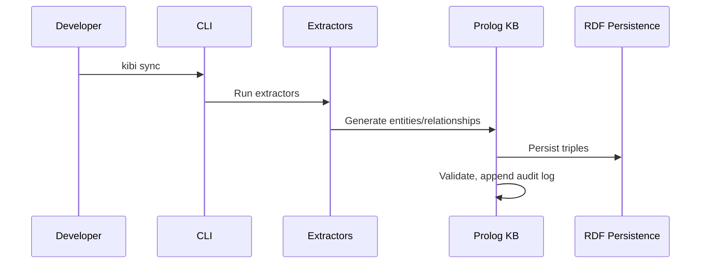
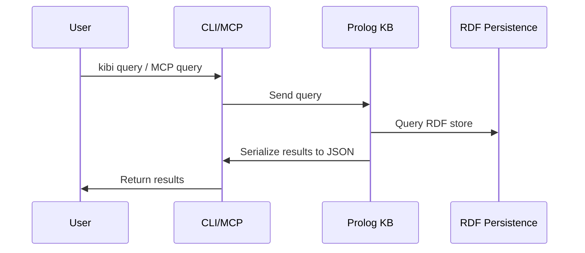

# Kibi System Architecture

## System Diagram

```mermaid
graph TD
    subgraph Git Repository
        D[Markdown/YAML Documents]
    end
    D -->|Extract| E[Extractors]
    E -->|Entities/Relationships| KB[Prolog KB (per branch)]
    KB -->|Query| CLI[CLI]
    KB -->|Query| MCP[MCP Server]
    MCP -->|Tooling| VSCode[VS Code Extension]
    CLI -->|Git Hooks| GH[Git Hooks]
    GH -->|post-checkout/post-merge| KB
    KB -->|Persist| RDF[RDF Persistence]
```

## Component Descriptions

### Prolog Core
- Located at `packages/core/src/kb.pl`
- Implements RDF persistence using SWI-Prolog's `rdf_persistency`
- Stores entities and relationships as RDF triples
- Enforces validation rules
- All operations mutex-protected for concurrency safety

### CLI
- Located at `packages/cli/`
- Node.js/Bun wrapper around Prolog
- Spawns SWI-Prolog subprocess
- Commands: init, sync, query, check, gc, branch, doctor
- Runs extractors for Markdown/YAML
- Handles schema validation and audit logging

### MCP Server
- Located at `packages/mcp/`
- Provides stdio JSON-RPC transport (newline-delimited, no embedded newlines)
- Tools: query, upsert, delete, check, branch.ensure, branch.gc
- Branch-aware: all tools accept branch parameter
- Keeps Prolog process alive for stateful operations

### VS Code Extension
- Located at `packages/vscode/`
- TreeView scaffolding for KB navigation
- MCP integration for queries and updates
- Minimal functionality in v0

### Git Hooks
- Installed in `$GIT_DIR/hooks` or via `core.hooksPath`
- `post-checkout`: ensures branch KB exists, runs sync
- `post-merge`: runs sync
- `kb gc`: deletes stale branch KBs

## Data Flow Diagrams

### Write Path (Document → KB)



### Read Path (KB → Query)



## Per-Branch KB Architecture

- Each git branch has its own KB directory
- On new branch creation: KB is copied from main branch snapshot
- After creation, branch KBs evolve independently (no ongoing sync)
- Branch KB isolation prevents cross-branch contamination
- Git hooks automate KB creation and sync on branch events

## RDF Persistence Details

- Uses SWI-Prolog `library(semweb/rdf_persistency)`
- Directory layout: base snapshot (binary `.trp`) + journal (`.jrn` Prolog terms)
- File locking: lock file with timestamp, PID, hostname prevents concurrent access
- Multi-step updates guarded with `with_mutex/2` for atomicity
- Journals are not auto-merged; explicit maintenance required
- Also uses `library(persistency)` for record-like predicates
- Provides ACID properties (isolation, durability) for KB operations

## MCP Stdio Transport

- JSON-RPC messages sent via stdio (newline-delimited)
- No embedded newlines in messages
- Only valid MCP messages on stdout; logs sent to stderr

## Git Hook Automation

- `post-checkout`: ensures branch KB exists, runs sync
- `post-merge`: runs sync
- `kb gc`: deletes stale branch KBs

## Directory Structure

- See README.md for `.kb/` directory layout and file details

---

This document covers the technical architecture, component interactions, data flow, per-branch KB isolation, RDF persistence, MCP transport, and git hook automation for Kibi. For directory structure details, refer to README.md.