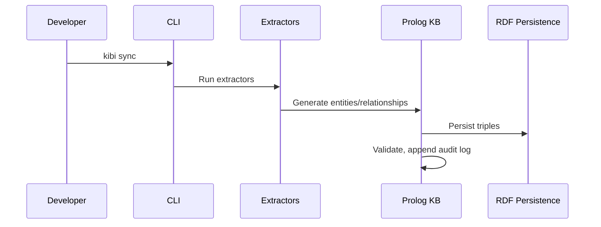
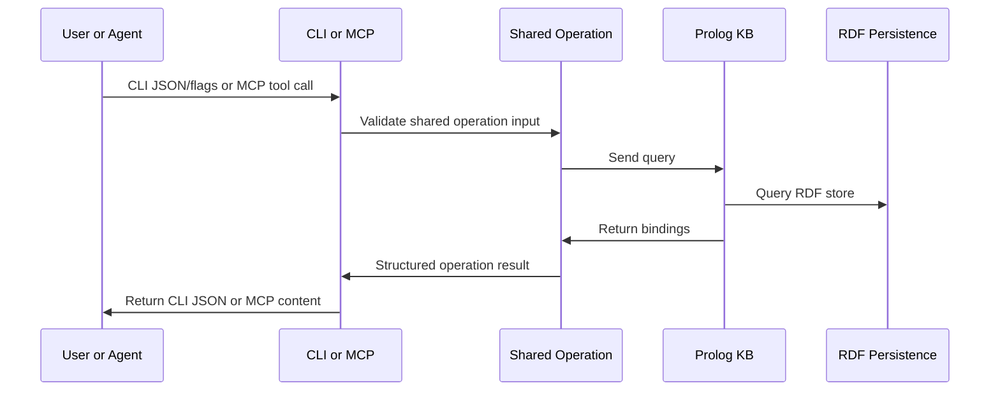

# Kibi System Architecture

## System Diagram

```mermaid
graph TD
    subgraph Git Repository
        D[Markdown/YAML Documents]
    end
    D -->|Extract| E[Extractors]
    E -->|Entities/Relationships| KB[Prolog KB (per branch)]
    CLI[CLI: flags + JSON routes] --> OPS[18 shared operation specs]
    MCP[MCP Server] --> OPS
    OPS -->|Query / mutate| KB[Prolog KB (per branch)]
    CC[kibi-codex (optional plugin)] -->|calls| MCP
    CU[kibi-cursor (optional plugin)] -->|calls| MCP
    MCP -->|Tooling| VSCode[VS Code Extension]
    CLI -->|Git Hooks| GH[Git Hooks]
    GH -->|post-checkout/post-merge| KB
    KB -->|Persist| RDF[RDF Persistence]
```

## Component Descriptions

### Monorepo Architecture and Simplification
- Detailed analysis of package boundaries and simplification roadmap: [OpenCode monorepo simplification review](proposals/opencode-monorepo-simplification.md)

### Prolog Core

- Located at `packages/core/src/kb.pl`
- Implements RDF persistence using SWI-Prolog's `rdf_persistency`
- Stores entities and relationships as RDF triples
- Enforces validation rules
- All operations mutex-protected for concurrency safety

### CLI
- Located at `packages/cli/`
- Peer public operation surface alongside MCP, plus maintenance and human-oriented commands
- Exposes all 18 public operations through `--input <file|->` JSON routes and preserves ergonomic flag commands where available
- Node.js/Bun wrapper that owns the short-lived CLI runtime and spawns SWI-Prolog when an operation requires it
- Maintenance commands include init, sync, migrate, gc, branch, doctor, and usage-metrics
- Runs extractors for Markdown/YAML
- Handles schema validation and audit logging

### MCP Server
- Located at `packages/mcp/`
- Peer public operation surface alongside the CLI
- Provides stdio JSON-RPC transport (newline-delimited, no embedded newlines)
- Registers the same 18 shared operation specs as host-visible `kb_*` tools
- Keeps a branch-aware Prolog process alive and adapts its session runtime to shared executors

### Codex Adapter Plugin
- Located at `packages/codex/`
- Optional package that provides a Codex plugin manifest, skill bundle, and lifecycle hooks
- Points Codex MCP wiring to the local `kibi-mcp` server
- Provides optional reminders and advisories only; it does not replace `kibi-core`, `kibi-cli`, or `kibi-mcp`

### Cursor Adapter Plugin
- Located at `packages/cursor/`
- Optional package that provides a Cursor plugin manifest, rules, skills, commands, MCP config, and editor hooks
- Points Cursor MCP wiring to the local `kibi-mcp` server
- Uses Cursor-specific hooks (`sessionStart`, `preToolUse`, `postToolUse`, `beforeReadFile`, `stop`) for read/write guidance and freshness follow-ups
- Provides optional reminders and advisories only; it does not replace `kibi-core`, `kibi-cli`, or `kibi-mcp`

> **Entity Modeling:** `flag` entities represent runtime/config gates. Bug and workaround notes belong in `fact` entities with `fact_kind: observation` or `meta`. **Strict facts** drive contradiction checks; observation/meta are non-blocking notes. See [Entity Schema](entity-schema.md). `domain-contradictions` applies to strict lane; `strict-fact-shape` is a default-off migration check.
### VS Code Extension
- Located at `packages/vscode/`
- TreeView scaffolding for KB navigation
- MCP integration for queries and updates
- Minimal functionality in v0

### Git Hooks
- Installed in `$GIT_DIR/hooks` or via `core.hooksPath`
- `post-checkout`: ensures branch KB exists, runs sync
- `post-merge`: runs sync
- `kb gc`: deletes stale branch KBs

## Data Flow Diagrams

### Write Path (Document → KB)

```mermaid
sequenceDiagram
    participant Dev as Developer
    participant CLI as CLI
    participant Ext as Extractors
    participant KB as Prolog KB
    participant RDF as RDF Persistence
    Dev->>CLI: kibi sync
    CLI->>Ext: Run extractors
    Ext->>KB: Generate entities/relationships
    KB->>RDF: Persist triples
    KB->>KB: Validate, append audit log
```

### Read Path (KB → Query)

```mermaid
sequenceDiagram
    participant User as User or Agent
    participant Surface as CLI or MCP
    participant Ops as Shared Operation
    participant KB as Prolog KB
    participant RDF as RDF Persistence
    User->>Surface: CLI JSON/flags or MCP tool call
    Surface->>Ops: Validate shared operation input
    Ops->>KB: Send query
    KB->>RDF: Query RDF store
    KB->>Ops: Return bindings
    Ops->>Surface: Structured operation result
    Surface->>User: Return CLI JSON or MCP content
```

## Per-Branch KB Architecture

- Each git branch has its own KB directory
- On new branch creation: KB is copied from main branch snapshot
- After creation, branch KBs evolve independently (no ongoing sync)
- Branch KB isolation prevents cross-branch contamination
- Git hooks automate KB creation and sync on branch events

## RDF Persistence Details

- Uses SWI-Prolog `library(semweb/rdf_persistency)`
- Directory layout: base snapshot (binary `.trp`) + journal (`.jrn` Prolog terms)
- File locking: lock file with timestamp, PID, hostname prevents concurrent access
- Multi-step updates guarded with `with_mutex/2` for atomicity
- Journals are not auto-merged; explicit maintenance required
- Also uses `library(persistency)` for record-like predicates
- Provides ACID properties (isolation, durability) for KB operations

## MCP Stdio Transport

- JSON-RPC messages sent via stdio (newline-delimited)
- No embedded newlines in messages
- Only valid MCP messages on stdout; logs sent to stderr

## Git Hook Automation

- `post-checkout`: ensures branch KB exists, runs sync
- `post-merge`: runs sync
- `kb gc`: deletes stale branch KBs

## Directory Structure

- See README.md for `.kb/` directory layout and file details

---

This document covers the technical architecture, component interactions, data flow, per-branch KB isolation, RDF persistence, MCP transport, and git hook automation for Kibi. For directory structure details, refer to README.md.
