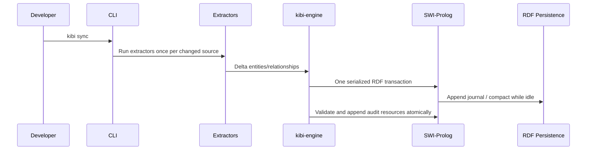
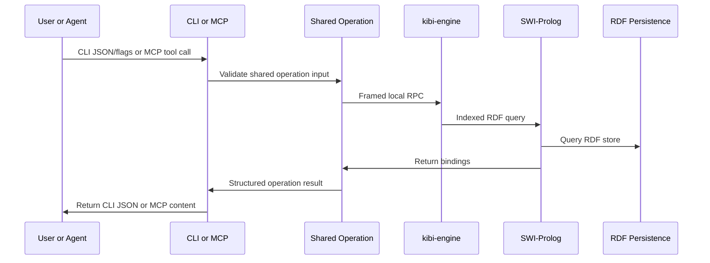

# Kibi System Architecture

## System Diagram

```mermaid
graph TD
    subgraph Git Repository
        D[Markdown/YAML Documents]
    end
    D -->|Extract| E[Extractors]
    E -->|Entities/Relationships| KB[Prolog KB (per branch)]
    CLI[CLI: flags + JSON routes] --> OPS[21 shared operation specs]
    MCP[MCP Server] --> OPS
    OPS -->|Framed local RPC| ENG[Node kibi-engine\n(single writer per workspace/branch)]
    ENG -->|One interactive process| KB[SWI-Prolog KB (per branch)]
    CC[kibi-codex (optional plugin)] -->|calls| MCP
    CU[kibi-cursor (optional plugin)] -->|calls| MCP
    MCP -->|Tooling| VSCode[VS Code Extension]
    CLI -->|Git Hooks| GH[Git Hooks]
    GH -->|post-checkout/post-merge| KB
    KB -->|Persist| RDF[RDF Persistence]
```

## Component Descriptions

### Monorepo Architecture and Simplification
- Detailed analysis of package boundaries and simplification roadmap: [OpenCode monorepo simplification review](proposals/opencode-monorepo-simplification.md)

### Prolog Core

- Located at `packages/core/src/kb.pl`
- Implements journaled RDF persistence using SWI-Prolog's `rdf_persistency`
- Stores entities and relationships as RDF triples
- Enforces validation rules
- All operations mutex-protected for concurrency safety

### CLI
- Located at `packages/cli/`
- Peer public operation surface alongside MCP, plus maintenance and human-oriented commands
- Exposes all 21 public operations through `--input <file|->` JSON routes and preserves ergonomic flag commands where available
- Node.js 18+ is the supported CLI/MCP runtime and hosts the long-lived `kibi-engine` daemon
- Automatically connects to (or starts) one engine per real workspace path and branch over a protected local socket/named pipe
- Maintenance commands include init, sync, migrate, gc, branch, doctor, and usage-metrics
- Runs extractors for Markdown/YAML
- Handles schema validation and audit logging

### MCP Server
- Located at `packages/mcp/`
- Peer public operation surface alongside the CLI
- Provides stdio JSON-RPC transport (newline-delimited, no embedded newlines)
- Registers the same 21 shared operation specs as host-visible `kb_*` tools
- Uses the same Node engine as CLI, so MCP and CLI requests serialize through one SWI-Prolog writer

### Journaled engine

- `packages/cli/src/engine.ts` owns the length-prefixed JSON RPC client and daemon lifecycle.
- A daemon keeps one interactive SWI process attached for up to ten minutes after the last client disconnects. Requests carry IDs, protocol version, workspace identity, and structured errors over a local socket/named pipe.
- New branches use `.kb/branches/<exact-ref-sha256>/branch.json` plus
  `storage.json`, `rdf/` binary snapshots and journals, and an atomic `CURRENT`
  value of `<generation-id>:<commit-sequence>`. The manifest is an identity
  fence; literal branch directories are legacy compatibility storage.
- Legacy `kb.rdf`/`audit.log` branches migrate once under `kb.lock` into a staging generation. Canonical triple digests, counts, audit resources, schema fields, and relationship endpoints are checked before publication; originals remain in immutable `legacy/` backups.
- Domain triples and audit resources share the same RDF transaction. `audit.log` is only produced by `kibi storage export` and is not authoritative.
- Ordinary sync compiles changed/deleted source files and relationship shards into the active journal. `kibi sync --rebuild` is the only path that publishes a replacement generation.
- Each attached engine rebuilds disposable ID/type/tag/source/token/coordinate indexes from RDF. Exact and paginated discovery uses the index to materialize only the requested page; a triple/entity-count mismatch rebuilds the index and never repairs RDF.

### Codex Adapter Plugin
- Located at `packages/codex/`
- Optional package that provides a Codex plugin manifest, skill bundle, and lifecycle hooks
- Points Codex MCP wiring to the local `kibi-mcp` server through `mcpServers`; the
  plugin leaves `cwd` unset so Codex supplies the active task workspace to the
  project-local `npx --no-install` command. Setting `cwd` to `.` would instead
  re-root the process in the installed plugin cache.
- Provides optional reminders and advisories only; it does not replace `kibi-core`, `kibi-cli`, or `kibi-mcp`

### Cursor Adapter Plugin
- Located at `packages/cursor/`
- Optional package that provides a Cursor plugin manifest, rules, skills, commands, MCP config, and editor hooks
- Points Cursor MCP wiring to the local `kibi-mcp` server
- Uses Cursor-specific hooks (`sessionStart`, `preToolUse`, `postToolUse`, `beforeReadFile`, `stop`) for read/write guidance and freshness follow-ups
- Provides optional reminders and advisories only; it does not replace `kibi-core`, `kibi-cli`, or `kibi-mcp`

> **Entity Modeling:** `flag` entities represent runtime/config gates. Bug and workaround notes belong in `fact` entities with `fact_kind: observation` or `meta`. **Strict facts** drive contradiction checks; observation/meta are non-blocking notes. See [Entity Schema](entity-schema.md). `domain-contradictions` applies to strict lane; `strict-fact-shape` is an advisory default-on quality diagnostic.
### VS Code Extension
- Located at `packages/vscode/`
- TreeView scaffolding for KB navigation
- MCP integration for queries and updates
- Minimal functionality in v0

### Git Hooks
- Installed in `$GIT_DIR/hooks` or via `core.hooksPath`
- `post-checkout`: ensures branch KB exists, runs sync
- `post-merge`: runs sync
- `kb gc`: quarantines stale branch KBs and purges them only explicitly after retention

## Data Flow Diagrams

### Write Path (Document → KB)

```mermaid
sequenceDiagram
    participant Dev as Developer
    participant CLI as CLI
    participant Ext as Extractors
    participant ENG as kibi-engine
    participant KB as SWI-Prolog
    participant RDF as RDF Persistence
    Dev->>CLI: kibi sync
    CLI->>Ext: Run extractors once per changed source
    Ext->>ENG: Delta entities/relationships
    ENG->>KB: One serialized RDF transaction
    KB->>RDF: Append journal / compact while idle
    ENG->>KB: Validate and append audit resources atomically
```

### Read Path (KB → Query)

```mermaid
sequenceDiagram
    participant User as User or Agent
    participant Surface as CLI or MCP
    participant Ops as Shared Operation
    participant ENG as kibi-engine
    participant KB as SWI-Prolog
    participant RDF as RDF Persistence
    User->>Surface: CLI JSON/flags or MCP tool call
    Surface->>Ops: Validate shared operation input
    Ops->>ENG: Framed local RPC
    ENG->>KB: Indexed RDF query
    KB->>RDF: Query RDF store
    KB->>Ops: Return bindings
    Ops->>Surface: Structured operation result
    Surface->>User: Return CLI JSON or MCP content
```

## Per-Branch KB Architecture

- Each exact Git branch identity has a compiled store under
  `.kb/branches/<sha256(exact-ref)>/` with a versioned `branch.json`
  identity fence.
- `kibi sync` materializes a missing store from the current checkout's tracked
  Markdown/YAML/manifests and never copies another branch's compiled store.
- Git remains the sole branch/merge authority: unresolved authored-file
  conflicts block compilation, and Kibi never selects merge winners.
- Worktree-local branches remain live for collection; remote-only refs do not.
- Legacy literal-path migration is explicit old/new, preview-first, and
  preserves a recoverable backup. Deleted stores are quarantined before purge.
- Git hooks invoke normal `kibi sync` only; they do not create or clone a
  Kibi-specific branch model.

## Source-First Mutation and Recovery

Tracked Markdown/YAML, symbol manifests, and relationship shards are the
authoritative project artifacts. `kb_upsert` and approved plan application may
write those files transactionally through the runtime, preserving existing
document bodies when requested, while Kibi never stages or commits Git state.
RDF/Prolog stores are compiled outputs and can be rebuilt with `kibi sync`.

Source writes carry before/after hashes, stay inside the workspace (including
symlink checks), and use a recovery journal with staged preimages/postimages.
Failures before the authoritative commit roll back; failures after it are
reported as `committed_with_repairs` with typed repair actions rather than
repeating the original mutation.

## RDF Persistence Details

- Uses SWI-Prolog `library(semweb/rdf_persistency)`
- Directory layout: `storage.json`, `CURRENT`, `rdf/` binary `.trp` snapshots plus incremental `.jrn` journals, and a legacy sentinel `kb.rdf`
- File locking: lock file with timestamp, PID, hostname prevents concurrent access
- Multi-step updates guarded with `with_mutex/2` for atomicity
- Journals compact automatically while idle once they exceed 16 MiB; `kibi storage compact` forces compaction
- `library(persistency)` remains only for legacy migration/import; journaled audit resources live in the RDF graph
- Writes are acknowledged only after the transaction and journal are durable

## MCP Stdio Transport

- JSON-RPC messages sent via stdio (newline-delimited)
- No embedded newlines in messages
- Only valid MCP messages on stdout; logs sent to stderr

## Git Hook Automation

- `post-checkout`: ensures branch KB exists, runs sync
- `post-merge`: runs sync
- `kb gc`: quarantines stale branch KBs and purges them only explicitly after retention

## Directory Structure

- See README.md for `.kb/` directory layout and file details

---

This document covers the technical architecture, component interactions, data flow, per-branch KB isolation, RDF persistence, MCP transport, and git hook automation for Kibi. For directory structure details, refer to README.md.
