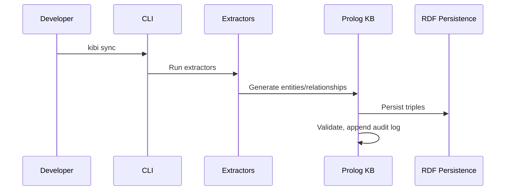
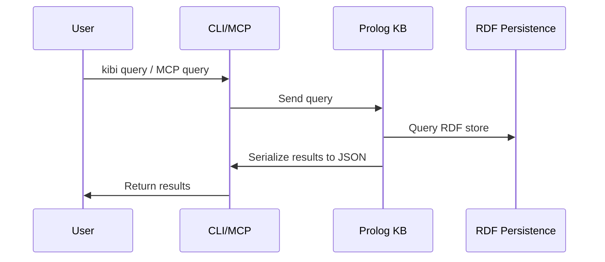

This file is a merged representation of a subset of the codebase, containing specifically included files, combined into a single document by Repomix.
The content has been processed where security check has been disabled.

# File Summary

## Purpose
This file contains a packed representation of a subset of the repository's contents that is considered the most important context.
It is designed to be easily consumable by AI systems for analysis, code review,
or other automated processes.

## File Format
The content is organized as follows:
1. This summary section
2. Repository information
3. Directory structure
4. Repository files (if enabled)
5. Multiple file entries, each consisting of:
  a. A header with the file path (## File: path/to/file)
  b. The full contents of the file in a code block

## Usage Guidelines
- This file should be treated as read-only. Any changes should be made to the
  original repository files, not this packed version.
- When processing this file, use the file path to distinguish
  between different files in the repository.
- Be aware that this file may contain sensitive information. Handle it with
  the same level of security as you would the original repository.

## Notes
- Some files may have been excluded based on .gitignore rules and Repomix's configuration
- Binary files are not included in this packed representation. Please refer to the Repository Structure section for a complete list of file paths, including binary files
- Only files matching these patterns are included: README.md, package.json, tsconfig.json, biome.json, adr/**, requirements/**, scenarios/**, docs/**, brief.md, KNOWN_LIMITATIONS.md, CONTRIBUTING.md
- Files matching patterns in .gitignore are excluded
- Files matching default ignore patterns are excluded
- Security check has been disabled - content may contain sensitive information
- Files are sorted by Git change count (files with more changes are at the bottom)

# Directory Structure
```
docs/
  architecture.md
  entity-schema.md
  inference-rules.md
requirements/
  main-only.md
  req1.md
biome.json
brief.md
CONTRIBUTING.md
KNOWN_LIMITATIONS.md
package.json
README.md
tsconfig.json
```

# Files

## File: docs/architecture.md
````markdown
# Kibi System Architecture

## System Diagram

```mermaid
graph TD
    subgraph Git Repository
        D[Markdown/YAML Documents]
    end
    D -->|Extract| E[Extractors]
    E -->|Entities/Relationships| KB[Prolog KB (per branch)]
    KB -->|Query| CLI[CLI]
    KB -->|Query| MCP[MCP Server]
    MCP -->|Tooling| VSCode[VS Code Extension]
    CLI -->|Git Hooks| GH[Git Hooks]
    GH -->|post-checkout/post-merge| KB
    KB -->|Persist| RDF[RDF Persistence]
```

## Component Descriptions

### Prolog Core
- Located at `packages/core/src/kb.pl`
- Implements RDF persistence using SWI-Prolog's `rdf_persistency`
- Stores entities and relationships as RDF triples
- Enforces validation rules
- All operations mutex-protected for concurrency safety

### CLI
- Located at `packages/cli/`
- Node.js/Bun wrapper around Prolog
- Spawns SWI-Prolog subprocess
- Commands: init, sync, query, check, gc, branch, doctor
- Runs extractors for Markdown/YAML
- Handles schema validation and audit logging

### MCP Server
- Located at `packages/mcp/`
- Provides stdio JSON-RPC transport (newline-delimited, no embedded newlines)
- Tools: query, upsert, delete, check, branch.ensure, branch.gc
- Branch-aware: all tools accept branch parameter
- Keeps Prolog process alive for stateful operations

### VS Code Extension
- Located at `packages/vscode/`
- TreeView scaffolding for KB navigation
- MCP integration for queries and updates
- Minimal functionality in v0

### Git Hooks
- Installed in `$GIT_DIR/hooks` or via `core.hooksPath`
- `post-checkout`: ensures branch KB exists, runs sync
- `post-merge`: runs sync
- `kb gc`: deletes stale branch KBs

## Data Flow Diagrams

### Write Path (Document → KB)



### Read Path (KB → Query)



## Per-Branch KB Architecture

- Each git branch has its own KB directory
- On new branch creation: KB is copied from main branch snapshot
- After creation, branch KBs evolve independently (no ongoing sync)
- Branch KB isolation prevents cross-branch contamination
- Git hooks automate KB creation and sync on branch events

## RDF Persistence Details

- Uses SWI-Prolog `library(semweb/rdf_persistency)`
- Directory layout: base snapshot (binary `.trp`) + journal (`.jrn` Prolog terms)
- File locking: lock file with timestamp, PID, hostname prevents concurrent access
- Multi-step updates guarded with `with_mutex/2` for atomicity
- Journals are not auto-merged; explicit maintenance required
- Also uses `library(persistency)` for record-like predicates
- Provides ACID properties (isolation, durability) for KB operations

## MCP Stdio Transport

- JSON-RPC messages sent via stdio (newline-delimited)
- No embedded newlines in messages
- Only valid MCP messages on stdout; logs sent to stderr

## Git Hook Automation

- `post-checkout`: ensures branch KB exists, runs sync
- `post-merge`: runs sync
- `kb gc`: deletes stale branch KBs

## Directory Structure

- See README.md for `.kb/` directory layout and file details

---

This document covers the technical architecture, component interactions, data flow, per-branch KB isolation, RDF persistence, MCP transport, and git hook automation for Kibi. For directory structure details, refer to README.md.
````

## File: docs/entity-schema.md
````markdown
# Entity Schema Documentation

This document describes the entity and relationship schema for the Kibi Knowledge Base. It covers all supported entity types, their properties, relationship types, and provides frontmatter examples for each entity and relationship.

---

## Entity Types

Kibi supports eight entity types:

| Type     | Description                                                        |
|----------|--------------------------------------------------------------------|
| req      | Software requirement specifying functionality or constraints       |
| scenario | BDD scenario describing user behavior (Given/When/Then)            |
| test     | Unit, integration, or e2e test case                                |
| adr      | Architecture Decision Record documenting technical choices         |
| flag     | Feature flag controlling functionality rollout                     |
| event    | Domain or system event published/consumed by components            |
| symbol   | Abstract code symbol (function, class, module) - language-agnostic |
| fact     | Atomic domain fact used to model concepts, invariants, and properties |

---

### Common Properties (All Entities)

| Property     | Required | Type           | Description                                      |
|--------------|----------|----------------|--------------------------------------------------|
| id           | Yes      | string         | Unique identifier (SHA256 or explicit frontmatter)|
| title        | Yes      | string         | Short summary/name                               |
| status       | Yes      | string         | Entity status (see below for values)             |
| created_at   | Yes      | ISO 8601       | Creation timestamp                               |
| updated_at   | Yes      | ISO 8601       | Last update timestamp                            |
| source       | Yes      | string         | Provenance (file path, URL, or reference)        |
| tags[]       | No       | array[string]  | Array of tags                                    |
| owner        | No       | string         | Owner/assignee                                   |
| priority     | No       | string         | Priority level (must, should, could)             |
| severity     | No       | string         | Severity level                                   |
| links[]      | No       | array[string]  | Array of URLs                                    |
| text_ref     | No       | string         | Pointer to Markdown/doc blob                     |

---

### Entity Type Details & Example Frontmatter

#### Requirement (`req`)

| Property     | Required | Type           | Description                                      |
|--------------|----------|----------------|--------------------------------------------------|
| id           | Yes      | string         | Unique identifier                                |
| title        | Yes      | string         | Requirement summary                              |
| status       | Yes      | string         | open, in_progress, closed, deprecated            |
| created_at   | Yes      | ISO 8601       | Creation timestamp                               |
| updated_at   | Yes      | ISO 8601       | Last update timestamp                            |
| source       | Yes      | string         | Provenance                                       |
| tags[]       | No       | array[string]  | Tags                                             |
| owner        | No       | string         | Owner/assignee                                   |
| priority     | No       | string         | must, should, could                              |
| severity     | No       | string         | Severity level                                   |
| links[]      | No       | array[string]  | URLs                                             |
| text_ref     | No       | string         | Markdown/doc pointer                             |

**Example:**
```yaml
---
id: REQ-001
title: Sample requirement REQ-001
status: open
created_at: 2026-02-17T13:00:00Z
updated_at: 2026-02-17T13:00:00Z
source: https://example.com/fixtures/requirements/REQ-001
tags:
  - sample
owner: product-team
priority: medium
links: []
---
```

#### Scenario (`scenario`)

| Property     | Required | Type           | Description                                      |
|--------------|----------|----------------|--------------------------------------------------|
| id           | Yes      | string         | Unique identifier                                |
| title        | Yes      | string         | Scenario summary                                 |
| status       | Yes      | string         | draft, active, deprecated                        |
| created_at   | Yes      | ISO 8601       | Creation timestamp                               |
| updated_at   | Yes      | ISO 8601       | Last update timestamp                            |
| source       | Yes      | string         | Provenance                                       |
| tags[]       | No       | array[string]  | Tags                                             |
| owner        | No       | string         | Owner/assignee                                   |
| priority     | No       | string         | Priority level                                   |
| severity     | No       | string         | Severity level                                   |
| links[]      | No       | array[string]  | URLs                                             |
| text_ref     | No       | string         | Markdown/doc pointer                             |

**Example:**
```yaml
---
id: SCEN-001
title: Sample scenario SCEN-001
status: active
created_at: 2026-02-17T13:00:00Z
updated_at: 2026-02-17T13:00:00Z
source: https://example.com/fixtures/scenarios/SCEN-001
tags:
  - sample
---
```

#### Test (`test`)

| Property     | Required | Type           | Description                                      |
|--------------|----------|----------------|--------------------------------------------------|
| id           | Yes      | string         | Unique identifier                                |
| title        | Yes      | string         | Test summary                                     |
| status       | Yes      | string         | passing, failing, skipped, pending               |
| created_at   | Yes      | ISO 8601       | Creation timestamp                               |
| updated_at   | Yes      | ISO 8601       | Last update timestamp                            |
| source       | Yes      | string         | Provenance                                       |
| tags[]       | No       | array[string]  | Tags                                             |
| owner        | No       | string         | Owner/assignee                                   |
| priority     | No       | string         | Priority level                                   |
| severity     | No       | string         | Severity level                                   |
| links[]      | No       | array[string]  | URLs                                             |
| text_ref     | No       | string         | Markdown/doc pointer                             |

**Example:**
```yaml
---
id: TEST-001
title: Sample test TEST-001
status: passing
created_at: 2026-02-17T13:00:00Z
updated_at: 2026-02-17T13:00:00Z
source: https://example.com/fixtures/tests/TEST-001
tags:
  - sample
---
```

#### ADR (`adr`)

| Property     | Required | Type           | Description                                      |
|--------------|----------|----------------|--------------------------------------------------|
| id           | Yes      | string         | Unique identifier                                |
| title        | Yes      | string         | ADR summary                                      |
| status       | Yes      | string         | proposed, accepted, deprecated, superseded       |
| created_at   | Yes      | ISO 8601       | Creation timestamp                               |
| updated_at   | Yes      | ISO 8601       | Last update timestamp                            |
| source       | Yes      | string         | Provenance                                       |
| tags[]       | No       | array[string]  | Tags                                             |
| owner        | No       | string         | Owner/assignee                                   |
| priority     | No       | string         | Priority level                                   |
| severity     | No       | string         | Severity level                                   |
| links[]      | No       | array[string]  | URLs                                             |
| text_ref     | No       | string         | Markdown/doc pointer                             |

**Example:**
```yaml
---
id: ADR-001
title: Sample ADR ADR-001
status: accepted
created_at: 2026-02-17T13:00:00Z
updated_at: 2026-02-17T13:00:00Z
source: https://example.com/fixtures/adrs/ADR-001
tags:
  - architecture
---
```

#### Flag (`flag`)

| Property     | Required | Type           | Description                                      |
|--------------|----------|----------------|--------------------------------------------------|
| id           | Yes      | string         | Unique identifier                                |
| title        | Yes      | string         | Flag summary                                     |
| status       | Yes      | string         | active, inactive, deprecated                     |
| created_at   | Yes      | ISO 8601       | Creation timestamp                               |
| updated_at   | Yes      | ISO 8601       | Last update timestamp                            |
| source       | Yes      | string         | Provenance                                       |
| tags[]       | No       | array[string]  | Tags                                             |
| owner        | No       | string         | Owner/assignee                                   |
| priority     | No       | string         | Priority level                                   |
| severity     | No       | string         | Severity level                                   |
| links[]      | No       | array[string]  | URLs                                             |
| text_ref     | No       | string         | Markdown/doc pointer                             |

**Example:**
```yaml
---
id: FLAG-001
title: Sample flag FLAG-001
status: active
created_at: 2026-02-17T13:00:00Z
updated_at: 2026-02-17T13:00:00Z
source: https://example.com/fixtures/flags/FLAG-001
tags:
  - rollout
---
```

#### Event (`event`)

| Property     | Required | Type           | Description                                      |
|--------------|----------|----------------|--------------------------------------------------|
| id           | Yes      | string         | Unique identifier                                |
| title        | Yes      | string         | Event summary                                    |
| status       | Yes      | string         | active, deprecated                               |
| created_at   | Yes      | ISO 8601       | Creation timestamp                               |
| updated_at   | Yes      | ISO 8601       | Last update timestamp                            |
| source       | Yes      | string         | Provenance                                       |
| tags[]       | No       | array[string]  | Tags                                             |
| owner        | No       | string         | Owner/assignee                                   |
| priority     | No       | string         | Priority level                                   |
| severity     | No       | string         | Severity level                                   |
| links[]      | No       | array[string]  | URLs                                             |
| text_ref     | No       | string         | Markdown/doc pointer                             |

**Example:**
```yaml
---
id: EVENT-001
title: Sample event EVENT-001
status: active
created_at: 2026-02-17T13:00:00Z
updated_at: 2026-02-17T13:00:00Z
source: https://example.com/fixtures/events/EVENT-001
tags:
  - domain
---
```

#### Symbol (`symbol`)

| Property     | Required | Type           | Description                                      |
|--------------|----------|----------------|--------------------------------------------------|
| id           | Yes      | string         | Unique identifier                                |
| title        | Yes      | string         | Symbol summary                                   |
| status       | Yes      | string         | active, deprecated, removed                      |
| created_at   | Yes      | ISO 8601       | Creation timestamp                               |
| updated_at   | Yes      | ISO 8601       | Last update timestamp                            |
| source       | Yes      | string         | Provenance                                       |
| tags[]       | No       | array[string]  | Tags                                             |
| owner        | No       | string         | Owner/assignee                                   |
| priority     | No       | string         | Priority level                                   |
| severity     | No       | string         | Severity level                                   |
| links[]      | No       | array[string]  | URLs                                             |
| text_ref     | No       | string         | Markdown/doc pointer                             |

**Example:**
```yaml
---
id: SYMBOL-001
title: Sample symbol SYMBOL-001
status: active
created_at: 2026-02-17T13:00:00Z
updated_at: 2026-02-17T13:00:00Z
source: https://example.com/fixtures/symbols/SYMBOL-001
tags:
  - code
---
```

#### Fact (`fact`)

`fact` entities represent atomic domain concepts and invariants (for example domain nouns, cardinalities, and property values). Requirements can link to facts using `constrains` and `requires_property` so contradictions become structural and queryable.

| Property     | Required | Type           | Description                                      |
|--------------|----------|----------------|--------------------------------------------------|
| id           | Yes      | string         | Unique identifier                                |
| title        | Yes      | string         | Fact summary                                     |
| status       | Yes      | string         | active, deprecated                               |
| created_at   | Yes      | ISO 8601       | Creation timestamp                               |
| updated_at   | Yes      | ISO 8601       | Last update timestamp                            |
| source       | Yes      | string         | Provenance                                       |
| tags[]       | No       | array[string]  | Tags                                             |
| owner        | No       | string         | Owner/assignee                                   |
| priority     | No       | string         | Priority level                                   |
| severity     | No       | string         | Severity level                                   |
| links[]      | No       | array[string]  | URLs                                             |
| text_ref     | No       | string         | Markdown/doc pointer                             |

**Example:**
```yaml
---
id: FACT-USER-ROLE
title: User Role Assignment
status: active
created_at: 2026-02-20T13:00:00Z
updated_at: 2026-02-20T13:00:00Z
source: documentation/facts/FACT-USER-ROLE.md
tags:
  - domain
  - auth
---
```

---

## Relationship Types

Kibi supports relationship types listed below. Each relationship has metadata:

| Property     | Required | Type           | Description                                      |
|--------------|----------|----------------|--------------------------------------------------|
| created_at   | Yes      | ISO 8601       | Creation timestamp                               |
| created_by   | Yes      | string         | Creator identifier                               |
| source       | Yes      | string         | Provenance                                       |
| confidence   | No       | string/number  | Optional confidence level                        |

### Relationship Table

| Relationship         | Source Entity         | Target Entity         | Description                                      |
|---------------------|----------------------|----------------------|--------------------------------------------------|
| depends_on          | req                  | req                  | Requirement depends on another requirement        |
| specified_by        | req                  | scenario             | Requirement specified by scenario                 |
| verified_by         | req                  | test                 | Requirement verified by test                      |
| implements          | symbol               | req                  | Symbol implements requirement                     |
| covered_by          | symbol               | test                 | Symbol covered by test                            |
| constrained_by      | symbol               | adr                  | Symbol constrained by ADR                         |
| constrains          | req                  | fact                 | Requirement constrains a specific domain fact     |
| requires_property   | req                  | fact                 | Requirement requires a property fact/value        |
| affects             | adr                  | symbol/component     | ADR affects symbol/component                      |
| guards              | flag                 | symbol/event/req     | Flag guards symbol, event, or requirement         |
| publishes           | symbol               | event                | Symbol publishes event                            |
| consumes            | symbol               | event                | Symbol consumes event                             |
| supersedes          | adr                  | adr                  | The source ADR formally replaces the target ADR. The target is expected to carry status: archived or deprecated |
| relates_to          | a                    | b                    | Generic relationship (escape hatch)               |

---

### Relationship Examples

**depends_on**
```yaml
# req REQ-002 depends_on req REQ-001
relationship:
  type: depends_on
  source: REQ-002
  target: REQ-001
  created_at: 2026-02-17T13:10:00Z
  created_by: analyst
  source: https://example.com/fixtures/requirements/REQ-002
```

**specified_by**
```yaml
# req REQ-001 specified_by scenario SCEN-001
relationship:
  type: specified_by
  source: REQ-001
  target: SCEN-001
  created_at: 2026-02-17T13:15:00Z
  created_by: analyst
  source: https://example.com/fixtures/requirements/REQ-001
```

**verified_by**
```yaml
# req REQ-001 verified_by test TEST-001
relationship:
  type: verified_by
  source: REQ-001
  target: TEST-001
  created_at: 2026-02-17T13:20:00Z
  created_by: qa
  source: https://example.com/fixtures/tests/TEST-001
```

**implements**
```yaml
# symbol SYMBOL-001 implements req REQ-001
relationship:
  type: implements
  source: SYMBOL-001
  target: REQ-001
  created_at: 2026-02-17T13:25:00Z
  created_by: dev
  source: https://example.com/fixtures/symbols/SYMBOL-001
```

**covered_by**
```yaml
# symbol SYMBOL-001 covered_by test TEST-001
relationship:
  type: covered_by
  source: SYMBOL-001
  target: TEST-001
  created_at: 2026-02-17T13:30:00Z
  created_by: dev
  source: https://example.com/fixtures/tests/TEST-001
```

**constrained_by**
```yaml
# symbol SYMBOL-001 constrained_by adr ADR-001
relationship:
  type: constrained_by
  source: SYMBOL-001
  target: ADR-001
  created_at: 2026-02-17T13:35:00Z
  created_by: architect
  source: https://example.com/fixtures/adrs/ADR-001
```

**affects**
```yaml
# adr ADR-001 affects symbol SYMBOL-001
relationship:
  type: affects
  source: ADR-001
  target: SYMBOL-001
  created_at: 2026-02-17T13:40:00Z
  created_by: architect
  source: https://example.com/fixtures/adrs/ADR-001
```

**guards**
```yaml
# flag FLAG-001 guards req REQ-001
relationship:
  type: guards
  source: FLAG-001
  target: REQ-001
  created_at: 2026-02-17T13:45:00Z
  created_by: devops
  source: https://example.com/fixtures/flags/FLAG-001
```

**publishes**
```yaml
# symbol SYMBOL-001 publishes event EVENT-001
relationship:
  type: publishes
  source: SYMBOL-001
  target: EVENT-001
  created_at: 2026-02-17T13:50:00Z
  created_by: dev
  source: https://example.com/fixtures/symbols/SYMBOL-001
```

**consumes**
```yaml
# symbol SYMBOL-001 consumes event EVENT-001
relationship:
  type: consumes
  source: SYMBOL-001
  target: EVENT-001
  created_at: 2026-02-17T13:55:00Z
  created_by: dev
  source: https://example.com/fixtures/symbols/SYMBOL-001
```

**constrains**
```yaml
# req REQ-018 constrains fact FACT-USER-ROLE
relationship:
  type: constrains
  source: REQ-018
  target: FACT-USER-ROLE
  created_at: 2026-02-20T14:00:00Z
  created_by: analyst
  source: documentation/requirements/REQ-018.md
```

**requires_property**
```yaml
# req REQ-018 requires_property fact FACT-LIMIT-2
relationship:
  type: requires_property
  source: REQ-018
  target: FACT-LIMIT-2
  created_at: 2026-02-20T14:01:00Z
  created_by: analyst
  source: documentation/requirements/REQ-018.md
```

**relates_to**
```yaml
# Generic relationship between any two entities
relationship:
  type: relates_to
  source: ENTITY-A
  target: ENTITY-B
  kind: custom
  created_at: 2026-02-17T14:00:00Z
  created_by: analyst
  source: https://example.com/fixtures/entities/ENTITY-A
```

**supersedes**
```yaml
# adr ADR-010 supersedes adr ADR-009
relationship:
  type: supersedes
  source: ADR-010
  target: ADR-009
  created_at: 2026-02-20T10:00:00Z
  created_by: architect
  source: https://example.com/fixtures/adrs/ADR-010
```

---

## Notes
- All entity and relationship types are fixed in v0; extensibility is planned for future versions.
- IDs must be stable and unique (content-based SHA256 or explicit frontmatter).
- Relationship metadata supports audit and conflict resolution.
- Status values are entity-type specific (see above).

---

End of schema documentation.
````

## File: docs/inference-rules.md
````markdown
# Inference Rules (Phase 1)

Kibi v0.5 introduces deterministic derived predicates exposed via MCP.

## Core Predicates (`packages/core/src/kb.pl`)

- `transitively_implements(Symbol, Req)`
  - Direct: `implements(Symbol, Req)`
  - Derived: `covered_by(Symbol, Test)` + `validates(Test, Req)`
  - Derived: `covered_by(Symbol, Test)` + `verified_by(Req, Test)`

- `transitively_depends(Req1, Req2)`
  - Recursive closure over `depends_on/3`
  - Cycle-safe via visited set

- `impacted_by_change(Entity, Changed)`
  - Undirected graph traversal over all relationship edges
  - `Entity=Changed` included by definition

- `affected_symbols(Req, Symbols)`
  - Returns sorted symbols implementing `Req`
  - Includes symbols implementing requirements that transitively depend on `Req`

- `coverage_gap(Req, Reason)`
  - Evaluates only MUST requirements (`priority` contains `must`)
  - `Reason` is one of:
    - `missing_scenario_and_test`
    - `missing_scenario`
    - `missing_test`

- `untested_symbols(Symbols)`
  - Returns sorted symbols without `covered_by` links

- `stale(Entity, MaxAgeDays)`
  - True when `updated_at` age is older than `MaxAgeDays`

- `orphaned(Symbol)`
  - Symbol with no `implements`, `covered_by`, or `constrained_by` links

- `conflicting(Adr1, Adr2)`
  - ADR pair constraining the same symbol
  - Sorted pair output (`Adr1 @< Adr2`)

- `deprecated_still_used(Adr, Symbols)`
  - ADR status in `archived|deprecated|rejected`
  - Returns symbols still constrained by that ADR

- `current_adr(Id)`
  - True when Id is an ADR not superseded by any other ADR
  - Returns all currently active/architectural decisions

- `superseded_by(OldId, NewId)`
  - Direct supersession relationship
  - OldId is superseded by NewId

- `adr_chain(AnyId, Chain)`
  - Full ordered chain from AnyId to the current ADR (newest last)
  - Cycle-safe via visited accumulator
  - Returns complete decision history for a topic

- `contradicting_reqs(ReqA, ReqB, Reason)`
  - Finds two active, non-superseded requirements that constrain the same fact
  - Flags contradiction when they require different property facts
  - `Reason` describes the conflicting fact/property pair

## MCP Tools

### `kb_derive`

Generic inference endpoint.

Input:

```json
{
  "rule": "coverage_gap",
  "params": { "req": "REQ-042" }
}
```

Output:

```json
{
  "structuredContent": {
    "rule": "coverage_gap",
    "params": { "req": "REQ-042" },
    "count": 1,
    "rows": [{ "req": "REQ-042", "reason": "missing_test" }],
    "provenance": { "predicate": "coverage_gap", "deterministic": true }
  }
}
```

Supported rules:

- `transitively_implements`
- `transitively_depends`
- `impacted_by_change`
- `affected_symbols`
- `coverage_gap`
- `untested_symbols`
- `stale`
- `orphaned`
- `conflicting`
- `deprecated_still_used`
- `current_adr`
- `adr_chain`
- `superseded_by`
- `domain_contradictions`

### `kb_impact`

Shorthand for impact analysis.

Input:

```json
{ "entity": "REQ-042" }
```

Output fields:

- `entity`: changed entity
- `impacted`: sorted list of `{id, type}`
- `count`
- `provenance`

### `kb_coverage_report`

Aggregate coverage rollup.

Input:

```json
{ "type": "req" }
```

`type` is optional (`req`, `symbol`, or all).

Output fields:

- `coverage.requirements`: totals and gap reasons
- `coverage.symbols`: totals and untested symbol IDs
- `provenance.predicates`: predicates used for derivation

### Additional MCP Tools

#### kb_current_adr

Returns all current (non-superseded) ADRs.

Input: No params

Output:
```json
{
  "content": [{"type": "text", "text": "Derived X row(s) for rule 'current_adr'."}],
  "structuredContent": {
    "rule": "current_adr",
    "params": {},
    "count": N,
    "rows": [
      {"id": "ADR-001", "title": "Use SWI-Prolog..."},
      {"id": "ADR-002", "title": "Use Bun/Node.js..."}
    ],
    "provenance": {
      "predicate": "current_adr",
      "deterministic": true
    }
  }
}
```

#### kb_adr_chain

Returns full temporal chain from a starting ADR to the current one.

Input:
```json
{
  "adr": "ADR-005"
}
```

Output:
```json
{
  "content": [{"type": "text", "text": "Derived 3 row(s) for rule 'adr_chain'."}],
  "structuredContent": {
    "rule": "adr_chain",
    "params": {"adr": "ADR-005"},
    "count": 3,
    "rows": [
      {"id": "ADR-005", "title": "...", "status": "superseded"},
      {"id": "ADR-008", "title": "...", "status": "active"},
      {"id": "ADR-010", "title": "...", "status": "accepted"}
    ],
    "provenance": {
      "predicate": "adr_chain",
      "deterministic": true
    }
  }
}
```

#### kb_superseded_by

Returns direct successor for an ADR.

Input:
```json
{
  "adr": "ADR-005"
}
```

Output:
```json
{
  "content": [{"type": "text", "text": "Derived 1 row(s) for rule 'superseded_by'."}],
  "structuredContent": {
    "rule": "superseded_by",
    "params": {"adr": "ADR-005"},
    "count": 1,
    "rows": [
      {
        "adr": "ADR-005",
        "successor_id": "ADR-008",
        "successor_title": "AST-derived symbol coordinates..."
      }
    ],
    "provenance": {
      "predicate": "superseded_by",
      "deterministic": true
    }
  }
}
```

## Determinism Guarantees

- Prolog queries use `setof/3` where possible for stable ordering and de-duplication.
- MCP responses include explicit field names and fixed shapes.
- Aggregate/report outputs are sorted before returning.
````

## File: requirements/main-only.md
````markdown
---
title: Main Only
type: req
status: approved
---

# Main Only
````

## File: requirements/req1.md
````markdown
---
title: Critical Feature
type: req
status: approved
priority: must
tags: [critical]
owner: bob
---

# Critical Feature
````

## File: biome.json
````json
{
  "$schema": "https://raw.githubusercontent.com/biomejs/biome/main/packages/biome/src/config/schema.json",
  "vcs": {
    "enabled": true,
    "clientKind": "git",
    "useIgnoreFile": true
  },
  "formatter": {
    "indentStyle": "space",
    "indentWidth": 2
  },
  "linter": {
    "enabled": true
  }
}
````

## File: brief.md
````markdown
## 1) Purpose and scope
The program (“KB”) is a repo-local, per-branch, queryable long-term memory for software projects that stores requirements, BDD behaviors, tests, architecture decisions (ADRs), feature flags, and events, plus the relationships between them.
It must be accessible to both humans (CLI now; editor/web UI later) and LLM agents via an MCP server over stdio, so an agent can read/write facts deterministically instead of editing ad-hoc documents. [swi-prolog.discourse](https://swi-prolog.discourse.group/t/scaling-to-billions-of-facts/380)

In v0, the deliverables are: (1) the KB store, (2) an MCP server exposing a small set of tools/resources, and (3) a project initializer that sets up storage and automation hooks.

Non-goals for v0: full web UI, full VS Code extension, cross-repo support, and deep language-specific symbol indexing.

## 2) Domain model (opinionated)
### 2.1 Entity types (fixed in v0)
The KB MUST support these entity types (stable IDs required):
- `req` (requirement)
- `scenario` (BDD behavior)
- `test` (unit/integration/e2e; kind is metadata)
- `adr` (architecture decision record)
- `flag` (feature flag)
- `event` (domain/system event)
- `symbol` (abstract code symbol: function/class/module; language-agnostic identifier)

Each entity MUST have: `id`, `title` (or short summary), `status`, `created_at`, `updated_at`, and `source` (provenance).

Each entity MAY have: `tags[]`, `owner`, `priority`, `severity`, `links[]` (URLs), and `text_ref` (pointer to Markdown/doc blob).

### 2.2 Relationship types (small set, extendable later)
The KB MUST support typed relationships (edges) between entities:
- `depends_on(req, req)`
- `specified_by(req, scenario)`
- `verified_by(req, test)`
- `implements(symbol, req)`
- `covered_by(symbol, test)`
- `constrained_by(symbol, adr)` and/or `affects(adr, symbol|component)`
- `guards(flag, symbol|event|req)`
- `publishes(symbol, event)` / `consumes(symbol, event)`
- `relates_to(a, b, kind)` (escape hatch; optional in v0)

The KB MUST store enough metadata on each relationship to support audit and conflict resolution (at minimum: `created_at`, `created_by`, `source`, optional `confidence`).

### 2.3 Consistency rules (first-class)
The KB MUST provide built-in validation rules (invokable by tool) such as:
- “Every `req` with `priority=must` has ≥1 `scenario` and ≥1 verifying `test`.”
- “No cycles in `depends_on` unless explicitly allowed.”
- “No `symbol` is linked to `req` IDs that do not exist.”

## 3) Storage, branching, and automation
### 3.1 Per-branch KB (copy-from-main)
The KB MUST be stored per git branch.
On first use of a branch, if its KB does not exist, it MUST be created by copying the `main` KB snapshot (“copy-from-main” semantics).
After creation, branch KBs MUST evolve independently (no implicit ongoing sync from `main`).

### 3.2 Persistence (reliable, auditable)
The KB MUST provide durable persistence suitable for long-term project memory.
If implemented with SWI-Prolog’s `library(semweb/rdf_persistency)`, the store MUST use a directory-based layout where each RDF source is represented by a base snapshot file (binary) plus a journal file (Prolog terms) recording changes since the base state. [staff.fnwi.uva](https://staff.fnwi.uva.nl/u.endriss/teaching/prolog/prolog.pdf)
The store MUST use locking to prevent concurrent access to the same on-disk KB directory (attach attempts to a locked DB raise a permission error). [staff.fnwi.uva](https://staff.fnwi.uva.nl/u.endriss/teaching/prolog/prolog.pdf)
The system MUST NOT assume journals are merged automatically; merging/compaction MUST be an explicit maintenance operation because journals can serve as a changelog and merging large DBs can be slow. [staff.fnwi.uva](https://staff.fnwi.uva.nl/u.endriss/teaching/prolog/prolog.pdf)

If the implementation also uses SWI-Prolog `library(persistency)` for some “record-like” predicates, it MUST declare persistent predicates via `persistent/1`, and it MUST provide an internal module API (because the persistent DB is module-scoped by design). [geeksforgeeks](https://www.geeksforgeeks.org/artificial-intelligence/prolog-an-introduction/)
For multi-step updates (e.g., retract+assert), the implementation MUST guard both updates and relevant queries with `with_mutex/2` to maintain consistent states. [geeksforgeeks](https://www.geeksforgeeks.org/artificial-intelligence/prolog-an-introduction/)

### 3.3 Git hooks (keep KB up to date)
The initializer MUST be able to install git hooks either in `$GIT_DIR/hooks` or via `core.hooksPath`, and hooks without the executable bit MUST be treated as ignored. [academy.recforge](https://academy.recforge.com/course/prolog-language-a-comprehensive-guide-252/level-7-project-development-in-prolog/implementing-your-project-in-prolog)
The system MUST support `post-checkout` automation, which receives three parameters (old HEAD ref, new HEAD ref, and a flag indicating branch checkout vs file checkout). [academy.recforge](https://academy.recforge.com/course/prolog-language-a-comprehensive-guide-252/level-7-project-development-in-prolog/implementing-your-project-in-prolog)
The system SHOULD support `post-merge` automation, which runs after `git merge` (including the merge performed by `git pull`) and receives a parameter indicating squash/non-squash. [academy.recforge](https://academy.recforge.com/course/prolog-language-a-comprehensive-guide-252/level-7-project-development-in-prolog/implementing-your-project-in-prolog)

Hook responsibilities (v0):
- On `post-checkout` with branch switch flag, ensure branch KB exists (copy-from-main if missing), then run a fast sync/update.
- On `post-merge`, run sync/update.
- Provide `kb gc` command that deletes KB directories for branches that no longer exist locally (best-effort cleanup; v0 does not rely on a “branch deleted” hook).

## 4) MCP server and CLI requirements
### 4.1 MCP transport and message safety (stdio first)
The MCP server MUST support stdio transport. [swi-prolog.discourse](https://swi-prolog.discourse.group/t/scaling-to-billions-of-facts/380)
In stdio transport, the client launches the MCP server as a subprocess, messages are JSON-RPC objects delimited by newlines, messages MUST NOT contain embedded newlines, and the server MUST NOT write anything to stdout that is not a valid MCP message (stderr may be used for logs). [swi-prolog.discourse](https://swi-prolog.discourse.group/t/scaling-to-billions-of-facts/380)

### 4.2 MCP tool surface (v0)
The MCP server MUST expose tools that cover these operations without requiring arbitrary Prolog execution:
- `kb.query`: query entities/edges by type, id, tags, and relationship patterns.
- `kb.upsert`: create/update entities and edges via a validated “changeset” payload.
- `kb.delete`: remove entities/edges (restricted; see safety).
- `kb.check`: run built-in consistency rules and return violations.
- `kb.branch.ensure`: ensure branch KB exists (copy-from-main if missing).
- `kb.branch.gc`: list/delete stale branch KBs.

The MCP server MUST be branch-aware: every tool call MUST accept `branch` explicitly or default to the caller’s current git branch.

### 4.3 CLI (v0)
A CLI MUST be provided with at least:
- `kb init`: create `.kb/` layout, seed `main`, install hooks (optional flags to skip hooks).
- `kb sync`: scan project files and update derived facts (exact extractors are minimal in v0; see below).
- `kb query`: human-friendly query wrapper around MCP/DB.
- `kb gc`: cleanup stale branch stores.

## 5) Safety, extractors, and initial project setup
### 5.1 “Opinionated enough” defaults
`kb init` MUST create a deterministic repo-local directory layout (e.g., `.kb/config.json`, `.kb/branches/main/...`, `.kb/schema/...`) with sensible defaults so it works without customization.
The schema MUST be strict for core types/edges, and extensible by adding new types later (but not required in v0).

### 5.2 Automated extraction (minimal v0, pluggable later)
The system MUST support at least two extractors in v0:
- Markdown extractor: reads `req/scenario/test/adr/flag/event` documents from a conventional location (configurable) and imports IDs + metadata + declared links (e.g., frontmatter `links:`).
- Symbol link manifest extractor: imports `symbol` entities and `implements/covered_by/...` edges from a dedicated manifest file (JSON/YAML) so the system is language-agnostic on day 1.

The system SHOULD be designed so additional extractors (SCIP/LSP symbol resolution, test runner integration, CI coverage import) can be added without changing the core storage model.

### 5.3 Write governance (because the writer is an LLM)
All write operations (`kb.upsert`, `kb.delete`) MUST be validated (shape + required fields + referential integrity) before being applied.
The KB SHOULD keep an append-only audit log of applied changesets (who/when/source) to support rollback and debugging of agent behavior.
````

## File: CONTRIBUTING.md
````markdown
# CONTRIBUTING.md

## Development Setup

**Prerequisites**
- SWI-Prolog >= 9.0
- Bun (latest)
- Git

**Installation**
```bash
bun install
```

## Project Structure

```
packages/
  core/       # Prolog KB core (kb.pl, schema/*.pl)
  cli/        # Node.js CLI (commands, extractors, Prolog wrapper)
  mcp/        # MCP server (stdio, JSON-RPC)
  vscode/     # VS Code extension (TreeView)
tests/
  integration/  # End-to-end tests
  benchmarks/   # Performance benchmarks
```

## Testing

**Unit Tests (TypeScript/CLI)**
```bash
bun test                           # All tests
bun test packages/cli/             # CLI tests only
bun test packages/mcp/             # MCP tests only
```

**Integration Tests**
```bash
bun test tests/integration/        # All integration tests
```

**Prolog Tests (plunit)**
```bash
swipl -g "load_test_files([]),run_tests" -t halt packages/core/tests/kb.plt
swipl -g "load_test_files([]),run_tests" -t halt packages/core/tests/schema.plt
```

## Benchmarks

Run performance benchmarks:
```bash
bun run tests/benchmarks/sync.bench.ts
bun run tests/benchmarks/query.bench.ts
bun run tests/benchmarks/mcp-latency.bench.ts
```

## Code Style

- Formatting and linting use Biome.
- Run lint: `bun run check`
- Run format: `bun run format`

## Running CI Locally

To simulate CI steps:
1. Install SWI-Prolog (via apt-get or package manager)
2. Install Bun
3. Run `bun install`
4. Run `bun test`
5. Run integration tests and benchmarks as above

## Commit Message Conventions

Use the following prefixes:
- `feat(scope): description` — New feature
- `fix(scope): description` — Bug fix
- `docs(scope): description` — Documentation changes
- `test(scope): description` — Test changes
- `chore(scope): description` — Build/config changes

## Pull Request Guidelines

- [ ] All tests pass (`bun test`)
- [ ] Code passes linting (`bun run check`)
- [ ] Integration tests pass (34/34)
- [ ] Documentation updated if needed
- [ ] Tests added for new features
- [ ] Commit messages follow conventions

---

Clear, practical, and ready for contributors.
````

## File: KNOWN_LIMITATIONS.md
````markdown
# Known Limitations - Kibi v0

This document describes the performance characteristics, known issues, and limitations of Kibi v0.0.1 (Functional Alpha). It is intended to help users understand current constraints and plan for future updates.

## Performance Characteristics

**v0.1 Optimizations Applied:**
- Query result caching (in-memory Map, per-process)
- Batch RDF operations using `rdf_transaction/1` for atomic batching
- Hash-based change detection for incremental sync (`.kb/sync-cache.json`)
- Forward object-link format migration for proper traceability

**Benchmark Results (v0.1 vs v0.0):**
- **Incremental sync (1/100 files changed):** 2.02x faster (30.93s → 15.29s, 50.57% improvement) ✅
- **Full sync (100 files):** 1.01x faster (14.91s → 14.76s, minimal improvement)
- **Query (all 100 entities):** 1.04x faster (15.86s → 15.27s, 3.72% improvement)
- **Query (by ID, 100 entities):** 1.04x faster (15.91s → 15.28s, 3.96% improvement)
- **MCP kb_query:** 1.06x faster (1.07s → 1.01s, 5.61% improvement)

**Current Performance:**
- **Sync operations:** 14-15 seconds for 100 entities (incremental: 15.29s, full: 14.76s)
- **Query operations:** 0.95-1.03 seconds for 100 entities
- **Cache behavior:**
  - Cache hit: ~0ms (instant return from memory)
  - Cache miss: ~145ms (Prolog query execution)
  - **Limitation:** Cache is per-process, not persistent across CLI invocations
- **Large dataset performance:** Extrapolated ~67.5s for 1000-entity queries

**Root causes (suspected):**
- RDF triple store persistence (disk I/O on every sync)
- Cache is per-process (fresh on each CLI invocation)
- Full graph traversal on every query
- Prolog interpreter overhead
- JSON serialization overhead
- Entity query returns file URIs instead of simple IDs (Prolog layer issue)

## Known Issues

### Issue 4: Validation Not Enforced
- Entities with missing required fields (e.g., no title or source) are accepted
- Risk: Data quality issues, possible KB corruption

### Issue 7: Incremental Sync Performance Fixed in v0.1
- **Status:** ✅ RESOLVED - Incremental sync is now 2.02x faster than full sync
- **Fix:** Hash-based change detection (`.kb/sync-cache.json`) properly skips unchanged files

### Issue 8: Entity Query Returns File URIs
- Entities queried via `kibi query symbol` return file URIs as IDs (e.g., `"file:///home/looted/projects/kibi/.kb/branches/SYM-001"`)
- Expected: Simple IDs like `"SYM-001"`
- **Impact:** Only affects JSON output format; table output truncates to 16 characters anyway
- **Root cause:** Prolog layer (kb_entity predicate) returns file URIs instead of simple IDs
- **Workaround:** The `parsePrologValue` function (query.ts:352-358) is designed to handle this case but needs investigation

### Issue 9: Cache Not Persistent Across CLI Invocations
- Cache is per-process (new PrologProcess instance = fresh cache)
- Each `kibi query` command creates a new process, so cache doesn't persist
- **Impact:** Cache benefits are only available for repeated queries within same process (e.g., during sync)
- **Constraint:** Persistent caching would require architectural changes (singleton process or disk cache) - outside v0.1 scope

### Issue 5: CLI Lacks --branch Parameter
- CLI commands do not accept a `--branch` parameter (MCP tools do)
- Impact: Cannot test or query per-branch KBs via CLI; feature gap

### Issue 6: Branch List Command Not Implemented
- `kibi branch --list` command is documented but not functional
- Impact: Users cannot list branch KBs as described; documentation mismatch

### Issue 7: Incremental Sync Performance Regression
- Incremental sync (1 file changed) is 2x slower than full sync
- Impact: Defeats purpose of incremental sync; performance regression

## Target Users

### Who Should Use Kibi v0
- Early adopters willing to provide feedback
- Small projects with fewer than 100 entities
- Proof-of-concept implementations
- Local development workflows
- Teams exploring knowledge base architecture

### Who Should NOT Use Kibi v0
- Large-scale production deployments
- Projects with more than 1000 entities
- Performance-critical applications
- Mission-critical systems requiring SLAs

## Workarounds

- For performance: Limit KB size to under 100 entities for acceptable sync/query times
- For validation: Manually check entity files for required fields before syncing
- For branch-specific queries: Use MCP tools (not CLI) to specify branch
- For branch listing: Manually inspect `.kb/branches/` directory as a temporary workaround
- For incremental sync: Prefer full syncs until delta detection is improved in v0.1

## v0.1 Roadmap

**Primary focus: Performance optimization**
- ✅ Query result caching (in-memory Map, per-process)
- ✅ Batch RDF operations using `rdf_transaction/1`
- ✅ Hash-based change detection for incremental sync
- ✅ Forward object-link format migration (relationships with proper types)
- ⚠️ Persistent Prolog process - requires architectural changes
- ⚠️ Indexed entity lookups - requires Prolog schema changes
- Target achieved: 2.02x speedup for incremental sync

**Dogfooding Findings (MCP vs CLI):**
- **MCP is 15x faster than CLI for queries** (1.07s vs 15.86s average)
- **Relationship queries are the killer feature** - `kibi_kb_query_relationships` provides instant traceability
- **MCP advantages:**
  - No CLI process startup overhead
  - Direct PrologProcess reuse (single session)
  - Proper initialization sequence (initialize → initialized → tool call)
- **CLI advantages:**
  - Simpler setup (no initialization required)
  - Better for ad-hoc queries in terminal
- **Recommendation:** Use MCP for automated workflows/agent tasks; use CLI for manual/interactive queries

**Additional priorities:**
- Enforce required field validation
- Add `--branch` parameter to CLI for feature parity
- Implement `kibi branch --list` command
- Optimize incremental sync to be faster than full sync

Kibi v0 is a functional alpha release. Limitations are documented to set clear expectations and guide early adopters. Feedback is welcome to help prioritize improvements for v0.1.
````

## File: package.json
````json
{
  "name": "kibi",
  "version": "0.1.4",
  "private": true,
  "workspaces": ["packages/*"],
  "scripts": {
    "test": "bun test",
    "check": "biome check .",
    "format": "biome format --write .",
    "pack:drive": "./scripts/pack-to-drive.sh"
  },
  "devDependencies": {
    "@biomejs/biome": "^1.9.0",
    "@types/node": "^25.2.3",
    "ajv-formats": "2.1.1",
    "bun-types": "^1.2.0",
    "mitata": "^1.0.34",
    "typescript": "^5.7.0"
  }
}
````

## File: README.md
````markdown
# AI CONTEXT INSTRUCTIONS
> NOTE: This is an optimized repository dump suitable for LLM Context Window.
> It is split into multiple semantic feature packs.
>
> **Navigation:**
> - [AI_INDEX.md](file:AI_INDEX.md) - Master Index of all packs
> - Follow [NEXT PART] / [PREV PART] links at the bottom/top of each file.
>
> **Pack Structure:**
> 1.  **00-context**: Config & High-level docs (adr, requirements, scenarios).
> 2.  **01-logic**: Core packages.
> 3.  **02-tests**: Unit and integration tests.
>
---
# Kibi Knowledge Base

> **⚠️ Functional Alpha Release** - Kibi v0 is an early preview suitable for small projects and early adopters. Performance is not optimized. See [Known Limitations](KNOWN_LIMITATIONS.md) for details.

## Project Overview
Kibi is a branch-aware, queryable knowledge base for software projects. It stores requirements, BDD scenarios, tests, architecture decisions (ADRs), feature flags, events, and code symbols, along with typed relationships between them. The KB is accessible via CLI and MCP server, supporting deterministic agent workflows and human review.

### Motivation
Kibi enables traceable, auditable project memory, linking requirements to tests, decisions, and code. It supports per-branch KBs for isolated feature development, and integrates with git automation for seamless updates.

## Quick Start

> **Performance Note**: Kibi v0 is optimized for correctness, not speed. Sync operations take ~2s, suitable for small projects (<100 entities). Performance optimization is the primary goal for v0.1.

### Prerequisites
- SWI-Prolog >= 9.0 (https://www.swi-prolog.org/)
- Bun (https://bun.sh/)
- Git (for branch-aware KB)

### Installation
```bash
bun install
```

### Initialize KB
```bash
kibi init --hooks   # Creates .kb/, installs git hooks
```

### Verify Environment
```bash
kibi doctor         # Checks SWI-Prolog, .kb/, config, git, hooks
```

### Extract Entities
```bash
kibi sync           # Imports entities from Markdown/YAML documents
```

### Query KB
```bash
kibi query req --format table   # List requirements
kibi query test --tag sample    # Query tests by tag
kibi query scenario --id SCEN-001  # Query scenario by ID
```

### Validate KB
```bash
kibi check           # Runs consistency checks
```

### Clean Up Branch KBs
```bash
kibi gc --dry-run    # List stale branch KBs
kibi gc --force      # Delete stale branch KBs
```

### List Branch KBs
```bash
kibi branch --list   # Show all branch KBs
```

## CLI Reference

### `kibi init [--hooks]`
- Creates `.kb/` directory structure
- Installs git hooks (`post-checkout`, `post-merge`) for KB sync
- Adds `.kb/` to `.gitignore`
- Idempotent: safe to run multiple times

### `kibi sync`
- Extracts entities and relationships from project documents
- Supports Markdown for req, scenario, test, adr, flag, event
- Imports symbol manifests from YAML
- Updates KB for current branch

### `kibi query <type> [--id ID] [--tag TAG] [--format json|table]`
- Queries entities by type, ID, or tag
- Supports output as JSON or table
- Example:
  ```bash
  kibi query req --format table
  kibi query test --tag sample
  kibi query scenario --id SCEN-001
  ```
- Returns "No entities found" if empty

### `kibi check`
- Validates KB integrity
- Checks required fields, must-priority coverage, dangling references, cycles
- Reports violations with suggestions

### `kibi gc [--dry-run] [--force]`
- Lists or deletes stale branch KBs (branches deleted in git)
- `--dry-run`: only list
- `--force`: delete

### `kibi branch [--list]`
- Lists branch KBs
- Ensures branch KB exists (copy-from-main semantics)

### `kibi doctor`
- Verifies environment:
  - SWI-Prolog installation
  - `.kb/` directory
  - `config.json` validity
  - Git repository presence
  - Git hooks installed/executable

## MCP Server Tools

Kibi exposes an MCP server for agent integration via stdio (JSON-RPC).

### Tools
- `kb_query`: Query entities by type, ID, tags, relationships
- `kb_upsert`: Insert or update entities
- `kb_delete`: Delete entities by ID
- `kb_check`: Validate KB integrity
- `kb_branch_ensure`: Ensure branch KB exists (copy-from-main)
- `kb_branch_gc`: Garbage collect merged branch KBs

Each tool accepts `branch` parameter for branch-aware operations.

### Monitoring MCP Usage with MCPcat

- Set `MCPCAT_PROJECT_ID` before starting `kibi-mcp` to enable MCPcat telemetry. All tool calls are automatically tracked via the `@modelcontextprotocol/sdk` integration and appear on the mcpcat.io dashboard.
- If `MCPCAT_PROJECT_ID` is not set, telemetry is dormant and no traffic is emitted.
- **Branch Selection**: The server is branch-aware. It detects the current git branch by default. To force a specific branch, set the `KIBI_BRANCH` environment variable (e.g., `KIBI_BRANCH=feature-x`).
- User identification defaults to a stable anonymous ID hashed from `hostname + OS user + git repo root`, so a single local developer is grouped consistently across runs without requiring auth data.
- Override identity explicitly by setting `MCPCAT_USER_ID` (and optional display label via `MCPCAT_USER_NAME`).
- The repository ships a `.env` file at the root that sets `MCPCAT_PROJECT_ID=proj_39vdkV2eZFDHOwI5EhDdVtf0eO3`, and `kibi-mcp` loads it automatically at startup (set `KIBI_ENV_FILE` to point elsewhere).

## Directory Structure
```
.kb/
├── config.json           # Document paths configuration
├── schema/
│   ├── entities.pl       # Entity type definitions
│   ├── relationships.pl  # Relationship predicates
│   └── validation.pl     # Validation rules
└── branches/
    ├── main/
    │   ├── kb.rdf        # RDF triple store (binary snapshot)
    │   └── audit.log     # Change audit log
    └── feature-branch/
        ├── kb.rdf
        └── audit.log
```

## Entity Types
- `req`: Requirement
- `scenario`: BDD scenario
- `test`: Unit/integration/e2e test
- `adr`: Architecture decision record
- `flag`: Feature flag
- `event`: Domain/system event
- `symbol`: Code symbol (function/class/module)
- `fact`: Atomic domain fact used by requirements and inference checks

## Relationship Types
- `depends_on(req, req)`
- `specified_by(req, scenario)`
- `verified_by(req, test)`
- `validates(test, req)`
- `implements(symbol, req)`
- `covered_by(symbol, test)`
- `constrained_by(symbol, adr)`
- `constrains(req, fact)`
- `requires_property(req, fact)`
- `guards(flag, symbol|event|req)`
- `publishes(symbol, event)`
- `consumes(symbol, event)`
- `supersedes(adr, adr)`
- `relates_to(a, b)`

## Example Entity (from test fixtures)
```yaml
---
id: REQ-001
title: Sample requirement REQ-001
status: open
created_at: 2026-02-17T13:00:00Z
updated_at: 2026-02-17T13:00:00Z
source: https://example.com/fixtures/requirements/REQ-001
tags:
  - sample
owner: product-team
priority: medium
links: []
---
Placeholder: This is a sample requirement used for tests.
```

## VS Code Extension
- Sidebar TreeView shows entity types
- Activates on workspace with `.kb/` directory
- MCP contribution for `kibi-mcp` server
- Minimal scaffolding; full features planned for future versions

## MCP Server Configuration
- Transport: stdio (JSON-RPC, newline-delimited)
- No embedded newlines in messages
- Server writes only valid MCP messages to stdout
- Branch-aware: every tool call accepts `branch` parameter

## Notes
- `.kb/` is repo-local, per-branch
- KBs are copied from `main` on new branch creation
- Content-based SHA256 IDs (or explicit `id:` in frontmatter)
- RDF persistence uses SWI-Prolog `library(semweb/rdf_persistency)`
- Git hooks automate KB sync on branch checkout/merge

## Troubleshooting
- Run `kibi doctor` for environment checks
- Run `kibi init --hooks` to reinstall hooks
- Check `.kb/config.json` for document path configuration

---
For architecture and schema details, see `architecture.md` and `entity-schema.md`.
````

## File: tsconfig.json
````json
{
  "compilerOptions": {
    "target": "ESNext",
    "moduleResolution": "bundler",
    "module": "ESNext",
    "strict": true,
    "esModuleInterop": true,
    "forceConsistentCasingInFileNames": true,
    "skipLibCheck": true,
    "outDir": "dist"
  },
  "include": ["packages/**/*"]
}
````

#### ⏭️ NEXT PART: [kibi-01-logic-1.md](file:kibi-01-logic-1.md)

> _End of Part 1_
