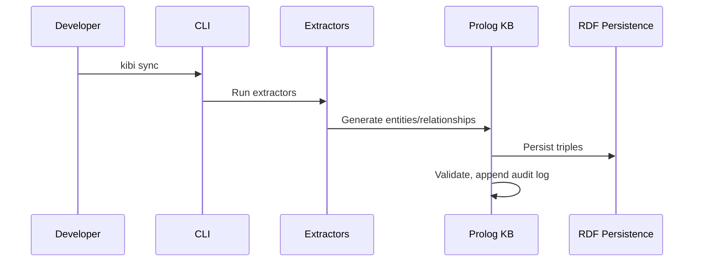
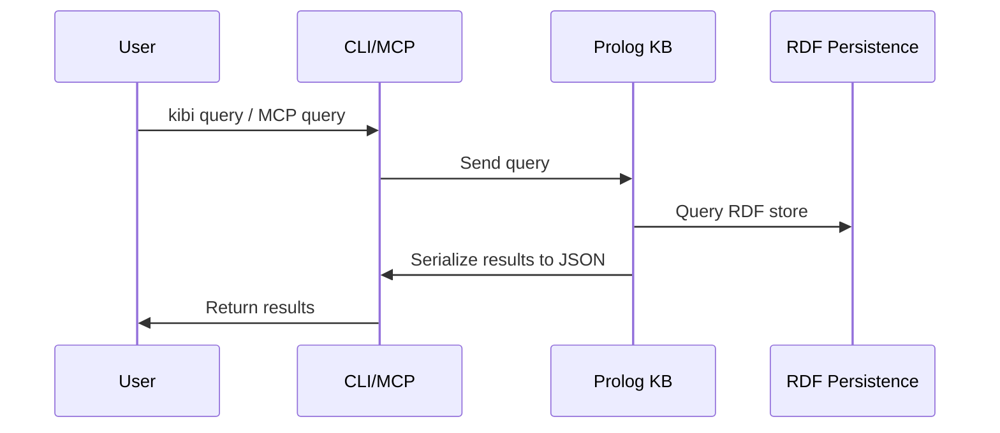

LAST_UPDATED: 2026-02-25 09:53 CET
COMMIT: 8a8a039


# Kibi Complete Lite
> Single-file repository dump optimized for LLM context windows.
> Generated on Wed Feb 25 09:54:32 CET 2026
---


This file is a merged representation of the entire codebase, combined into a single document by Repomix.
The content has been processed where security check has been disabled.

# File Summary

## Purpose
This file contains a packed representation of the entire repository's contents.
It is designed to be easily consumable by AI systems for analysis, code review,
or other automated processes.

## File Format
The content is organized as follows:
1. This summary section
2. Repository information
3. Directory structure
4. Repository files (if enabled)
5. Multiple file entries, each consisting of:
  a. A header with the file path (## File: path/to/file)
  b. The full contents of the file in a code block

## Usage Guidelines
- This file should be treated as read-only. Any changes should be made to the
  original repository files, not this packed version.
- When processing this file, use the file path to distinguish
  between different files in the repository.
- Be aware that this file may contain sensitive information. Handle it with
  the same level of security as you would the original repository.

## Notes
- Some files may have been excluded based on .gitignore rules and Repomix's configuration
- Binary files are not included in this packed representation. Please refer to the Repository Structure section for a complete list of file paths, including binary files
- Files matching patterns in .gitignore are excluded
- Files matching default ignore patterns are excluded
- Security check has been disabled - content may contain sensitive information
- Files are sorted by Git change count (files with more changes are at the bottom)

# Directory Structure
```
.opencode/
  config.json
docs/
  architecture.md
  entity-schema.md
  inference-rules.md
documentation/
  adr/
    ADR-001.md
    ADR-002.md
    ADR-003.md
    ADR-004.md
    ADR-005.md
    ADR-006.md
    ADR-007.md
    ADR-008.md
    ADR-009.md
    ADR-010.md
    ADR-011.md
    ADR-annotation-strategy.md
  events/
    EVT-001.md
    EVT-002.md
    EVT-003.md
    EVT-004.md
    EVT-005.md
  flags/
    FLAG-001.md
    FLAG-002.md
    FLAG-003.md
    FLAG-004.md
    FLAG-005.md
  requirements/
    REQ-001.md
    REQ-002.md
    REQ-003.md
    REQ-004.md
    REQ-005.md
    REQ-006.md
    REQ-007.md
    REQ-008.md
    REQ-009.md
    REQ-010.md
    REQ-011.md
    REQ-012.md
    REQ-013.md
    REQ-014.md
    REQ-015.md
    REQ-016.md
    REQ-018.md
    REQ-019.md
    REQ-vscode-traceability.md
  scenarios/
    SCEN-001.md
    SCEN-002.md
    SCEN-003.md
    SCEN-004.md
    SCEN-005.md
    SCEN-006.md
    SCEN-007.md
    SCEN-008.md
    SCEN-009.md
    SCEN-010.md
    SCEN-011.md
    SCEN-vscode-code-action.md
    SCEN-vscode-open-entity.md
  symbols.yaml
packages/
  cli/
    bin/
      kibi
    src/
      commands/
        branch.ts
        check.ts
        check.ts.backup
        check.ts.head
        check.ts.tail
        check.ts.tmp
        doctor.ts
        gc.ts
        init-helpers.ts
        init.ts
        query.ts
        sync.ts
      extractors/
        manifest.ts
        markdown.ts
        symbols-coordinator.ts
        symbols-ts.ts
      hooks/
        post-checkout.sh
        post-merge.sh
        pre-commit.sh
      schemas/
        changeset.schema.json
        entity.schema.json
        relationship.schema.json
      types/
        changeset.ts
        entities.ts
        js-yaml.d.ts
        relationships.ts
      cli.ts
      kibi.code-workspace
      prolog.ts
    package.json
    tsconfig.json
  core/
    schema/
      entities.pl
      relationships.pl
      validation.pl
    src/
      kb.pl
    package.json
  mcp/
    bin/
      kibi-mcp
    src/
      tools/
        branch.ts
        check.ts
        context.ts
        coverage-report.ts
        delete.ts
        derive.ts
        impact.ts
        list-types.ts
        prolog-list.ts
        query-relationships.ts
        query.ts
        symbols.ts
        upsert.ts
      types/
        js-yaml.d.ts
      env.ts
      mcpcat.ts
      server.ts
      tools-config.ts
      workspace.ts
    package.json
    tsconfig.json
  vscode/
    media/
      kibi-activitybar.svg
    src/
      codeActionProvider.ts
      codeLensProvider.ts
      extension.ts
      helpers.ts
      hoverProvider.ts
      relationshipCache.ts
      symbolIndex.ts
      treeProvider.ts
    .vscodeignore
    icon.svg
    package-vsix.sh
    package.json
    README.md
requirements/
  main-only.md
  req1.md
types/
  bun-test.d.ts
.editorconfig
.gitignore
AGENTS.md
biome.json
brief.md
check.ts
CONTRIBUTING.md
example-initialization.md
KNOWN_LIMITATIONS.md
oh-my-opencode.json
opencode.json
package.json
README.md
tsconfig.json
```

# Files

## File: .opencode/config.json
````json
{
  "mcpServers": {
    "kibi-mcp": {
      "command": "bun",
      "args": ["./packages/mcp/bin/kibi-mcp"]
    }
  }
}
````

## File: docs/architecture.md
````markdown
# Kibi System Architecture

## System Diagram

```mermaid
graph TD
    subgraph Git Repository
        D[Markdown/YAML Documents]
    end
    D -->|Extract| E[Extractors]
    E -->|Entities/Relationships| KB[Prolog KB (per branch)]
    KB -->|Query| CLI[CLI]
    KB -->|Query| MCP[MCP Server]
    MCP -->|Tooling| VSCode[VS Code Extension]
    CLI -->|Git Hooks| GH[Git Hooks]
    GH -->|post-checkout/post-merge| KB
    KB -->|Persist| RDF[RDF Persistence]
```

## Component Descriptions

### Prolog Core
- Located at `packages/core/src/kb.pl`
- Implements RDF persistence using SWI-Prolog's `rdf_persistency`
- Stores entities and relationships as RDF triples
- Enforces validation rules
- All operations mutex-protected for concurrency safety

### CLI
- Located at `packages/cli/`
- Node.js/Bun wrapper around Prolog
- Spawns SWI-Prolog subprocess
- Commands: init, sync, query, check, gc, branch, doctor
- Runs extractors for Markdown/YAML
- Handles schema validation and audit logging

### MCP Server
- Located at `packages/mcp/`
- Provides stdio JSON-RPC transport (newline-delimited, no embedded newlines)
- Tools: query, upsert, delete, check, branch.ensure, branch.gc
- Branch-aware: all tools accept branch parameter
- Keeps Prolog process alive for stateful operations

### VS Code Extension
- Located at `packages/vscode/`
- TreeView scaffolding for KB navigation
- MCP integration for queries and updates
- Minimal functionality in v0

### Git Hooks
- Installed in `$GIT_DIR/hooks` or via `core.hooksPath`
- `post-checkout`: ensures branch KB exists, runs sync
- `post-merge`: runs sync
- `kb gc`: deletes stale branch KBs

## Data Flow Diagrams

### Write Path (Document → KB)



### Read Path (KB → Query)



## Per-Branch KB Architecture

- Each git branch has its own KB directory
- On new branch creation: KB is copied from main branch snapshot
- After creation, branch KBs evolve independently (no ongoing sync)
- Branch KB isolation prevents cross-branch contamination
- Git hooks automate KB creation and sync on branch events

## RDF Persistence Details

- Uses SWI-Prolog `library(semweb/rdf_persistency)`
- Directory layout: base snapshot (binary `.trp`) + journal (`.jrn` Prolog terms)
- File locking: lock file with timestamp, PID, hostname prevents concurrent access
- Multi-step updates guarded with `with_mutex/2` for atomicity
- Journals are not auto-merged; explicit maintenance required
- Also uses `library(persistency)` for record-like predicates
- Provides ACID properties (isolation, durability) for KB operations

## MCP Stdio Transport

- JSON-RPC messages sent via stdio (newline-delimited)
- No embedded newlines in messages
- Only valid MCP messages on stdout; logs sent to stderr

## Git Hook Automation

- `post-checkout`: ensures branch KB exists, runs sync
- `post-merge`: runs sync
- `kb gc`: deletes stale branch KBs

## Directory Structure

- See README.md for `.kb/` directory layout and file details

---

This document covers the technical architecture, component interactions, data flow, per-branch KB isolation, RDF persistence, MCP transport, and git hook automation for Kibi. For directory structure details, refer to README.md.
````

## File: docs/entity-schema.md
````markdown
# Entity Schema Documentation

This document describes the entity and relationship schema for the Kibi Knowledge Base. It covers all supported entity types, their properties, relationship types, and provides frontmatter examples for each entity and relationship.

---

## Entity Types

Kibi supports eight entity types:

| Type     | Description                                                        |
|----------|--------------------------------------------------------------------|
| req      | Software requirement specifying functionality or constraints       |
| scenario | BDD scenario describing user behavior (Given/When/Then)            |
| test     | Unit, integration, or e2e test case                                |
| adr      | Architecture Decision Record documenting technical choices         |
| flag     | Feature flag controlling functionality rollout                     |
| event    | Domain or system event published/consumed by components            |
| symbol   | Abstract code symbol (function, class, module) - language-agnostic |
| fact     | Atomic domain fact used to model concepts, invariants, and properties |

---

### Common Properties (All Entities)

| Property     | Required | Type           | Description                                      |
|--------------|----------|----------------|--------------------------------------------------|
| id           | Yes      | string         | Unique identifier (SHA256 or explicit frontmatter)|
| title        | Yes      | string         | Short summary/name                               |
| status       | Yes      | string         | Entity status (see below for values)             |
| created_at   | Yes      | ISO 8601       | Creation timestamp                               |
| updated_at   | Yes      | ISO 8601       | Last update timestamp                            |
| source       | Yes      | string         | Provenance (file path, URL, or reference)        |
| tags[]       | No       | array[string]  | Array of tags                                    |
| owner        | No       | string         | Owner/assignee                                   |
| priority     | No       | string         | Priority level (must, should, could)             |
| severity     | No       | string         | Severity level                                   |
| links[]      | No       | array[string]  | Array of URLs                                    |
| text_ref     | No       | string         | Pointer to Markdown/doc blob                     |

---

### Entity Type Details & Example Frontmatter

#### Requirement (`req`)

| Property     | Required | Type           | Description                                      |
|--------------|----------|----------------|--------------------------------------------------|
| id           | Yes      | string         | Unique identifier                                |
| title        | Yes      | string         | Requirement summary                              |
| status       | Yes      | string         | open, in_progress, closed, deprecated            |
| created_at   | Yes      | ISO 8601       | Creation timestamp                               |
| updated_at   | Yes      | ISO 8601       | Last update timestamp                            |
| source       | Yes      | string         | Provenance                                       |
| tags[]       | No       | array[string]  | Tags                                             |
| owner        | No       | string         | Owner/assignee                                   |
| priority     | No       | string         | must, should, could                              |
| severity     | No       | string         | Severity level                                   |
| links[]      | No       | array[string]  | URLs                                             |
| text_ref     | No       | string         | Markdown/doc pointer                             |

**Example:**
```yaml
---
id: REQ-001
title: Sample requirement REQ-001
status: open
created_at: 2026-02-17T13:00:00Z
updated_at: 2026-02-17T13:00:00Z
source: https://example.com/fixtures/requirements/REQ-001
tags:
  - sample
owner: product-team
priority: medium
links: []
---
```

#### Scenario (`scenario`)

| Property     | Required | Type           | Description                                      |
|--------------|----------|----------------|--------------------------------------------------|
| id           | Yes      | string         | Unique identifier                                |
| title        | Yes      | string         | Scenario summary                                 |
| status       | Yes      | string         | draft, active, deprecated                        |
| created_at   | Yes      | ISO 8601       | Creation timestamp                               |
| updated_at   | Yes      | ISO 8601       | Last update timestamp                            |
| source       | Yes      | string         | Provenance                                       |
| tags[]       | No       | array[string]  | Tags                                             |
| owner        | No       | string         | Owner/assignee                                   |
| priority     | No       | string         | Priority level                                   |
| severity     | No       | string         | Severity level                                   |
| links[]      | No       | array[string]  | URLs                                             |
| text_ref     | No       | string         | Markdown/doc pointer                             |

**Example:**
```yaml
---
id: SCEN-001
title: Sample scenario SCEN-001
status: active
created_at: 2026-02-17T13:00:00Z
updated_at: 2026-02-17T13:00:00Z
source: https://example.com/fixtures/scenarios/SCEN-001
tags:
  - sample
---
```

#### Test (`test`)

| Property     | Required | Type           | Description                                      |
|--------------|----------|----------------|--------------------------------------------------|
| id           | Yes      | string         | Unique identifier                                |
| title        | Yes      | string         | Test summary                                     |
| status       | Yes      | string         | passing, failing, skipped, pending               |
| created_at   | Yes      | ISO 8601       | Creation timestamp                               |
| updated_at   | Yes      | ISO 8601       | Last update timestamp                            |
| source       | Yes      | string         | Provenance                                       |
| tags[]       | No       | array[string]  | Tags                                             |
| owner        | No       | string         | Owner/assignee                                   |
| priority     | No       | string         | Priority level                                   |
| severity     | No       | string         | Severity level                                   |
| links[]      | No       | array[string]  | URLs                                             |
| text_ref     | No       | string         | Markdown/doc pointer                             |

**Example:**
```yaml
---
id: TEST-001
title: Sample test TEST-001
status: passing
created_at: 2026-02-17T13:00:00Z
updated_at: 2026-02-17T13:00:00Z
source: https://example.com/fixtures/tests/TEST-001
tags:
  - sample
---
```

#### ADR (`adr`)

| Property     | Required | Type           | Description                                      |
|--------------|----------|----------------|--------------------------------------------------|
| id           | Yes      | string         | Unique identifier                                |
| title        | Yes      | string         | ADR summary                                      |
| status       | Yes      | string         | proposed, accepted, deprecated, superseded       |
| created_at   | Yes      | ISO 8601       | Creation timestamp                               |
| updated_at   | Yes      | ISO 8601       | Last update timestamp                            |
| source       | Yes      | string         | Provenance                                       |
| tags[]       | No       | array[string]  | Tags                                             |
| owner        | No       | string         | Owner/assignee                                   |
| priority     | No       | string         | Priority level                                   |
| severity     | No       | string         | Severity level                                   |
| links[]      | No       | array[string]  | URLs                                             |
| text_ref     | No       | string         | Markdown/doc pointer                             |

**Example:**
```yaml
---
id: ADR-001
title: Sample ADR ADR-001
status: accepted
created_at: 2026-02-17T13:00:00Z
updated_at: 2026-02-17T13:00:00Z
source: https://example.com/fixtures/adrs/ADR-001
tags:
  - architecture
---
```

#### Flag (`flag`)

| Property     | Required | Type           | Description                                      |
|--------------|----------|----------------|--------------------------------------------------|
| id           | Yes      | string         | Unique identifier                                |
| title        | Yes      | string         | Flag summary                                     |
| status       | Yes      | string         | active, inactive, deprecated                     |
| created_at   | Yes      | ISO 8601       | Creation timestamp                               |
| updated_at   | Yes      | ISO 8601       | Last update timestamp                            |
| source       | Yes      | string         | Provenance                                       |
| tags[]       | No       | array[string]  | Tags                                             |
| owner        | No       | string         | Owner/assignee                                   |
| priority     | No       | string         | Priority level                                   |
| severity     | No       | string         | Severity level                                   |
| links[]      | No       | array[string]  | URLs                                             |
| text_ref     | No       | string         | Markdown/doc pointer                             |

**Example:**
```yaml
---
id: FLAG-001
title: Sample flag FLAG-001
status: active
created_at: 2026-02-17T13:00:00Z
updated_at: 2026-02-17T13:00:00Z
source: https://example.com/fixtures/flags/FLAG-001
tags:
  - rollout
---
```

#### Event (`event`)

| Property     | Required | Type           | Description                                      |
|--------------|----------|----------------|--------------------------------------------------|
| id           | Yes      | string         | Unique identifier                                |
| title        | Yes      | string         | Event summary                                    |
| status       | Yes      | string         | active, deprecated                               |
| created_at   | Yes      | ISO 8601       | Creation timestamp                               |
| updated_at   | Yes      | ISO 8601       | Last update timestamp                            |
| source       | Yes      | string         | Provenance                                       |
| tags[]       | No       | array[string]  | Tags                                             |
| owner        | No       | string         | Owner/assignee                                   |
| priority     | No       | string         | Priority level                                   |
| severity     | No       | string         | Severity level                                   |
| links[]      | No       | array[string]  | URLs                                             |
| text_ref     | No       | string         | Markdown/doc pointer                             |

**Example:**
```yaml
---
id: EVENT-001
title: Sample event EVENT-001
status: active
created_at: 2026-02-17T13:00:00Z
updated_at: 2026-02-17T13:00:00Z
source: https://example.com/fixtures/events/EVENT-001
tags:
  - domain
---
```

#### Symbol (`symbol`)

| Property     | Required | Type           | Description                                      |
|--------------|----------|----------------|--------------------------------------------------|
| id           | Yes      | string         | Unique identifier                                |
| title        | Yes      | string         | Symbol summary                                   |
| status       | Yes      | string         | active, deprecated, removed                      |
| created_at   | Yes      | ISO 8601       | Creation timestamp                               |
| updated_at   | Yes      | ISO 8601       | Last update timestamp                            |
| source       | Yes      | string         | Provenance                                       |
| tags[]       | No       | array[string]  | Tags                                             |
| owner        | No       | string         | Owner/assignee                                   |
| priority     | No       | string         | Priority level                                   |
| severity     | No       | string         | Severity level                                   |
| links[]      | No       | array[string]  | URLs                                             |
| text_ref     | No       | string         | Markdown/doc pointer                             |

**Example:**
```yaml
---
id: SYMBOL-001
title: Sample symbol SYMBOL-001
status: active
created_at: 2026-02-17T13:00:00Z
updated_at: 2026-02-17T13:00:00Z
source: https://example.com/fixtures/symbols/SYMBOL-001
tags:
  - code
---
```

#### Fact (`fact`)

`fact` entities represent atomic domain concepts and invariants (for example domain nouns, cardinalities, and property values). Requirements can link to facts using `constrains` and `requires_property` so contradictions become structural and queryable.

| Property     | Required | Type           | Description                                      |
|--------------|----------|----------------|--------------------------------------------------|
| id           | Yes      | string         | Unique identifier                                |
| title        | Yes      | string         | Fact summary                                     |
| status       | Yes      | string         | active, deprecated                               |
| created_at   | Yes      | ISO 8601       | Creation timestamp                               |
| updated_at   | Yes      | ISO 8601       | Last update timestamp                            |
| source       | Yes      | string         | Provenance                                       |
| tags[]       | No       | array[string]  | Tags                                             |
| owner        | No       | string         | Owner/assignee                                   |
| priority     | No       | string         | Priority level                                   |
| severity     | No       | string         | Severity level                                   |
| links[]      | No       | array[string]  | URLs                                             |
| text_ref     | No       | string         | Markdown/doc pointer                             |

**Example:**
```yaml
---
id: FACT-USER-ROLE
title: User Role Assignment
status: active
created_at: 2026-02-20T13:00:00Z
updated_at: 2026-02-20T13:00:00Z
source: documentation/facts/FACT-USER-ROLE.md
tags:
  - domain
  - auth
---
```

---

## Relationship Types

Kibi supports relationship types listed below. Each relationship has metadata:

| Property     | Required | Type           | Description                                      |
|--------------|----------|----------------|--------------------------------------------------|
| created_at   | Yes      | ISO 8601       | Creation timestamp                               |
| created_by   | Yes      | string         | Creator identifier                               |
| source       | Yes      | string         | Provenance                                       |
| confidence   | No       | string/number  | Optional confidence level                        |

### Relationship Table

| Relationship         | Source Entity         | Target Entity         | Description                                      |
|---------------------|----------------------|----------------------|--------------------------------------------------|
| depends_on          | req                  | req                  | Requirement depends on another requirement        |
| specified_by        | req                  | scenario             | Requirement specified by scenario                 |
| verified_by         | req                  | test                 | Requirement verified by test                      |
| implements          | symbol               | req                  | Symbol implements requirement                     |
| covered_by          | symbol               | test                 | Symbol covered by test                            |
| constrained_by      | symbol               | adr                  | Symbol constrained by ADR                         |
| constrains          | req                  | fact                 | Requirement constrains a specific domain fact     |
| requires_property   | req                  | fact                 | Requirement requires a property fact/value        |
| affects             | adr                  | symbol/component     | ADR affects symbol/component                      |
| guards              | flag                 | symbol/event/req     | Flag guards symbol, event, or requirement         |
| publishes           | symbol               | event                | Symbol publishes event                            |
| consumes            | symbol               | event                | Symbol consumes event                             |
| supersedes          | adr                  | adr                  | The source ADR formally replaces the target ADR. The target is expected to carry status: archived or deprecated |
| relates_to          | a                    | b                    | Generic relationship (escape hatch)               |

---

### Relationship Examples

**depends_on**
```yaml
# req REQ-002 depends_on req REQ-001
relationship:
  type: depends_on
  source: REQ-002
  target: REQ-001
  created_at: 2026-02-17T13:10:00Z
  created_by: analyst
  source: https://example.com/fixtures/requirements/REQ-002
```

**specified_by**
```yaml
# req REQ-001 specified_by scenario SCEN-001
relationship:
  type: specified_by
  source: REQ-001
  target: SCEN-001
  created_at: 2026-02-17T13:15:00Z
  created_by: analyst
  source: https://example.com/fixtures/requirements/REQ-001
```

**verified_by**
```yaml
# req REQ-001 verified_by test TEST-001
relationship:
  type: verified_by
  source: REQ-001
  target: TEST-001
  created_at: 2026-02-17T13:20:00Z
  created_by: qa
  source: https://example.com/fixtures/tests/TEST-001
```

**implements**
```yaml
# symbol SYMBOL-001 implements req REQ-001
relationship:
  type: implements
  source: SYMBOL-001
  target: REQ-001
  created_at: 2026-02-17T13:25:00Z
  created_by: dev
  source: https://example.com/fixtures/symbols/SYMBOL-001
```

**covered_by**
```yaml
# symbol SYMBOL-001 covered_by test TEST-001
relationship:
  type: covered_by
  source: SYMBOL-001
  target: TEST-001
  created_at: 2026-02-17T13:30:00Z
  created_by: dev
  source: https://example.com/fixtures/tests/TEST-001
```

**constrained_by**
```yaml
# symbol SYMBOL-001 constrained_by adr ADR-001
relationship:
  type: constrained_by
  source: SYMBOL-001
  target: ADR-001
  created_at: 2026-02-17T13:35:00Z
  created_by: architect
  source: https://example.com/fixtures/adrs/ADR-001
```

**affects**
```yaml
# adr ADR-001 affects symbol SYMBOL-001
relationship:
  type: affects
  source: ADR-001
  target: SYMBOL-001
  created_at: 2026-02-17T13:40:00Z
  created_by: architect
  source: https://example.com/fixtures/adrs/ADR-001
```

**guards**
```yaml
# flag FLAG-001 guards req REQ-001
relationship:
  type: guards
  source: FLAG-001
  target: REQ-001
  created_at: 2026-02-17T13:45:00Z
  created_by: devops
  source: https://example.com/fixtures/flags/FLAG-001
```

**publishes**
```yaml
# symbol SYMBOL-001 publishes event EVENT-001
relationship:
  type: publishes
  source: SYMBOL-001
  target: EVENT-001
  created_at: 2026-02-17T13:50:00Z
  created_by: dev
  source: https://example.com/fixtures/symbols/SYMBOL-001
```

**consumes**
```yaml
# symbol SYMBOL-001 consumes event EVENT-001
relationship:
  type: consumes
  source: SYMBOL-001
  target: EVENT-001
  created_at: 2026-02-17T13:55:00Z
  created_by: dev
  source: https://example.com/fixtures/symbols/SYMBOL-001
```

**constrains**
```yaml
# req REQ-018 constrains fact FACT-USER-ROLE
relationship:
  type: constrains
  source: REQ-018
  target: FACT-USER-ROLE
  created_at: 2026-02-20T14:00:00Z
  created_by: analyst
  source: documentation/requirements/REQ-018.md
```

**requires_property**
```yaml
# req REQ-018 requires_property fact FACT-LIMIT-2
relationship:
  type: requires_property
  source: REQ-018
  target: FACT-LIMIT-2
  created_at: 2026-02-20T14:01:00Z
  created_by: analyst
  source: documentation/requirements/REQ-018.md
```

**relates_to**
```yaml
# Generic relationship between any two entities
relationship:
  type: relates_to
  source: ENTITY-A
  target: ENTITY-B
  kind: custom
  created_at: 2026-02-17T14:00:00Z
  created_by: analyst
  source: https://example.com/fixtures/entities/ENTITY-A
```

**supersedes**
```yaml
# adr ADR-010 supersedes adr ADR-009
relationship:
  type: supersedes
  source: ADR-010
  target: ADR-009
  created_at: 2026-02-20T10:00:00Z
  created_by: architect
  source: https://example.com/fixtures/adrs/ADR-010
```

---

## Notes
- All entity and relationship types are fixed in v0; extensibility is planned for future versions.
- IDs must be stable and unique (content-based SHA256 or explicit frontmatter).
- Relationship metadata supports audit and conflict resolution.
- Status values are entity-type specific (see above).

---

End of schema documentation.
````

## File: docs/inference-rules.md
````markdown
# Inference Rules (Phase 1)

Kibi v0.5 introduces deterministic derived predicates exposed via MCP.

## Core Predicates (`packages/core/src/kb.pl`)

- `transitively_implements(Symbol, Req)`
  - Direct: `implements(Symbol, Req)`
  - Derived: `covered_by(Symbol, Test)` + `validates(Test, Req)`
  - Derived: `covered_by(Symbol, Test)` + `verified_by(Req, Test)`

- `transitively_depends(Req1, Req2)`
  - Recursive closure over `depends_on/3`
  - Cycle-safe via visited set

- `impacted_by_change(Entity, Changed)`
  - Undirected graph traversal over all relationship edges
  - `Entity=Changed` included by definition

- `affected_symbols(Req, Symbols)`
  - Returns sorted symbols implementing `Req`
  - Includes symbols implementing requirements that transitively depend on `Req`

- `coverage_gap(Req, Reason)`
  - Evaluates only MUST requirements (`priority` contains `must`)
  - `Reason` is one of:
    - `missing_scenario_and_test`
    - `missing_scenario`
    - `missing_test`

- `untested_symbols(Symbols)`
  - Returns sorted symbols without `covered_by` links

- `stale(Entity, MaxAgeDays)`
  - True when `updated_at` age is older than `MaxAgeDays`

- `orphaned(Symbol)`
  - Symbol with no `implements`, `covered_by`, or `constrained_by` links

- `conflicting(Adr1, Adr2)`
  - ADR pair constraining the same symbol
  - Sorted pair output (`Adr1 @< Adr2`)

- `deprecated_still_used(Adr, Symbols)`
  - ADR status in `archived|deprecated|rejected`
  - Returns symbols still constrained by that ADR

- `current_adr(Id)`
  - True when Id is an ADR not superseded by any other ADR
  - Returns all currently active/architectural decisions

- `superseded_by(OldId, NewId)`
  - Direct supersession relationship
  - OldId is superseded by NewId

- `adr_chain(AnyId, Chain)`
  - Full ordered chain from AnyId to the current ADR (newest last)
  - Cycle-safe via visited accumulator
  - Returns complete decision history for a topic

- `contradicting_reqs(ReqA, ReqB, Reason)`
  - Finds two active, non-superseded requirements that constrain the same fact
  - Flags contradiction when they require different property facts
  - `Reason` describes the conflicting fact/property pair

## MCP Tools

### `kb_derive`

Generic inference endpoint.

Input:

```json
{
  "rule": "coverage_gap",
  "params": { "req": "REQ-042" }
}
```

Output:

```json
{
  "structuredContent": {
    "rule": "coverage_gap",
    "params": { "req": "REQ-042" },
    "count": 1,
    "rows": [{ "req": "REQ-042", "reason": "missing_test" }],
    "provenance": { "predicate": "coverage_gap", "deterministic": true }
  }
}
```

Supported rules:

- `transitively_implements`
- `transitively_depends`
- `impacted_by_change`
- `affected_symbols`
- `coverage_gap`
- `untested_symbols`
- `stale`
- `orphaned`
- `conflicting`
- `deprecated_still_used`
- `current_adr`
- `adr_chain`
- `superseded_by`
- `domain_contradictions`

### `kb_impact`

Shorthand for impact analysis.

Input:

```json
{ "entity": "REQ-042" }
```

Output fields:

- `entity`: changed entity
- `impacted`: sorted list of `{id, type}`
- `count`
- `provenance`

### `kb_coverage_report`

Aggregate coverage rollup.

Input:

```json
{ "type": "req" }
```

`type` is optional (`req`, `symbol`, or all).

Output fields:

- `coverage.requirements`: totals and gap reasons
- `coverage.symbols`: totals and untested symbol IDs
- `provenance.predicates`: predicates used for derivation

### Additional MCP Tools

#### kb_current_adr

Returns all current (non-superseded) ADRs.

Input: No params

Output:
```json
{
  "content": [{"type": "text", "text": "Derived X row(s) for rule 'current_adr'."}],
  "structuredContent": {
    "rule": "current_adr",
    "params": {},
    "count": N,
    "rows": [
      {"id": "ADR-001", "title": "Use SWI-Prolog..."},
      {"id": "ADR-002", "title": "Use Bun/Node.js..."}
    ],
    "provenance": {
      "predicate": "current_adr",
      "deterministic": true
    }
  }
}
```

#### kb_adr_chain

Returns full temporal chain from a starting ADR to the current one.

Input:
```json
{
  "adr": "ADR-005"
}
```

Output:
```json
{
  "content": [{"type": "text", "text": "Derived 3 row(s) for rule 'adr_chain'."}],
  "structuredContent": {
    "rule": "adr_chain",
    "params": {"adr": "ADR-005"},
    "count": 3,
    "rows": [
      {"id": "ADR-005", "title": "...", "status": "superseded"},
      {"id": "ADR-008", "title": "...", "status": "active"},
      {"id": "ADR-010", "title": "...", "status": "accepted"}
    ],
    "provenance": {
      "predicate": "adr_chain",
      "deterministic": true
    }
  }
}
```

#### kb_superseded_by

Returns direct successor for an ADR.

Input:
```json
{
  "adr": "ADR-005"
}
```

Output:
```json
{
  "content": [{"type": "text", "text": "Derived 1 row(s) for rule 'superseded_by'."}],
  "structuredContent": {
    "rule": "superseded_by",
    "params": {"adr": "ADR-005"},
    "count": 1,
    "rows": [
      {
        "adr": "ADR-005",
        "successor_id": "ADR-008",
        "successor_title": "AST-derived symbol coordinates..."
      }
    ],
    "provenance": {
      "predicate": "superseded_by",
      "deterministic": true
    }
  }
}
```

## Determinism Guarantees

- Prolog queries use `setof/3` where possible for stable ordering and de-duplication.
- MCP responses include explicit field names and fixed shapes.
- Aggregate/report outputs are sorted before returning.
````

## File: documentation/adr/ADR-001.md
````markdown
---
id: ADR-001
title: Use SWI-Prolog with RDF persistence for knowledge base storage
status: active
created_at: 2026-02-18T13:12:25.000Z
updated_at: 2026-02-18T13:12:25.000Z
priority: must
tags:
  - storage
  - prolog
  - rdf
links:
  - REQ-009
---

## Context

We need a local, queryable knowledge base with typed entities and typed relationships.
Options considered: SQLite, JSON files, graph DB (Neo4j), RDF/Prolog.

## Decision

Use SWI-Prolog with `library(semweb/rdf_persistency)`. Prolog gives us a native
query language (unification, backtracking) suitable for relationship traversal and
rule-based validation. RDF persistence provides a standard serialisation format.

## Consequences

- Requires SWI-Prolog to be installed on the host machine
- RDF/XML is verbose but human-readable and diff-friendly
- Validation rules written in Prolog are co-located with the schema
````

## File: documentation/adr/ADR-002.md
````markdown
---
id: ADR-002
title: Use Bun/Node.js as CLI wrapper around SWI-Prolog subprocess
status: active
created_at: 2026-02-18T13:12:25.000Z
updated_at: 2026-02-18T13:12:25.000Z
priority: must
tags:
  - cli
  - bun
  - nodejs
links:
  - REQ-003
---

## Context

The CLI needs to drive the Prolog KB, parse YAML/Markdown, handle file I/O,
and produce formatted output. Prolog alone is awkward for these tasks.

## Decision

TypeScript (Bun runtime) wraps SWI-Prolog as a long-lived subprocess.
Communication is via stdin/stdout using a simple line-based JSON protocol.

## Consequences

- Fast startup (Bun)
- Familiar ecosystem for contributors (TypeScript, npm packages)
- Prolog process keep-alive avoids repeated startup costs
- Subprocess crash must be detected and handled gracefully
````

## File: documentation/adr/ADR-003.md
````markdown
---
id: ADR-003
title: Use stdio JSON-RPC transport for MCP server (no embedded newlines)
status: active
created_at: 2026-02-18T13:12:25.000Z
updated_at: 2026-02-18T13:12:25.000Z
priority: must
tags:
  - mcp
  - transport
  - json-rpc
links:
  - REQ-002
---

## Context

MCP specifies stdio as the transport mechanism. JSON-RPC messages must be
newline-delimited. Multi-line JSON with embedded newlines would break framing.

## Decision

All JSON-RPC messages are serialised on a single line (no embedded newlines).
The server reads one line at a time and parses each line as a complete message.

## Consequences

- Simple, robust framing; no length-prefix headers needed
- JSON output for tool results must have embedded newlines stripped
- Large results may produce very long lines (acceptable for this use case)
````

## File: documentation/adr/ADR-004.md
````markdown
---
id: ADR-004
title: Per-branch KB isolation with no automatic cross-branch merging
status: active
created_at: 2026-02-18T13:12:25.000Z
updated_at: 2026-02-18T13:12:25.000Z
priority: must
tags:
  - branching
  - isolation
links:
  - REQ-001
  - REQ-012
---

## Context

Should KB state automatically merge when git branches merge? This would mirror
code-merge semantics but RDF merge conflicts are difficult to resolve automatically.

## Decision

Each branch has its own isolated KB store. No automatic merge. New branches get
a copy of `main` as a starting point (`copy-from-main` semantics). Developers
manually re-sync after merging code branches if they want entities propagated.

## Consequences

- Simple, predictable semantics
- No RDF merge conflicts
- Cross-branch entity propagation is explicit and intentional
- Slight divergence risk if branches are long-lived without re-sync
````

## File: documentation/adr/ADR-005.md
````markdown
---
id: ADR-005
title: Language-agnostic symbol extraction via YAML manifest files (SCIP deferred to v1)
status: deprecated
created_at: 2026-02-18T13:12:25.000Z
updated_at: 2026-02-18T13:12:25.000Z
priority: must
tags:
  - symbols
  - manifest
  - extractors
links:
  - REQ-007
  - FLAG-002
---

## Context

Linking code symbols (classes, functions) to KB entities requires some form of
symbol extraction. SCIP (Source Code Intelligence Protocol) is precise but requires
language-specific indexers and adds significant tooling complexity.

## Decision

For v0: symbols are declared manually in a `symbols.yaml` manifest at the repo root.
Each entry has an `id`, `title`, optional `sourceFile`, and `links` to KB entity IDs.
SCIP-based extraction is deferred to v1 behind `FLAG-002`.

## Consequences

- Zero external tooling dependencies for symbol linking
- Manual maintenance of `symbols.yaml` is low-friction for small codebases
- No automatic discovery of unannotated symbols
- CodeActionProvider in VS Code uses the manifest as its index
````

## File: documentation/adr/ADR-006.md
````markdown
---
id: ADR-006
title: "Monorepo structure: core (Prolog) + cli + mcp + vscode packages"
status: active
created_at: 2026-02-18T13:12:25.000Z
updated_at: 2026-02-18T13:12:25.000Z
priority: must
tags:
  - monorepo
  - structure
links:
  - REQ-001
  - REQ-002
  - REQ-003
---

## Context

kibi has four distinct deployment targets: the Prolog core, a CLI binary, an MCP
server binary, and a VS Code extension. These have different runtimes, build
systems, and release cadences.

## Decision

Bun workspaces monorepo with `packages/core`, `packages/cli`, `packages/mcp`,
`packages/vscode`. Shared types live in `packages/cli/src/types/`. Each package
has its own `package.json` and `tsconfig.json`.

## Consequences

- Single `bun install` sets up all packages
- Cross-package imports via workspace protocol (`@kibi/cli`)
- VS Code extension bundled separately with esbuild
- Each package can be published independently
````

## File: documentation/adr/ADR-007.md
````markdown
---
id: ADR-007
title: Defer graph visualization and full VS Code features to post-v0
status: active
created_at: 2026-02-18T13:12:25.000Z
updated_at: 2026-02-18T13:12:25.000Z
priority: should
tags:
  - vscode
  - scope
  - deferred
links:
  - REQ-010
  - FLAG-001
---

## Context

A graph visualization of entity relationships and a full VS Code webview panel
would be valuable but add significant implementation complexity for the v0 release.

## Decision

v0 ships only the tree-view sidebar and bidirectional traceability (click-to-open,
code actions). Graph visualization and the full webview experience are deferred to
v1 behind `FLAG-001`.

## Consequences

- v0 ships faster with a simpler, more maintainable extension
- Tree view covers the core navigation use case
- Graph view can be added without breaking existing tree-view functionality
````

## File: documentation/adr/ADR-008.md
````markdown
---
id: ADR-008
title: AST-derived symbol coordinates; MCP-enforced freshness
status: active
createdAt: 2026-02-20T00:00:00.000Z
updatedAt: 2026-02-20T00:00:00.000Z
priority: must
tags:
  - symbols
  - manifest
  - vscode
  - mcp
links:
  - ADR-005
  - REQ-007
  - REQ-vscode-traceability
  - type: supersedes
    target: ADR-005
---

## Context

ADR-005 deferred automated symbol extraction (SCIP) to v1 and mandated a
manually-maintained `symbols.yaml`. This created two problems:

1. `sourceLine` and related coordinates drift silently whenever code is refactored.
2. The VS Code extension positions CodeLens from stale coordinates, placing hints
   on wrong lines.

The root cause is that `symbols.yaml` conflated two distinct concerns: semantic
knowledge (which symbol links to which requirement/ADR — authored once, stable)
and mechanical coordinates (line/column positions — derivable from AST at any time,
must never be hand-maintained).

## Decision

Split the two concerns explicitly:

**Authored fields** (`id`, `title`, `sourceFile`, `links`) — written by an LLM
agent or human once. Stable across refactors unless the symbol is removed or
renamed.

**Generated fields** (`sourceLine`, `sourceColumn`, `sourceEndLine`,
`sourceEndColumn`, `coordinatesGeneratedAt`) — always produced by a TypeScript
AST extractor. Never written by hand. The authoritative source is the TypeScript
compiler, not the YAML file.

### Enforcement mechanism (no CI required)

The primary enforcement point is the MCP server itself. A new tool
`kb.symbols.refresh` resolves AST coordinates for all entries in `symbols.yaml`
that have a resolvable `sourceFile`, then rewrites the file in-place. The MCP
server also auto-refreshes coordinates for a symbol when `kb.upsert` is called
with `type: "symbol"`.

`kibi sync` also calls the same extractor, so git hooks (post-checkout,
post-merge) keep coordinates fresh as a secondary layer.

This means: as long as an LLM uses Kibi's MCP interface — which is the entire
point of the product — coordinates are always correct. No CI. No manual steps.

### What replaces SCIP (FLAG-002)

Full SCIP-based discovery remains deferred. This ADR does not auto-discover
new symbols. It only enriches existing `symbols.yaml` entries that already have
a `sourceFile`. Discovery automation (auto-populating new symbols from AST scans)
remains a v1 concern under FLAG-002.

## Consequences

- `symbols.yaml` generated fields must not be edited manually. Add a comment
  block at the top of the file documenting this.
- The TypeScript compiler API (via ts-morph) is added as a dependency of
  `packages/cli`.
- `sourceLine` drift is now impossible in normal operation.
- CodeLens positioning in the VS Code extension requires no changes — it simply
  reads coordinates that are always fresh.
- ADR-005 is superseded. The SCIP deferral clause of ADR-005 remains valid (SCIP
  is still v1), but the manual-maintenance clause is replaced by this ADR.
````

## File: documentation/adr/ADR-009.md
````markdown
---
id: ADR-009
title: No Automatic YAML Repair - Improve Diagnostics Instead
status: accepted
created_at: 2026-02-21T10:00:00Z
updated_at: 2026-02-21T10:00:00Z
source: documentation/adr/ADR-009.md
tags:
  - error-handling
  - yaml
  - frontmatter
---

# ADR-009: No Automatic YAML Repair - Improve Diagnostics Instead

## Context
Kibi parses YAML frontmatter from Markdown documents. When frontmatter is malformed (e.g., invalid indentation, missing quotes), the parser fails. We considered implementing automatic repair strategies (e.g., using LLMs or heuristics to fix common errors) to improve user experience.

## Decision
We will **NOT** implement automatic YAML repair. Instead, we will focus on providing precise, actionable error diagnostics that help the user or LLM agent fix the issue themselves.

## Rationale
1.  **Safety**: Automatic repairs can silently introduce subtle errors or misinterpret user intent.
2.  **Complexity**: Heuristic repair is brittle; LLM-based repair introduces non-determinism and latency.
3.  **Education**: Explicit errors teach users (and agents) the correct format, preventing future errors.
4.  **Fail Fast**: It is better to reject invalid input immediately than to guess and potentially corrupt the Knowledge Base.

## Consequences
- **Positive**: Users get clear, actionable errors pointing to the exact line and nature of the problem.
- **Positive**: The system remains deterministic and predictable.
- **Negative**: Users must manually fix YAML errors, which may feel less "magical" than auto-repair.

## Related Work
- Task 1: Improved YAML error messages (implemented to support this decision).
````

## File: documentation/adr/ADR-010.md
````markdown
---
id: ADR-010
title: Relationships Must Be Idempotent - Dedup at KB Layer
status: accepted
created_at: 2026-02-21T10:00:00Z
updated_at: 2026-02-21T10:00:00Z
source: documentation/adr/ADR-010.md
tags:
  - data-integrity
  - relationships
  - idempotency
---

# ADR-010: Relationships Must Be Idempotent - Dedup at KB Layer

## Context
Kibi allows asserting relationships between entities (e.g., `REQ-001 depends_on REQ-002`). Clients (CLI, MCP agents) may submit the same relationship multiple times, or retry operations after partial failures. Duplicate edges in the RDF graph clutter the store and complicate queries.

## Decision
Relationship assertion must be **idempotent**. The Knowledge Base layer will automatically deduplicate relationships. Asserting an existing relationship is a no-op.

## Rationale
1.  **Robustness**: Clients can safely retry operations without fear of creating duplicate data.
2.  **Simplicity**: Clients do not need to check for existence before asserting, simplifying agent logic.
3.  **Consistency**: The graph remains a set of unique edges, matching the logical model of entity relationships.

## Implementation
In the Prolog layer (`kb_assert_relationship/4`), we explicitly retract any existing identical triple before asserting the new one:
```prolog
rdf_retractall(S, P, O),
rdf_assert(S, P, O).
```
This ensures that at any point, only one instance of a specific relationship triple exists.

## Consequences
- **Positive**: Safe retries and batch operations.
- **Positive**: Cleaner graph data.
- **Negative**: Slight performance overhead for the retract-before-assert pattern (negligible for expected volume).

## Related Work
- Task 4: Deduplication implementation.
````

## File: documentation/adr/ADR-011.md
````markdown
---
id: ADR-011
title: Branch Hint Cannot Be Silently Ignored - Must Warn/Error
status: accepted
created_at: 2026-02-21T10:00:00Z
updated_at: 2026-02-21T10:00:00Z
source: documentation/adr/ADR-011.md
tags:
  - branching
  - error-handling
  - context
---

# ADR-011: Branch Hint Cannot Be Silently Ignored - Must Warn/Error

## Context
The `kbcontext` tool accepts a `branch` parameter to specify which branch's Knowledge Base to query. Previously, if the requested branch did not match the active checked-out branch, the system might silently ignore the hint and return results from the active branch.

## Decision
The `branch` parameter in `kbcontext` (and other tools) **must not be silently ignored**. If the requested branch differs from the active branch context, the system must return an explicit error or warning.

## Rationale
1.  **Correctness**: Silently returning data from the wrong branch leads to hallucinations and incorrect reasoning by agents.
2.  **Transparency**: The user/agent must know if they are querying a state that is not currently accessible or active.
3.  **Debugging**: Explicit errors make it obvious when branch context is mismatched, speeding up troubleshooting.

## Implementation
When `kbcontext` is called:
1.  Check the requested `branch` parameter.
2.  Compare it against the currently active git branch.
3.  If they differ, throw an error: `Requested branch 'X' does not match active branch 'Y'. Context is only available for the active branch.`

## Consequences
- **Positive**: Prevents "silent failure" scenarios where agents act on wrong information.
- **Positive**: Enforces branch discipline.
- **Negative**: Agents must be aware of the current branch and cannot arbitrarily query off-branch context without switching branches (which is by design).

## Related Work
- Task 5: `kbcontext` fix to enforce this decision.
````

## File: documentation/adr/ADR-annotation-strategy.md
````markdown
---
id: ADR-annotation-strategy
title: "Use symbols.yaml manifest for code-symbol-to-entity mapping (no inline annotations)"
status: active
created_at: 2026-02-18T00:00:00Z
updated_at: 2026-02-18T00:00:00Z
priority: must
tags:
  - vscode
  - annotation
  - symbols
  - manifest
links:
  - REQ-vscode-traceability
  - ADR-005
---

## Context

How should VS Code know which source symbols correspond to which KB entities?
Options: inline comments/decorators (`// @kibi: REQ-001`), a dedicated manifest
file (`symbols.yaml`), or language-server symbol index (SCIP).

## Decision

Use `symbols.yaml` manifest only. No inline annotations in source code.
The `KibiCodeActionProvider` reads the manifest and builds an index by title and
by source file path to match cursor position to KB entities.

## Consequences

- Source files remain annotation-free (no coupling to kibi syntax)
- Manifest must be kept in sync manually (or via `kibi sync`)
- `resolveManifestPath()` checks `.kb/config.json` for a custom path override
- Inverse direction (`constrained_by` from ADR to symbol) uses `relates_to` as
  a workaround because the schema only supports `constrained_by(symbol, adr)`
````

## File: documentation/events/EVT-001.md
````markdown
---
id: EVT-001
title: "v0.0.1 released as Functional Alpha"
status: active
created_at: 2026-02-18T13:12:25.000Z
updated_at: 2026-02-18T13:12:25.000Z
priority: must
tags:
  - release
  - milestone
links:
  - REQ-001
  - REQ-002
  - REQ-003
---

First public release. All must-priority requirements for v0 are satisfied.
CLI, MCP server, VS Code extension, and Prolog KB core are all functional.
````

## File: documentation/events/EVT-002.md
````markdown
---
id: EVT-002
title: KB initialized on repository with kibi init
status: active
created_at: 2026-02-18T13:12:25.000Z
updated_at: 2026-02-18T13:12:25.000Z
priority: must
tags:
  - lifecycle
  - init
links:
  - REQ-003
  - SCEN-002
---

Emitted when a developer runs `kibi init` for the first time in a repository.
Marks the start of KB lifecycle for that repo.
````

## File: documentation/events/EVT-003.md
````markdown
---
id: EVT-003
title: Branch KB created from main snapshot on first checkout
status: active
created_at: 2026-02-18T13:12:25.000Z
updated_at: 2026-02-18T13:12:25.000Z
priority: must
tags:
  - lifecycle
  - branching
links:
  - REQ-012
  - SCEN-003
---

Emitted when `copy-from-main` semantics trigger on first checkout of a new branch.
The `main` KB store is copied to `.kb/branches/<new-branch>/`.
````

## File: documentation/events/EVT-004.md
````markdown
---
id: EVT-004
title: Entity sync triggered by post-checkout or post-merge git hook
status: active
created_at: 2026-02-18T13:12:25.000Z
updated_at: 2026-02-18T13:12:25.000Z
priority: must
tags:
  - lifecycle
  - hooks
  - sync
links:
  - REQ-008
  - SCEN-003
---

Emitted when a git hook fires `kibi sync`. Payload includes the branch name,
number of entities upserted, and timestamp.
````

## File: documentation/events/EVT-005.md
````markdown
---
id: EVT-005
title: "KB garbage collected: stale branch stores deleted by kibi gc"
status: active
created_at: 2026-02-18T13:12:25.000Z
updated_at: 2026-02-18T13:12:25.000Z
priority: should
tags:
  - lifecycle
  - gc
links:
  - REQ-003
  - SCEN-006
---

Emitted when `kibi gc` removes one or more stale branch KB stores.
Payload includes the list of deleted branch names and total bytes freed.
````

## File: documentation/flags/FLAG-001.md
````markdown
---
id: FLAG-001
title: "vscode-full-features: full VS Code extension with graph visualization"
status: active
created_at: 2026-02-18T13:12:25.000Z
updated_at: 2026-02-18T13:12:25.000Z
priority: should
tags:
  - vscode
  - deferred
  - graph
links:
  - ADR-007
  - REQ-010
---

When enabled: adds a webview panel with an interactive graph of entity relationships
using D3 or a similar library. Deferred to v1.
````

## File: documentation/flags/FLAG-002.md
````markdown
---
id: FLAG-002
title: "scip-symbol-extraction: SCIP/LSP-based language-specific symbol indexing"
status: active
created_at: 2026-02-18T13:12:25.000Z
updated_at: 2026-02-18T13:12:25.000Z
priority: could
tags:
  - symbols
  - scip
  - deferred
links:
  - ADR-005
---

When enabled: replaces manual `symbols.yaml` maintenance with automatic symbol
extraction using the SCIP protocol. Requires language-specific indexers (scip-typescript,
scip-python, etc.). Deferred behind this flag until tooling matures.
````

## File: documentation/flags/FLAG-003.md
````markdown
---
id: FLAG-003
title: "web-ui: browser-based KB explorer UI"
status: active
created_at: 2026-02-18T13:12:25.000Z
updated_at: 2026-02-18T13:12:25.000Z
priority: could
tags:
  - ui
  - web
  - deferred
links:
  - REQ-001
---

When enabled: serves a local web UI (`kibi serve`) for browsing and editing
KB entities in a browser. Useful for non-VS Code users.
````

## File: documentation/flags/FLAG-004.md
````markdown
---
id: FLAG-004
title: "cross-repo-support: KB federation across multiple repositories"
status: active
created_at: 2026-02-18T13:12:25.000Z
updated_at: 2026-02-18T13:12:25.000Z
priority: could
tags:
  - federation
  - multi-repo
  - deferred
links:
  - REQ-001
---

When enabled: allows entities from a remote kibi KB to be referenced (read-only)
in the local KB. Supports monorepo-to-monorepo and cross-team traceability links.
````

## File: documentation/flags/FLAG-005.md
````markdown
---
id: FLAG-005
title: "ci-coverage-import: import test coverage data from CI into KB"
status: active
created_at: 2026-02-18T13:12:25.000Z
updated_at: 2026-02-18T13:12:25.000Z
priority: could
tags:
  - ci
  - coverage
  - deferred
links:
  - REQ-006
---

When enabled: a CI step parses coverage reports (lcov, cobertura) and upserts
`covered_by` relationships into the KB. Enables automatic coverage traceability
without manual `links` maintenance.
````

## File: documentation/requirements/REQ-001.md
````markdown
---
id: REQ-001
title: Repo-local per-branch knowledge base
status: active
created_at: 2026-02-18T13:12:24.652Z
updated_at: 2026-02-20T14:25:00Z
source: brief.md#3.1
priority: must
tags:
  - core
  - storage
  - branching
links:
  - type: constrains
    target: FACT-KB-SCOPE
  - type: requires_property
    target: FACT-KB-REPO-LOCAL
  - type: requires_property
    target: FACT-KB-PER-BRANCH
---

Each git repository maintains its own KB stored under `.kb/branches/<branch>/`.
Switching branches switches the active KB context automatically.
````

## File: documentation/requirements/REQ-002.md
````markdown
---
id: REQ-002
title: MCP server with 6 tools over stdio transport
status: active
created_at: 2026-02-18T13:12:24.860Z
updated_at: 2026-02-20T20:34:38Z
source: brief.md#4.2
priority: must
tags:
  - mcp
  - api
  - tools
links:
  - type: constrains
    target: FACT-MCP-SERVER-INTERFACE
  - type: requires_property
    target: FACT-TRANSPORT-STDIO
  - type: requires_property
    target: FACT-MCP-TOOLSET-CORE-6
  - type: requires_property
    target: FACT-MCPCAT-IDENTITY-FALLBACK
---

The kibi-mcp server exposes a JSON-RPC 2.0 interface over stdin/stdout.
Tools: `kb_upsert`, `kb_query`, `kb_delete`, `kb_check`, `kb_branch_ensure`, `kb_branch_gc`.
````

## File: documentation/requirements/REQ-003.md
````markdown
---
id: REQ-003
title: CLI with init, sync, query, check, gc, doctor commands
status: active
created_at: 2026-02-18T13:12:25.067Z
updated_at: 2026-02-20T14:25:00Z
source: brief.md#4.3
priority: must
tags:
  - cli
  - commands
links:
  - type: constrains
    target: FACT-CLI-SURFACE
  - type: requires_property
    target: FACT-CLI-COMMAND-SET-CORE
---

The `kibi` CLI provides: `init` (scaffold .kb/), `sync` (import entities from files),
`query` (filter and format KB output), `check` (run validation rules),
`gc` (remove stale branch stores), `doctor` (diagnose KB health).
````

## File: documentation/requirements/REQ-004.md
````markdown
---
id: REQ-004
title: "Eight entity types: req, scenario, test, adr, flag, event, symbol, fact"
status: active
created_at: 2026-02-18T13:12:25.274Z
updated_at: 2026-02-20T20:30:00Z
source: brief.md#2.1
priority: must
tags:
  - schema
  - entities
links:
  - type: constrains
    target: FACT-SCHEMA-ENTITY-MODEL
  - type: requires_property
    target: FACT-ENTITY-TYPES-CORE-7
---

The KB schema supports exactly eight typed entities. Each has required fields
(`id`, `type`, `title`, `status`, `created_at`, `updated_at`) and optional fields
(`priority`, `tags`, `owner`, `source`, `links`).
````

## File: documentation/requirements/REQ-005.md
````markdown
---
id: REQ-005
title: Typed relationships between entities with audit metadata
status: active
created_at: 2026-02-18T13:12:25.480Z
updated_at: 2026-02-20T14:40:00Z
source: brief.md#2.2
priority: must
tags:
  - schema
  - relationships
links:
  - type: constrains
    target: FACT-SCHEMA-RELATIONSHIP-MODEL
  - type: requires_property
    target: FACT-RELATIONSHIP-AUDIT-METADATA
---

Relationships are first-class: `implements`, `validates`, `specified_by`,
`covered_by`, `depends_on`, `relates_to`, `constrained_by`, etc.
Each relationship triple is stored in RDF with a provenance timestamp.
````

## File: documentation/requirements/REQ-006.md
````markdown
---
id: REQ-006
title: "Built-in consistency validation rules (must-priority-coverage, no-cycles, no-dangling-refs)"
status: active
created_at: 2026-02-18T13:12:25.687Z
updated_at: 2026-02-20T14:40:00Z
source: brief.md#2.3
priority: must
tags:
  - validation
  - check
links:
  - type: constrains
    target: FACT-CONSISTENCY-CHECKING
  - type: requires_property
    target: FACT-CHECK-RULESET-CORE-3
---

`kibi check` runs three built-in Prolog rules:
- `must-priority-coverage`: every `must`-priority req must have a scenario and a test
- `no-dangling-refs`: every relationship target must exist in the KB
- `no-cycles`: no circular dependency chains
````

## File: documentation/requirements/REQ-007.md
````markdown
---
id: REQ-007
title: Markdown and YAML manifest extractors for entity import
status: active
created_at: 2026-02-18T13:12:25.896Z
updated_at: 2026-02-18T13:12:25.896Z
source: brief.md#5.2
priority: must
tags:
  - extractors
  - sync
---

`kibi sync` reads entity data from:
- YAML frontmatter in Markdown files (requirements, scenarios, tests, ADRs, flags, events)
- `symbols.yaml` manifest for code symbol entries
````

## File: documentation/requirements/REQ-008.md
````markdown
---
id: REQ-008
title: Git hooks for automated KB sync on branch checkout and merge
status: active
created_at: 2026-02-18T13:12:26.052Z
updated_at: 2026-02-18T13:12:26.052Z
source: brief.md#3.3
priority: must
tags:
  - git
  - hooks
  - automation
---

`kibi init --hooks` installs `post-checkout` and `post-merge` git hooks that
automatically run `kibi sync` to keep the KB in sync with the working tree.
````

## File: documentation/requirements/REQ-009.md
````markdown
---
id: REQ-009
title: RDF persistence using SWI-Prolog rdf_persistency library
status: active
created_at: 2026-02-18T13:12:26.206Z
updated_at: 2026-02-18T13:12:26.206Z
source: brief.md#3.2
priority: must
tags:
  - storage
  - prolog
  - rdf
---

The KB is stored as RDF triples using `library(semweb/rdf_persistency)`.
The on-disk format is RDF/XML at `.kb/branches/<branch>/kb.rdf`.
Prolog predicates provide the read/write interface; the CLI and MCP translate to/from JSON.
````

## File: documentation/requirements/REQ-010.md
````markdown
---
id: REQ-010
title: VS Code extension with TreeView sidebar for KB navigation
status: active
created_at: 2026-02-18T13:12:26.360Z
updated_at: 2026-02-18T13:12:26.360Z
source: brief.md
priority: should
tags:
  - vscode
  - ui
---

The VS Code extension contributes a sidebar panel with a tree view of all KB
entities grouped by type. Entities with a known source file can be opened in the
editor by clicking.
````

## File: documentation/requirements/REQ-011.md
````markdown
---
id: REQ-011
title: "Write governance: validated changesets and append-only audit log"
status: active
created_at: 2026-02-18T13:12:26.514Z
updated_at: 2026-02-20T14:40:00Z
source: brief.md#5.3
priority: must
tags:
  - governance
  - audit
  - safety
links:
  - type: constrains
    target: FACT-WRITE-GOVERNANCE
  - type: requires_property
    target: FACT-UPSERT-VALIDATION
  - type: requires_property
    target: FACT-AUDIT-APPEND-ONLY
---

All KB writes go through `kb_upsert/2` which validates the changeset schema before
committing. The RDF store is append-only; history is preserved via `rdf_persistency`.
````

## File: documentation/requirements/REQ-012.md
````markdown
---
id: REQ-012
title: Copy-from-main semantics for new branch KB creation
status: active
created_at: 2026-02-18T13:12:26.668Z
updated_at: 2026-02-20T14:40:00Z
source: brief.md#3.1
priority: must
tags:
  - branching
  - copy-from-main
links:
  - type: constrains
    target: FACT-KB-PER-BRANCH
  - type: requires_property
    target: FACT-BRANCH-INITIALIZATION
  - type: requires_property
    target: FACT-COPY-FROM-MAIN
---

When a new branch is checked out and no KB store exists for it yet, kibi
automatically copies the `main` branch store as the starting snapshot.
This preserves continuity without requiring manual re-sync.
````

## File: documentation/requirements/REQ-013.md
````markdown
---
id: REQ-013
title: Deterministic inference tools for impact and coverage analysis
status: active
created_at: 2026-02-20T08:10:00.000Z
updated_at: 2026-02-20T14:40:00Z
source: docs/inference-rules.md
priority: must
tags:
  - inference
  - mcp
  - reasoning
links:
  - type: constrains
    target: FACT-INFERENCE-SURFACE
  - type: requires_property
    target: FACT-INFERENCE-DETERMINISTIC
  - type: requires_property
    target: FACT-INFERENCE-TOOLS-CORE-3
  - ADR-008
  - SCEN-008
  - TEST-010
---

Kibi must expose deterministic inference capabilities over MCP so agents can derive
impact and coverage information without ad-hoc graph traversal in prompt space.

The first release includes:
- generic rule execution via `kb_derive`
- impact shorthand via `kb_impact`
- aggregate coverage rollup via `kb_coverage_report`
````

## File: documentation/requirements/REQ-014.md
````markdown
---
id: REQ-014
title: Pre-commit and CI enforcement of KB consistency
status: active
created_at: 2026-02-20T09:36:22.000Z
updated_at: 2026-02-20T14:40:00Z
source: brief.md
priority: must
tags:
  - enforcement
  - hooks
  - ci
links:
  - type: constrains
    target: FACT-CONSISTENCY-CHECKING
  - type: requires_property
    target: FACT-CHECK-ENFORCEMENT
  - type: requires_property
    target: FACT-CI-GATING
  - SCEN-009
  - TEST-011
---

`kibi init --hooks` installs a pre-commit git hook that runs `kibi check` and blocks commits when must-priority coverage rules are violated. CI also runs `kibi check` as a real gate.
````

## File: documentation/requirements/REQ-015.md
````markdown
---
id: REQ-015
title: Query KB entities by source file path
status: active
created_at: 2026-02-20T10:35:00.000Z
updated_at: 2026-02-20T10:35:00.000Z
source: brief.md
priority: must
tags:
  - query
  - context
  - mcp
  - cli
links:
  - type: depends_on
    target: REQ-002
  - type: depends_on
    target: REQ-003
---

The CLI and MCP server must accept a source file path as a query parameter and return
all KB entities whose source field matches that path. The MCP tool kbcontext returns
the full first-hop relationship chain in a single call.
````

## File: documentation/requirements/REQ-016.md
````markdown
---
id: REQ-016
title: Temporal ADR supersession chain
status: active
created_at: 2026-02-20T10:35:09Z
updated_at: 2026-02-20T14:40:00Z
source: brief.md
priority: must
tags:
  - adr
  - temporal
  - inference
  - schema
links:
  - type: constrains
    target: FACT-SCHEMA-RELATIONSHIP-MODEL
  - type: requires_property
    target: FACT-ADR-SUPERSESSION
  - type: requires_property
    target: FACT-ADR-TEMPORAL-INFERENCE
  - type: depends_on
    target: REQ-005
---

The KB must support a supersedes(adr, adr) relationship type so the full chain of architectural decisions is machine-readable. Inference rules expose current_adr/1, adr_chain/2, and superseded_by/2. kibi check flags archived/deprecated ADRs with no successor.

This enables agents to query the complete history of architectural decisions for any topic, understanding how decisions have evolved over time and which ADR is currently in effect.
````

## File: documentation/requirements/REQ-018.md
````markdown
---
id: REQ-018
title: Users have a maximum of 2 roles
status: active
created_at: 2026-02-20T13:05:00Z
updated_at: 2026-02-20T13:05:00Z
source: documentation/requirements/REQ-018.md
priority: must
tags: [auth]
links:
  - type: constrains
    target: FACT-USER-ROLE
  - type: requires_property
    target: FACT-LIMIT-2
---

Legacy business rule.
````

## File: documentation/requirements/REQ-019.md
````markdown
---
id: REQ-019
title: Users can now have 3 roles
status: active
created_at: 2026-02-20T13:06:00Z
updated_at: 2026-02-20T13:06:00Z
source: documentation/requirements/REQ-019.md
priority: must
tags: [auth]
links:
  - type: constrains
    target: FACT-USER-ROLE
  - type: requires_property
    target: FACT-LIMIT-3
---

New business rule that intentionally conflicts with REQ-018 to test the contradiction engine.
````

## File: documentation/requirements/REQ-vscode-traceability.md
````markdown
---
id: REQ-vscode-traceability
title: Bidirectional traceability in VS Code extension
status: active
created_at: 2026-02-18T00:00:00Z
updated_at: 2026-02-18T00:00:00Z
source: packages/vscode/src/extension.ts
priority: must
owner: dev
tags:
  - vscode
  - traceability
  - ux
links:
  - SCEN-vscode-open-entity
  - SCEN-vscode-code-action
---

Two directions of traceability from the VS Code extension:

1. **KB → source**: clicking an entity in the tree opens its source file in the
   editor. Enabled when the entity's `source` field resolves to a local file path.

2. **Source → KB**: any TypeScript or JavaScript symbol registered in `symbols.yaml`
   shows a `Kibi: Browse linked entities` code action. Selecting it opens a Quick
   Pick of all related KB entities (requirements, tests, ADRs, etc.).
````

## File: documentation/scenarios/SCEN-001.md
````markdown
---
id: SCEN-001
title: Agent queries requirements from KB via MCP kb_query tool
status: active
created_at: 2026-02-18T13:12:25.000Z
updated_at: 2026-02-18T13:12:25.000Z
priority: must
tags:
  - mcp
  - query
links:
  - REQ-002
---

Steps:
1. LLM agent sends `tools/call` with `name: kb_query`, `arguments: { type: "req" }`
2. MCP server queries Prolog KB with `kb_entity(Id, req, Props)`
3. Server serialises results to JSON array and returns in `content[0].text`
4. Agent receives list of requirement objects with `id`, `title`, `status`, `tags`
````

## File: documentation/scenarios/SCEN-002.md
````markdown
---
id: SCEN-002
title: Developer initializes KB on fresh repository with kibi init --hooks
status: active
created_at: 2026-02-18T13:12:25.000Z
updated_at: 2026-02-18T13:12:25.000Z
priority: must
tags:
  - cli
  - init
links:
  - REQ-003
  - REQ-008
---

Steps:
1. Developer runs `kibi init --hooks` in a git repository root
2. kibi creates `.kb/` directory with `config.json` and `schema/`
3. Git hooks `post-checkout` and `post-merge` are installed under `.git/hooks/`
4. `kibi doctor` reports all checks passing
````

## File: documentation/scenarios/SCEN-003.md
````markdown
---
id: SCEN-003
title: Branch switch triggers copy-from-main KB creation and auto-sync
status: active
created_at: 2026-02-18T13:12:25.000Z
updated_at: 2026-02-18T13:12:25.000Z
priority: must
tags:
  - branching
  - hooks
links:
  - REQ-008
  - REQ-012
---

Steps:
1. Developer runs `git checkout -b feature/x`
2. `post-checkout` hook fires and invokes `kibi sync`
3. kibi detects no store for `feature/x`, copies `main` KB as starting snapshot
4. kibi syncs entity files from the working tree into the new branch store
5. `kibi query req` returns same entities as were on `main`
````

## File: documentation/scenarios/SCEN-004.md
````markdown
---
id: SCEN-004
title: LLM agent upserts new requirement via MCP and KB validates schema
status: active
created_at: 2026-02-18T13:12:25.000Z
updated_at: 2026-02-18T13:12:25.000Z
priority: must
tags:
  - mcp
  - upsert
  - validation
links:
  - REQ-002
  - REQ-011
---

Steps:
1. Agent sends `kb_upsert` with `{ type: "req", id: "REQ-NEW", title: "...", status: "active", priority: "must" }`
2. MCP server validates against changeset schema (required fields present, status enum valid)
3. Prolog asserts `kb_entity(REQ-NEW, req, Props)` and persists to RDF
4. Agent receives `{ success: true }` response
5. Subsequent `kb_query` returns the new entity
````

## File: documentation/scenarios/SCEN-005.md
````markdown
---
id: SCEN-005
title: kibi check detects must-priority requirement without scenario coverage
status: active
created_at: 2026-02-18T13:12:25.000Z
updated_at: 2026-02-18T13:12:25.000Z
priority: must
tags:
  - check
  - validation
links:
  - REQ-006
---

Steps:
1. KB contains `REQ-NEW` with `priority: must` but no scenario with `specified_by → REQ-NEW`
2. Developer runs `kibi check`
3. Prolog `must_priority_coverage` rule fires
4. Output lists `REQ-NEW` as a violation with rule `must-priority-coverage`
5. Exit code is non-zero
````

## File: documentation/scenarios/SCEN-006.md
````markdown
---
id: SCEN-006
title: kibi gc removes KB directory for branch deleted from git
status: active
created_at: 2026-02-18T13:12:25.000Z
updated_at: 2026-02-18T13:12:25.000Z
priority: should
tags:
  - gc
  - branches
links:
  - REQ-003
---

Steps:
1. Branch `feature/old` has been deleted from git but `.kb/branches/feature/old/` still exists
2. Developer runs `kibi gc`
3. kibi lists all local git branches and compares against `.kb/branches/` directories
4. Stale `feature/old` store is deleted
5. Output confirms removal; `main` store is never touched
````

## File: documentation/scenarios/SCEN-007.md
````markdown
---
id: SCEN-007
title: kibi sync imports entities from Markdown frontmatter and YAML manifest
status: active
created_at: 2026-02-18T13:12:25.000Z
updated_at: 2026-02-18T13:12:25.000Z
priority: must
tags:
  - sync
  - extractors
links:
  - REQ-007
---

Steps:
1. Developer runs `kibi sync`
2. kibi globs `requirements/**/*.md`, `scenarios/**/*.md`, etc. per `.kb/config.json`
3. YAML frontmatter is extracted from each `.md` file and validated
4. `symbols.yaml` is parsed for symbol entries
5. All valid entities are upserted into the Prolog KB
6. `kibi query req` returns entities sourced from the files
````

## File: documentation/scenarios/SCEN-008.md
````markdown
---
id: SCEN-008
title: Agent derives impact and coverage from a requirement change
status: active
created_at: 2026-02-20T08:10:00.000Z
updated_at: 2026-02-20T08:10:00.000Z
priority: must
tags:
  - inference
  - impact
  - coverage
links:
  - REQ-013
  - ADR-008
---

Steps:
1. Agent calls `kb_impact` with a changed requirement ID.
2. Kibi returns impacted entities with stable ordering and explicit types.
3. Agent calls `kb_coverage_report` to inspect requirement/symbol gaps.
4. If needed, agent calls `kb_derive` for specific predicates (e.g. `coverage_gap`).
5. Agent uses deterministic structured results to plan code and test updates.
````

## File: documentation/scenarios/SCEN-009.md
````markdown
---
id: SCEN-009
title: Commit blocked when must-priority requirement lacks scenario coverage
status: active
created_at: 2026-02-20T09:36:22.000Z
updated_at: 2026-02-20T09:36:22.000Z
priority: must
tags:
  - enforcement
  - pre-commit
links:
  - REQ-014
---
Steps:
1. KB contains REQ-X with priority: must but no specifiedby scenario.
2. Developer attempts git commit.
3. pre-commit hook fires kibi check.
4. kibi check exits 1 with must-priority-coverage violation.
5. Commit is blocked. Developer sees violation output.
````

## File: documentation/scenarios/SCEN-010.md
````markdown
---
id: SCEN-010
title: Agent queries full KB context for a source file before editing it
status: active
created_at: 2026-02-20T10:35:00.000Z
updated_at: 2026-02-20T10:35:00.000Z
priority: must
tags:
  - mcp
  - context
  - agent-workflow
links:
  - type: specified_by
    target: REQ-015
---

Steps:
1. Agent is about to edit src/auth/login.ts.
2. Agent calls kbcontext with sourceFile: "src/auth/login.ts".
3. Kibi returns entities linked to that file (requirements, symbols, ADRs).
4. Agent uses the context to understand what the file implements and what tests cover it.
5. After editing, agent runs kibi sync to update the KB.
````

## File: documentation/scenarios/SCEN-011.md
````markdown
---
id: SCEN-011
title: Agent retrieves full ADR decision history before making an architectural change
status: active
created_at: 2026-02-20T10:35:09Z
updated_at: 2026-02-20T10:35:09Z
source: brief.md
priority: must
tags:
  - adr
  - temporal
  - agent-workflow
links:
  - type: specified_by
    target: REQ-016
---

## Scenario

An AI agent is considering a change to the storage layer and needs to understand the full history of architectural decisions before proposing changes.

### Steps

1. Agent is considering a change to the storage layer.
2. Agent calls kbderive with rule: current_adr — receives list of active ADRs.
3. Agent calls kbderive with rule: adr_chain, params: {adr: "ADR-001"} — receives full timeline.
4. Agent understands ADR-001 was superseded by ADR-009 in v0.5 and uses that context.
5. Agent creates ADR-010 with links: [{type: supersedes, target: ADR-009}].
6. kibi sync ingests ADR-010. kibi check passes. ADR-009 is no longer returned by current_adr.

### Expected Outcomes

- Agent has complete context of decision evolution
- Agent understands which ADRs are currently in effect
- Proposed changes respect existing architectural decisions
- Supersession chain remains consistent and machine-readable
````

## File: documentation/scenarios/SCEN-vscode-code-action.md
````markdown
---
id: SCEN-vscode-code-action
title: Code action on a symbol opens Quick Pick of linked KB entities
status: active
created_at: 2026-02-18T00:00:00Z
updated_at: 2026-02-18T00:00:00Z
priority: must
owner: dev
tags:
  - vscode
  - traceability
  - code-action
links:
  - REQ-vscode-traceability
---

Steps:
1. Developer places cursor on a symbol name in a `.ts` or `.js` file
2. VS Code shows a lightbulb; developer invokes `Kibi: Browse linked entities for "<symbol>"`
3. kibi looks up the symbol in `symbols.yaml` by title or by source file
4. A Quick Pick appears listing all related KB entities (from `links` + live relationship query)
5. Developer selects an entity; its source file opens in the editor
````

## File: documentation/scenarios/SCEN-vscode-open-entity.md
````markdown
---
id: SCEN-vscode-open-entity
title: Clicking a KB entity in the tree opens its source file in the editor
status: active
created_at: 2026-02-18T00:00:00Z
updated_at: 2026-02-18T00:00:00Z
priority: must
owner: dev
tags:
  - vscode
  - traceability
links:
  - REQ-vscode-traceability
  - REQ-010
---

Steps:
1. Developer opens the Kibi sidebar in VS Code
2. Tree shows entity groups (Requirements, Scenarios, etc.)
3. Developer clicks on an entity whose `source` field is a local file path
4. VS Code opens the file in the editor and scrolls to it
5. Entities without a local `source` are not clickable (no command attached)
````

## File: documentation/symbols.yaml
````yaml
# symbols.yaml
# AUTHORED fields (edit freely):
#   id, title, sourceFile, links, status, tags, owner, priority
# GENERATED fields (never edit manually — overwritten by kibi sync and kb.symbols.refresh):
#   sourceLine, sourceColumn, sourceEndLine, sourceEndColumn, coordinatesGeneratedAt
# Run `kibi sync` or call the `kb.symbols.refresh` MCP tool to refresh coordinates.
symbols:
  - id: SYM-001
    title: PrologProcess
    sourceFile: packages/cli/src/prolog.ts
    links:
      - REQ-001
      - REQ-009
    relationships:
      - type: implements
        target: REQ-001
      - type: implements
        target: REQ-009
    sourceLine: 19
    sourceColumn: 13
    sourceEndLine: 362
    sourceEndColumn: 1
    coordinatesGeneratedAt: '2026-02-23T21:40:37.898Z'
  - id: SYM-002
    title: handleKbUpsert
    sourceFile: packages/mcp/src/tools/upsert.ts
    sourceLine: 36
    links:
      - REQ-002
      - REQ-011
    relationships:
      - type: implements
        target: REQ-002
      - type: implements
        target: REQ-011
    sourceColumn: 22
    sourceEndLine: 186
    sourceEndColumn: 1
    coordinatesGeneratedAt: '2026-02-23T21:40:38.173Z'
  - id: SYM-003
    title: handleKbQuery
    sourceFile: packages/mcp/src/tools/query.ts
    sourceLine: 24
    links:
      - REQ-002
    relationships:
      - type: implements
        target: REQ-002
    sourceColumn: 22
    sourceEndLine: 139
    sourceEndColumn: 1
    coordinatesGeneratedAt: '2026-02-23T21:40:38.230Z'
  - id: SYM-004
    title: handleKbCheck
    sourceFile: packages/mcp/src/tools/check.ts
    links:
      - REQ-002
      - REQ-006
    relationships:
      - type: implements
        target: REQ-002
      - type: implements
        target: REQ-006
    sourceLine: 29
    sourceColumn: 22
    sourceEndLine: 87
    sourceEndColumn: 1
    coordinatesGeneratedAt: '2026-02-23T21:40:38.284Z'
  - id: SYM-005
    title: KibiTreeDataProvider
    sourceFile: packages/vscode/src/treeProvider.ts
    sourceLine: 94
    links:
      - REQ-010
      - REQ-vscode-traceability
    relationships:
      - type: implements
        target: REQ-010
      - type: implements
        target: REQ-vscode-traceability
    sourceColumn: 13
    sourceEndLine: 424
    sourceEndColumn: 1
    coordinatesGeneratedAt: '2026-02-23T21:40:38.397Z'
  - id: SYM-007
    title: extractFromManifest
    sourceFile: packages/cli/src/extractors/manifest.ts
    links:
      - REQ-007
    relationships:
      - type: implements
        target: REQ-007
    sourceLine: 67
    sourceColumn: 16
    sourceEndLine: 120
    sourceEndColumn: 1
    coordinatesGeneratedAt: '2026-02-23T21:40:38.441Z'
  - id: SYM-010
    title: startServer
    sourceFile: packages/mcp/src/server.ts
    links:
      - REQ-002
    relationships:
      - type: implements
        target: REQ-002
    sourceLine: 1099
    sourceColumn: 22
    sourceEndLine: 1396
    sourceEndColumn: 1
    coordinatesGeneratedAt: '2026-02-23T21:40:38.667Z'
  - id: SYM-KibiTreeDataProvider
    title: KibiTreeDataProvider
    sourceFile: packages/vscode/src/treeProvider.ts
    sourceLine: 94
    links:
      - REQ-vscode-traceability
      - REQ-010
    relationships:
      - type: implements
        target: REQ-vscode-traceability
      - type: implements
        target: REQ-010
    sourceColumn: 13
    sourceEndLine: 424
    sourceEndColumn: 1
    coordinatesGeneratedAt: '2026-02-23T21:40:38.667Z'
  - id: SYM-KibiCodeActionProvider
    title: KibiCodeActionProvider
    sourceFile: packages/vscode/src/codeActionProvider.ts
    links:
      - REQ-vscode-traceability
      - ADR-annotation-strategy
    relationships:
      - type: implements
        target: REQ-vscode-traceability
      - type: constrained_by
        target: ADR-annotation-strategy
    sourceLine: 8
    sourceColumn: 13
    sourceEndLine: 114
    sourceEndColumn: 1
    coordinatesGeneratedAt: '2026-02-23T21:40:38.669Z'
  - id: SYM-handleKbQueryRelationships
    title: handleKbQueryRelationships
    sourceFile: packages/mcp/src/tools/query-relationships.ts
    sourceLine: 48
    links:
      - REQ-vscode-traceability
      - REQ-002
    relationships:
      - type: implements
        target: REQ-vscode-traceability
      - type: implements
        target: REQ-002
    sourceColumn: 22
    sourceEndLine: 134
    sourceEndColumn: 1
    coordinatesGeneratedAt: '2026-02-23T21:40:38.742Z'
  - id: SYM-KibiMCPServer
    title: kibi MCP server (startServer)
    sourceFile: packages/mcp/src/server.ts
    links:
      - REQ-002
    relationships:
      - type: implements
        target: REQ-002
  - id: SYM-activateKibiExtension
    title: activate
    sourceFile: packages/vscode/src/extension.ts
    sourceLine: 18
    links:
      - REQ-vscode-traceability
      - REQ-010
    relationships:
      - type: implements
        target: REQ-vscode-traceability
      - type: implements
        target: REQ-010
    sourceColumn: 16
    sourceEndLine: 329
    sourceEndColumn: 1
    coordinatesGeneratedAt: '2026-02-23T21:40:38.815Z'
  - id: SYM-KibiCodeLensProvider
    title: KibiCodeLensProvider
    sourceFile: packages/vscode/src/codeLensProvider.ts
    sourceLine: 22
    links:
      - REQ-vscode-traceability
      - ADR-annotation-strategy
    relationships:
      - type: implements
        target: REQ-vscode-traceability
      - type: constrained_by
        target: ADR-annotation-strategy
    sourceColumn: 13
    sourceEndLine: 313
    sourceEndColumn: 1
    coordinatesGeneratedAt: '2026-02-23T21:40:38.816Z'
  - id: SYM-mergeStaticLinks
    title: mergeStaticLinks
    sourceFile: packages/vscode/src/codeLensProvider.ts
    sourceLine: 167
    links:
      - REQ-vscode-traceability
      - TEST-vscode-traceability
    relationships:
      - type: implements
        target: REQ-vscode-traceability
      - type: covered_by
        target: TEST-vscode-traceability
  - id: SYM-parseSymbolsManifest
    title: parseSymbolsManifest
    sourceFile: packages/vscode/src/symbolIndex.ts
    sourceLine: 81
    links:
      - ADR-annotation-strategy
      - REQ-vscode-traceability
    relationships:
      - type: constrained_by
        target: ADR-annotation-strategy
      - type: implements
        target: REQ-vscode-traceability
````

## File: packages/cli/bin/kibi
````
#!/usr/bin/env bun
import "../src/cli.ts";
````

## File: packages/cli/src/commands/branch.ts
````typescript
import { execSync } from "node:child_process";
import * as fs from "node:fs";
import * as path from "node:path";

export async function branchEnsureCommand(): Promise<void> {
  const branch = execSync("git branch --show-current", {
    encoding: "utf-8",
  }).trim();
  const kbPath = path.join(process.cwd(), ".kb/branches", branch);
  const mainPath = path.join(process.cwd(), ".kb/branches/main");

  if (!fs.existsSync(mainPath)) {
    console.warn(
      "Warning: main branch KB does not exist, skipping branch ensure",
    );
    return;
  }

  if (!fs.existsSync(kbPath)) {
    fs.cpSync(mainPath, kbPath, { recursive: true });
    console.log(`Created branch KB: ${branch}`);
  } else {
    console.log(`Branch KB already exists: ${branch}`);
  }
}

export default branchEnsureCommand;
````

## File: packages/cli/src/commands/check.ts
````typescript
import * as path from "node:path";
import { PrologProcess } from "../prolog.js";
export interface CheckOptions {
  fix?: boolean;
}

export interface Violation {
  rule: string;
  entityId: string;
  description: string;
  suggestion?: string;
  source?: string;
}

export async function checkCommand(options: CheckOptions): Promise<void> {
  try {
    const prolog = new PrologProcess();
    await prolog.start();

    const kbPath = path.join(process.cwd(), ".kb/branches/main");
    const attachResult = await prolog.query(`kb_attach('${kbPath}')`);

    if (!attachResult.success) {
      await prolog.terminate();
      console.error(`Error: Failed to attach KB: ${attachResult.error}`);
      process.exit(1);
    }

    const violations: Violation[] = [];

    const allEntityIds = await getAllEntityIds(prolog);

    violations.push(...(await checkMustPriorityCoverage(prolog)));
    violations.push(...(await checkNoDanglingRefs(prolog)));
    violations.push(...(await checkNoCycles(prolog)));
    violations.push(...(await checkRequiredFields(prolog, allEntityIds)));
    violations.push(...(await checkDeprecatedAdrs(prolog)));
    violations.push(...(await checkDomainContradictions(prolog)));

    await prolog.query("kb_detach");
    await prolog.terminate();

    if (violations.length === 0) {
      console.log("✓ No violations found. KB is valid.");
      process.exit(0);
    }

    console.log(`Found ${violations.length} violation(s):`);
    console.log();

    for (const v of violations) {
      const filename = v.source ? path.basename(v.source, ".md") : v.entityId;
      console.log(`[${v.rule}] ${filename}`);
      console.log(`  ${v.description}`);
      if (options.fix && v.suggestion) {
        console.log(`  Suggestion: ${v.suggestion}`);
      }
      console.log();
    }

    process.exit(1);
  } catch (error) {
    const message = error instanceof Error ? error.message : String(error);
    console.error(`Error: ${message}`);
    process.exit(1);
  }
}

async function checkMustPriorityCoverage(
  prolog: PrologProcess,
): Promise<Violation[]> {
  const violations: Violation[] = [];

  // Find all must-priority requirements
  const mustReqs = await findMustPriorityReqs(prolog);

  for (const reqId of mustReqs) {
    const entityResult = await prolog.query(
      `kb_entity('${reqId}', req, Props)`,
    );

    let source = "";
    if (entityResult.success && entityResult.bindings.Props) {
      const propsStr = entityResult.bindings.Props;
      const sourceMatch = propsStr.match(/source\s*=\s*\^\^?\("([^"]+)"/);
      if (sourceMatch) {
        source = sourceMatch[1];
      }
    }

    const scenarioResult = await prolog.query(
      `kb_relationship(specified_by, '${reqId}', ScenarioId)`,
    );

    const hasScenario = scenarioResult.success;

    const testResult = await prolog.query(
      `kb_relationship(validates, TestId, '${reqId}')`,
    );

    const hasTest = testResult.success;

    if (!hasScenario || !hasTest) {
      let desc = "Must-priority requirement lacks ";
      const missing: string[] = [];
      if (!hasScenario) missing.push("scenario");
      if (!hasTest) missing.push("test");
      desc = `${desc}${missing.join(" and ")} coverage`;

      violations.push({
        rule: "must-priority-coverage",
        entityId: reqId,
        description: desc,
        source,
        suggestion: missing
          .map((m) => `Create ${m} that covers this requirement`)
          .join("; "),
      });
    }
  }

  return violations;
}

async function findMustPriorityReqs(prolog: PrologProcess): Promise<string[]> {
  const query = `findall(Id, (kb_entity(Id, req, Props), memberchk(priority=P, Props), (P = ^^("must", _) ; P = "must" ; P = 'must' ; (atom(P), atom_string(P, PS), sub_string(PS, _, 4, 0, "must")))), Ids)`;
  const result = await prolog.query(query);

  if (!result.success || !result.bindings.Ids) {
    return [];
  }

  const idsStr = result.bindings.Ids;
  const match = idsStr.match(/\[(.*)\]/);
  if (!match) {
    return [];
  }

  const content = match[1].trim();
  if (!content) {
    return [];
  }

  return content.split(",").map((id) => id.trim().replace(/^'|'$/g, ""));
}

async function getAllEntityIds(
  prolog: PrologProcess,
  type?: string,
): Promise<string[]> {
  const typeFilter = type ? `, Type = ${type}` : "";
  const query = `findall(Id, (kb_entity(Id, Type, _)${typeFilter}), Ids)`;
  const result = await prolog.query(query);

  if (!result.success || !result.bindings.Ids) {
    return [];
  }

  const idsStr = result.bindings.Ids;
  const match = idsStr.match(/\[(.*)\]/);
  if (!match) {
    return [];
  }

  const content = match[1].trim();
  if (!content) {
    return [];
  }

  return content.split(",").map((id) => id.trim().replace(/^'|'$/g, ""));
}

async function checkNoDanglingRefs(
  prolog: PrologProcess,
): Promise<Violation[]> {
  const violations: Violation[] = [];

  // Get all entity IDs once
  const allEntityIds = new Set(await getAllEntityIds(prolog));

  // Get all relationships by querying all known relationship types
  const relTypes = [
    "depends_on",
    "verified_by",
    "validates",
    "specified_by",
    "constrains",
    "requires_property",
    "supersedes",
    "relates_to",
  ];

  const allRels: Array<{ from: string; to: string }> = [];

  for (const relType of relTypes) {
    const relsResult = await prolog.query(
      `findall([From,To], kb_relationship(${relType}, From, To), Rels)`,
    );

    if (relsResult.success && relsResult.bindings.Rels) {
      const relsStr = relsResult.bindings.Rels;
      const match = relsStr.match(/\[(.*)\]/);
      if (match) {
        const content = match[1].trim();
        if (content) {
          const relMatches = content.matchAll(/\[([^,]+),([^\]]+)\]/g);
          for (const relMatch of relMatches) {
            const fromId = relMatch[1].trim().replace(/^'|'$/g, "");
            const toId = relMatch[2].trim().replace(/^'|'$/g, "");
            allRels.push({ from: fromId, to: toId });
          }
        }
      }
    }
  }

  // Check all collected relationships for dangling refs
  for (const rel of allRels) {
    if (!allEntityIds.has(rel.from)) {
      violations.push({
        rule: "no-dangling-refs",
        entityId: rel.from,
        description: `Relationship references non-existent entity: ${rel.from}`,
        suggestion: "Remove relationship or create missing entity",
      });
    }
    if (!allEntityIds.has(rel.to)) {
      violations.push({
        rule: "no-dangling-refs",
        entityId: rel.to,
        description: `Relationship references non-existent entity: ${rel.to}`,
        suggestion: "Remove relationship or create missing entity",
      });
    }
  }

  return violations;
}

async function checkNoCycles(prolog: PrologProcess): Promise<Violation[]> {
  const violations: Violation[] = [];

  // Get all depends_on relationships
  const depsResult = await prolog.query(
    "findall([From,To], kb_relationship(depends_on, From, To), Deps)",
  );

  if (!depsResult.success || !depsResult.bindings.Deps) {
    return violations;
  }

  const depsStr = depsResult.bindings.Deps;
  const match = depsStr.match(/\[(.*)\]/);
  if (!match) {
    return violations;
  }

  const content = match[1].trim();
  if (!content) {
    return violations;
  }

  // Build adjacency map
  const graph = new Map<string, string[]>();
  const depMatches = content.matchAll(/\[([^,]+),([^\]]+)\]/g);

  for (const depMatch of depMatches) {
    const from = depMatch[1].trim().replace(/^'|'$/g, "");
    const to = depMatch[2].trim().replace(/^'|'$/g, "");
    if (!graph.has(from)) {
      graph.set(from, []);
    }
    const fromList = graph.get(from);
    if (fromList) {
      fromList.push(to);
    }
  }

  // DFS to detect cycles
  const visited = new Set<string>();
  const recStack = new Set<string>();

  function hasCycleDFS(node: string, path: string[]): string[] | null {
    visited.add(node);
    recStack.add(node);
    path.push(node);

    const neighbors = graph.get(node) || [];
    for (const neighbor of neighbors) {
      if (!visited.has(neighbor)) {
        const cyclePath = hasCycleDFS(neighbor, [...path]);
        if (cyclePath) return cyclePath;
      } else if (recStack.has(neighbor)) {
        // Cycle detected
        return [...path, neighbor];
      }
    }

    recStack.delete(node);
    return null;
  }

  // Check each node for cycles
  for (const node of graph.keys()) {
    if (!visited.has(node)) {
      const cyclePath = hasCycleDFS(node, []);
      if (cyclePath) {
        const cycleWithSources: string[] = [];
        for (const entityId of cyclePath) {
          const entityResult = await prolog.query(
            `kb_entity('${entityId}', _, Props)`,
          );
          let sourceName = entityId;
          if (entityResult.success && entityResult.bindings.Props) {
            const propsStr = entityResult.bindings.Props;
            const sourceMatch = propsStr.match(/source\s*=\s*\^\^?\("([^"]+)"/);
            if (sourceMatch) {
              sourceName = path.basename(sourceMatch[1], ".md");
            }
          }
          cycleWithSources.push(sourceName);
        }

        violations.push({
          rule: "no-cycles",
          entityId: cyclePath[0],
          description: `Circular dependency detected: ${cycleWithSources.join(" → ")}`,
          suggestion:
            "Break cycle by removing one of the depends_on relationships",
        });
        break; // Report only first cycle found
      }
    }
  }

  return violations;
}

async function checkRequiredFields(
  prolog: PrologProcess,
  allEntityIds: string[],
): Promise<Violation[]> {
  const violations: Violation[] = [];

  const required = [
    "id",
    "title",
    "status",
    "created_at",
    "updated_at",
    "source",
  ];

  for (const entityId of allEntityIds) {
    const result = await prolog.query(`kb_entity('${entityId}', Type, Props)`);

    if (result.success && result.bindings.Props) {
      // Parse properties list: [key1=value1, key2=value2, ...]
      const propsStr = result.bindings.Props;
      const propKeys = new Set<string>();

      // Extract keys from Props
      const keyMatches = propsStr.matchAll(/(\w+)\s*=/g);
      for (const match of keyMatches) {
        propKeys.add(match[1]);
      }

      // Check for missing required fields
      for (const field of required) {
        if (!propKeys.has(field)) {
          violations.push({
            rule: "required-fields",
            entityId: entityId,
            description: `Missing required field: ${field}`,
            suggestion: `Add ${field} to entity definition`,
          });
        }
      }
    }
  }

  return violations;
}

async function checkDeprecatedAdrs(
  prolog: PrologProcess,
): Promise<Violation[]> {
  const violations: Violation[] = [];

  // Use Prolog predicate to find deprecated ADRs without successors
  const result = await prolog.query(
    "setof(Id, deprecated_no_successor(Id), Ids)",
  );

  if (!result.success || !result.bindings.Ids) {
    return violations;
  }

  const idsStr = result.bindings.Ids;
  const match = idsStr.match(/\[(.*)\]/);
  if (!match) {
    return violations;
  }

  const content = match[1].trim();
  if (!content) {
    return violations;
  }

  const adrIds = content
    .split(",")
    .map((id) => id.trim().replace(/^'|'$/g, ""));

  for (const adrId of adrIds) {
    // Get source for better error message
    const entityResult = await prolog.query(
      `kb_entity('${adrId}', adr, Props)`,
    );
    let source = "";
    if (entityResult.success && entityResult.bindings.Props) {
      const propsStr = entityResult.bindings.Props;
      const sourceMatch = propsStr.match(/source\s*=\s*\^\^?\("([^"]+)"/);
      if (sourceMatch) {
        source = sourceMatch[1];
      }
    }

    violations.push({
      rule: "deprecated-adr-no-successor",
      entityId: adrId,
      description:
        "Archived/deprecated ADR has no successor — add a supersedes link from the replacement ADR",
      suggestion: `Create a new ADR and add: links: [{type: supersedes, target: ${adrId}}]`,
      source,
    });
  }

  return violations;
}

async function checkDomainContradictions(
  prolog: PrologProcess,
): Promise<Violation[]> {
  const violations: Violation[] = [];

  const result = await prolog.query(
    "setof([A,B,Reason], contradicting_reqs(A, B, Reason), Rows)",
  );

  if (!result.success || !result.bindings.Rows) {
    return violations;
  }

  const rows = parseTripleRows(result.bindings.Rows);

  for (const [reqA, reqB, reason] of rows) {
    violations.push({
      rule: "domain-contradictions",
      entityId: `${reqA}/${reqB}`,
      description: reason,
      suggestion:
        "Supersede one requirement or align both to the same required property",
    });
  }

  return violations;
}

function parseTripleRows(raw: string): Array<[string, string, string]> {
  const cleaned = raw.trim();
  if (cleaned === "[]" || cleaned.length === 0) {
    return [];
  }

  const rows: Array<[string, string, string]> = [];
  const rowRegex = /\[([^,]+),([^,]+),([^\]]+)\]/g;
  let match: RegExpExecArray | null;
  do {
    match = rowRegex.exec(cleaned);
    if (match) {
      rows.push([
        match[1].trim().replace(/^'|'$/g, ""),
        match[2].trim().replace(/^'|'$/g, ""),
        match[3].trim().replace(/^'|'$/g, ""),
      ]);
    }
  } while (match);
  return rows;
}
````

## File: packages/cli/src/commands/check.ts.backup
````
import * as path from "node:path";
import { PrologProcess } from "../prolog.js";

export interface CheckOptions {
  fix?: boolean;
}

interface Violation {
  rule: string;
  entityId: string;
  description: string;
  suggestion?: string;
  source?: string;
}

export async function checkCommand(options: CheckOptions): Promise<void> {
  try {
    const prolog = new PrologProcess();
    await prolog.start();

    const kbPath = path.join(process.cwd(), ".kb/branches/main");
    const attachResult = await prolog.query(`kb_attach('${kbPath}')`);

    if (!attachResult.success) {
      await prolog.terminate();
      console.error(`Error: Failed to attach KB: ${attachResult.error}`);
      process.exit(1);
    }

    const violations: Violation[] = [];

    const allEntityIds = await getAllEntityIds(prolog);

    violations.push(...(await checkMustPriorityCoverage(prolog)));

    violations.push(...(await checkNoDanglingRefs(prolog)));

    violations.push(...(await checkNoCycles(prolog)));

    violations.push(...(await checkRequiredFields(prolog, allEntityIds)));

    violations.push(...(await checkDeprecatedAdrs(prolog)));

    violations.push(...(await checkDomainContradictions(prolog)));

    await prolog.query("kb_detach");
    await prolog.terminate();

    if (violations.length === 0) {
      console.log("✓ No violations found. KB is valid.");
      process.exit(0);
    }

    console.log(`Found ${violations.length} violation(s):
`);

    for (const v of violations) {
      const filename = v.source ? path.basename(v.source, ".md") : v.entityId;
      console.log(`[${v.rule}] ${filename}`);
      console.log(`  ${v.description}`);
      if (options.fix && v.suggestion) {
        console.log(`  Suggestion: ${v.suggestion}`);
      }
      console.log();
    }

    process.exit(1);
  } catch (error) {
    const message = error instanceof Error ? error.message : String(error);
    console.error(`Error: ${message}`);
    process.exit(1);
  }
}

async function checkMustPriorityCoverage(
  prolog: PrologProcess,
): Promise<Violation[]> {
  const violations: Violation[] = [];

  // Find all must-priority requirements
  const mustReqs = await findMustPriorityReqs(prolog);
  console.log('Found must-priority reqs:', mustReqs);


  for (const reqId of mustReqs) {
    const entityResult = await prolog.query(
      `kb_entity('${reqId}', req, Props)`,
    );

    let source = "";
    if (entityResult.success && entityResult.bindings.Props) {
      const propsStr = entityResult.bindings.Props;
      const sourceMatch = propsStr.match(/source\s*=\s*\^\^?\("([^"]+)"/);
      if (sourceMatch) {
        source = sourceMatch[1];
      }
    }

    const scenarioResult = await prolog.query(
      `kb_relationship(specified_by, '${reqId}', ScenarioId)`,
    );

    const hasScenario = scenarioResult.success;
  console.log('Scenario query success for reqId', reqId, ':', scenarioResult.success);


    const testResult = await prolog.query(
      `kb_relationship(validates, TestId, '${reqId}')`,
    );

    const hasTest = testResult.success;
  console.log('Test query success for reqId', reqId, ':', testResult.success);


    if (!hasScenario || !hasTest) {
      let desc = "Must-priority requirement lacks ";
      const missing: string[] = [];
      if (!hasScenario) missing.push("scenario");
      if (!hasTest) missing.push("test");
      desc = `${desc}${missing.join(" and ")} coverage`;

      violations.push({
        rule: "must-priority-coverage",
        entityId: reqId,
        description: desc,
        source,
        suggestion: missing
          .map((m) => `Create ${m} that covers this requirement`)
          .join("; "),
      });
    }
  }

  return violations;
}

async function findMustPriorityReqs(prolog: PrologProcess): Promise<string[]> {
  const query = `findall(Id, (kb_entity(Id, req, Props), memberchk(priority=P, Props), atom_string(P, PS), sub_string(PS, _, 4, 0, "must")), Ids)`;

  const result = await prolog.query(query);
  console.log('Success:', result.success);
  if (result.success && result.bindings) console.log('Ids:', result.bindings.Ids);

  if (!result.success || !result.bindings.Ids) {
    return [];
  }

  const idsStr = result.bindings.Ids;
  const match = idsStr.match(/\[(.*)\]/);
  if (!match) {
    return [];
  }

  const content = match[1].trim();
  if (!content) {
    return [];
  }

  return content.split(",").map((id) => id.trim().replace(/^'|'$/g, ""));
}

async function getAllEntityIds(
  prolog: PrologProcess,
  type?: string,
): Promise<string[]> {
  const typeFilter = type ? `, Type = ${type}` : "";
  const query = `findall(Id, (kb_entity(Id, Type, _)${typeFilter}), Ids)`;

  const result = await prolog.query(query);

  if (!result.success || !result.bindings.Ids) {
    return [];
  }

  const idsStr = result.bindings.Ids;
  const match = idsStr.match(/\[(.*)\]/);
  if (!match) {
    return [];
  }

  const content = match[1].trim();
  if (!content) {
    return [];
  }

  return content.split(",").map((id) => id.trim().replace(/^'|'$/g, ""));
}

async function checkNoDanglingRefs(
  prolog: PrologProcess,
): Promise<Violation[]> {
  const violations: Violation[] = [];

  // Get all entity IDs once
  const allEntityIds = new Set(await getAllEntityIds(prolog));

  // Get all relationships by querying all known relationship types
  const relTypes = [
    "depends_on",
    "verified_by",
    "validates",
    "specified_by",
    "constrains",
    "requires_property",
    "supersedes",
    "relates_to",
  ];

  const allRels: Array<{ from: string; to: string }> = [];

  for (const relType of relTypes) {
    const relsResult = await prolog.query(
      `findall([From,To], kb_relationship(${relType}, From, To), Rels)`,
    );

    if (relsResult.success && relsResult.bindings.Rels) {
      const relsStr = relsResult.bindings.Rels;
      const match = relsStr.match(/\[(.*)\]/);
      if (match) {
        const content = match[1].trim();
        if (content) {
          const relMatches = content.matchAll(/\[([^,]+),([^\]]+)\]/g);
          for (const relMatch of relMatches) {
            const fromId = relMatch[1].trim().replace(/^'|'$/g, "");
            const toId = relMatch[2].trim().replace(/^'|'$/g, "");
            allRels.push({ from: fromId, to: toId });
          }
        }
      }
    }
  }

  // Check all collected relationships for dangling refs
  for (const rel of allRels) {
    if (!allEntityIds.has(rel.from)) {
      violations.push({
        rule: "no-dangling-refs",
        entityId: rel.from,
        description: `Relationship references non-existent entity: ${rel.from}`,
        suggestion: "Remove relationship or create missing entity",
      });
    }

    if (!allEntityIds.has(rel.to)) {
      violations.push({
        rule: "no-dangling-refs",
        entityId: rel.to,
        description: `Relationship references non-existent entity: ${rel.to}`,
        suggestion: "Remove relationship or create missing entity",
      });
    }
  }

  return violations;
}

async function checkNoCycles(prolog: PrologProcess): Promise<Violation[]> {
  const violations: Violation[] = [];

  // Get all depends_on relationships
  const depsResult = await prolog.query(
    "findall([From,To], kb_relationship(depends_on, From, To), Deps)",
  );

  if (!depsResult.success || !depsResult.bindings.Deps) {
    return violations;
  }

  const depsStr = depsResult.bindings.Deps;
  const match = depsStr.match(/\[(.*)\]/);
  if (!match) {
    return violations;
  }

  const content = match[1].trim();
  if (!content) {
    return violations;
  }

  // Build adjacency map
  const graph = new Map<string, string[]>();
  const depMatches = content.matchAll(/\[([^,]+),([^\]]+)\]/g);

  for (const depMatch of depMatches) {
    const from = depMatch[1].trim().replace(/^'|'$/g, "");
    const to = depMatch[2].trim().replace(/^'|'$/g, "");

    if (!graph.has(from)) {
      graph.set(from, []);
    }
    const fromList = graph.get(from);
    if (fromList) {
      fromList.push(to);
    }
  }

  // DFS to detect cycles
  const visited = new Set<string>();
  const recStack = new Set<string>();

  function hasCycleDFS(node: string, path: string[]): string[] | null {
    visited.add(node);
    recStack.add(node);
    path.push(node);

    const neighbors = graph.get(node) || [];
    for (const neighbor of neighbors) {
      if (!visited.has(neighbor)) {
        const cyclePath = hasCycleDFS(neighbor, [...path]);
        if (cyclePath) return cyclePath;
      } else if (recStack.has(neighbor)) {
        // Cycle detected
        return [...path, neighbor];
      }
    }

    recStack.delete(node);
    return null;
  }

  // Check each node for cycles
  for (const node of graph.keys()) {
    if (!visited.has(node)) {
      const cyclePath = hasCycleDFS(node, []);
      if (cyclePath) {
        const cycleWithSources: string[] = [];
        for (const entityId of cyclePath) {
          const entityResult = await prolog.query(
            `kb_entity('${entityId}', _, Props)`,
          );
          let sourceName = entityId;
          if (entityResult.success && entityResult.bindings.Props) {
            const propsStr = entityResult.bindings.Props;
            const sourceMatch = propsStr.match(/source\s*=\s*\^\^?\("([^"]+)"/);
            if (sourceMatch) {
              sourceName = path.basename(sourceMatch[1], ".md");
            }
          }
          cycleWithSources.push(sourceName);
        }

        violations.push({
          rule: "no-cycles",
          entityId: cyclePath[0],
          description: `Circular dependency detected: ${cycleWithSources.join(" → ")}`,
          suggestion:
            "Break the cycle by removing one of the depends_on relationships",
        });
        break; // Report only first cycle found
      }
    }
  }

  return violations;
}

async function checkRequiredFields(
  prolog: PrologProcess,
  allEntityIds: string[],
): Promise<Violation[]> {
  const violations: Violation[] = [];

  const required = [
    "id",
    "title",
    "status",
    "created_at",
    "updated_at",
    "source",
  ];

  for (const entityId of allEntityIds) {
    const result = await prolog.query(`kb_entity('${entityId}', Type, Props)`);

    if (result.success && result.bindings.Props) {
      // Parse properties list: [key1=value1, key2=value2, ...]
      const propsStr = result.bindings.Props;
      const propKeys = new Set<string>();

      // Extract keys from Props
      const keyMatches = propsStr.matchAll(/(\w+)\s*=/g);
      for (const match of keyMatches) {
        propKeys.add(match[1]);
      }

      // Check for missing required fields
      for (const field of required) {
        if (!propKeys.has(field)) {
          violations.push({
            rule: "required-fields",
            entityId: entityId,
            description: `Missing required field: ${field}`,
            suggestion: `Add ${field} to entity definition`,
          });
        }
      }
    }
  }

  return violations;
}

async function checkDeprecatedAdrs(
  prolog: PrologProcess,
): Promise<Violation[]> {
  const violations: Violation[] = [];

  // Use Prolog predicate to find deprecated ADRs without successors
  const result = await prolog.query(
    "setof(Id, deprecated_no_successor(Id), Ids)",
  );

  if (!result.success || !result.bindings.Ids) {
    return violations;
  }

  const idsStr = result.bindings.Ids;
  const match = idsStr.match(/\[(.*)\]/);
  if (!match) {
    return violations;
  }

  const content = match[1].trim();
  if (!content) {
    return violations;
  }

  const adrIds = content
    .split(",")
    .map((id) => id.trim().replace(/^'|'$/g, ""));

  for (const adrId of adrIds) {
    // Get source for better error message
    const entityResult = await prolog.query(
      `kb_entity('${adrId}', adr, Props)`,
    );

    let source = "";
    if (entityResult.success && entityResult.bindings.Props) {
      const propsStr = entityResult.bindings.Props;
      const sourceMatch = propsStr.match(/source\s*=\s*\^\^?\("([^"]+)"/);
      if (sourceMatch) {
        source = sourceMatch[1];
      }
    }

    violations.push({
      rule: "deprecated-adr-no-successor",
      entityId: adrId,
      description:
        "Archived/deprecated ADR has no successor — add a supersedes link from the replacement ADR",
      suggestion: `Create a new ADR and add: links: [{type: supersedes, target: ${adrId}}]`,
      source,
    });
  }

  return violations;
}

async function checkDomainContradictions(
  prolog: PrologProcess,
): Promise<Violation[]> {
  const violations: Violation[] = [];
  const result = await prolog.query(
    "setof([A,B,Reason], contradicting_reqs(A, B, Reason), Rows)",
  );

  if (!result.success || !result.bindings.Rows) {
    return violations;
  }

  const rows = parseTripleRows(result.bindings.Rows);
  for (const [reqA, reqB, reason] of rows) {
    violations.push({
      rule: "domain-contradictions",
      entityId: `${reqA}/${reqB}`,
      description: reason,
      suggestion:
        "Supersede one requirement or align both to the same required property",
    });
  }

  return violations;
}

function parseTripleRows(raw: string): Array<[string, string, string]> {
  const cleaned = raw.trim();
  if (cleaned === "[]" || cleaned.length === 0) {
    return [];
  }

  const rows: Array<[string, string, string]> = [];
  const rowRegex = /\[([^,]+),([^,]+),([^\]]+)\]/g;
  let match: RegExpExecArray | null;
  do {
    match = rowRegex.exec(cleaned);
    if (match) {
      rows.push([
        match[1].trim().replace(/^'|'$/g, ""),
        match[2].trim().replace(/^'|'$/g, ""),
        match[3].trim().replace(/^'|'$/g, ""),
      ]);
    }
  } while (match);

  return rows;
}
````

## File: packages/cli/src/commands/check.ts.head
````
import * as path from "node:path";
import { PrologProcess } from "../prolog.js";

export interface CheckOptions {
  fix?: boolean;
}

interface Violation {
  rule: string;
  entityId: string;
  description: string;
  suggestion?: string;
  source?: string;
}

export async function checkCommand(options: CheckOptions): Promise<void> {
  try {
    const prolog = new PrologProcess();
    await prolog.start();

    const kbPath = path.join(process.cwd(), ".kb/branches/main");
    const attachResult = await prolog.query(`kb_attach('${kbPath}')`);

    if (!attachResult.success) {
      await prolog.terminate();
      console.error(`Error: Failed to attach KB: ${attachResult.error}`);
      process.exit(1);
    }

    const violations: Violation[] = [];

    const allEntityIds = await getAllEntityIds(prolog);

    violations.push(...(await checkMustPriorityCoverage(prolog)));

    violations.push(...(await checkNoDanglingRefs(prolog)));

    violations.push(...(await checkNoCycles(prolog)));

    violations.push(...(await checkRequiredFields(prolog, allEntityIds)));

    violations.push(...(await checkDeprecatedAdrs(prolog)));

    violations.push(...(await checkDomainContradictions(prolog)));

    await prolog.query("kb_detach");
    await prolog.terminate();

    if (violations.length === 0) {
      console.log("✓ No violations found. KB is valid.");
      process.exit(0);
    }

    console.log(`Found ${violations.length} violation(s):
`);

    for (const v of violations) {
      const filename = v.source ? path.basename(v.source, ".md") : v.entityId;
      console.log(`[${v.rule}] ${filename}`);
      console.log(`  ${v.description}`);
      if (options.fix && v.suggestion) {
        console.log(`  Suggestion: ${v.suggestion}`);
      }
      console.log();
    }

    process.exit(1);
  } catch (error) {
    const message = error instanceof Error ? error.message : String(error);
    console.error(`Error: ${message}`);
    process.exit(1);
  }
}
````

## File: packages/cli/src/commands/check.ts.tail
````
async function checkMustPriorityCoverage(
  prolog: PrologProcess,
): Promise<Violation[]> {
  const violations: Violation[] = [];

  // Use Prolog predicate to find coverage gaps
  const result = await prolog.query("setof([Req, Reason], coverage_gap(Req, Reason), Rows)");

  if (!result.success || !result.bindings.Rows) {
    return violations;
  }

  const rows = result.bindings.Rows;
  const match = rows.match(/\[(.*)\]/);
  if (!match) {
    return violations;
  }

  const content = match[1].trim();
  if (!content) {
    return violations;
  }

  // Parse the results from Rows
  const rowMatches = content.matchAll(/\[([^,]+),([^\]]+)\]/g);
  for (const rowMatch of rowMatches) {
    const reqId = rowMatch[1].trim().replace(/^'|'$/g, "");
    const reason = rowMatch[2].trim().replace(/^'|'$/g, "");

    // Get source for better error messages
    const entityResult = await prolog.query(
      `kb_entity('${reqId}', req, Props)`,
    );

    let source = "";
    if (entityResult.success && entityResult.bindings.Props) {
      const propsStr = entityResult.bindings.Props;
      const sourceMatch = propsStr.match(/source\s*=\s*\^\^?\("([^"]+)"/);
      if (sourceMatch) {
        source = sourceMatch[1];
      }
    }

    violations.push({
      rule: "must-priority-coverage",
      entityId: reqId,
      description: `Must-priority requirement lacks ${reason}`,
      source,
      suggestion: `Create ${reason} that covers this requirement`,
    });
  }

  return violations;
}
````

## File: packages/cli/src/commands/check.ts.tmp
````
async function checkMustPriorityCoverage(
  prolog: PrologProcess,
): Promise<Violation[]> {
  const violations: Violation[] = [];

  // Use Prolog predicate to find coverage gaps
  const result = await prolog.query("setof([Req, Reason], coverage_gap(Req, Reason), Rows)");

  if (!result.success || !result.bindings.Rows) {
    return violations;
  }

  const rows = result.bindings.Rows;
  const match = rows.match(/\[(.*)\]/);
  if (!match) {
    return violations;
  }

  const content = match[1].trim();
  if (!content) {
    return violations;
  }

  // Parse the results from Rows
  const rowMatches = content.matchAll(/\[([^,]+),([^\]]+)\]/g);
  for (const rowMatch of rowMatches) {
    const reqId = rowMatch[1].trim().replace(/^'|'$/g, "");
    const reason = rowMatch[2].trim().replace(/^'|'$/g, "");

    // Get source for better error messages
    const entityResult = await prolog.query(
      `kb_entity('${reqId}', req, Props)`,
    );

    let source = "";
    if (entityResult.success && entityResult.bindings.Props) {
      const propsStr = entityResult.bindings.Props;
      const sourceMatch = propsStr.match(/source\s*=\s*\^\^?\("([^"]+)"/);
      if (sourceMatch) {
        source = sourceMatch[1];
      }
    }

    violations.push({
      rule: "must-priority-coverage",
      entityId: reqId,
      description: `Must-priority requirement lacks ${reason}`,
      source,
      suggestion: `Create ${reason} that covers this requirement`,
    });
  }

  return violations;
}
````

## File: packages/cli/src/commands/doctor.ts
````typescript
import { execSync } from "node:child_process";
import { existsSync, readFileSync, statSync } from "node:fs";
import * as path from "node:path";

interface DoctorCheck {
  name: string;
  check: () => { passed: boolean; message: string; remediation?: string };
}

export async function doctorCommand(): Promise<void> {
  const checks: DoctorCheck[] = [
    {
      name: "SWI-Prolog",
      check: checkSWIProlog,
    },
    {
      name: ".kb/ directory",
      check: checkKbDirectory,
    },
    {
      name: "config.json",
      check: checkConfigJson,
    },
    {
      name: "Git repository",
      check: checkGitRepository,
    },
    {
      name: "Git hooks",
      check: checkGitHooks,
    },
    {
      name: "pre-commit hook",
      check: checkPreCommitHook,
    },
  ];

  console.log("Kibi Environment Diagnostics
");

  let allPassed = true;

  for (const { name, check } of checks) {
    const result = check();
    const status = result.passed ? "✓" : "✗";
    console.log(`${status} ${name}: ${result.message}`);

    if (!result.passed) {
      allPassed = false;
      if (result.remediation) {
        console.log(`  → ${result.remediation}`);
      }
    }
  }

  console.log();

  if (allPassed) {
    console.log("All checks passed! Your environment is ready.");
    process.exit(0);
  } else {
    console.log("Some checks failed. Please address the issues above.");
    process.exit(1);
  }
}

function checkSWIProlog(): {
  passed: boolean;
  message: string;
  remediation?: string;
} {
  try {
    const output = execSync("swipl --version", { encoding: "utf-8" });
    const versionMatch = output.match(/version\s+(\d+)\.(\d+)/i);

    if (!versionMatch) {
      return {
        passed: false,
        message: "Unable to parse version",
        remediation: "Reinstall SWI-Prolog from https://www.swi-prolog.org/",
      };
    }

    const major = Number.parseInt(versionMatch[1], 10);

    if (major < 9) {
      return {
        passed: false,
        message: `Version ${major}.x found (requires ≥9.0)`,
        remediation:
          "Upgrade SWI-Prolog to version 9.0 or higher from https://www.swi-prolog.org/",
      };
    }

    return {
      passed: true,
      message: `Version ${versionMatch[0]} installed`,
    };
  } catch (error) {
    return {
      passed: false,
      message: "Not installed or not in PATH",
      remediation:
        "Install SWI-Prolog from https://www.swi-prolog.org/ and add to PATH",
    };
  }
}

function checkKbDirectory(): {
  passed: boolean;
  message: string;
  remediation?: string;
} {
  const kbDir = path.join(process.cwd(), ".kb");

  if (!existsSync(kbDir)) {
    return {
      passed: false,
      message: "Not found",
      remediation: "Run: kibi init",
    };
  }

  return {
    passed: true,
    message: "Found",
  };
}

function checkConfigJson(): {
  passed: boolean;
  message: string;
  remediation?: string;
} {
  const configPath = path.join(process.cwd(), ".kb/config.json");

  if (!existsSync(configPath)) {
    return {
      passed: false,
      message: "Not found",
      remediation: "Run: kibi init",
    };
  }

  try {
    const content = readFileSync(configPath, "utf-8");
    JSON.parse(content);

    return {
      passed: true,
      message: "Valid JSON",
    };
  } catch (error) {
    return {
      passed: false,
      message: "Invalid JSON",
      remediation: "Fix .kb/config.json syntax or run: kibi init",
    };
  }
}

function checkGitRepository(): {
  passed: boolean;
  message: string;
  remediation?: string;
} {
  try {
    execSync("git status", { stdio: "pipe", cwd: process.cwd() });

    return {
      passed: true,
      message: "Found",
    };
  } catch (error) {
    return {
      passed: false,
      message: "Not a git repository",
      remediation: "Run: git init",
    };
  }
}

function checkGitHooks(): {
  passed: boolean;
  message: string;
  remediation?: string;
} {
  const postCheckoutPath = path.join(process.cwd(), ".git/hooks/post-checkout");
  const postMergePath = path.join(process.cwd(), ".git/hooks/post-merge");

  const postCheckoutExists = existsSync(postCheckoutPath);
  const postMergeExists = existsSync(postMergePath);

  if (!postCheckoutExists && !postMergeExists) {
    return {
      passed: true,
      message: "Not installed (optional)",
    };
  }

  if (postCheckoutExists && postMergeExists) {
    try {
      const checkoutStats = statSync(postCheckoutPath);
      const mergeStats = statSync(postMergePath);

      const checkoutExecutable = (checkoutStats.mode & 0o111) !== 0;
      const mergeExecutable = (mergeStats.mode & 0o111) !== 0;

      if (checkoutExecutable && mergeExecutable) {
        return {
          passed: true,
          message: "Installed and executable",
        };
      }
      return {
        passed: false,
        message: "Installed but not executable",
        remediation:
          "Run: chmod +x .git/hooks/post-checkout .git/hooks/post-merge",
      };
    } catch (error) {
      return {
        passed: false,
        message: "Unable to check hook permissions",
      };
    }
  }

  return {
    passed: false,
    message: "Partially installed",
    remediation: "Run: kibi init --hooks",
  };
}

function checkPreCommitHook(): {
  passed: boolean;
  message: string;
  remediation?: string;
} {
  const postCheckoutPath = path.join(process.cwd(), ".git/hooks/post-checkout");
  const postMergePath = path.join(process.cwd(), ".git/hooks/post-merge");
  const preCommitPath = path.join(process.cwd(), ".git/hooks/pre-commit");

  const postCheckoutExists = existsSync(postCheckoutPath);
  const postMergeExists = existsSync(postMergePath);

  if (!postCheckoutExists && !postMergeExists) {
    return {
      passed: true,
      message: "Not installed (optional)",
    };
  }

  const preCommitExists = existsSync(preCommitPath);

  if (!preCommitExists) {
    return {
      passed: false,
      message: "Not installed",
      remediation: "Run: kibi init --hooks",
    };
  }

  try {
    const preCommitStats = statSync(preCommitPath);
    const preCommitExecutable = (preCommitStats.mode & 0o111) !== 0;

    if (preCommitExecutable) {
      return {
        passed: true,
        message: "Installed and executable",
      };
    }
    return {
      passed: false,
      message: "Installed but not executable",
      remediation: "Run: chmod +x .git/hooks/pre-commit",
    };
  } catch (error) {
    return {
      passed: false,
      message: "Unable to check hook permissions",
    };
  }
}
````

## File: packages/cli/src/commands/gc.ts
````typescript
import { execSync } from "node:child_process";
import * as fs from "node:fs";
import * as path from "node:path";

export async function gcCommand(options: {
  dryRun?: boolean;
  force?: boolean;
}) {
  // If force is true, perform deletion. Otherwise default to dry run.
  const dryRun = options?.force ? false : (options?.dryRun ?? true);

  try {
    const kbRoot = path.resolve(process.cwd(), ".kb/branches");

    if (!fs.existsSync(kbRoot)) {
      console.error("No branch KBs found (.kb/branches does not exist)");
      process.exitCode = 1;
      return;
    }

    let gitBranches: Set<string>;
    try {
      execSync("git rev-parse --git-dir", {
        encoding: "utf-8",
        cwd: process.cwd(),
        stdio: ["pipe", "pipe", "pipe"],
        env: process.env,
      });

      const output = execSync("git branch --format='%(refname:short)'", {
        encoding: "utf-8",
        cwd: process.cwd(),
        stdio: ["pipe", "pipe", "pipe"],
        env: process.env,
      });

      gitBranches = new Set(
        output
          .trim()
          .split("
")
          .map((b) => b.trim().replace(/^'|'$/g, ""))
          .filter((b) => b),
      );
    } catch (error) {
      const message = error instanceof Error ? error.message : String(error);
      console.error(
        `Not in a git repository or git command failed: ${message}`,
      );
      process.exitCode = 1;
      return;
    }

    const kbBranches = fs
      .readdirSync(kbRoot, { withFileTypes: true })
      .filter((d) => d.isDirectory())
      .map((d) => d.name);

    const staleBranches = kbBranches.filter(
      (kb) => kb !== "main" && !gitBranches.has(kb),
    );

    // Perform deletion when dryRun is false (force requested)
    const performDelete = !dryRun;
    let deletedCount = 0;
    if (performDelete && staleBranches.length > 0) {
      for (const branch of staleBranches) {
        const branchPath = path.join(kbRoot, branch);
        fs.rmSync(branchPath, { recursive: true, force: true });
        deletedCount++;
      }
    }

    if (dryRun) {
      console.log(
        `Found ${staleBranches.length} stale branch KB(s) (dry run - not deleted)`,
      );
      if (staleBranches.length > 0) {
        for (const b of staleBranches) console.log(`  - ${b}`);
      }
    } else {
      console.log(`Deleted ${deletedCount} stale branch KB(s)`);
    }

    process.exitCode = 0;
  } catch (error) {
    const message = error instanceof Error ? error.message : String(error);
    console.error(`Branch GC failed: ${message}`);
    process.exitCode = 1;
  }
}

export default gcCommand;
````

## File: packages/cli/src/commands/init-helpers.ts
````typescript
import {
  copyFileSync,
  existsSync,
  mkdirSync,
  readFileSync,
  writeFileSync,
} from "node:fs";
import * as path from "node:path";
import fg from "fast-glob";

const POST_CHECKOUT_HOOK = `#!/bin/sh
kibi sync
`;

const POST_MERGE_HOOK = `#!/bin/sh
kibi sync
`;

const PRE_COMMIT_HOOK = `#!/bin/sh
set -e
kibi check
`;

const DEFAULT_CONFIG = {
  paths: {
    requirements: "requirements",
    scenarios: "scenarios",
    tests: "tests",
    adr: "adr",
    flags: "flags",
    events: "events",
    facts: "facts",
    symbols: "symbols.yaml",
  },
};

export async function getCurrentBranch(
  cwd: string = process.cwd(),
): Promise<string> {
  let currentBranch = "develop";
  try {
    const { execSync } = await import("node:child_process");
    const branch = execSync("git branch --show-current", {
      cwd,
      encoding: "utf8",
    }).trim();
    if (branch && branch !== "master") {
      currentBranch = branch;
    }
  } catch {
    currentBranch = "develop";
  }
  return currentBranch;
}

export function createKbDirectoryStructure(
  kbDir: string,
  currentBranch: string,
): void {
  mkdirSync(kbDir, { recursive: true });
  mkdirSync(path.join(kbDir, "schema"), { recursive: true });
  mkdirSync(path.join(kbDir, "branches", currentBranch), {
    recursive: true,
  });
  console.log("✓ Created .kb/ directory structure");
  console.log(`✓ Created branches/${currentBranch}/ directory`);
}

export function createConfigFile(kbDir: string): void {
  writeFileSync(
    path.join(kbDir, "config.json"),
    JSON.stringify(DEFAULT_CONFIG, null, 2),
  );
  console.log("✓ Created config.json with default paths");
}

export function updateGitIgnore(cwd: string): void {
  const gitignorePath = path.join(cwd, ".gitignore");
  const gitignoreContent = existsSync(gitignorePath)
    ? readFileSync(gitignorePath, "utf8")
    : "";

  if (!gitignoreContent.includes(".kb/")) {
    const newContent = gitignoreContent
      ? `${gitignoreContent.trimEnd()}
.kb/
`
      : ".kb/
";
    writeFileSync(gitignorePath, newContent);
    console.log("✓ Added .kb/ to .gitignore");
  }
}

export async function copySchemaFiles(
  kbDir: string,
  schemaSourceDir: string,
): Promise<void> {
  const schemaFiles = await fg("*.pl", {
    cwd: schemaSourceDir,
    absolute: false,
  });

  for (const file of schemaFiles) {
    const sourcePath = path.join(schemaSourceDir, file);
    const destPath = path.join(kbDir, "schema", file);
    copyFileSync(sourcePath, destPath);
  }
  console.log(`✓ Copied ${schemaFiles.length} schema files`);
}

export function installHook(hookPath: string, content: string): void {
  if (existsSync(hookPath)) {
    const existing = readFileSync(hookPath, "utf8");
    if (!existing.includes("kibi")) {
      writeFileSync(
        hookPath,
        `${existing}
${content}`,
        {
          mode: 0o755,
        },
      );
    }
  } else {
    writeFileSync(
      hookPath,
      `#!/bin/sh
${content}`,
      { mode: 0o755 },
    );
  }
}

export function installGitHooks(gitDir: string): void {
  const hooksDir = path.join(gitDir, "hooks");
  mkdirSync(hooksDir, { recursive: true });

  const postCheckoutPath = path.join(hooksDir, "post-checkout");
  const postMergePath = path.join(hooksDir, "post-merge");
  const preCommitPath = path.join(hooksDir, "pre-commit");

  installHook(postCheckoutPath, POST_CHECKOUT_HOOK.replace("#!/bin/sh
", ""));
  installHook(postMergePath, POST_MERGE_HOOK.replace("#!/bin/sh
", ""));
  installHook(preCommitPath, PRE_COMMIT_HOOK.replace("#!/bin/sh
", ""));

  console.log("✓ Installed git hooks (pre-commit, post-checkout, post-merge)");
}
````

## File: packages/cli/src/commands/init.ts
````typescript
import { existsSync } from "node:fs";
import * as path from "node:path";
import {
  copySchemaFiles,
  createConfigFile,
  createKbDirectoryStructure,
  getCurrentBranch,
  installGitHooks,
  updateGitIgnore,
} from "./init-helpers";

interface InitOptions {
  hooks?: boolean;
}

export async function initCommand(options: InitOptions): Promise<void> {
  const kbDir = path.join(process.cwd(), ".kb");
  const kbExists = existsSync(kbDir);

  const currentBranch = await getCurrentBranch();

  try {
    if (!kbExists) {
      createKbDirectoryStructure(kbDir, currentBranch);
      createConfigFile(kbDir);
      updateGitIgnore(process.cwd());

      const cliSrcDir = path.resolve(__dirname, "..");
      const schemaSourceDir = path.resolve(cliSrcDir, "../../core/schema");

      await copySchemaFiles(kbDir, schemaSourceDir);
    } else {
      console.log("✓ .kb/ directory already exists, skipping creation");
    }

    if (options.hooks) {
      const gitDir = path.join(process.cwd(), ".git");
      if (!existsSync(gitDir)) {
        console.error("Warning: No git repository found, skipping hooks");
      } else {
        installGitHooks(gitDir);
      }
    }

    console.log("
Kibi initialized successfully!");
    console.log("Next steps:");
    console.log("  1. Run 'kibi doctor' to verify setup");
    console.log("  2. Run 'kibi sync' to extract entities from documents");

    process.exit(0);
  } catch (error) {
    console.error("Error during initialization:", error);
    process.exit(1);
  }
}
````

## File: packages/cli/src/commands/query.ts
````typescript
import * as path from "node:path";
import Table from "cli-table3";
import { PrologProcess } from "../prolog.js";

interface QueryOptions {
  id?: string;
  tag?: string;
  source?: string;
  relationships?: string;
  format?: "json" | "table";
  limit?: string;
  offset?: string;
}

export async function queryCommand(
  type: string | undefined,
  options: QueryOptions,
): Promise<void> {
  try {
    const prolog = new PrologProcess();
    await prolog.start();

    await prolog.query(
      "set_prolog_flag(answer_write_options, [max_depth(0), spacing(next_argument)])",
    );

    let currentBranch = "main";
    try {
      const { execSync } = await import("node:child_process");
      currentBranch = execSync("git branch --show-current", {
        cwd: process.cwd(),
        encoding: "utf8",
      }).trim();
      if (!currentBranch || currentBranch === "master") currentBranch = "main";
    } catch {
      currentBranch = "main";
    }

    const kbPath = path.join(process.cwd(), `.kb/branches/${currentBranch}`);
    const attachResult = await prolog.query(`kb_attach('${kbPath}')`);

    if (!attachResult.success) {
      await prolog.terminate();
      console.error(
        `Error: Failed to attach KB: ${attachResult.error || "Unknown error"}`,
      );
      process.exit(1);
    }

    let results: any[] = [];

    // Query relationships mode
    if (options.relationships) {
      const goal = `findall([Type,From,To], kb_relationship(Type, ${options.relationships}, To), Results)`;
      const queryResult = await prolog.query(goal);

      if (queryResult.success && queryResult.bindings.Results) {
        const relationshipsData = parseListOfLists(
          queryResult.bindings.Results,
        );

        results = relationshipsData.map((rel) => ({
          type: rel[0],
          from: options.relationships,
          to: rel[1],
        }));
      }
    }
    // Query entities mode
    else if (type || options.source) {
      // Validate type if provided
      if (type) {
        const validTypes = [
          "req",
          "scenario",
          "test",
          "adr",
          "flag",
          "event",
          "symbol",
          "fact",
        ];
        if (!validTypes.includes(type)) {
          await prolog.query("kb_detach");
          await prolog.terminate();
          console.error(
            `Error: Invalid type '${type}'. Valid types: ${validTypes.join(", ")}`,
          );
          process.exit(1);
        }
      }

      let goal: string;

      if (options.source) {
        // Query by source path (substring match)
        const safeSource = String(options.source).replace(/'/g, "\'");
        if (type) {
          goal = `findall([Id,'${type}',Props], (kb_entities_by_source('${safeSource}', SourceIds), member(Id, SourceIds), kb_entity(Id, '${type}', Props)), Results)`;
        } else {
          goal = `findall([Id,Type,Props], (kb_entities_by_source('${safeSource}', SourceIds), member(Id, SourceIds), kb_entity(Id, Type, Props)), Results)`;
        }
      } else if (options.id) {
        const safeId = String(options.id).replace(/'/g, "''");
        goal = `kb_entity('${safeId}', '${type}', Props), Id = '${safeId}', Type = '${type}', Result = [Id, Type, Props]`;
      } else if (options.tag) {
        const safeTag = String(options.tag).replace(/'/g, "''");
        goal = `findall([Id,'${type}',Props], (kb_entity(Id, '${type}', Props), memberchk(tags=Tags, Props), member('${safeTag}', Tags)), Results)`;
      } else {
        goal = `findall([Id,'${type}',Props], kb_entity(Id, '${type}', Props), Results)`;
      }

      const queryResult = await prolog.query(goal);

      if (queryResult.success) {
        if (options.id) {
          // Single entity query
          if (queryResult.bindings.Result) {
            const entity = parseEntityFromBinding(queryResult.bindings.Result);
            results = [entity];
          }
        } else {
          // Multiple entities query
          if (queryResult.bindings.Results) {
            const entitiesData = parseListOfLists(queryResult.bindings.Results);

            for (const data of entitiesData) {
              const entity = parseEntityFromList(data);
              results.push(entity);
            }
          }
        }
      }
    } else {
      await prolog.query("kb_detach");
      await prolog.terminate();
      console.error(
        "Error: Must specify entity type, --source, or --relationships option",
      );
      process.exit(1);
    }

    await prolog.query("kb_detach");
    await prolog.terminate();

    // Apply pagination
    const limit = Number.parseInt(options.limit || "100");
    const offset = Number.parseInt(options.offset || "0");
    const paginated = results.slice(offset, offset + limit);

    if (!paginated || paginated.length === 0) {
      if (options.format === "json") {
        console.log("[]");
      } else {
        console.log("No entities found");
      }
      process.exit(0);
    }

    // Format output
    if (options.format === "table") {
      outputTable(paginated, Boolean(options.relationships));
    } else {
      console.log(JSON.stringify(paginated, null, 2));
    }

    process.exit(0);
  } catch (error) {
    const message = error instanceof Error ? error.message : String(error);
    console.error(`Error: ${message}`);
    process.exit(1);
  }
}

/**
 * Parse a Prolog list of lists into a JavaScript array.
 * Input: "[[a,b,c],[d,e,f]]"
 * Output: [["a", "b", "c"], ["d", "e", "f"]]
 */
function parseListOfLists(listStr: string): string[][] {
  // Clean input
  const cleaned = listStr.trim().replace(/^\[/, "").replace(/\]$/, "");

  if (cleaned === "") {
    return [];
  }

  const results: string[][] = [];
  let depth = 0;
  let inQuotes = false;
  let current = "";
  let currentList: string[] = [];

  for (let i = 0; i < cleaned.length; i++) {
    const char = cleaned[i];
    const prevChar = i > 0 ? cleaned[i - 1] : "";

    if (char === '"' && prevChar !== "\") {
      inQuotes = !inQuotes;
      current += char;
      continue;
    }

    if (inQuotes) {
      current += char;
      continue;
    }

    if (char === "[") {
      depth++;
      if (depth > 1) current += char;
    } else if (char === "]") {
      depth--;
      if (depth === 0) {
        if (current) {
          currentList.push(current.trim());
          current = "";
        }
        if (currentList.length > 0) {
          results.push(currentList);
          currentList = [];
        }
      } else {
        current += char;
      }
    } else if (char === "," && depth === 1) {
      if (current) {
        currentList.push(current.trim());
        current = "";
      }
    } else if (char === "," && depth === 0) {
      // Skip comma between lists
    } else {
      current += char;
    }
  }

  return results;
}

/**
 * Parse a single entity from Prolog binding format.
 * Input: "[abc123, req, [id=abc123, title=\"Test\", ...]]"
 */
function parseEntityFromBinding(bindingStr: string): any {
  const cleaned = bindingStr.trim().replace(/^\[/, "").replace(/\]$/, "");
  const parts = splitTopLevel(cleaned, ",");

  if (parts.length < 3) {
    return {};
  }

  const id = parts[0].trim();
  const type = parts[1].trim();
  const propsStr = parts.slice(2).join(",").trim();

  const props = parsePropertyList(propsStr);
  return { id, type, ...props };
}

/**
 * Parse entity from array returned by parseListOfLists.
 * Input: ["abc123", "req", "[id=abc123, title=\"Test\", ...]"]
 */
function parseEntityFromList(data: string[]): any {
  if (data.length < 3) {
    return {};
  }

  const id = data[0].trim();
  const type = data[1].trim();
  const propsStr = data[2].trim();

  const props = parsePropertyList(propsStr);
  return { id, type, ...props };
}

/**
 * Parse Prolog property list into JavaScript object.
 * Input: "[id=abc123, title=^^(\"User Auth\", xsd:string), status='file:///path/approved', tags=^^(\"[security,auth]\", xsd:string)]"
 * Output: { id: "abc123", title: "User Auth", status: "approved", tags: ["security", "auth"] }
 */
function parsePropertyList(propsStr: string): Record<string, any> {
  const props: Record<string, any> = {};

  // Remove outer brackets
  let cleaned = propsStr.trim();
  if (cleaned.startsWith("[")) {
    cleaned = cleaned.substring(1);
  }
  if (cleaned.endsWith("]")) {
    cleaned = cleaned.substring(0, cleaned.length - 1);
  }

  // Split by top-level commas
  const pairs = splitTopLevel(cleaned, ",");

  for (const pair of pairs) {
    const eqIndex = pair.indexOf("=");
    if (eqIndex === -1) continue;

    const key = pair.substring(0, eqIndex).trim();
    const value = pair.substring(eqIndex + 1).trim();

    if (key === "..." || value === "..." || value === "...|...") {
      continue;
    }

    const parsed = parsePrologValue(value);
    props[key] = parsed;
  }

  return props;
}

/**
 * Parse a single Prolog value, handling typed literals and URIs.
 * Examples:
 * - ^^("value", 'http://...#string') -> "value"
 * - 'file:///path/to/id' -> "id" (extract last segment)
 * - "string" -> "string"
 * - atom -> "atom"
 * - [a,b,c] -> ["a", "b", "c"]
 */
function parsePrologValue(value: string): any {
  value = value.trim();

  if (value.startsWith("^^(")) {
    const innerStart = value.indexOf("(") + 1;
    let depth = 1;
    let innerEnd = innerStart;
    for (let i = innerStart; i < value.length; i++) {
      if (value[i] === "(") depth++;
      if (value[i] === ")") {
        depth--;
        if (depth === 0) {
          innerEnd = i;
          break;
        }
      }
    }
    const innerContent = value.substring(innerStart, innerEnd);

    const parts = splitTopLevel(innerContent, ",");
    if (parts.length >= 2) {
      let literalValue = parts[0].trim();

      if (literalValue.startsWith('"') && literalValue.endsWith('"')) {
        literalValue = literalValue.substring(1, literalValue.length - 1);
      }

      if (literalValue.startsWith("[") && literalValue.endsWith("]")) {
        const listContent = literalValue.substring(1, literalValue.length - 1);
        if (listContent === "") {
          return [];
        }
        return listContent.split(",").map((item) => item.trim());
      }

      return literalValue;
    }
  }

  if (value.startsWith("file:///")) {
    const cleaned = value;
    const lastSlash = cleaned.lastIndexOf("/");
    if (lastSlash !== -1) {
      return cleaned.substring(lastSlash + 1);
    }
    return cleaned;
  }

  // Handle quoted string
  if (value.startsWith('"') && value.endsWith('"')) {
    return value.substring(1, value.length - 1);
  }

  // Handle quoted atom (may contain file URLs that need extraction)
  if (value.startsWith("'") && value.endsWith("'")) {
    const unquoted = value.substring(1, value.length - 1);
    // Check if unquoted value is a file URL
    if (unquoted.startsWith("file:///")) {
      const lastSlash = unquoted.lastIndexOf("/");
      if (lastSlash !== -1) {
        return unquoted.substring(lastSlash + 1);
      }
    }
    return unquoted;
  }

  // Handle list
  if (value.startsWith("[") && value.endsWith("]")) {
    const listContent = value.substring(1, value.length - 1);
    if (listContent === "") {
      return [];
    }
    const items = listContent.split(",").map((item) => {
      return parsePrologValue(item.trim());
    });
    return items;
  }

  // Return as-is
  return value;
}

/**
 * Split a string by delimiter at the top level (not inside brackets or quotes).
 */
function splitTopLevel(str: string, delimiter: string): string[] {
  const results: string[] = [];
  let current = "";
  let depth = 0;
  let inQuotes = false;

  for (let i = 0; i < str.length; i++) {
    const char = str[i];
    const prevChar = i > 0 ? str[i - 1] : "";

    if (char === '"' && prevChar !== "\") {
      inQuotes = !inQuotes;
      current += char;
    } else if (!inQuotes && (char === "[" || char === "(")) {
      depth++;
      current += char;
    } else if (!inQuotes && (char === "]" || char === ")")) {
      depth--;
      current += char;
    } else if (!inQuotes && depth === 0 && char === delimiter) {
      if (current) {
        results.push(current);
        current = "";
      }
    } else {
      current += char;
    }
  }

  if (current) {
    results.push(current);
  }

  return results;
}

/**
 * Output results as a formatted table.
 */
function outputTable(items: any[], isRelationships: boolean): void {
  if (items.length === 0) {
    console.log("No entities found.");
    return;
  }

  if (isRelationships) {
    const table = new Table({
      head: ["Type", "From", "To"],
      colWidths: [20, 18, 18],
    });

    for (const item of items) {
      table.push([
        item.type || "N/A",
        item.from?.substring(0, 16) || "N/A",
        item.to?.substring(0, 16) || "N/A",
      ]);
    }

    console.log(table.toString());
  } else {
    const table = new Table({
      head: ["ID", "Type", "Title", "Status", "Tags"],
      colWidths: [18, 10, 40, 12, 30],
    });

    for (const entity of items) {
      table.push([
        entity.id?.substring(0, 16) || "N/A",
        entity.type || "N/A",
        (entity.title || "N/A").substring(0, 38),
        entity.status || "N/A",
        (entity.tags || []).join(", ").substring(0, 28) || "",
      ]);
    }

    console.log(table.toString());
  }
}
````

## File: packages/cli/src/commands/sync.ts
````typescript
import { createHash } from "node:crypto";
import { existsSync, mkdirSync, readFileSync, writeFileSync } from "node:fs";
import * as fs from "node:fs";
import * as path from "node:path";
import fg from "fast-glob";
import { dump as dumpYAML, load as parseYAML } from "js-yaml";
import { extractFromManifest } from "../extractors/manifest.js";
import {
  type ExtractionResult,
  extractFromMarkdown,
} from "../extractors/markdown.js";
import {
  type ManifestSymbolEntry,
  enrichSymbolCoordinates,
} from "../extractors/symbols-coordinator.js";
import { PrologProcess } from "../prolog.js";

export class SyncError extends Error {
  constructor(message: string) {
    super(message);
    this.name = "SyncError";
  }
}

type SyncCache = {
  version: 1;
  hashes: Record<string, string>;
  seenAt: Record<string, string>;
};

const SYNC_CACHE_VERSION = 1;
const SYNC_CACHE_TTL_MS = 30 * 24 * 60 * 60 * 1000;
const SYMBOLS_MANIFEST_COMMENT_BLOCK = `# symbols.yaml
# AUTHORED fields (edit freely):
#   id, title, sourceFile, links, status, tags, owner, priority
# GENERATED fields (never edit manually — overwritten by kibi sync and kb.symbols.refresh):
#   sourceLine, sourceColumn, sourceEndLine, sourceEndColumn, coordinatesGeneratedAt
# Run \`kibi sync\` or call the \`kb.symbols.refresh\` MCP tool to refresh coordinates.
`;
const SYMBOL_COORD_EXTENSIONS = new Set([
  ".ts",
  ".tsx",
  ".js",
  ".jsx",
  ".mts",
  ".cts",
  ".mjs",
  ".cjs",
]);
const GENERATED_COORD_FIELDS = [
  "sourceLine",
  "sourceColumn",
  "sourceEndLine",
  "sourceEndColumn",
  "coordinatesGeneratedAt",
] as const;

function toCacheKey(filePath: string): string {
  return path.relative(process.cwd(), filePath).split(path.sep).join("/");
}

function hashFile(filePath: string): string {
  const content = readFileSync(filePath);
  return createHash("sha256").update(content).digest("hex");
}

function readSyncCache(cachePath: string): SyncCache {
  if (!existsSync(cachePath)) {
    return {
      version: SYNC_CACHE_VERSION,
      hashes: {},
      seenAt: {},
    };
  }

  try {
    const parsed = JSON.parse(
      readFileSync(cachePath, "utf8"),
    ) as Partial<SyncCache>;
    if (parsed.version !== SYNC_CACHE_VERSION) {
      return {
        version: SYNC_CACHE_VERSION,
        hashes: {},
        seenAt: {},
      };
    }

    return {
      version: SYNC_CACHE_VERSION,
      hashes: parsed.hashes ?? {},
      seenAt: parsed.seenAt ?? {},
    };
  } catch {
    return {
      version: SYNC_CACHE_VERSION,
      hashes: {},
      seenAt: {},
    };
  }
}

function writeSyncCache(cachePath: string, cache: SyncCache): void {
  const cacheDir = path.dirname(cachePath);
  if (!existsSync(cacheDir)) {
    mkdirSync(cacheDir, { recursive: true });
  }

  writeFileSync(
    cachePath,
    `${JSON.stringify(cache, null, 2)}
`,
    "utf8",
  );
}

export async function syncCommand(
  options: {
    validateOnly?: boolean;
  } = {},
): Promise<void> {
  const validateOnly = options.validateOnly ?? false;
  try {
    // Detect current branch early (needed for cache and KB paths)
    let currentBranch = "main";
    try {
      const { execSync } = await import("node:child_process");
      const branch = execSync("git branch --show-current", {
        cwd: process.cwd(),
        encoding: "utf8",
      }).trim();
      if (branch && branch !== "master") {
        currentBranch = branch;
      }
    } catch {
      currentBranch = "main";
    }
    if (process.env.KIBI_DEBUG) {
      try {
        // eslint-disable-next-line no-console
        console.log("[kibi-debug] currentBranch:", currentBranch);
      } catch {}
    }

    // Load config (fall back to defaults if missing)
    const DEFAULT_CONFIG = {
      paths: {
        requirements: "requirements/**/*.md",
        scenarios: "scenarios/**/*.md",
        tests: "tests/**/*.md",
        adr: "adr/**/*.md",
        flags: "flags/**/*.md",
        events: "events/**/*.md",
        facts: "facts/**/*.md",
        symbols: "symbols.yaml",
      },
    };

    type SyncConfig = {
      paths: Record<string, string>;
    };

    const configPath = path.join(process.cwd(), ".kb/config.json");
    let config: SyncConfig;
    try {
      const parsed = JSON.parse(
        readFileSync(configPath, "utf8"),
      ) as Partial<SyncConfig>;
      config = {
        paths: {
          ...DEFAULT_CONFIG.paths,
          ...(parsed.paths ?? {}),
        },
      };
    } catch {
      config = DEFAULT_CONFIG;
    }
    const paths = config.paths;

    // Discover files - construct glob patterns from directory paths
    const normalizeMarkdownPath = (
      pattern: string | undefined,
    ): string | null => {
      if (!pattern) return null;
      if (pattern.includes("*")) return pattern;
      return `${pattern}/**/*.md`;
    };

    const markdownPatterns = [
      normalizeMarkdownPath(paths.requirements),
      normalizeMarkdownPath(paths.scenarios),
      normalizeMarkdownPath(paths.tests),
      normalizeMarkdownPath(paths.adr),
      normalizeMarkdownPath(paths.flags),
      normalizeMarkdownPath(paths.events),
      normalizeMarkdownPath(paths.facts),
    ].filter((p): p is string => Boolean(p));

    const markdownFiles = await fg(markdownPatterns, {
      cwd: process.cwd(),
      absolute: true,
    });

    if (process.env.KIBI_DEBUG) {
      try {
        // eslint-disable-next-line no-console
        console.log("[kibi-debug] markdownPatterns:", markdownPatterns);
        // eslint-disable-next-line no-console
        console.log("[kibi-debug] markdownFiles:", markdownFiles);
      } catch {}
    }

    const manifestFiles = await fg(paths.symbols, {
      cwd: process.cwd(),
      absolute: true,
    });

    const sourceFiles = [...markdownFiles, ...manifestFiles].sort();
    // Use branch-specific cache to handle branch isolation correctly
    const cachePath = path.join(
      process.cwd(),
      `.kb/branches/${currentBranch}/sync-cache.json`,
    );
    const syncCache = readSyncCache(cachePath);
    const nowIso = new Date().toISOString();
    const nowMs = Date.now();

    const nextHashes: Record<string, string> = {};
    const nextSeenAt: Record<string, string> = {};
    const changedMarkdownFiles: string[] = [];
    const changedManifestFiles: string[] = [];

    for (const file of sourceFiles) {
      try {
        const key = toCacheKey(file);
        const hash = hashFile(file);
        const lastSeen = syncCache.seenAt[key];
        const lastSeenMs = lastSeen ? Date.parse(lastSeen) : Number.NaN;
        const expired = Number.isNaN(lastSeenMs)
          ? false
          : nowMs - lastSeenMs > SYNC_CACHE_TTL_MS;

        nextHashes[key] = hash;
        nextSeenAt[key] = nowIso;

        if (expired || syncCache.hashes[key] !== hash || validateOnly) {
          if (markdownFiles.includes(file)) {
            changedMarkdownFiles.push(file);
          } else {
            changedManifestFiles.push(file);
          }
        }
      } catch (error) {
        const message = error instanceof Error ? error.message : String(error);
        console.warn(`Warning: Failed to hash ${file}: ${message}`);
      }
    }

    const results: ExtractionResult[] = [];
    const failedCacheKeys = new Set<string>();
    const errors: { file: string; message: string }[] = [];

    for (const file of changedMarkdownFiles) {
      try {
        results.push(extractFromMarkdown(file));
      } catch (error) {
        const message = error instanceof Error ? error.message : String(error);
        if (validateOnly) {
          errors.push({ file, message });
        } else {
          console.warn(`Warning: Failed to extract from ${file}: ${message}`);
        }
        failedCacheKeys.add(toCacheKey(file));
      }
    }

    for (const file of changedManifestFiles) {
      try {
        const manifestResults = extractFromManifest(file);
        results.push(...manifestResults);
      } catch (error) {
        const message = error instanceof Error ? error.message : String(error);
        if (validateOnly) {
          errors.push({ file, message });
        } else {
          console.warn(`Warning: Failed to extract from ${file}: ${message}`);
        }
        failedCacheKeys.add(toCacheKey(file));
      }
    }

    if (validateOnly) {
      if (errors.length > 0) {
        for (const err of errors) {
          console.error(`${err.file}: ${err.message}`);
        }
        console.error(`FAILED: ${errors.length} errors found`);
        process.exit(1);
      } else {
        console.log(`OK: Validation passed (${results.length} entities)`);
        process.exit(0);
      }
    }

    for (const file of manifestFiles) {
      try {
        await refreshManifestCoordinates(file, process.cwd());
      } catch (error) {
        const message = error instanceof Error ? error.message : String(error);
        console.warn(
          `Warning: Failed to refresh symbol coordinates in ${file}: ${message}`,
        );
      }
    }

    if (results.length === 0) {
      const evictedHashes: Record<string, string> = {};
      const evictedSeenAt: Record<string, string> = {};

      for (const [key, hash] of Object.entries(nextHashes)) {
        if (failedCacheKeys.has(key)) {
          continue;
        }
        evictedHashes[key] = hash;
        evictedSeenAt[key] = nextSeenAt[key] ?? nowIso;
      }

      writeSyncCache(cachePath, {
        version: SYNC_CACHE_VERSION,
        hashes: evictedHashes,
        seenAt: evictedSeenAt,
      });

      console.log("✓ Imported 0 entities, 0 relationships");
      process.exit(0);
    }

    // Connect to KB
    const prolog = new PrologProcess();
    await prolog.start();

    const kbPath = path.join(process.cwd(), `.kb/branches/${currentBranch}`);
    const mainPath = path.join(process.cwd(), ".kb/branches/main");

    // If branch KB doesn't exist but main does, copy from main (copy-on-write)
    // Skip for orphan branches (branches with no commits yet)
    if (!existsSync(kbPath) && existsSync(mainPath)) {
      const hasCommits = (() => {
        try {
          const { execSync } = require("node:child_process");
          execSync("git rev-parse HEAD", { cwd: process.cwd(), stdio: "pipe" });
          return true;
        } catch {
          return false;
        }
      })();
      if (hasCommits) {
        fs.cpSync(mainPath, kbPath, { recursive: true });
        // Remove copied sync cache to avoid cross-branch cache pollution
        try {
          const copiedCache = path.join(kbPath, "sync-cache.json");
          if (existsSync(copiedCache)) {
            fs.rmSync(copiedCache);
          }
        } catch {
          // ignore errors cleaning up cache
        }
      }
    }

    const attachResult = await prolog.query(`kb_attach('${kbPath}')`);

    if (!attachResult.success) {
      await prolog.terminate();
      throw new SyncError(
        `Failed to attach KB: ${attachResult.error || "Unknown error"}`,
      );
    }

    // Upsert entities
    let entityCount = 0;
    let kbModified = false;
    const simplePrologAtom = /^[a-z][a-zA-Z0-9_]*$/;
    const prologAtom = (value: string): string =>
      simplePrologAtom.test(value) ? value : `'${value.replace(/'/g, "''")}'`;
    for (const { entity } of results) {
      try {
        const props = [
          `id='${entity.id}'`,
          `title="${entity.title.replace(/"/g, '\"')}"`,
          `status=${prologAtom(entity.status)}`,
          `created_at="${entity.created_at}"`,
          `updated_at="${entity.updated_at}"`,
          `source="${entity.source.replace(/"/g, '\"')}"`,
        ];

        if (entity.tags && entity.tags.length > 0) {
          const tagsList = entity.tags.map(prologAtom).join(",");
          props.push(`tags=[${tagsList}]`);
        }
        if (entity.owner) props.push(`owner=${prologAtom(entity.owner)}`);
        if (entity.priority)
          props.push(`priority=${prologAtom(entity.priority)}`);
        if (entity.severity)
          props.push(`severity=${prologAtom(entity.severity)}`);
        if (entity.text_ref) props.push(`text_ref="${entity.text_ref}"`);

        const propsList = `[${props.join(", ")}]`;
        const goal = `kb_assert_entity(${entity.type}, ${propsList})`;
        const result = await prolog.query(goal);
        if (result.success) {
          entityCount++;
          kbModified = true;
        }
      } catch (error) {
        const message = error instanceof Error ? error.message : String(error);
        console.warn(
          `Warning: Failed to upsert entity ${entity.id}: ${message}`,
        );
      }
    }

    // Build ID lookup map: filename -> entity ID
    const idLookup = new Map<string, string>();
    for (const { entity } of results) {
      const filename = path.basename(entity.source, ".md");
      idLookup.set(filename, entity.id);
      idLookup.set(entity.id, entity.id);
    }

    // Assert relationships
    let relCount = 0;
    for (const { relationships } of results) {
      for (const rel of relationships) {
        try {
          const fromId = idLookup.get(rel.from) || rel.from;
          const toId = idLookup.get(rel.to) || rel.to;

          const goal = `kb_assert_relationship(${rel.type}, '${fromId}', '${toId}', [])`;
          const result = await prolog.query(goal);
          if (result.success) {
            relCount++;
            kbModified = true;
          }
        } catch (error) {
          const message =
            error instanceof Error ? error.message : String(error);
          console.warn(
            `Warning: Failed to assert relationship ${rel.type}: ${rel.from} -> ${rel.to}: ${message}`,
          );
        }
      }
    }

    if (kbModified) {
      prolog.invalidateCache();
    }

    // Save KB and detach
    await prolog.query("kb_save");
    await prolog.query("kb_detach");
    await prolog.terminate();

    const evictedHashes: Record<string, string> = {};
    const evictedSeenAt: Record<string, string> = {};

    for (const [key, hash] of Object.entries(nextHashes)) {
      if (failedCacheKeys.has(key)) {
        continue;
      }
      evictedHashes[key] = hash;
      evictedSeenAt[key] = nextSeenAt[key] ?? nowIso;
    }

    writeSyncCache(cachePath, {
      version: SYNC_CACHE_VERSION,
      hashes: evictedHashes,
      seenAt: evictedSeenAt,
    });

    console.log(
      `✓ Imported ${entityCount} entities, ${relCount} relationships`,
    );
    process.exit(0);
  } catch (error) {
    if (error instanceof SyncError) {
      console.error(`Error: ${error.message}`);
    } else if (error instanceof Error) {
      console.error(`Error: ${error.message}`);
    } else {
      console.error(`Error: ${String(error)}`);
    }
    process.exit(1);
  }
}

async function refreshManifestCoordinates(
  manifestPath: string,
  workspaceRoot: string,
): Promise<void> {
  const rawContent = readFileSync(manifestPath, "utf8");
  const parsed = parseYAML(rawContent);

  if (!isRecord(parsed)) {
    console.warn(
      `Warning: symbols manifest ${manifestPath} is not a YAML object; skipping coordinate refresh`,
    );
    return;
  }

  const rawSymbols = parsed.symbols;
  if (!Array.isArray(rawSymbols)) {
    console.warn(
      `Warning: symbols manifest ${manifestPath} has no symbols array; skipping coordinate refresh`,
    );
    return;
  }

  const before = rawSymbols.map((entry) =>
    isRecord(entry)
      ? ({ ...entry } as ManifestSymbolEntry)
      : ({} as ManifestSymbolEntry),
  );
  const enriched = await enrichSymbolCoordinates(before, workspaceRoot);
  parsed.symbols = enriched;

  let refreshed = 0;
  let failed = 0;
  let unchanged = 0;

  for (let i = 0; i < before.length; i++) {
    const previous = before[i] ?? ({} as ManifestSymbolEntry);
    const current = enriched[i] ?? previous;
    const changed = GENERATED_COORD_FIELDS.some(
      (field) => previous[field] !== current[field],
    );

    if (changed) {
      refreshed++;
      continue;
    }

    const eligible = isEligibleForCoordinateRefresh(
      typeof current.sourceFile === "string"
        ? current.sourceFile
        : typeof previous.sourceFile === "string"
          ? previous.sourceFile
          : undefined,
      workspaceRoot,
    );

    if (eligible && !hasAllGeneratedCoordinates(current)) {
      failed++;
    } else {
      unchanged++;
    }
  }

  const dumped = dumpYAML(parsed, {
    lineWidth: -1,
    noRefs: true,
    sortKeys: false,
  });
  const nextContent = `${SYMBOLS_MANIFEST_COMMENT_BLOCK}${dumped}`;

  if (rawContent !== nextContent) {
    writeFileSync(manifestPath, nextContent, "utf8");
  }

  console.log(
    `✓ Refreshed symbol coordinates in ${path.relative(workspaceRoot, manifestPath)} (refreshed=${refreshed}, unchanged=${unchanged}, failed=${failed})`,
  );
}

function hasAllGeneratedCoordinates(entry: ManifestSymbolEntry): boolean {
  return (
    typeof entry.sourceLine === "number" &&
    typeof entry.sourceColumn === "number" &&
    typeof entry.sourceEndLine === "number" &&
    typeof entry.sourceEndColumn === "number" &&
    typeof entry.coordinatesGeneratedAt === "string" &&
    entry.coordinatesGeneratedAt.length > 0
  );
}

function isEligibleForCoordinateRefresh(
  sourceFile: string | undefined,
  workspaceRoot: string,
): boolean {
  if (!sourceFile) return false;
  const absolute = path.isAbsolute(sourceFile)
    ? sourceFile
    : path.resolve(workspaceRoot, sourceFile);

  if (!existsSync(absolute)) return false;
  const ext = path.extname(absolute).toLowerCase();
  return SYMBOL_COORD_EXTENSIONS.has(ext);
}

function isRecord(value: unknown): value is Record<string, unknown> {
  return typeof value === "object" && value !== null && !Array.isArray(value);
}
````

## File: packages/cli/src/extractors/manifest.ts
````typescript
import { createHash } from "node:crypto";
import { readFileSync } from "node:fs";
import { load as parseYAML } from "js-yaml";

export interface ExtractedEntity {
  id: string;
  type: string;
  title: string;
  status: string;
  created_at: string;
  updated_at: string;
  source: string;
  tags?: string[];
  owner?: string;
  priority?: string;
  severity?: string;
  links?: unknown[];
  text_ref?: string;
}

export interface ExtractedRelationship {
  type: string;
  from: string;
  to: string;
}

export interface ExtractionResult {
  entity: ExtractedEntity;
  relationships: ExtractedRelationship[];
}

export class ManifestError extends Error {
  constructor(
    message: string,
    public filePath: string,
  ) {
    super(message);
    this.name = "ManifestError";
  }
}

interface RelationshipObject {
  type?: string;
  target?: string;
}

interface ManifestSymbol {
  id?: string;
  title?: string;
  source?: string;
  status?: string;
  tags?: string[];
  owner?: string;
  priority?: string;
  severity?: string;
  links?: unknown[];
  relationships?: RelationshipObject[];
  text_ref?: string;
  created_at?: string;
  updated_at?: string;
}

interface ManifestFile {
  symbols?: ManifestSymbol[];
}

export function extractFromManifest(filePath: string): ExtractionResult[] {
  try {
    const content = readFileSync(filePath, "utf8");
    const manifest = parseYAML(content) as ManifestFile;

    if (!manifest.symbols || !Array.isArray(manifest.symbols)) {
      throw new ManifestError("No symbols array found in manifest", filePath);
    }

    return manifest.symbols.map((symbol) => {
      if (!symbol.title) {
        throw new ManifestError("Missing required field: title", filePath);
      }

      const id = symbol.id || generateId(filePath, symbol.title);
      const relationships = extractRelationships(
        symbol.relationships || symbol.links || [],
        id,
      );

      return {
        entity: {
          id,
          type: "symbol",
          title: symbol.title,
          status: symbol.status || "draft",
          created_at: symbol.created_at || new Date().toISOString(),
          updated_at: symbol.updated_at || new Date().toISOString(),
          source: filePath,
          tags: symbol.tags,
          owner: symbol.owner,
          priority: symbol.priority,
          severity: symbol.severity,
          links: symbol.links,
          text_ref: symbol.text_ref,
        },
        relationships,
      };
    });
  } catch (error) {
    if (error instanceof ManifestError) {
      throw error;
    }

    if (error instanceof Error) {
      throw new ManifestError(
        `Failed to parse manifest: ${error.message}`,
        filePath,
      );
    }

    throw error;
  }
}

function generateId(filePath: string, title: string): string {
  const hash = createHash("sha256");
  hash.update(`${filePath}:${title}`);
  return hash.digest("hex").substring(0, 16);
}

interface LinkObject {
  type?: string;
  target?: string;
  id?: string;
  to?: string;
}

function extractRelationships(
  links: unknown[],
  fromId: string,
): ExtractedRelationship[] {
  if (!Array.isArray(links)) return [];

  return links.map((link) => {
    if (typeof link === "string") {
      return {
        type: "relates_to",
        from: fromId,
        to: link,
      };
    }

    const linkObj = link as LinkObject;
    return {
      type: linkObj.type || "relates_to",
      from: fromId,
      to: linkObj.target || linkObj.id || linkObj.to || "",
    };
  });
}
````

## File: packages/cli/src/extractors/markdown.ts
````typescript
import { createHash } from "node:crypto";
import { readFileSync } from "node:fs";
import matter from "gray-matter";

export interface ExtractedEntity {
  id: string;
  type: string;
  title: string;
  status: string;
  created_at: string;
  updated_at: string;
  source: string;
  tags?: string[];
  owner?: string;
  priority?: string;
  severity?: string;
  links?: unknown[];
  text_ref?: string;
}

export interface ExtractedRelationship {
  type: string;
  from: string;
  to: string;
}

export interface ExtractionResult {
  entity: ExtractedEntity;
  relationships: ExtractedRelationship[];
}

export class FrontmatterError extends Error {
  public classification: string;
  public hint: string;
  public originalError?: string;

  constructor(
    message: string,
    public filePath: string,
    options?: {
      classification?: string;
      hint?: string;
      originalError?: string;
    },
  ) {
    super(message);
    this.name = "FrontmatterError";
    this.classification = options?.classification || "Generic Error";
    this.hint = options?.hint || "Check the file for syntax errors.";
    this.originalError = options?.originalError;
  }

  override toString() {
    let msg = `${this.filePath}: [${this.classification}] ${this.message}`;
    if (this.hint) {
      msg += `
How to fix:
- ${this.hint}`;
    }
    if (this.originalError) {
      msg += `

Original error: ${this.originalError}`;
    }
    return msg;
  }
}

export function extractFromMarkdown(filePath: string): ExtractionResult {
  let content: string;
  try {
    content = readFileSync(filePath, "utf8");
  } catch (error) {
    throw new FrontmatterError(
      `Failed to read file: ${error instanceof Error ? error.message : String(error)}`,
      filePath,
      { classification: "File Read Error" },
    );
  }

  try {
    const { data, content: body } = matter(content);

    if (content.trim().startsWith("---")) {
      const parts = content.split("---");
      if (parts.length < 3) {
        throw new FrontmatterError("Missing closing --- delimiter", filePath, {
          classification: "Missing closing ---",
          hint: "Ensure the frontmatter is enclosed between two '---' delimiters.",
        });
      }
    }

    const type = data.type || inferTypeFromPath(filePath);

    if (!type) {
      throw new FrontmatterError(
        "Could not determine entity type from path or frontmatter",
        filePath,
        {
          classification: "Missing Type",
          hint: "Add 'type: <type>' to frontmatter or place file in a typed directory (e.g., /requirements/).",
        },
      );
    }

    if (!data.title) {
      throw new FrontmatterError("Missing required field: title", filePath, {
        classification: "Missing Field",
        hint: "Add a 'title: ...' field to the YAML frontmatter.",
      });
    }

    const id = data.id || generateId(filePath, data.title);
    const relationships = extractRelationships(data.links || [], id);

    return {
      entity: {
        id,
        type,
        title: data.title,
        status: data.status || "draft",
        created_at: data.created_at || new Date().toISOString(),
        updated_at: data.updated_at || new Date().toISOString(),
        source: filePath,
        tags: data.tags,
        owner: data.owner,
        priority: data.priority,
        severity: data.severity,
        links: data.links,
        text_ref: data.text_ref,
      },
      relationships,
    };
  } catch (error) {
    if (error instanceof FrontmatterError) {
      throw error;
    }

    if (error instanceof Error) {
      const message = error.message;
      let classification = "Frontmatter YAML syntax error";
      let hint = "Check the YAML syntax in your frontmatter.";

      if (
        message.includes("incomplete explicit mapping pair") &&
        message.includes(":")
      ) {
        classification = "Unquoted colon likely in title";
        hint =
          'Wrap values containing colons in quotes (e.g., title: "Foo: Bar").';
      } else if (
        !content.trim().startsWith("---") ||
        content.split("---").length < 3
      ) {
        if (
          content.trim().startsWith("---") &&
          content.split("---").length < 3
        ) {
          classification = "Missing closing ---";
          hint =
            "Ensure the frontmatter is enclosed between two '---' delimiters.";
        }
      } else if (
        message.includes("unexpected end of the stream") ||
        message.includes("flow collection") ||
        message.includes("end of the stream")
      ) {
        classification = "Generic YAML mapping error";
        hint = "Check for unclosed brackets, braces, or quotes in your YAML.";
      }

      throw new FrontmatterError(
        `Failed to parse frontmatter: ${message}`,
        filePath,
        {
          classification,
          hint,
          originalError: message,
        },
      );
    }

    throw error;
  }
}

export function inferTypeFromPath(filePath: string): string | null {
  if (filePath.includes("/requirements/")) return "req";
  if (filePath.includes("/scenarios/")) return "scenario";
  if (filePath.includes("/tests/")) return "test";
  if (filePath.includes("/adr/")) return "adr";
  if (filePath.includes("/flags/")) return "flag";
  if (filePath.includes("/events/")) return "event";
  if (filePath.includes("/facts/")) return "fact";
  return null;
}

function generateId(filePath: string, title: string): string {
  const hash = createHash("sha256");
  hash.update(`${filePath}:${title}`);
  return hash.digest("hex").substring(0, 16);
}

interface LinkObject {
  type?: string;
  target?: string;
  id?: string;
  to?: string;
}

function extractRelationships(
  links: unknown[],
  fromId: string,
): ExtractedRelationship[] {
  if (!Array.isArray(links)) return [];

  return links.map((link) => {
    if (typeof link === "string") {
      return {
        type: "relates_to",
        from: fromId,
        to: link,
      };
    }

    const linkObj = link as LinkObject;
    return {
      type: linkObj.type || "relates_to",
      from: fromId,
      to: linkObj.target || linkObj.id || linkObj.to || "",
    };
  });
}
````

## File: packages/cli/src/extractors/symbols-coordinator.ts
````typescript
import * as fs from "node:fs";
import * as path from "node:path";
import {
  type ManifestSymbolEntry,
  enrichSymbolCoordinatesWithTsMorph,
} from "./symbols-ts.js";

const TS_JS_EXTENSIONS = new Set([
  ".ts",
  ".tsx",
  ".js",
  ".jsx",
  ".mts",
  ".cts",
  ".mjs",
  ".cjs",
]);

export type { ManifestSymbolEntry };

export async function enrichSymbolCoordinates(
  entries: ManifestSymbolEntry[],
  workspaceRoot: string,
): Promise<ManifestSymbolEntry[]> {
  const output = entries.map((entry) => ({ ...entry }));

  const tsIndices: number[] = [];
  const tsEntries: ManifestSymbolEntry[] = [];

  for (let index = 0; index < output.length; index++) {
    const entry = output[index];
    const resolved = resolveSourcePath(entry.sourceFile, workspaceRoot);
    if (!resolved) continue;

    const ext = path.extname(resolved.absolutePath).toLowerCase();
    if (TS_JS_EXTENSIONS.has(ext)) {
      tsIndices.push(index);
      tsEntries.push(entry);
      continue;
    }

    output[index] = enrichWithRegexHeuristic(entry, resolved.absolutePath);
  }

  if (tsEntries.length > 0) {
    const enrichedTs = await enrichSymbolCoordinatesWithTsMorph(
      tsEntries,
      workspaceRoot,
    );
    for (let i = 0; i < tsIndices.length; i++) {
      const target = tsIndices[i];
      const enriched = enrichedTs[i];
      if (target === undefined || !enriched) continue;
      output[target] = enriched;
    }
  }

  return output;
}

function enrichWithRegexHeuristic(
  entry: ManifestSymbolEntry,
  absolutePath: string,
): ManifestSymbolEntry {
  try {
    const content = fs.readFileSync(absolutePath, "utf8");
    const escaped = escapeRegex(entry.title);
    const pattern = new RegExp(`\b${escaped}\b`);
    const lines = content.split(/
?
/);

    for (let i = 0; i < lines.length; i++) {
      const line = lines[i] ?? "";
      const match = pattern.exec(line);
      if (!match) continue;

      const sourceLine = i + 1;
      const sourceColumn = match.index;
      const sourceEndLine = sourceLine;
      const sourceEndColumn = sourceColumn + entry.title.length;

      return {
        ...entry,
        sourceLine,
        sourceColumn,
        sourceEndLine,
        sourceEndColumn,
        coordinatesGeneratedAt: new Date().toISOString(),
      };
    }

    return entry;
  } catch (error) {
    const message = error instanceof Error ? error.message : String(error);
    console.warn(
      `[kibi] Failed regex coordinate heuristic for ${entry.id}: ${message}`,
    );
    return entry;
  }
}

function resolveSourcePath(
  sourceFile: string | undefined,
  workspaceRoot: string,
): { absolutePath: string } | null {
  if (!sourceFile) return null;
  const absolutePath = path.isAbsolute(sourceFile)
    ? sourceFile
    : path.resolve(workspaceRoot, sourceFile);
  if (!fs.existsSync(absolutePath)) return null;
  return { absolutePath };
}

function escapeRegex(value: string): string {
  return value.replace(/[.*+?^${}()|[\]\]/g, "\$&");
}
````

## File: packages/cli/src/extractors/symbols-ts.ts
````typescript
import * as fs from "node:fs";
import * as path from "node:path";
import {
  type ClassDeclaration,
  type Node,
  Project,
  type SourceFile,
  type VariableDeclaration,
} from "ts-morph";

export interface SymbolCoordinates {
  sourceLine: number;
  sourceColumn: number;
  sourceEndLine: number;
  sourceEndColumn: number;
  coordinatesGeneratedAt: string;
}

export interface ManifestSymbolEntry {
  id: string;
  title: string;
  sourceFile?: string;
  sourceLine?: number;
  sourceColumn?: number;
  sourceEndLine?: number;
  sourceEndColumn?: number;
  coordinatesGeneratedAt?: string;
  links?: string[];
  [key: string]: unknown;
}

const SUPPORTED_SOURCE_EXTENSIONS = new Set([
  ".ts",
  ".tsx",
  ".js",
  ".jsx",
  ".mts",
  ".cts",
  ".mjs",
  ".cjs",
]);

export async function enrichSymbolCoordinatesWithTsMorph(
  entries: ManifestSymbolEntry[],
  workspaceRoot: string,
): Promise<ManifestSymbolEntry[]> {
  const project = new Project({
    skipAddingFilesFromTsConfig: true,
  });
  const sourceFileCache = new Map<string, SourceFile>();

  const enriched: ManifestSymbolEntry[] = [];

  for (const entry of entries) {
    try {
      const resolved = resolveSourcePath(entry.sourceFile, workspaceRoot);
      if (!resolved) {
        enriched.push(entry);
        continue;
      }

      const sourceFile = getOrAddSourceFile(project, sourceFileCache, resolved);
      if (!sourceFile) {
        enriched.push(entry);
        continue;
      }

      const match = findNamedDeclaration(sourceFile, entry.title);
      if (!match) {
        enriched.push(entry);
        continue;
      }

      const nameStart = match.getNameNode().getStart();
      const end = match.node.getEnd();

      const startLc = sourceFile.getLineAndColumnAtPos(nameStart);
      const endLc = sourceFile.getLineAndColumnAtPos(end);

      const coordinates: SymbolCoordinates = {
        sourceLine: startLc.line,
        sourceColumn: Math.max(0, startLc.column - 1),
        sourceEndLine: endLc.line,
        sourceEndColumn: Math.max(0, endLc.column - 1),
        coordinatesGeneratedAt: new Date().toISOString(),
      };

      enriched.push({
        ...entry,
        ...coordinates,
      });
    } catch (error) {
      const message = error instanceof Error ? error.message : String(error);
      console.warn(
        `[kibi] Failed to enrich symbol coordinates for ${entry.id}: ${message}`,
      );
      enriched.push(entry);
    }
  }

  return enriched;
}

function resolveSourcePath(
  sourceFile: string | undefined,
  workspaceRoot: string,
): string | null {
  if (!sourceFile) return null;

  const absolute = path.isAbsolute(sourceFile)
    ? sourceFile
    : path.resolve(workspaceRoot, sourceFile);
  const ext = path.extname(absolute).toLowerCase();

  if (!SUPPORTED_SOURCE_EXTENSIONS.has(ext)) return null;
  if (!fs.existsSync(absolute)) return null;

  return absolute;
}

function getOrAddSourceFile(
  project: Project,
  cache: Map<string, SourceFile>,
  absolutePath: string,
): SourceFile | null {
  const cached = cache.get(absolutePath);
  if (cached) return cached;

  try {
    const sourceFile = project.addSourceFileAtPath(absolutePath);
    cache.set(absolutePath, sourceFile);
    return sourceFile;
  } catch {
    return null;
  }
}

type NamedDeclarationCandidate = Node | ClassDeclaration | VariableDeclaration;

function findNamedDeclaration(
  sourceFile: SourceFile,
  title: string,
): { node: NamedDeclarationCandidate; getNameNode: () => Node } | null {
  const candidates: Array<{
    node: NamedDeclarationCandidate;
    getNameNode: () => Node;
  }> = [];

  for (const decl of sourceFile.getFunctions()) {
    if (!decl.isExported()) continue;
    if (decl.getName() !== title) continue;
    const nameNode = decl.getNameNode();
    if (!nameNode) continue;
    candidates.push({ node: decl, getNameNode: () => nameNode });
  }

  for (const decl of sourceFile.getClasses()) {
    if (!decl.isExported()) continue;
    if (decl.getName() !== title) continue;
    const nameNode = decl.getNameNode();
    if (!nameNode) continue;
    candidates.push({ node: decl, getNameNode: () => nameNode });
  }

  for (const decl of sourceFile.getInterfaces()) {
    if (!decl.isExported()) continue;
    if (decl.getName() !== title) continue;
    const nameNode = decl.getNameNode();
    if (!nameNode) continue;
    candidates.push({ node: decl, getNameNode: () => nameNode });
  }

  for (const decl of sourceFile.getTypeAliases()) {
    if (!decl.isExported()) continue;
    if (decl.getName() !== title) continue;
    const nameNode = decl.getNameNode();
    if (!nameNode) continue;
    candidates.push({ node: decl, getNameNode: () => nameNode });
  }

  for (const decl of sourceFile.getEnums()) {
    if (!decl.isExported()) continue;
    if (decl.getName() !== title) continue;
    const nameNode = decl.getNameNode();
    if (!nameNode) continue;
    candidates.push({ node: decl, getNameNode: () => nameNode });
  }

  for (const statement of sourceFile.getVariableStatements()) {
    if (!statement.isExported()) continue;

    for (const declaration of statement.getDeclarations()) {
      if (declaration.getName() !== title) continue;
      const nameNode = declaration.getNameNode();
      candidates.push({ node: declaration, getNameNode: () => nameNode });
    }
  }

  if (candidates.length === 0) return null;

  candidates.sort(
    (a, b) => a.getNameNode().getStart() - b.getNameNode().getStart(),
  );
  return candidates[0] ?? null;
}
````

## File: packages/cli/src/hooks/post-checkout.sh
````bash
#!/bin/sh
# post-checkout hook for kibi
# Parameters: old_ref new_ref branch_flag

old_ref=$1
new_ref=$2
branch_flag=$3

if [ "$branch_flag" = "1" ]; then
  kibi branch ensure && kibi sync
fi
````

## File: packages/cli/src/hooks/post-merge.sh
````bash
#!/bin/sh
# post-merge hook for kibi
# Parameter: squash_flag (not used)

kibi sync
````

## File: packages/cli/src/hooks/pre-commit.sh
````bash
#!/bin/sh
# pre-commit hook for kibi
# Blocks commits if kibi check finds violations

set -e
kibi check
````

## File: packages/cli/src/schemas/changeset.schema.json
````json
{
  "$id": "changeset.schema.json",
  "title": "Changeset",
  "type": "object",
  "properties": {
    "operations": {
      "type": "array",
      "items": {
        "oneOf": [
          {
            "type": "object",
            "properties": {
              "operation": { "const": "upsert" },
              "entity": { "$ref": "./entity.schema.json" },
              "relationships": {
                "type": "array",
                "items": { "$ref": "./relationship.schema.json" }
              }
            },
            "required": ["operation", "entity"],
            "additionalProperties": false
          },
          {
            "type": "object",
            "properties": {
              "operation": { "const": "delete" },
              "id": { "type": "string" }
            },
            "required": ["operation", "id"],
            "additionalProperties": false
          }
        ]
      }
    },
    "metadata": {
      "type": "object",
      "properties": {
        "timestamp": { "type": "string" },
        "author": { "type": "string" },
        "source": { "type": "string" }
      },
      "required": ["timestamp"],
      "additionalProperties": false
    }
  },
  "required": ["operations"],
  "additionalProperties": false
}
````

## File: packages/cli/src/schemas/entity.schema.json
````json
{
  "$id": "entity.schema.json",
  "title": "Entity",
  "type": "object",
  "properties": {
    "id": { "type": "string" },
    "title": { "type": "string" },
    "status": {
      "type": "string",
      "enum": [
        "active",
        "draft",
        "archived",
        "deleted",
        "approved",
        "rejected",
        "pending",
        "in_progress",
        "superseded"
      ]
    },
    "created_at": { "type": "string" },
    "updated_at": { "type": "string" },
    "source": { "type": "string" },
    "tags": { "type": "array", "items": { "type": "string" } },
    "owner": { "type": "string" },
    "priority": { "type": "string" },
    "severity": { "type": "string" },
    "links": { "type": "array", "items": { "type": "string" } },
    "text_ref": { "type": "string" },
    "type": {
      "type": "string",
      "enum": [
        "req",
        "scenario",
        "test",
        "adr",
        "flag",
        "event",
        "symbol",
        "fact"
      ]
    }
  },
  "required": [
    "id",
    "title",
    "status",
    "created_at",
    "updated_at",
    "source",
    "type"
  ],
  "additionalProperties": false
}
````

## File: packages/cli/src/schemas/relationship.schema.json
````json
{
  "$id": "relationship.schema.json",
  "title": "Relationship",
  "type": "object",
  "properties": {
    "type": {
      "type": "string",
      "enum": [
        "depends_on",
        "specified_by",
        "verified_by",
        "validates",
        "implements",
        "covered_by",
        "constrained_by",
        "constrains",
        "requires_property",
        "guards",
        "publishes",
        "consumes",
        "supersedes",
        "relates_to"
      ]
    },
    "from": { "type": "string" },
    "to": { "type": "string" },
    "created_at": { "type": "string" },
    "created_by": { "type": "string" },
    "source": { "type": "string" },
    "confidence": { "type": "number", "minimum": 0, "maximum": 1 }
  },
  "required": ["type", "from", "to"],
  "additionalProperties": false
}
````

## File: packages/cli/src/types/changeset.ts
````typescript
import type { Entity } from "./entities";
import type BaseRelationship from "./relationships";

export interface UpsertOperation {
  operation: "upsert";
  entity: Entity;
  relationships?: BaseRelationship[];
}

export interface DeleteOperation {
  operation: "delete";
  id: string;
}

export type ChangesetOperation = UpsertOperation | DeleteOperation;

export interface Changeset {
  operations: ChangesetOperation[];
  metadata?: {
    timestamp: string;
    author?: string;
    source?: string;
  };
}

export default Changeset;
````

## File: packages/cli/src/types/entities.ts
````typescript
export interface BaseEntity {
  id: string;
  title: string;
  status: string;
  created_at: string; // ISO 8601
  updated_at: string; // ISO 8601
  source: string; // URI
  tags?: string[];
  owner?: string;
  priority?: string;
  severity?: string;
  links?: string[];
  text_ref?: string;
}

export type Requirement = BaseEntity & { type: "req" };
export type Scenario = BaseEntity & { type: "scenario" };
export type TestEntity = BaseEntity & { type: "test" };
export type ADR = BaseEntity & { type: "adr" };
export type Flag = BaseEntity & { type: "flag" };
export type Event = BaseEntity & { type: "event" };
export type Symbol = BaseEntity & { type: "symbol" };
export type Fact = BaseEntity & { type: "fact" };

export type Entity =
  | Requirement
  | Scenario
  | TestEntity
  | ADR
  | Flag
  | Event
  | Symbol
  | Fact;
````

## File: packages/cli/src/types/js-yaml.d.ts
````typescript
declare module "js-yaml" {
  export function load(input: string): unknown;
  export function dump(
    input: unknown,
    options?: Record<string, unknown>,
  ): string;
}
````

## File: packages/cli/src/types/relationships.ts
````typescript
export interface BaseRelationship {
  type:
    | "depends_on"
    | "specified_by"
    | "verified_by"
    | "implements"
    | "covered_by"
    | "constrained_by"
    | "constrains"
    | "requires_property"
    | "guards"
    | "publishes"
    | "consumes"
    | "supersedes"
    | "relates_to";
  from: string; // entity ID
  to: string; // entity ID
  created_at?: string;
  created_by?: string;
  source?: string;
  confidence?: number;
}

export default BaseRelationship;
````

## File: packages/cli/src/cli.ts
````typescript
import { Command } from "commander";
import packageJson from "../package.json";
import { branchEnsureCommand } from "./commands/branch";
import { checkCommand } from "./commands/check";
import { doctorCommand } from "./commands/doctor";
import { gcCommand } from "./commands/gc.js";
import { initCommand } from "./commands/init";
import { queryCommand } from "./commands/query";
import { syncCommand } from "./commands/sync";

const program = new Command();

program
  .name("kibi")
  .description("Prolog-based project knowledge base")
  .version(packageJson.version);

program
  .command("init")
  .description("Initialize .kb/ directory")
  .option("--no-hooks", "Do not install git hooks (hooks installed by default)")
  .action(async (options) => {
    await initCommand(options);
  });

program
  .command("sync")
  .description("Sync entities from documents")
  .option("--validate-only", "Perform validation without mutations")
  .action(async (options) => {
    await syncCommand(options);
  });

program
  .command("query [type]")
  .description("Query knowledge base")
  .option("--id <id>", "Query specific entity by ID")
  .option("--tag <tag>", "Filter by tag")
  .option("--source <path>", "Filter by source file path (substring match)")
  .option("--relationships <id>", "Get relationships from entity")
  .option("--format <format>", "Output format: json|table", "json")
  .option("--limit <n>", "Limit results", "100")
  .option("--offset <n>", "Skip results", "0")
  .action(async (type, options) => {
    await queryCommand(type, options);
  });

program
  .command("check")
  .description("Check KB consistency and integrity")
  .option("--fix", "Suggest fixes for violations")
  .action(async (options) => {
    await checkCommand(options);
  });

program
  .command("gc")
  .description("Garbage collect stale branch KBs")
  .option("--dry-run", "Preview without deleting (default)", true)
  .option("--force", "Actually delete stale branches")
  .action(async (options) => {
    const dryRun = !options.force;
    await gcCommand({ dryRun, force: options.force });
  });

program
  .command("doctor")
  .description("Diagnose KB setup and configuration")
  .action(async () => {
    await doctorCommand();
  });

program
  .command("branch")
  .description("Manage branch KBs")
  .argument("<action>", "Action: ensure")
  .action(async (action) => {
    if (action === "ensure") {
      await branchEnsureCommand();
    }
  });

program.parse(process.argv);
````

## File: packages/cli/src/kibi.code-workspace
````
{
  "folders": [
    {
      "name": "kibi",
      "path": "../../.."
    }
  ]
}
````

## File: packages/cli/src/prolog.ts
````typescript
import { type ChildProcess, spawn, spawnSync } from "node:child_process";
import { existsSync } from "node:fs";
import path from "node:path";
import { fileURLToPath } from "node:url";

const importMetaDir = path.dirname(fileURLToPath(import.meta.url));

export interface PrologOptions {
  swiplPath?: string;
  timeout?: number;
}

export interface QueryResult {
  success: boolean;
  bindings: Record<string, string>;
  error?: string;
}

export class PrologProcess {
  private process: ChildProcess | null = null;
  private swiplPath: string;
  private timeout: number;
  private outputBuffer = "";
  private errorBuffer = "";
  private cache: Map<string, QueryResult> = new Map();
  private useOneShotMode =
    typeof (globalThis as { Bun?: unknown }).Bun !== "undefined";
  private attachedKbPath: string | null = null;

  constructor(options: PrologOptions = {}) {
    this.swiplPath = options.swiplPath || "swipl";
    this.timeout = options.timeout || 30000;
  }

  async start(): Promise<void> {
    if (!existsSync(this.swiplPath) && this.swiplPath !== "swipl") {
      throw new Error(
        `SWI-Prolog not found at ${this.swiplPath}. Please install SWI-Prolog or check your PATH.`,
      );
    }

    const kbPath = path.resolve(importMetaDir, "../../core/src/kb.pl");

    this.process = spawn(this.swiplPath, [
      "-g",
      `use_module('${kbPath}'), set_prolog_flag(answer_write_options, [max_depth(0), quoted(true)])`,
      "--quiet",
    ]);

    if (!this.process.stdout || !this.process.stderr || !this.process.stdin) {
      throw new Error("Failed to spawn Prolog process");
    }

    this.process.stdout.on("data", (chunk) => {
      this.outputBuffer += chunk.toString();
    });

    this.process.stderr.on("data", (chunk) => {
      this.errorBuffer += chunk.toString();
    });

    process.on("exit", () => {
      this.terminate();
    });

    await this.waitForReady();
  }

  private async waitForReady(): Promise<void> {
    await new Promise((resolve) => setTimeout(resolve, 500));

    if (this.errorBuffer.includes("ERROR")) {
      throw new Error(
        `Failed to load kb module: ${this.translateError(this.errorBuffer)}`,
      );
    }

    this.outputBuffer = "";
    this.errorBuffer = "";
  }

  async query(goal: string | string[]): Promise<QueryResult> {
    const isSingleGoal = typeof goal === "string";
    const goalKey = isSingleGoal ? goal : null;
    const cacheable = goalKey !== null && this.isCacheableGoal(goalKey);

    if (cacheable) {
      const cachedResult = this.cache.get(goalKey);
      if (cachedResult) {
        return cachedResult;
      }
    }

    if (this.useOneShotMode) {
      const oneShotResult = await this.queryOneShot(goal);
      if (!cacheable && oneShotResult.success) {
        this.invalidateCache();
      }
      if (cacheable && oneShotResult.success) {
        this.cache.set(goalKey, oneShotResult);
      }
      return oneShotResult;
    }

    if (!isSingleGoal) {
      const batchGoal = `(${goal.map((item) => this.normalizeGoal(item)).join(", ")})`;
      return this.query(batchGoal);
    }

    if (!this.process || !this.process.stdin) {
      throw new Error("Prolog process not started");
    }

    this.outputBuffer = "";
    this.errorBuffer = "";

    this.process.stdin.write(`${goal}.
`);

    return new Promise((resolve, reject) => {
      const timeoutId = setTimeout(() => {
        reject(new Error("Query timeout after 30s"));
      }, this.timeout);

      const checkResult = () => {
        if (this.errorBuffer.length > 0 && this.errorBuffer.includes("ERROR")) {
          clearTimeout(timeoutId);
          resolve({
            success: false,
            bindings: {},
            error: this.translateError(this.errorBuffer),
          });
        } else if (
          this.outputBuffer.includes("true.") ||
          this.outputBuffer.match(/^[A-Z_][A-Za-z0-9_]*\s*=\s*.+\./m)
        ) {
          clearTimeout(timeoutId);
          const result = {
            success: true,
            bindings: this.extractBindings(this.outputBuffer),
          };
          if (cacheable) {
            this.cache.set(goalKey, result);
          }
          resolve(result);
        } else if (
          this.outputBuffer.includes("false.") ||
          this.outputBuffer.includes("fail.")
        ) {
          clearTimeout(timeoutId);
          resolve({
            success: false,
            bindings: {},
            error: "Query failed",
          });
        } else {
          setTimeout(checkResult, 50);
        }
      };

      checkResult();
    });
  }

  invalidateCache(): void {
    this.cache.clear();
  }

  private isCacheableGoal(goal: string): boolean {
    const trimmed = goal.trim();
    return !(
      trimmed.startsWith("kb_attach(") ||
      trimmed.startsWith("kb_detach") ||
      trimmed.startsWith("kb_save") ||
      trimmed.startsWith("kb_assert_") ||
      trimmed.startsWith("kb_delete_") ||
      trimmed.startsWith("kb_retract_")
    );
  }

  private async queryOneShot(goal: string | string[]): Promise<QueryResult> {
    if (Array.isArray(goal)) {
      return this.execOneShot(goal, this.attachedKbPath);
    }

    const trimmedGoal = this.normalizeGoal(goal);

    // Keep a lightweight compatibility layer for callers that rely on
    // stateful attach/detach across multiple query() calls.
    if (trimmedGoal.startsWith("kb_detach")) {
      this.attachedKbPath = null;
      return { success: true, bindings: {} };
    }

    const attachMatch = trimmedGoal.match(/^kb_attach\('(.+)'\)$/);
    if (attachMatch) {
      const attachResult = this.execOneShot(trimmedGoal, null);
      if (attachResult.success) {
        this.attachedKbPath = attachMatch[1];
      }
      return attachResult;
    }

    return this.execOneShot(trimmedGoal, this.attachedKbPath);
  }

  private execOneShot(goal: string, kbPath: string | null): QueryResult;
  private execOneShot(goal: string[], kbPath: string | null): QueryResult;
  private execOneShot(
    goal: string | string[],
    kbPath: string | null,
  ): QueryResult {
    const goalList = Array.isArray(goal)
      ? goal.map((item) => this.normalizeGoal(item))
      : [this.normalizeGoal(goal)];
    const isBatch = goalList.length > 1;
    const combinedGoal =
      goalList.length === 1 ? goalList[0] : `(${goalList.join(", ")})`;
    const kbModulePath = path.resolve(importMetaDir, "../../core/src/kb.pl");
    const prologGoal = [
      `use_module('${kbModulePath}')`,
      "use_module(library(semweb/rdf_db))",
      "set_prolog_flag(answer_write_options, [max_depth(0), quoted(true)])",
      "getenv('KIBI_GOAL', GoalAtom)",
      "read_term_from_atom(GoalAtom, Goal, [variable_names(Vars)])",
      kbPath ? "getenv('KIBI_KB_PATH', KBPath), kb_attach(KBPath)" : "true",
      isBatch ? "WrappedGoal = rdf_transaction(Goal)" : "WrappedGoal = Goal",
      "(catch(call(WrappedGoal), E, (print_message(error, E), fail)) -> (forall(member(Name=Value, Vars), (write(Name), write('='), write_term(Value, [quoted(true), max_depth(0)]), writeln('.'))), writeln('__KIBI_TRUE__.')) ; writeln('__KIBI_FALSE__.'))",
      kbPath ? "kb_save, kb_detach" : "true",
    ].join(", ");

    const result = spawnSync(
      this.swiplPath,
      ["-q", "-g", prologGoal, "-t", "halt"],
      {
        encoding: "utf8",
        timeout: this.timeout,
        env: {
          ...process.env,
          KIBI_GOAL: combinedGoal,
          ...(kbPath ? { KIBI_KB_PATH: kbPath } : {}),
        },
        stdio: ["ignore", "pipe", "pipe"],
      },
    );

    if (
      result.error &&
      (result.error.message.includes("timed out") ||
        // Bun/Node differ here; keep a conservative timeout detection.
        result.error.message.includes("ETIMEDOUT"))
    ) {
      throw new Error("Query timeout after 30s");
    }

    const stdout = result.stdout ?? "";
    const stderr = result.stderr ?? "";

    if (stdout.includes("__KIBI_TRUE__")) {
      const clean = stdout
        .split("
")
        .filter((line) => !line.includes("__KIBI_TRUE__"))
        .join("
");
      return {
        success: true,
        bindings: this.extractBindings(clean),
      };
    }

    if (stderr.includes("ERROR")) {
      return {
        success: false,
        bindings: {},
        error: this.translateError(stderr),
      };
    }

    return {
      success: false,
      bindings: {},
      error: "Query failed",
    };
  }

  private normalizeGoal(goal: string): string {
    return goal.trim().replace(/\.+\s*$/, "");
  }

  private extractBindings(output: string): Record<string, string> {
    const bindings: Record<string, string> = {};
    const lines = output.split("
");

    for (const line of lines) {
      const match = line.match(/^([A-Z_][A-Za-z0-9_]*)\s*=\s*(.+)\.?\s*$/);
      if (match) {
        const [, varName, value] = match;
        bindings[varName] = value.trim().replace(/\.$/, "").replace(/,$/, "");
      }
    }

    return bindings;
  }

  private translateError(errorText: string): string {
    if (
      errorText.includes("existence_error") ||
      errorText.includes("Unknown procedure")
    ) {
      return "Predicate or file not found";
    }
    if (errorText.includes("permission_error")) {
      return "Access denied or KB locked";
    }
    if (
      errorText.includes("syntax_error") ||
      errorText.includes("Operator expected")
    ) {
      return "Invalid query syntax";
    }
    if (errorText.includes("timeout_error")) {
      return "Operation exceeded 30s timeout";
    }

    const simpleError = errorText
      .replace(/ERROR:\s*/g, "")
      .replace(/^\*\*.*\*\*$/gm, "")
      .replace(/^\s+/gm, "")
      .split("
")[0]
      .trim();

    return simpleError || "Unknown error";
  }

  isRunning(): boolean {
    return this.process !== null && !this.process.killed;
  }

  getPid(): number {
    return this.process?.pid || 0;
  }

  async terminate(): Promise<void> {
    if (this.process) {
      this.process.stdin?.end();
      this.process.kill("SIGTERM");

      await new Promise((resolve) => {
        const timeout = setTimeout(() => {
          this.process?.kill("SIGKILL");
          resolve(undefined);
        }, 1000);

        this.process?.on("exit", () => {
          clearTimeout(timeout);
          resolve(undefined);
        });
      });

      this.process = null;
    }
  }
}
````

## File: packages/cli/package.json
````json
{
  "name": "@kibi/cli",
  "version": "0.1.0",
  "private": true,
  "bin": {
    "kibi": "./bin/kibi"
  },
  "dependencies": {
    "ajv": "^8.12.0",
    "cli-table3": "^0.6.5",
    "commander": "^11.0.0",
    "fast-glob": "^3.2.12",
    "gray-matter": "^4.0.3",
    "js-yaml": "^4.1.0",
    "ts-morph": "^23.0.0"
  }
}
````

## File: packages/cli/tsconfig.json
````json
{
  "compilerOptions": {
    "target": "ESNext",
    "module": "ESNext",
    "moduleResolution": "node",
    "strict": true,
    "esModuleInterop": true,
    "forceConsistentCasingInFileNames": true,
    "skipLibCheck": true,
    "resolveJsonModule": true,
    "outDir": "dist",
    "types": ["node"]
  },
  "include": ["src/**/*"]
}
````

## File: packages/core/schema/entities.pl
````perl
% Module: kibi_entities
% Entity type and property definitions for Kibi knowledge base
:- module(kibi_entities, [entity_type/1, entity_property/3, required_property/2, optional_property/2]).

% Entity types
entity_type(req).
entity_type(scenario).
entity_type(test).
entity_type(adr).
entity_type(flag).
entity_type(event).
entity_type(symbol).
entity_type(fact).

% entity_property(EntityType, Property, Type).
% Basic typing hints (atom, string, datetime, list, uri)
entity_property(_, id, atom).
entity_property(_, title, string).
entity_property(_, status, atom).
entity_property(_, created_at, datetime).
entity_property(_, updated_at, datetime).
entity_property(_, source, uri).

% Optional properties
entity_property(_, tags, list).
entity_property(_, owner, atom).
entity_property(_, priority, atom).
entity_property(_, severity, atom).
entity_property(_, links, list).
entity_property(_, text_ref, uri).

% Required properties for all entity types
required_property(Type, id) :- entity_type(Type).
required_property(Type, title) :- entity_type(Type).
required_property(Type, status) :- entity_type(Type).
required_property(Type, created_at) :- entity_type(Type).
required_property(Type, updated_at) :- entity_type(Type).
required_property(Type, source) :- entity_type(Type).

% Optional properties for all entity types
optional_property(Type, tags) :- entity_type(Type).
optional_property(Type, owner) :- entity_type(Type).
optional_property(Type, priority) :- entity_type(Type).
optional_property(Type, severity) :- entity_type(Type).
optional_property(Type, links) :- entity_type(Type).
optional_property(Type, text_ref) :- entity_type(Type).

% Documentation helpers
% list all entity types
all_entity_types(Ts) :- findall(T, entity_type(T), Ts).
````

## File: packages/core/schema/relationships.pl
````perl
% Module: kibi_relationships
% Relationship type definitions and valid entity combinations
:- module(kibi_relationships, [relationship_type/1, valid_relationship/3, relationship_metadata/1]).

% Relationship types
relationship_type(depends_on).
relationship_type(specified_by).
relationship_type(verified_by).
relationship_type(validates).
relationship_type(implements).
relationship_type(covered_by).
relationship_type(constrained_by).
relationship_type(guards).
relationship_type(publishes).
relationship_type(consumes).
relationship_type(relates_to).
relationship_type(supersedes).
relationship_type(constrains).
relationship_type(requires_property).

% valid_relationship(RelType, FromType, ToType).
valid_relationship(depends_on, req, req).
valid_relationship(specified_by, req, scenario).
valid_relationship(verified_by, req, test).
valid_relationship(validates, test, req).
valid_relationship(implements, symbol, req).
valid_relationship(covered_by, symbol, test).
valid_relationship(constrained_by, symbol, adr).
% guards can target symbol, event, or req
valid_relationship(guards, flag, symbol).
valid_relationship(guards, flag, event).
valid_relationship(guards, flag, req).
valid_relationship(publishes, symbol, event).
valid_relationship(consumes, symbol, event).
valid_relationship(constrains, req, fact).
valid_relationship(requires_property, req, fact).

%% supersedes(+NewAdrId, +OldAdrId)
%% NewAdrId is the decision that replaces OldAdrId.
%% OldAdrId's status should be archived or deprecated as a consequence.
valid_relationship(supersedes, adr, adr).
valid_relationship(supersedes, req, req).
% escape hatch - allow any to any
valid_relationship(relates_to, _, _).

% Relationship metadata fields (some optional)
relationship_metadata([created_at, created_by, source, confidence]).
````

## File: packages/core/schema/validation.pl
````perl
% Module: kibi_validation
% Validation rules for entities and relationships in Kibi
:- module(kibi_validation,
          [ validate_entity/2,        % +Type, +Props
            validate_relationship/3,  % +RelType, +FromEntity, +ToEntity
            validate_property_type/3  % +Type, +Prop, +Value
          ]).

:- use_module('entities.pl').
:- use_module('relationships.pl').

% validate_entity(+Type, +Props:list)
% Props is a list of Property=Value pairs (e.g. id=ID, title=Title)
validate_entity(Type, Props) :-
    % check entity type exists
    entity_type(Type),
    % required properties present
    forall(required_property(Type, P), memberchk(P=_Val, Props)),
    % all properties have correct types
    forall(member(Key=Val, Props), validate_property_type(Type, Key, Val)).

% validate_relationship(+RelType, +From, +To)
% From and To are pairs Type=Id or structures type(Type) - allow Type or Type=Id
validate_relationship(RelType, From, To) :-
    relationship_type(RelType),
    % extract types
    type_of(From, FromType),
    type_of(To, ToType),
    % valid combination
    valid_relationship(RelType, FromType, ToType).

type_of(Type, Type) :- atom(Type), entity_type(Type), !.
type_of(Type=_Id, Type) :- atom(Type), entity_type(Type), !.

% validate_property_type(+EntityType, +Prop, +Value)
validate_property_type(_Type, Prop, Value) :-
    % find declared property type, default to atom
    ( entity_property(_Any, Prop, Kind) -> true ; Kind = atom ),
    check_kind(Kind, Value), !.

% check_kind(Kind, Value) succeeds if Value matches Kind
check_kind(atom, V) :- atom(V).
check_kind(string, V) :- string(V).
check_kind(datetime, V) :- string(V). % accept ISO strings for now
check_kind(list, V) :- is_list(V).
check_kind(uri, V) :- string(V).

% Fallback false
check_kind(_, _) :- fail.
````

## File: packages/core/src/kb.pl
````perl
% Module: kb
% Core Knowledge Base module with RDF persistence and audit logging
:- module(kb, [
    kb_attach/1,
    kb_detach/0,
    kb_save/0,
    with_kb_mutex/1,
    kb_assert_entity/2,
    kb_retract_entity/1,
    kb_entity/3,
    kb_entities_by_source/2,
    kb_assert_relationship/4,
    kb_relationship/3,
    transitively_implements/2,
    transitively_depends/2,
    impacted_by_change/2,
    affected_symbols/2,
    coverage_gap/2,
    untested_symbols/1,
    stale/2,
    orphaned/1,
    conflicting/2,
    deprecated_still_used/2,
    current_adr/1,
    superseded_by/2,
    adr_chain/2,
    deprecated_no_successor/1,
    current_req/1,
    contradicting_reqs/3,
    normalize_term_atom/2,
    changeset/4, % Export for testing
    kb_uri/1
]).

:- use_module(library(semweb/rdf11)).
:- use_module(library(persistency)).
:- use_module(library(thread)).
:- use_module(library(filesex)).
:- use_module(library(ordsets)).
:- use_module('../schema/entities.pl', [entity_type/1, entity_property/3, required_property/2]).
:- use_module('../schema/relationships.pl', [relationship_type/1, valid_relationship/3]).
:- use_module('../schema/validation.pl', [validate_entity/2, validate_relationship/3]).

% Constants
kb_uri('urn-kibi:').

% RDF namespace for KB entities and relationships
:- kb_uri(URI), rdf_register_prefix(kb, URI).
:- rdf_register_prefix(xsd, 'http://www.w3.org/2001/XMLSchema#').
:- rdf_meta
    kb_entity(?, ?, ?),
    kb_relationship(?, ?, ?).

% Persistent audit log declaration
:- persistent
    changeset(timestamp:atom, operation:atom, entity_id:atom, data:any).

% Dynamic facts to track KB state
:- dynamic kb_attached/1.
:- dynamic kb_audit_db/1.
:- dynamic kb_graph/1.

%% kb_attach(+Directory)
% Attach to a KB directory with RDF persistence and file locking.
% Creates directory if it doesn't exist.
kb_attach(Directory) :-
    % If we were already attached in this process, detach first.
    % This prevents accidentally loading the same RDF snapshot multiple times.
    (   kb_attached(_)
    ->  kb_detach
    ;   true
    ),
    % Ensure directory exists
    (   exists_directory(Directory)
    ->  true
    ;   make_directory_path(Directory)
    ),
    % Create RDF graph name from directory
    atom_concat('file://', Directory, GraphURI),
    % If a graph with this URI is already present, unload it to avoid duplicates.
    (   rdf_graph(GraphURI)
    ->  rdf_unload_graph(GraphURI)
    ;   true
    ),
    % Load existing RDF data if present
    atom_concat(Directory, '/kb.rdf', DataFile),
    (   exists_file(DataFile)
    ->  rdf_load(DataFile, [graph(GraphURI), silent(true)])
    ;   true
    ),
    % Set up audit log - only attach if not already attached
    atom_concat(Directory, '/audit.log', AuditLog),
    (   db_attached(AuditLog)
    ->  true  % Already attached
    ;   db_attach(AuditLog, [])
    ),
    % Track attachment state
    assert(kb_attached(Directory)),
    assert(kb_audit_db(AuditLog)),
    assert(kb_graph(GraphURI)).

%% kb_detach
% Safely detach from KB, flushing journals and closing audit log.
kb_detach :-
    (   kb_attached(_Directory)
    ->  (
            kb_save,
            % Clear state
            retractall(kb_attached(_)),
            retractall(kb_audit_db(_)),
            retractall(kb_graph(_))
        )
    ;   true
    ).

%% kb_save
% Save RDF graph and sync audit log to disk
kb_save :-
    (   kb_attached(Directory)
    ->  (
            % Save RDF graph to file with namespace declarations
            atom_concat(Directory, '/kb.rdf', DataFile),
            % Get current graph URI
            kb_graph(GraphURI),
            % If we have a graph URI, save that graph. Otherwise save all data
            % (fallback) so a kb.rdf is always produced. Report errors if save fails.
            (   kb_graph(GraphURI)
            ->  catch(rdf_save(DataFile, [graph(GraphURI), base_uri('urn-kibi:'), namespaces([kb, xsd])]), E, print_message(error, E))
            ;   catch(rdf_save(DataFile, [base_uri('urn-kibi:'), namespaces([kb, xsd])]), E2, print_message(error, E2))
            ),
            % Sync audit log
            (   kb_audit_db(AuditLog)
            ->  db_sync(AuditLog)
            ;   true
            )
        )
    ;   true
    ).

%% with_kb_mutex(+Goal)
% Execute Goal with KB mutex protection for thread safety.
with_kb_mutex(Goal) :-
    with_mutex(kb_lock, Goal).

%% kb_assert_entity(+Type, +Properties)
% Assert an entity into the KB with validation and audit logging.
% Properties is a list of Key=Value pairs.
kb_assert_entity(Type, Props) :-
    % Validate entity
    validate_entity(Type, Props),
    % Extract ID
    memberchk(id=Id, Props),
    % Get current graph
    kb_graph(Graph),
    % Execute with mutex protection
    with_kb_mutex((
        % Create entity URI using prefix notation for namespace expansion
        format(atom(EntityURI), 'kb:entity/~w', [Id]),
        % Upsert semantics: remove any existing triples for this entity first.
        rdf_retractall(EntityURI, _, _, Graph),
        % Store type as string literal to prevent URI interpretation
        atom_string(Type, TypeStr),
        rdf_assert(EntityURI, kb:type, TypeStr^^'http://www.w3.org/2001/XMLSchema#string', Graph),
        % Store all properties
        forall(
            member(Key=Value, Props),
            store_property(EntityURI, Key, Value, Graph)
        ),
        % Log to audit
        get_time(Timestamp),
        format_time(atom(TS), '%FT%T%:z', Timestamp),
        assert_changeset(TS, upsert, Id, Type-Props)
    )).

%% kb_retract_entity(+Id)
% Remove an entity from the KB with audit logging.
kb_retract_entity(Id) :-
    kb_graph(Graph),
    with_kb_mutex((
        % Create entity URI
        atom_concat('kb:entity/', Id, EntityURI),
        % Remove all triples for this entity
        rdf_retractall(EntityURI, _, _, Graph),
        % Log to audit
        get_time(Timestamp),
        format_time(atom(TS), '%FT%T%:z', Timestamp),
        assert_changeset(TS, delete, Id, null)
    )).

%% kb_entity(?Id, ?Type, ?Properties)
% Query entities from the KB.
% Properties is unified with a list of Key=Value pairs.
kb_entity(Id, Type, Props) :-
    kb_graph(Graph),
    % Find entity by pattern - use unquoted namespace term kb:type
    (   var(Id)
    ->  rdf(EntityURI, kb:type, TypeLiteral, Graph),
        atom_concat('kb:entity/', Id, EntityURI)
    ;   atom_concat('kb:entity/', Id, EntityURI),
        rdf(EntityURI, kb:type, TypeLiteral, Graph)
    ),
    % Extract type - convert string literal to atom
    literal_to_atom(TypeLiteral, Type),
    % Collect all properties (exclude kb:type which expands to full URI)
    findall(Key=Value, (
        rdf(EntityURI, PropURI, ValueLiteral, Graph),
        kb_uri(BaseURI),
        atom_concat(BaseURI, type, TypeURI),
        PropURI \= TypeURI,
        uri_to_key(PropURI, Key),
        literal_to_value(ValueLiteral, Value)
    ), Props).

%% kb_entities_by_source(+SourcePath, -Ids)
% Returns all entity IDs whose source property matches SourcePath (substring match).
kb_entities_by_source(SourcePath, Ids) :-
    findall(Id,
        (kb_entity(Id, _Type, Props),
         memberchk(source-S, Props),
         sub_atom(S, _, _, _, SourcePath)),
        Ids).

%% kb_assert_relationship(+Type, +From, +To, +Metadata)
% Assert a relationship between two entities with validation.
kb_assert_relationship(RelType, FromId, ToId, _Metadata) :-
    kb_graph(Graph),
    % Validate entities exist and relationship is valid
    % Use once/1 to keep this predicate deterministic even if the store
    % contains duplicate type triples from previous versions.
    once(kb_entity(FromId, FromType, _)),
    once(kb_entity(ToId, ToType, _)),
    validate_relationship(RelType, FromType, ToType),
    % Execute with mutex protection
    with_kb_mutex((
        % Create entity URIs
        atom_concat('kb:entity/', FromId, FromURI),
        atom_concat('kb:entity/', ToId, ToURI),
        % Create relationship property URI (full URI to match saved/loaded RDF)
        kb_uri(BaseURI),
        atom_concat(BaseURI, RelType, RelURI),
        % Upsert semantics: ensure the exact triple isn't duplicated.
        rdf_retractall(FromURI, RelURI, ToURI, Graph),
        % Assert relationship triple
        rdf_assert(FromURI, RelURI, ToURI, Graph),
        % Log to audit
        get_time(Timestamp),
        format_time(atom(TS), '%FT%T%:z', Timestamp),
        format(atom(RelId), '~w->~w', [FromId, ToId]),
        assert_changeset(TS, upsert_rel, RelId, RelType-[from=FromId, to=ToId])
    )).

%% kb_relationship(?Type, ?From, ?To)
% Query relationships from the KB.
kb_relationship(RelType, FromId, ToId) :-
    kb_graph(Graph),
    % Create relationship property URI (full URI to match loaded RDF)
    kb_uri(BaseURI),
    atom_concat(BaseURI, RelType, RelURI),
    % Find matching relationships
    rdf(FromURI, RelURI, ToURI, Graph),
    % Extract IDs from URIs
    atom_concat('kb:entity/', FromId, FromURI),
    atom_concat('kb:entity/', ToId, ToURI).

% Helper predicates

%% store_property(+EntityURI, +Key, +Value, +Graph)
% Store a property as an RDF triple with appropriate datatype.
% All values are stored as typed string literals to avoid URI interpretation issues.
% Uses prefix notation (kb:Key) to enable proper namespace expansion.
store_property(EntityURI, Key, Value, Graph) :-
    % Build property URI using prefix notation for namespace expansion
    format(atom(PropURI), 'kb:~w', [Key]),
    % Always convert to literal (never store as URI/resource)
    value_to_literal(Value, Literal),
    rdf_assert(EntityURI, PropURI, Literal, Graph).

%% value_to_literal(+Value, -Literal)
% Convert Prolog value to RDF literal with appropriate datatype.
value_to_literal(Value, Literal) :-
    (   string(Value)
    ->  Literal = Value^^'http://www.w3.org/2001/XMLSchema#string'
    ;   is_list(Value)
    ->  format(atom(ListStr), '~w', [Value]),
        Literal = ListStr^^'http://www.w3.org/2001/XMLSchema#string'
    ;   format(atom(Str), '~w', [Value]),
        Literal = Str^^'http://www.w3.org/2001/XMLSchema#string'
    ).

%% literal_to_value(+Literal, -Value)
% Extract value from RDF literal, parse list syntax back to Prolog lists.
literal_to_value(Literal, Value) :-
    (   % Handle ^^/2 functor (RDF typed literal shorthand)
        Literal = ^^(StrVal, 'http://www.w3.org/2001/XMLSchema#string')
    ->  (   % Preserve RDF typed literal functor for string values so callers
            % can inspect datatype if needed; but also attempt to parse lists
            % encoded as string into Prolog lists when appropriate.
            (atom(StrVal) ; string(StrVal)),
            (atom_concat('[', _, StrVal) ; string_concat("[", _, StrVal)),
            catch(atom_to_term(StrVal, ParsedValue, []), _, fail),
            is_list(ParsedValue)
        ->  Value = ParsedValue
        ;   Value = ^^(StrVal, 'http://www.w3.org/2001/XMLSchema#string')
        )
    ;   Literal = ^^(Val, Type)
    ->  Value = ^^(Val, Type)  % Preserve other typed literals as their functor
    ;   Literal = literal(type('http://www.w3.org/2001/XMLSchema#string', StrVal))
    ->  (   % Try to parse as Prolog list term (handles both atoms and strings)
            (atom(StrVal) ; string(StrVal)),
            (atom_concat('[', _, StrVal) ; string_concat("[", _, StrVal)),
            catch(atom_to_term(StrVal, ParsedValue, []), _, fail),
            is_list(ParsedValue)
        ->  Value = ParsedValue
        ;   Value = StrVal
        )
    ;   Literal = literal(type(_, _))
    ->  Value = Literal  % Keep other typed literals as-is
    ;   Literal = literal(lang(_, Val))
    ->  Value = Val
    ;   Literal = literal(Value)
    ->  true
    ;   Value = Literal
    ).

%% literal_to_atom(+Literal, -Atom)
% Convert RDF literal to atom (for type field).
literal_to_atom(Literal, Atom) :-
    (   % Handle RDF typed literal shorthand functor ^^(Value, Type)
        Literal = ^^(Val, _Type)
    ->  (   % Val may be atom or string
            atom(Val)
        ->  Atom = Val
        ;   atom_string(Atom, Val)
        )
    ;   Literal = literal(type(_, StringVal))
    ->  atom_string(Atom, StringVal)
    ;   Literal = literal(Value)
    ->  (atom(Value) -> Atom = Value ; atom_string(Atom, Value))
    ;   atom(Literal)
    ->  Atom = Literal
    ;   atom_string(Atom, Literal)
    ).

%% uri_to_key(+URI, -Key)
% Convert URI to property key (strip kb: namespace prefix).
uri_to_key(URI, Key) :-
    (   kb_uri(BaseURI),
        atom_concat(BaseURI, Key, URI)
    ->  true
    ;   atom_concat('kb:', Key, URI)
    ->  true
    ;   URI = Key
    ).

%% ------------------------------------------------------------------
%% Inference predicates (Phase 1)
%% ------------------------------------------------------------------

%% transitively_implements(+Symbol, +Req)
% A symbol transitively implements a requirement if it directly implements it,
% or if it is covered by a test that validates/verifies the requirement.
transitively_implements(Symbol, Req) :-
    kb_relationship(implements, Symbol, Req).
transitively_implements(Symbol, Req) :-
    kb_relationship(covered_by, Symbol, Test),
    kb_relationship(validates, Test, Req).
transitively_implements(Symbol, Req) :-
    kb_relationship(covered_by, Symbol, Test),
    kb_relationship(verified_by, Req, Test).

%% transitively_depends(+Req1, +Req2)
% Req1 transitively depends on Req2 through depends_on chains.
transitively_depends(Req1, Req2) :-
    transitively_depends_(Req1, Req2, []).

transitively_depends_(Req1, Req2, _) :-
    kb_relationship(depends_on, Req1, Req2).
transitively_depends_(Req1, Req2, Visited) :-
    kb_relationship(depends_on, Req1, Mid),
    Req1 \= Mid,
    \+ memberchk(Mid, Visited),
    transitively_depends_(Mid, Req2, [Req1|Visited]).

%% impacted_by_change(?Entity, +Changed)
% Entity is impacted if it is connected to Changed by any relationship
% direction via bounded, cycle-safe traversal.
impacted_by_change(Changed, Changed).
impacted_by_change(Entity, Changed) :-
    dif(Entity, Changed),
    connected_entity(Changed, Entity, [Changed]).

connected_entity(Current, Target, _Visited) :-
    linked_entity(Current, Target).
connected_entity(Current, Target, Visited) :-
    linked_entity(Current, Next),
    \+ memberchk(Next, Visited),
    connected_entity(Next, Target, [Next|Visited]).

linked_entity(A, B) :-
    relationship_type(RelType),
    kb_relationship(RelType, A, B).
linked_entity(A, B) :-
    relationship_type(RelType),
    kb_relationship(RelType, B, A).

%% affected_symbols(+Req, -Symbols)
% Symbols affected by a requirement change include symbols implementing Req,
% and symbols implementing requirements that depend on Req.
affected_symbols(Req, Symbols) :-
    setof(Symbol,
          RelatedReq^(requirement_in_scope(RelatedReq, Req),
                     transitively_implements(Symbol, RelatedReq)),
          Symbols),
    !.
affected_symbols(_, []).

requirement_in_scope(Req, Req).
requirement_in_scope(RelatedReq, Req) :-
    transitively_depends(RelatedReq, Req).

%% coverage_gap(+Req, -Reason)
% Detects missing scenario/test coverage for MUST requirements.
coverage_gap(Req, missing_scenario_and_test) :-
    must_requirement(Req),
    \+ has_scenario(Req),
    \+ has_test(Req).
coverage_gap(Req, missing_scenario) :-
    must_requirement(Req),
    \+ has_scenario(Req),
    has_test(Req).
coverage_gap(Req, missing_test) :-
    must_requirement(Req),
    has_scenario(Req),
    \+ has_test(Req).

must_requirement(Req) :-
    kb_entity(Req, req, Props),
    memberchk(priority=Priority, Props),
    normalize_term_atom(Priority, PriorityAtom),
    atom_string(PriorityAtom, PriorityStr),
    sub_string(PriorityStr, _, 4, 0, "must").

has_scenario(Req) :-
    once(kb_relationship(specified_by, Req, _)).

has_test(Req) :-
    once(kb_relationship(validates, _, Req)).
has_test(Req) :-
    once(kb_relationship(verified_by, Req, _)).

%% untested_symbols(-Symbols)
% Returns symbols with no test coverage relationship.
untested_symbols(Symbols) :-
    setof(Symbol,
          (kb_entity(Symbol, symbol, _),
           \+ kb_relationship(covered_by, Symbol, _)),
          Symbols),
    !.
untested_symbols([]).

%% stale(+Entity, +MaxAgeDays)
% Entity is stale if updated_at is older than MaxAgeDays.
stale(Entity, MaxAgeDays) :-
    number(MaxAgeDays),
    MaxAgeDays >= 0,
    kb_entity(Entity, _, Props),
    memberchk(updated_at=UpdatedAt, Props),
    coerce_timestamp_atom(UpdatedAt, UpdatedAtAtom),
    parse_time(UpdatedAtAtom, iso_8601, UpdatedTs),
    get_time(NowTs),
    AgeDays is (NowTs - UpdatedTs) / 86400,
    AgeDays > MaxAgeDays.

%% orphaned(+Symbol)
% Symbol is orphaned if it has no core traceability links.
orphaned(Symbol) :-
    kb_entity(Symbol, symbol, _),
    \+ kb_relationship(implements, Symbol, _),
    \+ kb_relationship(covered_by, Symbol, _),
    \+ kb_relationship(constrained_by, Symbol, _).

%% conflicting(?Adr1, ?Adr2)
% ADRs conflict if they both constrain the same symbol and are distinct.
conflicting(Adr1, Adr2) :-
    kb_relationship(constrained_by, Symbol, Adr1),
    kb_relationship(constrained_by, Symbol, Adr2),
    Adr1 \= Adr2,
    Adr1 @< Adr2.

%% deprecated_still_used(+Adr, -Symbols)
% Deprecated/archived/rejected ADRs that still constrain symbols.
deprecated_still_used(Adr, Symbols) :-
    kb_entity(Adr, adr, Props),
    memberchk(status=Status, Props),
    normalize_term_atom(Status, StatusAtom),
    memberchk(StatusAtom, [deprecated, archived, rejected]),
    setof(Symbol, kb_relationship(constrained_by, Symbol, Adr), Symbols),
    !.
deprecated_still_used(_, []).

%% ------------------------------------------------------------------
%% ADR Supersession Predicates
%% ------------------------------------------------------------------

%% current_adr(+Id)
% True when Id is an ADR not superseded by any other ADR.
current_adr(Id) :-
    kb_entity(Id, adr, _),
    \+ kb_relationship(supersedes, _, Id).

%% superseded_by(+OldId, -NewId)
% Direct supersession.
superseded_by(OldId, NewId) :-
    kb_relationship(supersedes, NewId, OldId).

%% adr_chain(+AnyId, -Chain)
% Full ordered chain from AnyId to the current ADR (newest last).
% Cycle-safe via visited accumulator.
adr_chain(Id, Chain) :-
    adr_chain_acc(Id, [], Chain).
adr_chain_acc(Id, Visited, [Id]) :-
    \+ member(Id, Visited),
    \+ kb_relationship(supersedes, _, Id).
adr_chain_acc(Id, Visited, [Id|Rest]) :-
    \+ member(Id, Visited),
    kb_relationship(supersedes, Newer, Id),
    adr_chain_acc(Newer, [Id|Visited], Rest).

%% deprecated_no_successor(+OldId)
% Lint rule: ADR is archived/deprecated but has no supersedes relationship pointing to it.
deprecated_no_successor(Id) :-
    kb_entity(Id, adr, Props),
    memberchk(status=Status, Props),
    normalize_term_atom(Status, StatusAtom),
    memberchk(StatusAtom, [archived, deprecated]),
    \+ kb_relationship(supersedes, _, Id).

%% current_req(+Id)
% Requirement is current when active and not superseded by another requirement.
current_req(Id) :-
    kb_entity(Id, req, Props),
    memberchk(status=Status, Props),
    normalize_term_atom(Status, active),
    \+ kb_relationship(supersedes, _, Id).

%% contradicting_reqs(-ReqA, -ReqB, -Reason)
% Two current requirements contradict if they constrain the same fact
% but require different properties.
contradicting_reqs(ReqA, ReqB, Reason) :-
    current_req(ReqA),
    current_req(ReqB),
    ReqA @< ReqB,
    kb_relationship(constrains, ReqA, FactId),
    kb_relationship(constrains, ReqB, FactId),
    kb_relationship(requires_property, ReqA, PropA),
    kb_relationship(requires_property, ReqB, PropB),
    PropA \= PropB,
    format(atom(Reason), 'Conflict on ~w: ~w vs ~w', [FactId, PropA, PropB]).

normalize_term_atom(Val^^_Type, Atom) :-
    !,
    normalize_term_atom(Val, Atom).
normalize_term_atom(literal(type(_, Val)), Atom) :-
    !,
    normalize_term_atom(Val, Atom).
normalize_term_atom(Val, Atom) :-
    string(Val),
    !,
    atom_string(ValAtom, Val),
    normalize_uri_atom(ValAtom, Atom).
normalize_term_atom(Val, Atom) :-
    atom(Val),
    !,
    normalize_uri_atom(Val, Atom).
normalize_term_atom(Val, Atom) :-
    term_string(Val, ValStr),
    atom_string(ValAtom, ValStr),
    normalize_uri_atom(ValAtom, Atom).

normalize_uri_atom(Value, Atom) :-
    (   sub_atom(Value, _, _, _, '/')
    ->  atomic_list_concat(Parts, '/', Value),
        last(Parts, Last),
        Atom = Last
    ;   Atom = Value
    ).

coerce_timestamp_atom(Val^^_Type, Atom) :-
    !,
    coerce_timestamp_atom(Val, Atom).
coerce_timestamp_atom(literal(type(_, Val)), Atom) :-
    !,
    coerce_timestamp_atom(Val, Atom).
coerce_timestamp_atom(Val, Atom) :-
    atom(Val),
    !,
    Atom = Val.
coerce_timestamp_atom(Val, Atom) :-
    string(Val),
    !,
    atom_string(Atom, Val).
coerce_timestamp_atom(Val, Atom) :-
    term_string(Val, Str),
    atom_string(Atom, Str).
````

## File: packages/core/package.json
````json
{
  "name": "@kibi/core",
  "version": "0.1.0",
  "private": true,
  "description": "Core Prolog modules for Kibi (placeholder)"
}
````

## File: packages/mcp/bin/kibi-mcp
````
#!/usr/bin/env bun
import { startServer } from "../src/server.js";

// Debug wrapper to log all stdio traffic
if (process.env.KIBI_MCP_DEBUG) {
  const originalStdoutWrite = process.stdout.write.bind(process.stdout);
  const originalStderrWrite = process.stderr.write.bind(process.stderr);
  
  process.stdout.write = function(chunk: any, encoding?: any, callback?: any) {
    const str = chunk.toString().trim();
    if (str) {
      originalStderrWrite(`[KIBI-MCP-OUT] ${str}
`);
    }
    return originalStdoutWrite(chunk, encoding, callback);
  };
  
  // Log incoming stdin data
  process.stdin.on('data', (data) => {
    const str = data.toString().trim();
    if (str) {
      originalStderrWrite(`[KIBI-MCP-IN] ${str}
`);
    }
  });
}

process.on('unhandledRejection', (reason: unknown, promise: Promise<unknown>) => {
  console.error('[KIBI-MCP] Unhandled rejection at promise:', promise);
  console.error('[KIBI-MCP] Reason:', reason);
  if (reason instanceof Error) {
    console.error('[KIBI-MCP] Stack:', reason.stack);
  }
  process.exit(1);
});

process.on('uncaughtException', (error: Error) => {
  console.error('[KIBI-MCP] Uncaught exception:', error.message);
  console.error('[KIBI-MCP] Stack:', error.stack);
  process.exit(1);
});

startServer().catch((error) => {
  console.error("Fatal error:", error);
  process.exit(1);
});
````

## File: packages/mcp/src/tools/branch.ts
````typescript
import { execSync } from "node:child_process";
import * as fs from "node:fs";
import * as path from "node:path";
import type { PrologProcess } from "@kibi/cli/src/prolog.js";
import { resolveKbPath, resolveWorkspaceRoot } from "../workspace.js";

export interface BranchEnsureArgs {
  branch: string;
}

export interface BranchEnsureResult {
  content: Array<{ type: string; text: string }>;
  structuredContent?: {
    created: boolean;
    path: string;
  };
}

export interface BranchGcArgs {
  dry_run?: boolean;
}

export interface BranchGcResult {
  content: Array<{ type: string; text: string }>;
  structuredContent?: {
    stale: string[];
    deleted: number;
  };
}

/**
 * Handle kb_branch_ensure tool calls - create branch KB if not exists
 */
export async function handleKbBranchEnsure(
  _prolog: PrologProcess,
  args: BranchEnsureArgs,
): Promise<BranchEnsureResult> {
  const { branch } = args;

  if (!branch || branch.trim() === "") {
    throw new Error("Branch name is required");
  }

  // Sanitize branch name (prevent path traversal)
  const isSafe = (name: string) => {
    // No empty or excessively long names
    if (!name || name.length > 255) return false;
    // No path traversal or absolute paths
    if (name.includes("..") || path.isAbsolute(name) || name.startsWith("/")) {
      return false;
    }
    // Whitelist characters (alphanumeric, dot, underscore, hyphen, forward slash)
    if (!/^[a-zA-Z0-9._\-/]+$/.test(name)) return false;
    // No redundant slashes or trailing slash/dot
    if (
      name.includes("//") ||
      name.endsWith("/") ||
      name.endsWith(".") ||
      name.includes("\")
    ) {
      return false;
    }

    return true;
  };

  if (!isSafe(branch)) {
    throw new Error(`Invalid branch name: ${branch}`);
  }
  const safeBranch = branch;

  try {
    const workspaceRoot = resolveWorkspaceRoot();
    const branchPath = resolveKbPath(workspaceRoot, safeBranch);
    const developPath = resolveKbPath(workspaceRoot, "develop");

    // Check if branch KB already exists
    if (fs.existsSync(branchPath)) {
      return {
        content: [
          {
            type: "text",
            text: `Branch KB '${safeBranch}' already exists`,
          },
        ],
        structuredContent: {
          created: false,
          path: branchPath,
        },
      };
    }

    // Ensure develop branch exists
    if (!fs.existsSync(developPath)) {
      throw new Error("Develop branch KB does not exist. Run 'kb init' first.");
    }

    // Copy develop branch KB to new branch
    fs.cpSync(developPath, branchPath, { recursive: true });

    return {
      content: [
        {
          type: "text",
          text: `Created branch KB '${safeBranch}' from develop`,
        },
      ],
      structuredContent: {
        created: true,
        path: branchPath,
      },
    };
  } catch (error) {
    const message = error instanceof Error ? error.message : String(error);
    throw new Error(`Branch ensure failed: ${message}`);
  }
}

/**
 * Handle kb_branch_gc tool calls - garbage collect stale branch KBs
 */
export async function handleKbBranchGc(
  _prolog: PrologProcess,
  args: BranchGcArgs,
): Promise<BranchGcResult> {
  const { dry_run = true } = args;

  try {
    const workspaceRoot = resolveWorkspaceRoot();
    const kbRoot = path.dirname(resolveKbPath(workspaceRoot, "develop"));

    // Check if .kb/branches exists
    if (!fs.existsSync(kbRoot)) {
      return {
        content: [
          {
            type: "text",
            text: "No branch KBs found (.kb/branches does not exist)",
          },
        ],
        structuredContent: {
          stale: [],
          deleted: 0,
        },
      };
    }

    let gitBranches: Set<string>;
    try {
      execSync("git rev-parse --git-dir", {
        encoding: "utf-8",
        cwd: workspaceRoot,
        stdio: ["pipe", "pipe", "pipe"],
        env: process.env,
      });

      const output = execSync("git branch --format='%(refname:short)'", {
        encoding: "utf-8",
        cwd: workspaceRoot,
        stdio: ["pipe", "pipe", "pipe"],
        env: process.env,
      });
      gitBranches = new Set(
        output
          .trim()
          .split("
")
          .map((b) => b.trim().replace(/^'|'$/g, ""))
          .filter((b) => b),
      );
    } catch (error) {
      const message = error instanceof Error ? error.message : String(error);
      throw new Error(
        `Not in a git repository or git command failed: ${message}`,
      );
    }

    // Get all KB branches
    const kbBranches = fs
      .readdirSync(kbRoot, { withFileTypes: true })
      .filter((dirent) => dirent.isDirectory())
      .map((dirent) => dirent.name);

    // Find stale branches (KB exists but git branch doesn't, excluding develop)
    const staleBranches = kbBranches.filter(
      (kb) => kb !== "develop" && !gitBranches.has(kb),
    );

    // Delete stale branches if not dry run
    let deletedCount = 0;
    if (!dry_run && staleBranches.length > 0) {
      for (const branch of staleBranches) {
        const branchPath = path.join(kbRoot, branch);
        fs.rmSync(branchPath, { recursive: true, force: true });
        deletedCount++;
      }
    }

    const summary = dry_run
      ? `Found ${staleBranches.length} stale branch KB(s) (dry run - not deleted)`
      : `Deleted ${deletedCount} stale branch KB(s)`;

    return {
      content: [
        {
          type: "text",
          text: summary,
        },
      ],
      structuredContent: {
        stale: staleBranches,
        deleted: deletedCount,
      },
    };
  } catch (error) {
    const message = error instanceof Error ? error.message : String(error);
    throw new Error(`Branch GC failed: ${message}`);
  }
}
````

## File: packages/mcp/src/tools/check.ts
````typescript
import * as path from "node:path";
import type { PrologProcess } from "@kibi/cli/src/prolog.js";
import { parsePairList } from "./prolog-list.js";

export interface CheckArgs {
  rules?: string[];
}

interface Violation {
  rule: string;
  entityId: string;
  description: string;
  suggestion?: string;
  source?: string;
}

export interface CheckResult {
  content: Array<{ type: string; text: string }>;
  structuredContent?: {
    violations: Violation[];
    count: number;
  };
}

/**
 * Handle kb_check tool calls - run validation rules on the KB
 * Reuses validation logic from CLI check command
 */
export async function handleKbCheck(
  prolog: PrologProcess,
  args: CheckArgs,
): Promise<CheckResult> {
  const { rules } = args;

  try {
    const violations: Violation[] = [];

    const allEntityIds = await getAllEntityIds(prolog);

    // Run all validation rules (or specific rules if provided)
    const allRules = [
      "must-priority-coverage",
      "no-dangling-refs",
      "no-cycles",
      "required-fields",
    ];
    const rulesToRun = rules && rules.length > 0 ? rules : allRules;

    if (rulesToRun.includes("must-priority-coverage")) {
      violations.push(...(await checkMustPriorityCoverage(prolog)));
    }

    if (rulesToRun.includes("no-dangling-refs")) {
      violations.push(...(await checkNoDanglingRefs(prolog)));
    }

    if (rulesToRun.includes("no-cycles")) {
      violations.push(...(await checkNoCycles(prolog)));
    }

    if (rulesToRun.includes("required-fields")) {
      violations.push(...(await checkRequiredFields(prolog, allEntityIds)));
    }

    // Return MCP structured response
    const summary =
      violations.length === 0
        ? "No violations found"
        : `${violations.length} violations found`;

    return {
      content: [
        {
          type: "text",
          text: summary,
        },
      ],
      structuredContent: {
        violations,
        count: violations.length,
      },
    };
  } catch (error) {
    const message = error instanceof Error ? error.message : String(error);
    throw new Error(`Check execution failed: ${message}`);
  }
}

async function checkMustPriorityCoverage(
  prolog: PrologProcess,
): Promise<Violation[]> {
  const violations: Violation[] = [];

  const gapsResult = await prolog.query(
    "setof([Req,Reason], coverage_gap(Req, Reason), Rows)",
  );
  if (!gapsResult.success || !gapsResult.bindings.Rows) {
    return violations;
  }

  const gaps = parsePairList(gapsResult.bindings.Rows);
  for (const [reqId, reason] of gaps) {
    const entityResult = await prolog.query(
      `kb_entity('${reqId}', req, Props)`,
    );
    let source = "";
    if (entityResult.success && entityResult.bindings.Props) {
      const propsStr = entityResult.bindings.Props;
      const sourceMatch = propsStr.match(/source\s*=\s*\^\^?\("([^"]+)"/);
      if (sourceMatch) {
        source = sourceMatch[1];
      }
    }

    const missing: string[] = [];
    if (reason.includes("scenario")) {
      missing.push("scenario");
    }
    if (reason.includes("test")) {
      missing.push("test");
    }

    violations.push({
      rule: "must-priority-coverage",
      entityId: reqId,
      description: `Must-priority requirement lacks ${missing.join(" and ")} coverage`,
      source,
      suggestion: missing
        .map((m) => `Create ${m} that covers this requirement`)
        .join("; "),
    });
  }

  return violations;
}

async function getAllEntityIds(
  prolog: PrologProcess,
  type?: string,
): Promise<string[]> {
  const typeFilter = type ? `, Type = ${type}` : "";
  const query = `findall(Id, (kb_entity(Id, Type, _)${typeFilter}), Ids)`;

  const result = await prolog.query(query);

  if (!result.success || !result.bindings.Ids) {
    return [];
  }

  const idsStr = result.bindings.Ids;
  const match = idsStr.match(/\[(.*)\]/);
  if (!match) {
    return [];
  }

  const content = match[1].trim();
  if (!content) {
    return [];
  }

  return content.split(",").map((id) => id.trim().replace(/^'|'$/g, ""));
}

async function checkNoDanglingRefs(
  prolog: PrologProcess,
): Promise<Violation[]> {
  const violations: Violation[] = [];

  // Get all entity IDs once
  const allEntityIds = new Set(await getAllEntityIds(prolog));

  // Get all relationships by querying all known relationship types
  const relTypes = [
    "depends_on",
    "verified_by",
    "validates",
    "specified_by",
    "relates_to",
  ];

  const allRels: Array<{ from: string; to: string }> = [];

  for (const relType of relTypes) {
    const relsResult = await prolog.query(
      `findall([From,To], kb_relationship(${relType}, From, To), Rels)`,
    );

    if (relsResult.success && relsResult.bindings.Rels) {
      const relsStr = relsResult.bindings.Rels;
      const match = relsStr.match(/\[(.*)\]/);
      if (match) {
        const content = match[1].trim();
        if (content) {
          const relMatches = content.matchAll(/\[([^,]+),([^\]]+)\]/g);
          for (const relMatch of relMatches) {
            const fromId = relMatch[1].trim().replace(/^'|'$/g, "");
            const toId = relMatch[2].trim().replace(/^'|'$/g, "");
            allRels.push({ from: fromId, to: toId });
          }
        }
      }
    }
  }

  // Check all collected relationships for dangling refs
  for (const rel of allRels) {
    if (!allEntityIds.has(rel.from)) {
      violations.push({
        rule: "no-dangling-refs",
        entityId: rel.from,
        description: `Relationship references non-existent entity: ${rel.from}`,
        suggestion: "Remove relationship or create missing entity",
      });
    }

    if (!allEntityIds.has(rel.to)) {
      violations.push({
        rule: "no-dangling-refs",
        entityId: rel.to,
        description: `Relationship references non-existent entity: ${rel.to}`,
        suggestion: "Remove relationship or create missing entity",
      });
    }
  }

  return violations;
}

async function checkNoCycles(prolog: PrologProcess): Promise<Violation[]> {
  const violations: Violation[] = [];

  // Get all depends_on relationships
  const depsResult = await prolog.query(
    "findall([From,To], kb_relationship(depends_on, From, To), Deps)",
  );

  if (!depsResult.success || !depsResult.bindings.Deps) {
    return violations;
  }

  const depsStr = depsResult.bindings.Deps;
  const match = depsStr.match(/\[(.*)\]/);
  if (!match) {
    return violations;
  }

  const content = match[1].trim();
  if (!content) {
    return violations;
  }

  // Build adjacency map
  const graph = new Map<string, string[]>();
  const depMatches = content.matchAll(/\[([^,]+),([^\]]+)\]/g);

  for (const depMatch of depMatches) {
    const from = depMatch[1].trim().replace(/^'|'$/g, "");
    const to = depMatch[2].trim().replace(/^'|'$/g, "");

    if (!graph.has(from)) {
      graph.set(from, []);
    }
    const fromList = graph.get(from);
    if (fromList) {
      fromList.push(to);
    }
  }

  // DFS to detect cycles
  const visited = new Set<string>();
  const recStack = new Set<string>();

  function hasCycleDFS(node: string, path: string[]): string[] | null {
    visited.add(node);
    recStack.add(node);
    path.push(node);

    const neighbors = graph.get(node) || [];
    for (const neighbor of neighbors) {
      if (!visited.has(neighbor)) {
        const cyclePath = hasCycleDFS(neighbor, [...path]);
        if (cyclePath) return cyclePath;
      } else if (recStack.has(neighbor)) {
        // Cycle detected
        return [...path, neighbor];
      }
    }

    recStack.delete(node);
    return null;
  }

  // Check each node for cycles
  for (const node of graph.keys()) {
    if (!visited.has(node)) {
      const cyclePath = hasCycleDFS(node, []);
      if (cyclePath) {
        const cycleWithSources: string[] = [];
        for (const entityId of cyclePath) {
          const entityResult = await prolog.query(
            `kb_entity('${entityId}', _, Props)`,
          );
          let sourceName = entityId;
          if (entityResult.success && entityResult.bindings.Props) {
            const propsStr = entityResult.bindings.Props;
            const sourceMatch = propsStr.match(/source\s*=\s*\^\^?\("([^"]+)"/);
            if (sourceMatch) {
              sourceName = path.basename(sourceMatch[1], ".md");
            }
          }
          cycleWithSources.push(sourceName);
        }

        violations.push({
          rule: "no-cycles",
          entityId: cyclePath[0],
          description: `Circular dependency detected: ${cycleWithSources.join(" → ")}`,
          suggestion:
            "Break the cycle by removing one of the depends_on relationships",
        });
        break; // Report only first cycle found
      }
    }
  }

  return violations;
}

async function checkRequiredFields(
  prolog: PrologProcess,
  allEntityIds: string[],
): Promise<Violation[]> {
  const violations: Violation[] = [];

  const required = [
    "id",
    "title",
    "status",
    "created_at",
    "updated_at",
    "source",
  ];

  for (const entityId of allEntityIds) {
    const result = await prolog.query(`kb_entity('${entityId}', Type, Props)`);

    if (result.success && result.bindings.Props) {
      // Parse properties list: [key1=value1, key2=value2, ...]
      const propsStr = result.bindings.Props;
      const propKeys = new Set<string>();

      // Extract keys from Props
      const keyMatches = propsStr.matchAll(/(\w+)\s*=/g);
      for (const match of keyMatches) {
        propKeys.add(match[1]);
      }

      // Check for missing required fields
      for (const field of required) {
        if (!propKeys.has(field)) {
          violations.push({
            rule: "required-fields",
            entityId: entityId,
            description: `Missing required field: ${field}`,
            suggestion: `Add ${field} to entity definition`,
          });
        }
      }
    }
  }

  return violations;
}
````

## File: packages/mcp/src/tools/context.ts
````typescript
import type { PrologProcess } from "@kibi/cli/src/prolog.js";

export interface ContextArgs {
  sourceFile: string;
  branch?: string;
}

export interface ContextResult {
  content: Array<{ type: string; text: string }>;
  structuredContent?: {
    sourceFile: string;
    entities: Array<{
      id: string;
      type: string;
      title: string;
      status: string;
      tags: string[];
    }>;
    relationships: Array<{ relType: string; fromId: string; toId: string }>;
    provenance: {
      predicate: string;
      deterministic: boolean;
    };
  };
}

export async function handleKbContext(
  prolog: PrologProcess,
  args: ContextArgs,
  activeBranch?: string,
): Promise<ContextResult> {
  const { sourceFile, branch } = args;

  if (branch && activeBranch && branch !== activeBranch) {
    return {
      content: [
        {
          type: "text",
          text: `Error: branch parameter is not supported server-side; set KIBI_BRANCH at startup or restart server on the desired branch. (Requested: ${branch}, Active: ${activeBranch})`,
        },
      ],
    };
  }

  try {
    const safeSource = sourceFile.replace(/'/g, "\'");

    const entityGoal = `findall([Id,Type,Props], (kb_entities_by_source('${safeSource}', SourceIds), member(Id, SourceIds), kb_entity(Id, Type, Props)), Results)`;
    const entityQueryResult = await prolog.query(entityGoal);

    const entities: Array<{
      id: string;
      type: string;
      title: string;
      status: string;
      tags: string[];
    }> = [];
    const entityIds: string[] = [];

    if (entityQueryResult.success && entityQueryResult.bindings.Results) {
      const entitiesData = parseListOfLists(entityQueryResult.bindings.Results);

      for (const data of entitiesData) {
        const entity = parseEntityFromList(data);
        entities.push({
          id: entity.id as string,
          type: entity.type as string,
          title: entity.title as string,
          status: entity.status as string,
          tags: (entity.tags as string[]) || [],
        });
        entityIds.push(entity.id as string);
      }
    }

    const relationships: Array<{
      relType: string;
      fromId: string;
      toId: string;
    }> = [];

    for (const entityId of entityIds) {
      const relGoal = `findall([RelType,FromId,ToId], (kb_relationship(RelType, FromId, ToId), (FromId = '${entityId}' ; ToId = '${entityId}')), RelResults)`;
      const relQueryResult = await prolog.query(relGoal);

      if (relQueryResult.success && relQueryResult.bindings.RelResults) {
        const relData = parseListOfLists(relQueryResult.bindings.RelResults);

        for (const rel of relData) {
          relationships.push({
            relType: rel[0],
            fromId: rel[1],
            toId: rel[2],
          });
        }
      }
    }

    const text =
      entities.length > 0
        ? `Found ${entities.length} KB entities linked to source file "${sourceFile}": ${entities.map((e) => e.id).join(", ")}`
        : `No KB entities found for source file "${sourceFile}"`;

    return {
      content: [
        {
          type: "text",
          text,
        },
      ],
      structuredContent: {
        sourceFile,
        entities,
        relationships,
        provenance: {
          predicate: "kb_entities_by_source",
          deterministic: true,
        },
      },
    };
  } catch (error) {
    const message = error instanceof Error ? error.message : String(error);
    throw new Error(`Context query failed: ${message}`);
  }
}

function parseListOfLists(listStr: string): string[][] {
  const cleaned = listStr.trim().replace(/^\[/, "").replace(/\]$/, "");

  if (cleaned === "") {
    return [];
  }

  const results: string[][] = [];
  let depth = 0;
  let current = "";
  let currentList: string[] = [];

  for (let i = 0; i < cleaned.length; i++) {
    const char = cleaned[i];

    if (char === "[") {
      depth++;
      if (depth > 1) current += char;
    } else if (char === "]") {
      depth--;
      if (depth === 0) {
        if (current) {
          currentList.push(current.trim());
          current = "";
        }
        if (currentList.length > 0) {
          results.push(currentList);
          currentList = [];
        }
      } else {
        current += char;
      }
    } else if (char === "," && depth === 1) {
      if (current) {
        currentList.push(current.trim());
        current = "";
      }
    } else if (char === "," && depth === 0) {
    } else {
      current += char;
    }
  }

  return results;
}

function parseEntityFromList(data: string[]): Record<string, unknown> {
  if (data.length < 3) {
    return {};
  }

  const id = data[0].trim();
  const type = data[1].trim();
  const propsStr = data[2].trim();

  const props = parsePropertyList(propsStr);
  return { ...props, id: normalizeEntityId(stripOuterQuotes(id)), type };
}

function parsePropertyList(propsStr: string): Record<string, unknown> {
  const props: Record<string, unknown> = {};

  let cleaned = propsStr.trim();
  if (cleaned.startsWith("[")) {
    cleaned = cleaned.substring(1);
  }
  if (cleaned.endsWith("]")) {
    cleaned = cleaned.substring(0, cleaned.length - 1);
  }

  const pairs = splitTopLevel(cleaned, ",");

  for (const pair of pairs) {
    const eqIndex = pair.indexOf("=");
    if (eqIndex === -1) continue;

    const key = pair.substring(0, eqIndex).trim();
    const value = pair.substring(eqIndex + 1).trim();

    if (key === "..." || value === "..." || value === "...|...") {
      continue;
    }

    const parsed = parsePrologValue(value);
    props[key] = parsed;
  }

  return props;
}

function parsePrologValue(valueInput: string): unknown {
  const value = valueInput.trim();

  if (value.startsWith("^^(")) {
    const innerStart = value.indexOf("(") + 1;
    let depth = 1;
    let innerEnd = innerStart;
    for (let i = innerStart; i < value.length; i++) {
      if (value[i] === "(") depth++;
      if (value[i] === ")") {
        depth--;
        if (depth === 0) {
          innerEnd = i;
          break;
        }
      }
    }
    const innerContent = value.substring(innerStart, innerEnd);

    const parts = splitTopLevel(innerContent, ",");
    if (parts.length >= 2) {
      let literalValue = parts[0].trim();

      if (literalValue.startsWith('"') && literalValue.endsWith('"')) {
        literalValue = literalValue.substring(1, literalValue.length - 1);
      }

      if (literalValue.startsWith("[") && literalValue.endsWith("]")) {
        const listContent = literalValue.substring(1, literalValue.length - 1);
        if (listContent === "") {
          return [];
        }
        return listContent.split(",").map((item) => item.trim());
      }

      return literalValue;
    }
  }

  if (value.startsWith("file:///")) {
    const lastSlash = value.lastIndexOf("/");
    if (lastSlash !== -1) {
      return value.substring(lastSlash + 1);
    }
    return value;
  }

  if (value.startsWith('"') && value.endsWith('"')) {
    return value.substring(1, value.length - 1);
  }

  if (value.startsWith("'") && value.endsWith("'")) {
    return value.substring(1, value.length - 1);
  }

  if (value.startsWith("[") && value.endsWith("]")) {
    const listContent = value.substring(1, value.length - 1);
    if (listContent === "") {
      return [];
    }
    const items = listContent.split(",").map((item) => {
      return parsePrologValue(item.trim());
    });
    return items;
  }

  return value;
}

function splitTopLevel(str: string, delimiter: string): string[] {
  const results: string[] = [];
  let current = "";
  let depth = 0;
  let inQuotes = false;

  for (let i = 0; i < str.length; i++) {
    const char = str[i];
    const prevChar = i > 0 ? str[i - 1] : "";

    if (char === '"' && prevChar !== "\") {
      inQuotes = !inQuotes;
      current += char;
    } else if (!inQuotes && (char === "[" || char === "(")) {
      depth++;
      current += char;
    } else if (!inQuotes && (char === "]" || char === ")")) {
      depth--;
      current += char;
    } else if (!inQuotes && depth === 0 && char === delimiter) {
      if (current) {
        results.push(current);
        current = "";
      }
    } else {
      current += char;
    }
  }

  if (current) {
    results.push(current);
  }

  return results;
}

function stripOuterQuotes(value: string): string {
  if (value.startsWith("'") && value.endsWith("'")) {
    return value.slice(1, -1);
  }
  if (value.startsWith('"') && value.endsWith('"')) {
    return value.slice(1, -1);
  }
  return value;
}

function normalizeEntityId(value: string): string {
  if (!value.startsWith("file:///")) {
    return value;
  }

  const idx = value.lastIndexOf("/");
  return idx === -1 ? value : value.slice(idx + 1);
}
````

## File: packages/mcp/src/tools/coverage-report.ts
````typescript
import type { PrologProcess } from "@kibi/cli/src/prolog.js";
import { parseAtomList, parsePairList } from "./prolog-list.js";

type CoverageType = "req" | "symbol";

export interface CoverageReportArgs {
  type?: CoverageType;
}

export interface CoverageReportResult {
  content: Array<{ type: string; text: string }>;
  structuredContent: {
    requested_type: CoverageType | "all";
    coverage: {
      requirements?: {
        total: number;
        with_gaps: number;
        healthy: number;
        gaps: Array<{ req: string; reason: string }>;
      };
      symbols?: {
        total: number;
        untested: number;
        tested: number;
        untested_symbols: string[];
      };
    };
    provenance: {
      deterministic: true;
      predicates: string[];
    };
  };
}

export async function handleKbCoverageReport(
  prolog: PrologProcess,
  args: CoverageReportArgs,
): Promise<CoverageReportResult> {
  const requested = args.type ?? "all";
  if (args.type && args.type !== "req" && args.type !== "symbol") {
    throw new Error("'type' must be one of: req, symbol");
  }

  const coverage: CoverageReportResult["structuredContent"]["coverage"] = {};
  const predicates: string[] = [];

  if (requested === "all" || requested === "req") {
    const reqIds = await queryAtoms(
      prolog,
      "setof(Req, kb_entity(Req, req, _), Reqs)",
      "Reqs",
    );
    const gapPairs = await queryPairs(
      prolog,
      "setof([Req,Reason], coverage_gap(Req, Reason), Rows)",
      "Rows",
    );

    const gaps = gapPairs.map(([req, reason]) => ({ req, reason }));
    coverage.requirements = {
      total: reqIds.length,
      with_gaps: gaps.length,
      healthy: Math.max(reqIds.length - gaps.length, 0),
      gaps,
    };
    predicates.push("coverage_gap");
  }

  if (requested === "all" || requested === "symbol") {
    const symbolIds = await queryAtoms(
      prolog,
      "setof(Symbol, kb_entity(Symbol, symbol, _), Symbols)",
      "Symbols",
    );
    const untestedResult = await prolog.query("untested_symbols(Symbols)");
    const untestedSymbols =
      untestedResult.success && untestedResult.bindings.Symbols
        ? parseAtomList(untestedResult.bindings.Symbols)
        : [];

    coverage.symbols = {
      total: symbolIds.length,
      untested: untestedSymbols.length,
      tested: Math.max(symbolIds.length - untestedSymbols.length, 0),
      untested_symbols: untestedSymbols,
    };
    predicates.push("untested_symbols");
  }

  const summaryParts: string[] = [];
  if (coverage.requirements) {
    summaryParts.push(
      `${coverage.requirements.healthy}/${coverage.requirements.total} requirements healthy`,
    );
  }
  if (coverage.symbols) {
    summaryParts.push(
      `${coverage.symbols.tested}/${coverage.symbols.total} symbols tested`,
    );
  }

  return {
    content: [
      {
        type: "text",
        text:
          summaryParts.length > 0
            ? `Coverage report: ${summaryParts.join("; ")}.`
            : "Coverage report: no data.",
      },
    ],
    structuredContent: {
      requested_type: requested,
      coverage,
      provenance: {
        deterministic: true,
        predicates,
      },
    },
  };
}

async function queryAtoms(
  prolog: PrologProcess,
  goal: string,
  bindingName: string,
): Promise<string[]> {
  const result = await prolog.query(goal);
  if (!result.success || !result.bindings[bindingName]) {
    return [];
  }
  return parseAtomList(result.bindings[bindingName]);
}

async function queryPairs(
  prolog: PrologProcess,
  goal: string,
  bindingName: string,
): Promise<Array<[string, string]>> {
  const result = await prolog.query(goal);
  if (!result.success || !result.bindings[bindingName]) {
    return [];
  }
  return parsePairList(result.bindings[bindingName]);
}
````

## File: packages/mcp/src/tools/delete.ts
````typescript
import type { PrologProcess } from "@kibi/cli/src/prolog.js";

export interface DeleteArgs {
  ids: string[];
}

export interface DeleteResult {
  content: Array<{ type: string; text: string }>;
  structuredContent?: {
    deleted: number;
    skipped: number;
    errors: string[];
  };
}

/**
 * Handle kb.delete tool calls
 * Prevents deletion of entities with dependents (referential integrity)
 */
export async function handleKbDelete(
  prolog: PrologProcess,
  args: DeleteArgs,
): Promise<DeleteResult> {
  const { ids } = args;

  if (!ids || ids.length === 0) {
    throw new Error("At least one ID required for delete");
  }

  let deleted = 0;
  let skipped = 0;
  const errors: string[] = [];

  try {
    for (const id of ids) {
      // Check if entity exists
      const checkGoal = `kb_entity('${id}', _, _)`;
      const checkResult = await prolog.query(checkGoal);

      if (!checkResult.success) {
        errors.push(`Entity ${id} does not exist`);
        skipped++;
        continue;
      }

      // Check for dependents (entities that reference this one)
      // Query each relationship type separately to avoid timeout with unbound Type
      const relTypes = [
        "depends_on",
        "verified_by",
        "validates",
        "specified_by",
        "relates_to",
        "guards",
        "publishes",
        "consumes",
      ];
      let hasDependents = false;

      for (const relType of relTypes) {
        const dependentsGoal = `findall(From, kb_relationship(${relType}, From, '${id}'), Dependents)`;
        const dependentsResult = await prolog.query(dependentsGoal);

        if (dependentsResult.success && dependentsResult.bindings.Dependents) {
          const dependentsStr = dependentsResult.bindings.Dependents;
          if (dependentsStr !== "[]") {
            errors.push(
              `Cannot delete entity ${id}: has dependents (other entities reference it via ${relType})`,
            );
            skipped++;
            hasDependents = true;
            break;
          }
        }
      }

      if (hasDependents) {
        continue;
      }

      // No dependents, safe to delete
      const deleteGoal = `kb_retract_entity('${id}')`;
      const deleteResult = await prolog.query(deleteGoal);

      if (!deleteResult.success) {
        errors.push(
          `Failed to delete entity ${id}: ${deleteResult.error || "Unknown error"}`,
        );
        skipped++;
      } else {
        deleted++;
      }
    }

    // Save KB to disk
    await prolog.query("kb_save");

    return {
      content: [
        {
          type: "text",
          text: `Deleted ${deleted} entities. Skipped ${skipped}. ${errors.length > 0 ? `Errors: ${errors.join("; ")}` : ""}`,
        },
      ],
      structuredContent: {
        deleted,
        skipped,
        errors,
      },
    };
  } catch (error) {
    const message = error instanceof Error ? error.message : String(error);
    throw new Error(`Delete execution failed: ${message}`);
  }
}
````

## File: packages/mcp/src/tools/derive.ts
````typescript
import type { PrologProcess } from "@kibi/cli/src/prolog.js";
import { parseAtomList, parsePairList } from "./prolog-list.js";

export type DeriveRule =
  | "transitively_implements"
  | "transitively_depends"
  | "impacted_by_change"
  | "affected_symbols"
  | "coverage_gap"
  | "untested_symbols"
  | "stale"
  | "orphaned"
  | "conflicting"
  | "deprecated_still_used"
  | "current_adr"
  | "adr_chain"
  | "superseded_by"
  | "domain_contradictions";

export interface DeriveArgs {
  rule: DeriveRule;
  params?: Record<string, unknown>;
}

type DeriveRow = Record<string, unknown>;

export interface DeriveResult {
  content: Array<{ type: string; text: string }>;
  structuredContent: {
    rule: DeriveRule;
    params: Record<string, unknown>;
    count: number;
    rows: DeriveRow[];
    provenance: {
      predicate: string;
      deterministic: true;
    };
  };
}

const RULES: DeriveRule[] = [
  "transitively_implements",
  "transitively_depends",
  "impacted_by_change",
  "affected_symbols",
  "coverage_gap",
  "untested_symbols",
  "stale",
  "orphaned",
  "conflicting",
  "deprecated_still_used",
  "current_adr",
  "adr_chain",
  "superseded_by",
  "domain_contradictions",
];

export async function handleKbDerive(
  prolog: PrologProcess,
  args: DeriveArgs,
): Promise<DeriveResult> {
  const params = args.params ?? {};
  const { rule } = args;

  if (!RULES.includes(rule)) {
    throw new Error(`Unsupported rule '${rule}'`);
  }

  let rows: DeriveRow[] = [];
  switch (rule) {
    case "transitively_implements":
      rows = await deriveTransitivelyImplements(prolog, params);
      break;
    case "transitively_depends":
      rows = await deriveTransitivelyDepends(prolog, params);
      break;
    case "impacted_by_change":
      rows = await deriveImpactedByChange(prolog, params);
      break;
    case "affected_symbols":
      rows = await deriveAffectedSymbols(prolog, params);
      break;
    case "coverage_gap":
      rows = await deriveCoverageGap(prolog, params);
      break;
    case "untested_symbols":
      rows = await deriveUntestedSymbols(prolog);
      break;
    case "stale":
      rows = await deriveStale(prolog, params);
      break;
    case "orphaned":
      rows = await deriveOrphaned(prolog, params);
      break;
    case "conflicting":
      rows = await deriveConflicting(prolog, params);
      break;
    case "deprecated_still_used":
      rows = await deriveDeprecatedStillUsed(prolog, params);
      break;
    case "current_adr":
      rows = await deriveCurrentAdr(prolog);
      break;
    case "adr_chain":
      rows = await deriveAdrChain(prolog, params);
      break;
    case "superseded_by":
      rows = await deriveSupersededBy(prolog, params);
      break;
    case "domain_contradictions":
      rows = await deriveDomainContradictions(prolog);
      break;
  }

  return {
    content: [
      {
        type: "text",
        text: `Derived ${rows.length} row(s) for rule '${rule}'.`,
      },
    ],
    structuredContent: {
      rule,
      params,
      count: rows.length,
      rows,
      provenance: {
        predicate: rule,
        deterministic: true,
      },
    },
  };
}

async function deriveTransitivelyImplements(
  prolog: PrologProcess,
  params: Record<string, unknown>,
): Promise<DeriveRow[]> {
  const symbolFilter = asOptionalString(params.symbol);
  const reqFilter = asOptionalString(params.req);
  const cond = makeConjunction([
    symbolFilter ? `Symbol='${escapeAtom(symbolFilter)}'` : "",
    reqFilter ? `Req='${escapeAtom(reqFilter)}'` : "",
  ]);

  const goal = `setof([Symbol,Req], (transitively_implements(Symbol, Req)${cond}), Rows)`;
  const pairs = await queryPairRows(prolog, goal, "Rows");
  return pairs.map(([symbol, req]) => ({ symbol, req }));
}

async function deriveTransitivelyDepends(
  prolog: PrologProcess,
  params: Record<string, unknown>,
): Promise<DeriveRow[]> {
  const req1Filter = asOptionalString(params.req1);
  const req2Filter = asOptionalString(params.req2);
  const cond = makeConjunction([
    req1Filter ? `Req1='${escapeAtom(req1Filter)}'` : "",
    req2Filter ? `Req2='${escapeAtom(req2Filter)}'` : "",
  ]);

  const goal = `setof([Req1,Req2], (transitively_depends(Req1, Req2)${cond}), Rows)`;
  const pairs = await queryPairRows(prolog, goal, "Rows");
  return pairs.map(([req1, req2]) => ({ req1, req2 }));
}

async function deriveImpactedByChange(
  prolog: PrologProcess,
  params: Record<string, unknown>,
): Promise<DeriveRow[]> {
  const changed = asRequiredString(
    params.changed,
    "params.changed is required",
  );
  const goal = `setof(Entity, impacted_by_change(Entity, '${escapeAtom(changed)}'), Rows)`;
  const entities = await queryAtomRows(prolog, goal, "Rows");
  return entities.map((entity) => ({ changed, entity }));
}

async function deriveAffectedSymbols(
  prolog: PrologProcess,
  params: Record<string, unknown>,
): Promise<DeriveRow[]> {
  const req = asRequiredString(params.req, "params.req is required");
  const goal = `affected_symbols('${escapeAtom(req)}', Symbols)`;
  const result = await prolog.query(goal);
  if (!result.success || !result.bindings.Symbols) {
    return [];
  }

  const symbols = parseAtomList(result.bindings.Symbols);
  return symbols.map((symbol) => ({ req, symbol }));
}

async function deriveCoverageGap(
  prolog: PrologProcess,
  params: Record<string, unknown>,
): Promise<DeriveRow[]> {
  const reqFilter = asOptionalString(params.req);
  const cond = reqFilter ? `Req='${escapeAtom(reqFilter)}'` : "";
  const goal = `setof([Req,Reason], (coverage_gap(Req, Reason)${makeConjunction([cond])}), Rows)`;
  const pairs = await queryPairRows(prolog, goal, "Rows");
  return pairs.map(([req, reason]) => ({ req, reason }));
}

async function deriveUntestedSymbols(
  prolog: PrologProcess,
): Promise<DeriveRow[]> {
  const result = await prolog.query("untested_symbols(Symbols)");
  if (!result.success || !result.bindings.Symbols) {
    return [];
  }

  const symbols = parseAtomList(result.bindings.Symbols);
  return symbols.map((symbol) => ({ symbol }));
}

async function deriveStale(
  prolog: PrologProcess,
  params: Record<string, unknown>,
): Promise<DeriveRow[]> {
  const maxAgeDays = Number(params.max_age_days ?? params.maxAgeDays);
  if (!Number.isFinite(maxAgeDays)) {
    throw new Error("params.max_age_days is required and must be numeric");
  }

  const entityFilter = asOptionalString(params.entity);
  const cond = entityFilter ? `Entity='${escapeAtom(entityFilter)}'` : "";
  const goal = `setof(Entity, (stale(Entity, ${maxAgeDays})${makeConjunction([cond])}), Rows)`;
  const entities = await queryAtomRows(prolog, goal, "Rows");
  return entities.map((entity) => ({ entity, max_age_days: maxAgeDays }));
}

async function deriveOrphaned(
  prolog: PrologProcess,
  params: Record<string, unknown>,
): Promise<DeriveRow[]> {
  const symbolFilter = asOptionalString(params.symbol);
  const cond = symbolFilter ? `Symbol='${escapeAtom(symbolFilter)}'` : "";
  const goal = `setof(Symbol, (orphaned(Symbol)${makeConjunction([cond])}), Rows)`;
  const symbols = await queryAtomRows(prolog, goal, "Rows");
  return symbols.map((symbol) => ({ symbol }));
}

async function deriveConflicting(
  prolog: PrologProcess,
  params: Record<string, unknown>,
): Promise<DeriveRow[]> {
  const adr1Filter = asOptionalString(params.adr1);
  const adr2Filter = asOptionalString(params.adr2);
  const cond = makeConjunction([
    adr1Filter ? `Adr1='${escapeAtom(adr1Filter)}'` : "",
    adr2Filter ? `Adr2='${escapeAtom(adr2Filter)}'` : "",
  ]);
  const goal = `setof([Adr1,Adr2], (conflicting(Adr1, Adr2)${cond}), Rows)`;
  const pairs = await queryPairRows(prolog, goal, "Rows");
  return pairs.map(([adr1, adr2]) => ({ adr1, adr2 }));
}

async function deriveDeprecatedStillUsed(
  prolog: PrologProcess,
  params: Record<string, unknown>,
): Promise<DeriveRow[]> {
  const adrFilter = asOptionalString(params.adr);
  const goal = adrFilter
    ? `deprecated_still_used('${escapeAtom(adrFilter)}', Symbols)`
    : "setof([Adr,Symbols], deprecated_still_used(Adr, Symbols), Rows)";

  if (adrFilter) {
    const result = await prolog.query(goal);
    if (!result.success || !result.bindings.Symbols) {
      return [];
    }
    return [
      { adr: adrFilter, symbols: parseAtomList(result.bindings.Symbols) },
    ];
  }

  const pairs = await queryPairRows(prolog, goal, "Rows");
  return pairs.map(([adr, symbolsRaw]) => ({
    adr,
    symbols: parseAtomList(symbolsRaw),
  }));
}

async function queryAtomRows(
  prolog: PrologProcess,
  goal: string,
  bindingName: string,
): Promise<string[]> {
  const result = await prolog.query(goal);
  if (!result.success || !result.bindings[bindingName]) {
    return [];
  }

  return parseAtomList(result.bindings[bindingName]);
}

async function queryPairRows(
  prolog: PrologProcess,
  goal: string,
  bindingName: string,
): Promise<Array<[string, string]>> {
  const result = await prolog.query(goal);
  if (!result.success || !result.bindings[bindingName]) {
    return [];
  }

  return parsePairList(result.bindings[bindingName]);
}

function asOptionalString(value: unknown): string | undefined {
  return typeof value === "string" && value.length > 0 ? value : undefined;
}

function asRequiredString(value: unknown, message: string): string {
  if (typeof value !== "string" || value.length === 0) {
    throw new Error(message);
  }
  return value;
}

function makeConjunction(parts: string[]): string {
  const filtered = parts.filter((part) => part.length > 0);
  if (filtered.length === 0) {
    return "";
  }
  return `, ${filtered.join(", ")}`;
}

function escapeAtom(value: string): string {
  return value.replace(/'/g, "\'");
}

async function deriveCurrentAdr(prolog: PrologProcess): Promise<DeriveRow[]> {
  // Query for all current ADRs and their titles
  const result = await prolog.query(
    "setof([Id,TitleAtom], (kb_entity(Id, adr, Props), memberchk(title=Title, Props), normalize_term_atom(Title, TitleAtom), current_adr(Id)), Rows)",
  );

  if (!result.success || !result.bindings.Rows) {
    return [];
  }

  const pairs = parsePairList(result.bindings.Rows);
  return pairs.map(([id, title]) => ({ id, title }));
}

async function deriveAdrChain(
  prolog: PrologProcess,
  params: Record<string, unknown>,
): Promise<DeriveRow[]> {
  const adr = asRequiredString(params.adr, "params.adr is required");

  // Query for the full chain including status
  const result = await prolog.query(
    `findall([Id,TitleAtom,StatusAtom], (kb_entity(Id, adr, Props), memberchk(title=Title, Props), normalize_term_atom(Title, TitleAtom), memberchk(status=Status, Props), normalize_term_atom(Status, StatusAtom), adr_chain('${escapeAtom(adr)}', Chain), member(Id, Chain)), Rows)`,
  );

  if (!result.success || !result.bindings.Rows) {
    return [];
  }

  // Parse triplets and include status
  const triplets = parseTripleList(result.bindings.Rows);
  return triplets.map(([id, title, status]) => ({ id, title, status }));
}

async function deriveSupersededBy(
  prolog: PrologProcess,
  params: Record<string, unknown>,
): Promise<DeriveRow[]> {
  const adr = asRequiredString(params.adr, "params.adr is required");

  // Query for direct supersession
  const result = await prolog.query(
    `superseded_by('${escapeAtom(adr)}', NewAdr), kb_entity(NewAdr, adr, Props), memberchk(title=Title, Props), normalize_term_atom(Title, TitleAtom)`,
  );

  if (
    !result.success ||
    !result.bindings.NewAdr ||
    !result.bindings.TitleAtom
  ) {
    return [];
  }

  const newAdr = String(result.bindings.NewAdr).replace(/^'|'$/g, "");
  const newAdrTitle = String(result.bindings.TitleAtom).replace(/^'|'$/g, "");

  return [
    {
      adr,
      successor_id: newAdr,
      successor_title: newAdrTitle,
    },
  ];
}

function parseTripleList(raw: string): [string, string, string][] {
  const match = raw.match(/\[(.*)\]/);
  if (!match) {
    return [];
  }

  const content = match[1].trim();
  if (!content) {
    return [];
  }

  // Parse triplets: [[a,b,c],[x,y,z],...]
  const triplets: [string, string, string][] = [];
  const tripletRegex = /\[([^,]+),([^,]+),([^\]]+)\]/g;
  let tripletMatch: RegExpExecArray | null;
  do {
    tripletMatch = tripletRegex.exec(content);
    if (tripletMatch !== null) {
      triplets.push([
        tripletMatch[1].trim().replace(/^'|'$/g, ""),
        tripletMatch[2].trim().replace(/^'|'$/g, ""),
        tripletMatch[3].trim().replace(/^'|'$/g, ""),
      ]);
    }
  } while (tripletMatch !== null);

  return triplets;
}

async function deriveDomainContradictions(
  prolog: PrologProcess,
): Promise<DeriveRow[]> {
  const result = await prolog.query(
    "setof([ReqA,ReqB,Reason], contradicting_reqs(ReqA, ReqB, Reason), Rows)",
  );

  if (!result.success || !result.bindings.Rows) {
    return [];
  }

  const rows = parseTripleList(result.bindings.Rows);
  return rows.map(([reqA, reqB, reason]) => ({ reqA, reqB, reason }));
}
````

## File: packages/mcp/src/tools/impact.ts
````typescript
import type { PrologProcess } from "@kibi/cli/src/prolog.js";
import { parseAtomList } from "./prolog-list.js";

export interface ImpactArgs {
  entity: string;
}

export interface ImpactResult {
  content: Array<{ type: string; text: string }>;
  structuredContent: {
    entity: string;
    impacted: Array<{ id: string; type: string }>;
    count: number;
    provenance: {
      predicate: "impacted_by_change";
      deterministic: true;
    };
  };
}

export async function handleKbImpact(
  prolog: PrologProcess,
  args: ImpactArgs,
): Promise<ImpactResult> {
  if (!args.entity || typeof args.entity !== "string") {
    throw new Error("'entity' is required");
  }

  const goal = `setof(Id, (impacted_by_change(Id, '${escapeAtom(args.entity)}'), Id \= '${escapeAtom(args.entity)}'), Impacted)`;
  const impactedIds = await queryAtoms(prolog, goal, "Impacted");

  const impacted: Array<{ id: string; type: string }> = [];
  for (const id of impactedIds) {
    const type = await getEntityType(prolog, id);
    impacted.push({ id, type: type ?? "unknown" });
  }

  impacted.sort((a, b) => {
    if (a.type === b.type) {
      return a.id.localeCompare(b.id);
    }
    return a.type.localeCompare(b.type);
  });

  return {
    content: [
      {
        type: "text",
        text: `Impact analysis for '${args.entity}': ${impacted.length} impacted entity(s).`,
      },
    ],
    structuredContent: {
      entity: args.entity,
      impacted,
      count: impacted.length,
      provenance: {
        predicate: "impacted_by_change",
        deterministic: true,
      },
    },
  };
}

async function queryAtoms(
  prolog: PrologProcess,
  goal: string,
  bindingName: string,
): Promise<string[]> {
  const result = await prolog.query(goal);
  if (!result.success || !result.bindings[bindingName]) {
    return [];
  }
  return parseAtomList(result.bindings[bindingName]);
}

async function getEntityType(
  prolog: PrologProcess,
  id: string,
): Promise<string | null> {
  const result = await prolog.query(`kb_entity('${escapeAtom(id)}', Type, _)`);
  if (!result.success || !result.bindings.Type) {
    return null;
  }

  return result.bindings.Type;
}

function escapeAtom(value: string): string {
  return value.replace(/'/g, "\'");
}
````

## File: packages/mcp/src/tools/list-types.ts
````typescript
export interface ListEntityTypesResult {
  content: Array<{ type: "text"; text: string }>;
  structuredContent: { types: string[] };
}

export interface ListRelationshipTypesResult {
  content: Array<{ type: "text"; text: string }>;
  structuredContent: { types: string[] };
}

/**
 * Handle kb_list_entity_types tool calls
 * Returns the static list of supported KB entity type names (req, scenario, test, adr, flag, event, symbol, fact).
 */
export async function handleKbListEntityTypes(): Promise<ListEntityTypesResult> {
  return {
    content: [
      {
        type: "text",
        text: "Available entity types: req, scenario, test, adr, flag, event, symbol, fact",
      },
    ],
    structuredContent: {
      types: [
        "req",
        "scenario",
        "test",
        "adr",
        "flag",
        "event",
        "symbol",
        "fact",
      ],
    },
  };
}

/**
 * Handle kb_list_relationship_types tool calls
 * Returns the static list of supported KB relationship type names (depends_on, specified_by, verified_by, etc.).
 */
export async function handleKbListRelationshipTypes(): Promise<ListRelationshipTypesResult> {
  return {
    content: [
      {
        type: "text",
        text: "Available relationship types: depends_on, specified_by, verified_by, validates, implements, covered_by, constrained_by, constrains, requires_property, guards, publishes, consumes, supersedes, relates_to",
      },
    ],
    structuredContent: {
      types: [
        "depends_on",
        "specified_by",
        "verified_by",
        "validates",
        "implements",
        "covered_by",
        "constrained_by",
        "constrains",
        "requires_property",
        "guards",
        "publishes",
        "consumes",
        "supersedes",
        "relates_to",
      ],
    },
  };
}
````

## File: packages/mcp/src/tools/prolog-list.ts
````typescript
export function parseAtomList(raw: string): string[] {
  const trimmed = raw.trim();
  if (trimmed === "[]" || trimmed.length === 0) {
    return [];
  }

  const content = unwrapList(trimmed);
  if (content.length === 0) {
    return [];
  }

  return splitTopLevel(content, ",")
    .map((token) => stripQuotes(token.trim()))
    .filter((token) => token.length > 0);
}

export function parsePairList(raw: string): Array<[string, string]> {
  const rows = parseListRows(raw);
  const pairs: Array<[string, string]> = [];

  for (const row of rows) {
    const parts = splitTopLevel(row, ",").map((part) =>
      stripQuotes(part.trim()),
    );
    if (parts.length >= 2) {
      pairs.push([parts[0], parts[1]]);
    }
  }

  return pairs;
}

export function parseTriples(raw: string): Array<[string, string, string]> {
  const rows = parseListRows(raw);
  const triples: Array<[string, string, string]> = [];

  for (const row of rows) {
    const parts = splitTopLevel(row, ",").map((part) =>
      stripQuotes(part.trim()),
    );
    if (parts.length >= 3) {
      triples.push([parts[0], parts[1], parts[2]]);
    }
  }

  return triples;
}

function parseListRows(raw: string): string[] {
  const trimmed = raw.trim();
  if (trimmed === "[]" || trimmed.length === 0) {
    return [];
  }

  const content = unwrapList(trimmed);
  if (content.length === 0) {
    return [];
  }

  const rows: string[] = [];
  let depth = 0;
  let current = "";

  for (let i = 0; i < content.length; i++) {
    const ch = content[i];
    if (ch === "[") {
      depth++;
      if (depth > 1) {
        current += ch;
      }
      continue;
    }

    if (ch === "]") {
      depth--;
      if (depth === 0) {
        rows.push(current.trim());
        current = "";
      } else {
        current += ch;
      }
      continue;
    }

    if (ch === "," && depth === 0) {
      continue;
    }

    current += ch;
  }

  return rows;
}

function unwrapList(value: string): string {
  if (value.startsWith("[") && value.endsWith("]")) {
    return value.slice(1, -1).trim();
  }
  return value;
}

function splitTopLevel(input: string, delimiter: string): string[] {
  const parts: string[] = [];
  let current = "";
  let depth = 0;
  let inDoubleQuotes = false;
  let inSingleQuotes = false;

  for (let i = 0; i < input.length; i++) {
    const ch = input[i];
    const prev = i > 0 ? input[i - 1] : "";

    if (ch === '"' && !inSingleQuotes && prev !== "\") {
      inDoubleQuotes = !inDoubleQuotes;
      current += ch;
      continue;
    }

    if (ch === "'" && !inDoubleQuotes && prev !== "\") {
      inSingleQuotes = !inSingleQuotes;
      current += ch;
      continue;
    }

    if (!inSingleQuotes && !inDoubleQuotes && (ch === "[" || ch === "(")) {
      depth++;
      current += ch;
      continue;
    }

    if (!inSingleQuotes && !inDoubleQuotes && (ch === "]" || ch === ")")) {
      depth--;
      current += ch;
      continue;
    }

    if (!inSingleQuotes && !inDoubleQuotes && depth === 0 && ch === delimiter) {
      if (current.length > 0) {
        parts.push(current);
      }
      current = "";
      continue;
    }

    current += ch;
  }

  if (current.length > 0) {
    parts.push(current);
  }

  return parts;
}

function stripQuotes(value: string): string {
  if (value.startsWith("'") && value.endsWith("'")) {
    return value.slice(1, -1);
  }

  if (value.startsWith('"') && value.endsWith('"')) {
    return value.slice(1, -1);
  }

  return value;
}
````

## File: packages/mcp/src/tools/query-relationships.ts
````typescript
import type { PrologProcess } from "@kibi/cli/src/prolog.js";

export interface QueryRelationshipsArgs {
  from?: string;
  to?: string;
  type?: string;
}

export interface Relationship {
  relType: string;
  from: string;
  to: string;
}

export interface QueryRelationshipsResult {
  content: Array<{ type: string; text: string }>;
  structuredContent?: {
    relationships: Relationship[];
    count: number;
  };
}

const VALID_REL_TYPES = [
  "depends_on",
  "specified_by",
  "verified_by",
  "validates",
  "implements",
  "covered_by",
  "constrained_by",
  "constrains",
  "requires_property",
  "guards",
  "publishes",
  "consumes",
  "supersedes",
  "relates_to",
];

/**
 * Handle kb_query_relationships tool calls.
 * Queries the kb_relationship/3 predicate which has arity (Type, From, To).
 *
 * Note: kb_relationship/3 requires RelType to be bound (atom_concat/3 in Prolog
 * does not work with an unbound first argument). When no type filter is given,
 * we iterate over all known type values.
 */
export async function handleKbQueryRelationships(
  prolog: PrologProcess,
  args: QueryRelationshipsArgs,
): Promise<QueryRelationshipsResult> {
  const { from, to, type } = args;

  if (type && !VALID_REL_TYPES.includes(type)) {
    throw new Error(
      `Invalid relationship type '${type}'. Valid types: ${VALID_REL_TYPES.join(", ")}`,
    );
  }

  // When type is specified we run one query; otherwise iterate all known types
  // (kb_relationship/3 requires the type to be bound due to atom_concat/3 in Prolog).
  const typesToQuery = type ? [type] : VALID_REL_TYPES;

  const allRelationships: Relationship[] = [];

  for (const relType of typesToQuery) {
    // We collect what we actually need based on which args are bound.
    // When both from and to are specified, we just need to check existence.
    // Otherwise collect the unbound sides.
    let goal: string;

    if (from && to) {
      // Check if the specific triple exists
      goal = `(kb_relationship('${relType}', '${from}', '${to}') -> Results = [['${from}','${to}']] ; Results = [])`;
    } else if (from) {
      goal = `findall(To, kb_relationship('${relType}', '${from}', To), Results)`;
    } else if (to) {
      goal = `findall(From, kb_relationship('${relType}', From, '${to}'), Results)`;
    } else {
      goal = `findall([From,To], kb_relationship('${relType}', From, To), Results)`;
    }

    const queryResult = await prolog.query(goal);

    if (!queryResult.success) {
      throw new Error(queryResult.error || "Relationship query failed");
    }

    if (queryResult.bindings.Results) {
      const raw = queryResult.bindings.Results as string;

      if (from && to) {
        // Results is either [[from,to]] or []
        const pairs = parsePairResults(raw);
        for (const [pairFrom, pairTo] of pairs) {
          allRelationships.push({ relType, from: pairFrom, to: pairTo });
        }
      } else if (from) {
        // Results is [To, To, ...]
        const ids = parseIdList(raw);
        for (const toId of ids) {
          allRelationships.push({ relType, from, to: toId });
        }
      } else if (to) {
        // Results is [From, From, ...]
        const ids = parseIdList(raw);
        for (const fromId of ids) {
          allRelationships.push({ relType, from: fromId, to });
        }
      } else {
        // Results is [[From,To], ...]
        const pairs = parsePairResults(raw);
        for (const [pairFrom, pairTo] of pairs) {
          allRelationships.push({ relType, from: pairFrom, to: pairTo });
        }
      }
    }
  }

  const text =
    allRelationships.length === 0
      ? "No relationships found."
      : `Found ${allRelationships.length} relationship(s): ${allRelationships
          .map((r) => `${r.from} -[${r.relType}]-> ${r.to}`)
          .join(", ")}`;

  return {
    content: [{ type: "text", text }],
    structuredContent: {
      relationships: allRelationships,
      count: allRelationships.length,
    },
  };
}

/**
 * Parse a flat Prolog list of atoms "[A,B,C]" into a string array.
 */
function parseIdList(raw: string): string[] {
  const cleaned = raw.trim();
  if (cleaned === "[]" || cleaned === "") return [];
  const inner = cleaned.replace(/^\[/, "").replace(/\]$/, "");
  return inner
    .split(",")
    .map((s) => s.trim().replace(/^'|'$/g, "").replace(/^"|"$/g, ""))
    .filter(Boolean);
}

/**
 * Parse Prolog findall result "[[From,To],...]" into [from, to] pairs.
 */
function parsePairResults(raw: string): Array<[string, string]> {
  const cleaned = raw.trim();
  if (cleaned === "[]" || cleaned === "") return [];

  const inner = cleaned.replace(/^\[/, "").replace(/\]$/, "");
  const pairs: Array<[string, string]> = [];

  let depth = 0;
  let current = "";

  for (let i = 0; i < inner.length; i++) {
    const ch = inner[i];
    if (ch === "[") {
      depth++;
      current += ch;
    } else if (ch === "]") {
      depth--;
      current += ch;
      if (depth === 0) {
        const pair = parsePair(current.trim());
        if (pair) pairs.push(pair);
        current = "";
      }
    } else if (ch === "," && depth === 0) {
      // top-level separator between pairs — skip
    } else {
      current += ch;
    }
  }

  return pairs;
}

function parsePair(pairStr: string): [string, string] | null {
  // expect "[From,To]"
  const inner = pairStr.replace(/^\[/, "").replace(/\]$/, "").trim();
  const parts = inner
    .split(",")
    .map((s) => s.trim().replace(/^'|'$/g, "").replace(/^"|"$/g, ""));
  if (parts.length < 2) return null;
  return [parts[0], parts[1]];
}
````

## File: packages/mcp/src/tools/query.ts
````typescript
import type { PrologProcess } from "@kibi/cli/src/prolog.js";

export interface QueryArgs {
  type?: string;
  id?: string;
  tags?: string[];
  sourceFile?: string;
  limit?: number;
  offset?: number;
}

export interface QueryResult {
  content: Array<{ type: string; text: string }>;
  structuredContent?: {
    entities: Record<string, unknown>[];
    count: number;
  };
}

export const VALID_ENTITY_TYPES = [
  "req",
  "scenario",
  "test",
  "adr",
  "flag",
  "event",
  "symbol",
  "fact",
];

/**
 * Handle kb.query tool calls
 * Reuses query logic from CLI command
 */
export async function handleKbQuery(
  prolog: PrologProcess,
  args: QueryArgs,
): Promise<QueryResult> {
  const { type, id, tags, sourceFile, limit = 100, offset = 0 } = args;

  try {
    let results: Record<string, unknown>[] = [];

    // Validate type if provided
    if (type) {
      if (!VALID_ENTITY_TYPES.includes(type)) {
        throw new Error(
          `Invalid type '${type}'. Valid types: ${VALID_ENTITY_TYPES.join(", ")}. Use a single type value, or omit this parameter to query all entities.`,
        );
      }
    }

    // Build Prolog query
    let goal: string;

    if (sourceFile) {
      const safeSource = sourceFile.replace(/'/g, "\'");
      if (type) {
        goal = `findall([Id,'${type}',Props], (kb_entities_by_source('${safeSource}', SourceIds), member(Id, SourceIds), kb_entity(Id, '${type}', Props)), Results)`;
      } else {
        goal = `findall([Id,Type,Props], (kb_entities_by_source('${safeSource}', SourceIds), member(Id, SourceIds), kb_entity(Id, Type, Props)), Results)`;
      }
    } else if (id && type) {
      goal = `kb_entity('${id}', '${type}', Props), Id = '${id}', Type = '${type}', Result = [Id, Type, Props]`;
    } else if (id) {
      goal = `findall(['${id}',Type,Props], kb_entity('${id}', Type, Props), Results)`;
    } else if (tags && tags.length > 0) {
      const tagList = `[${tags.map((t) => `'${t}'`).join(",")}]`;
      if (type) {
        goal = `findall([Id,'${type}',Props], (kb_entity(Id, '${type}', Props), memberchk(tags=Tags, Props), member(Tag, Tags), member(Tag, ${tagList})), Results)`;
      } else {
        goal = `findall([Id,Type,Props], (kb_entity(Id, Type, Props), memberchk(tags=Tags, Props), member(Tag, Tags), member(Tag, ${tagList})), Results)`;
      }
    } else if (type) {
      goal = `findall([Id,'${type}',Props], kb_entity(Id, '${type}', Props), Results)`;
    } else {
      goal = "findall([Id,Type,Props], kb_entity(Id, Type, Props), Results)";
    }

    const queryResult = await prolog.query(goal);

    if (queryResult.success) {
      if (id && type) {
        // Single entity query
        if (queryResult.bindings.Result) {
          const entity = parseEntityFromBinding(queryResult.bindings.Result);
          results = [entity];
        }
      } else {
        // Multiple entities query
        if (queryResult.bindings.Results) {
          const entitiesData = parseListOfLists(queryResult.bindings.Results);

          for (const data of entitiesData) {
            const entity = parseEntityFromList(data);
            results.push(entity);
          }
        }
      }
    } else {
      throw new Error(queryResult.error || "Query failed with unknown error");
    }

    // Apply pagination
    const paginated = results.slice(offset, offset + limit);

    // Build human-readable text with entity IDs and titles
    let text: string;
    if (results.length === 0) {
      text = `No entities found${type ? ` of type '${type}'` : ""}.`;
    } else {
      const details = paginated
        .map((e) => {
          const id = (e.id as string).replace(/^file:\/\/.*\//, "");
          const title = e.title as string;
          const status = e.status as string;
          return `${id} (${title}, status=${status})`;
        })
        .join(", ");
      text = `Found ${results.length} entities${type ? ` of type '${type}'` : ""}. Showing ${paginated.length} (offset ${offset}, limit ${limit}): ${details}`;
    }

    // Return MCP structured response
    return {
      content: [
        {
          type: "text",
          text,
        },
      ],
      structuredContent: {
        entities: paginated,
        count: results.length,
      },
    };
  } catch (error) {
    const message = error instanceof Error ? error.message : String(error);
    throw new Error(`Query execution failed: ${message}`);
  }
}

/**
 * Parse a Prolog list of lists into a JavaScript array.
 * Input: "[[a,b,c],[d,e,f]]"
 * Output: [["a", "b", "c"], ["d", "e", "f"]]
 */
export function parseListOfLists(listStr: string): string[][] {
  const cleaned = listStr.trim().replace(/^\[/, "").replace(/\]$/, "");

  if (cleaned === "") {
    return [];
  }

  const results: string[][] = [];
  let depth = 0;
  let current = "";
  let currentList: string[] = [];

  for (let i = 0; i < cleaned.length; i++) {
    const char = cleaned[i];

    if (char === "[") {
      depth++;
      if (depth > 1) current += char;
    } else if (char === "]") {
      depth--;
      if (depth === 0) {
        if (current) {
          currentList.push(current.trim());
          current = "";
        }
        if (currentList.length > 0) {
          results.push(currentList);
          currentList = [];
        }
      } else {
        current += char;
      }
    } else if (char === "," && depth === 1) {
      if (current) {
        currentList.push(current.trim());
        current = "";
      }
    } else if (char === "," && depth === 0) {
      // Skip comma between lists
    } else {
      current += char;
    }
  }

  return results;
}

/**
 * Parse a single entity from Prolog binding format.
 * Input: "[abc123, req, [id=abc123, title=\"Test\", ...]]"
 */
export function parseEntityFromBinding(
  bindingStr: string,
): Record<string, unknown> {
  const cleaned = bindingStr.trim().replace(/^\[/, "").replace(/\]$/, "");
  const parts = splitTopLevel(cleaned, ",");

  if (parts.length < 3) {
    return {};
  }

  const id = parts[0].trim();
  const type = parts[1].trim();
  const propsStr = parts.slice(2).join(",").trim();

  const props = parsePropertyList(propsStr);
  return { ...props, id: normalizeEntityId(stripOuterQuotes(id)), type };
}

/**
 * Parse entity from array returned by parseListOfLists.
 * Input: ["abc123", "req", "[id=abc123, title=\"Test\", ...]"]
 */
export function parseEntityFromList(data: string[]): Record<string, unknown> {
  if (data.length < 3) {
    return {};
  }

  const id = data[0].trim();
  const type = data[1].trim();
  const propsStr = data[2].trim();

  const props = parsePropertyList(propsStr);
  return { ...props, id: normalizeEntityId(stripOuterQuotes(id)), type };
}

/**
 * Parse Prolog property list into JavaScript object.
 */
export function parsePropertyList(propsStr: string): Record<string, unknown> {
  const props: Record<string, unknown> = {};

  let cleaned = propsStr.trim();
  if (cleaned.startsWith("[")) {
    cleaned = cleaned.substring(1);
  }
  if (cleaned.endsWith("]")) {
    cleaned = cleaned.substring(0, cleaned.length - 1);
  }

  const pairs = splitTopLevel(cleaned, ",");

  for (const pair of pairs) {
    const eqIndex = pair.indexOf("=");
    if (eqIndex === -1) continue;

    const key = pair.substring(0, eqIndex).trim();
    const value = pair.substring(eqIndex + 1).trim();

    if (key === "..." || value === "..." || value === "...|...") {
      continue;
    }

    const parsed = parsePrologValue(value);
    props[key] = parsed;
  }

  return props;
}

/**
 * Parse a single Prolog value, handling typed literals and URIs.
 */
export function parsePrologValue(valueInput: string): unknown {
  const value = valueInput.trim();

  // Handle typed literal: ^^("value", type)
  if (value.startsWith("^^(")) {
    const innerStart = value.indexOf("(") + 1;
    let depth = 1;
    let innerEnd = innerStart;
    for (let i = innerStart; i < value.length; i++) {
      if (value[i] === "(") depth++;
      if (value[i] === ")") {
        depth--;
        if (depth === 0) {
          innerEnd = i;
          break;
        }
      }
    }
    const innerContent = value.substring(innerStart, innerEnd);

    const parts = splitTopLevel(innerContent, ",");
    if (parts.length >= 2) {
      let literalValue = parts[0].trim();

      if (literalValue.startsWith('"') && literalValue.endsWith('"')) {
        literalValue = literalValue.substring(1, literalValue.length - 1);
      }

      // Handle array notation
      if (literalValue.startsWith("[") && literalValue.endsWith("]")) {
        const listContent = literalValue.substring(1, literalValue.length - 1);
        if (listContent === "") {
          return [];
        }
        return splitTopLevel(listContent, ",").map((item) => item.trim());
      }

      return literalValue;
    }
  }

  // Handle URI
  if (value.startsWith("file:///")) {
    const lastSlash = value.lastIndexOf("/");
    if (lastSlash !== -1) {
      return value.substring(lastSlash + 1);
    }
    return value;
  }

  // Handle quoted string
  if (value.startsWith('"') && value.endsWith('"')) {
    return value.substring(1, value.length - 1);
  }

  // Handle quoted atom
  if (value.startsWith("'") && value.endsWith("'")) {
    return value.substring(1, value.length - 1);
  }

  // Handle list
  if (value.startsWith("[") && value.endsWith("]")) {
    const listContent = value.substring(1, value.length - 1);
    if (listContent === "") {
      return [];
    }
    const items = splitTopLevel(listContent, ",").map((item) => {
      return parsePrologValue(item.trim());
    });
    return items;
  }

  return value;
}

/**
 * Split a string by delimiter at the top level (not inside brackets or quotes).
 */
export function splitTopLevel(str: string, delimiter: string): string[] {
  const results: string[] = [];
  let current = "";
  let depth = 0;
  let inQuotes = false;

  for (let i = 0; i < str.length; i++) {
    const char = str[i];
    const prevChar = i > 0 ? str[i - 1] : "";

    if (char === '"' && prevChar !== "\") {
      inQuotes = !inQuotes;
      current += char;
    } else if (!inQuotes && (char === "[" || char === "(")) {
      depth++;
      current += char;
    } else if (!inQuotes && (char === "]" || char === ")")) {
      depth--;
      current += char;
    } else if (!inQuotes && depth === 0 && char === delimiter) {
      if (current) {
        results.push(current);
        current = "";
      }
    } else {
      current += char;
    }
  }

  if (current) {
    results.push(current);
  }

  return results;
}

function stripOuterQuotes(value: string): string {
  if (value.startsWith("'") && value.endsWith("'")) {
    return value.slice(1, -1);
  }
  if (value.startsWith('"') && value.endsWith('"')) {
    return value.slice(1, -1);
  }
  return value;
}

function normalizeEntityId(value: string): string {
  if (!value.startsWith("file:///")) {
    return value;
  }

  const idx = value.lastIndexOf("/");
  return idx === -1 ? value : value.slice(idx + 1);
}
````

## File: packages/mcp/src/tools/symbols.ts
````typescript
import { existsSync, readFileSync, writeFileSync } from "node:fs";
import path from "node:path";
import { resolveWorkspaceRoot } from "../workspace.js";
import {
  type ManifestSymbolEntry as CliManifestSymbolEntry,
  enrichSymbolCoordinates,
} from "@kibi/cli/src/extractors/symbols-coordinator.js";
import { dump as dumpYAML, load as parseYAML } from "js-yaml";

export interface SymbolsRefreshArgs {
  dryRun?: boolean;
}

export interface SymbolsRefreshResult {
  content: Array<{ type: "text"; text: string }>;
  structuredContent?: {
    refreshed: number;
    failed: number;
    unchanged: number;
    dryRun: boolean;
  };
}

interface ManifestSymbolEntry {
  id?: string;
  title?: string;
  sourceFile?: string;
  sourceLine?: number;
  sourceColumn?: number;
  sourceEndLine?: number;
  sourceEndColumn?: number;
  coordinatesGeneratedAt?: string;
  [key: string]: unknown;
}

const COMMENT_BLOCK = `# symbols.yaml
# AUTHORED fields (edit freely):
#   id, title, sourceFile, links, status, tags, owner, priority
# GENERATED fields (never edit manually — overwritten by kibi sync and kb_symbols_refresh):
#   sourceLine, sourceColumn, sourceEndLine, sourceEndColumn, coordinatesGeneratedAt
# Run \`kibi sync\` or call the \`kb_symbols_refresh\` MCP tool to refresh coordinates.
`;

const GENERATED_COORD_FIELDS = [
  "sourceLine",
  "sourceColumn",
  "sourceEndLine",
  "sourceEndColumn",
  "coordinatesGeneratedAt",
] as const;

const SOURCE_EXTENSIONS = new Set([
  ".ts",
  ".tsx",
  ".js",
  ".jsx",
  ".mts",
  ".cts",
  ".mjs",
  ".cjs",
]);

export async function handleKbSymbolsRefresh(
  args: SymbolsRefreshArgs,
): Promise<SymbolsRefreshResult> {
  const dryRun = args.dryRun === true;
  const workspaceRoot = resolveWorkspaceRoot();
  const manifestPath = resolveManifestPath(workspaceRoot);

  const rawContent = readFileSync(manifestPath, "utf8");
  const parsed = parseYAML(rawContent);

  if (!isRecord(parsed) || !Array.isArray(parsed.symbols)) {
    throw new Error(`Invalid symbols manifest at ${manifestPath}`);
  }

  const original = parsed.symbols.map((entry) =>
    isRecord(entry)
      ? ({ ...entry } as ManifestSymbolEntry)
      : ({} as ManifestSymbolEntry),
  );
  const entriesForEnrichment: CliManifestSymbolEntry[] = original.map(
    (entry) => ({
      ...entry,
      id: typeof entry.id === "string" ? entry.id : "",
      title: typeof entry.title === "string" ? entry.title : "",
    }),
  );
  const enriched = await enrichSymbolCoordinates(
    entriesForEnrichment,
    workspaceRoot,
  );
  parsed.symbols = enriched;

  let refreshed = 0;
  let failed = 0;
  let unchanged = 0;

  for (let i = 0; i < original.length; i++) {
    const before = original[i] ?? ({} as ManifestSymbolEntry);
    const after = enriched[i] ?? before;

    const changed = GENERATED_COORD_FIELDS.some(
      (field) => before[field] !== after[field],
    );

    if (changed) {
      refreshed++;
      continue;
    }

    const source =
      typeof after.sourceFile === "string"
        ? after.sourceFile
        : typeof before.sourceFile === "string"
          ? before.sourceFile
          : undefined;

    const eligible = isEligible(source, workspaceRoot);
    if (eligible && !hasGeneratedCoordinates(after)) {
      failed++;
    } else {
      unchanged++;
    }
  }

  const dumped = dumpYAML(parsed, {
    lineWidth: -1,
    noRefs: true,
    sortKeys: false,
  });
  const nextContent = `${COMMENT_BLOCK}${dumped}`;

  if (!dryRun && rawContent !== nextContent) {
    writeFileSync(manifestPath, nextContent, "utf8");
  }

  return {
    content: [
      {
        type: "text",
        text: `kb_symbols_refresh ${dryRun ? "(dry run) " : ""}completed for ${path.relative(workspaceRoot, manifestPath)}: refreshed=${refreshed}, unchanged=${unchanged}, failed=${failed}`,
      },
    ],
    structuredContent: {
      refreshed,
      failed,
      unchanged,
      dryRun,
    },
  };
}

export async function refreshCoordinatesForSymbolId(
  symbolId: string,
  workspaceRoot: string = resolveWorkspaceRoot(),
): Promise<{ refreshed: boolean; found: boolean }> {
  const manifestPath = resolveManifestPath(workspaceRoot);
  const rawContent = readFileSync(manifestPath, "utf8");
  const parsed = parseYAML(rawContent);

  if (!isRecord(parsed) || !Array.isArray(parsed.symbols)) {
    return { refreshed: false, found: false };
  }

  const symbols = parsed.symbols.map((entry) =>
    isRecord(entry)
      ? ({ ...entry } as ManifestSymbolEntry)
      : ({} as ManifestSymbolEntry),
  );

  const index = symbols.findIndex((entry) => entry.id === symbolId);
  if (index < 0) {
    return { refreshed: false, found: false };
  }

  const original = symbols[index] ?? {};
  const singleEntry: CliManifestSymbolEntry = {
    ...(original as ManifestSymbolEntry),
    id:
      typeof (original as ManifestSymbolEntry).id === "string"
        ? ((original as ManifestSymbolEntry).id as string)
        : "",
    title:
      typeof (original as ManifestSymbolEntry).title === "string"
        ? ((original as ManifestSymbolEntry).title as string)
        : "",
  };
  const [enriched] = await enrichSymbolCoordinates(
    [singleEntry],
    workspaceRoot,
  );

  symbols[index] = enriched ?? (original as ManifestSymbolEntry);
  parsed.symbols = symbols;

  const refreshed = GENERATED_COORD_FIELDS.some(
    (field) =>
      (original as ManifestSymbolEntry)[field] !== symbols[index][field],
  );

  const dumped = dumpYAML(parsed, {
    lineWidth: -1,
    noRefs: true,
    sortKeys: false,
  });
  const nextContent = `${COMMENT_BLOCK}${dumped}`;

  if (rawContent !== nextContent) {
    writeFileSync(manifestPath, nextContent, "utf8");
  }

  return { refreshed, found: true };
}

function resolveManifestPath(workspaceRoot: string): string {
  const configPath = path.join(workspaceRoot, ".kb", "config.json");
  if (existsSync(configPath)) {
    try {
      const config = JSON.parse(readFileSync(configPath, "utf8")) as {
        symbolsManifest?: string;
      };
      if (config.symbolsManifest) {
        return path.isAbsolute(config.symbolsManifest)
          ? config.symbolsManifest
          : path.resolve(workspaceRoot, config.symbolsManifest);
      }
    } catch {}
  }

  const candidates = [
    path.join(workspaceRoot, "symbols.yaml"),
    path.join(workspaceRoot, "symbols.yml"),
  ];
  return candidates.find((candidate) => existsSync(candidate)) ?? candidates[0];
}

function hasGeneratedCoordinates(entry: ManifestSymbolEntry): boolean {
  return (
    typeof entry.sourceLine === "number" &&
    typeof entry.sourceColumn === "number" &&
    typeof entry.sourceEndLine === "number" &&
    typeof entry.sourceEndColumn === "number" &&
    typeof entry.coordinatesGeneratedAt === "string" &&
    entry.coordinatesGeneratedAt.length > 0
  );
}

function isEligible(
  sourceFile: string | undefined,
  workspaceRoot: string,
): boolean {
  if (!sourceFile) return false;

  const absolute = path.isAbsolute(sourceFile)
    ? sourceFile
    : path.resolve(workspaceRoot, sourceFile);
  if (!existsSync(absolute)) return false;

  return SOURCE_EXTENSIONS.has(path.extname(absolute).toLowerCase());
}

function isRecord(value: unknown): value is Record<string, unknown> {
  return typeof value === "object" && value !== null && !Array.isArray(value);
}
````

## File: packages/mcp/src/tools/upsert.ts
````typescript
import type { PrologProcess } from "@kibi/cli/src/prolog.js";
import entitySchema from "@kibi/cli/src/schemas/entity.schema.json";
import relationshipSchema from "@kibi/cli/src/schemas/relationship.schema.json";
import Ajv from "ajv";
import { refreshCoordinatesForSymbolId } from "./symbols.js";

export interface UpsertArgs {
  /** Entity type (req, scenario, test, adr, flag, event, symbol, fact) */
  type: string;
  /** Unique entity identifier */
  id: string;
  /** Key-value pairs to store as RDF properties (title, status, source, tags, etc.) */
  properties: Record<string, unknown>;
  /** Optional relationships to create alongside this entity */
  relationships?: Array<Record<string, unknown>>;
}

export interface UpsertResult {
  content: Array<{ type: string; text: string }>;
  structuredContent?: {
    created: number;
    updated: number;
    relationships_created: number;
  };
}

const ajv = new Ajv({ strict: false });
const validateEntity = ajv.compile(entitySchema);
const validateRelationship = ajv.compile(relationshipSchema);

/**
 * Handle kb.upsert tool calls
 * Accepts { type, id, properties } — the flat format matching the tool schema.
 * Validates the assembled entity against JSON Schema before Prolog writes.
 */
export async function handleKbUpsert(
  prolog: PrologProcess,
  args: UpsertArgs,
): Promise<UpsertResult> {
  const { type, id, properties, relationships = [] } = args;

  if (!type || !id) {
    throw new Error("'type' and 'id' are required for upsert");
  }

  // Assemble full entity from flat args + properties
  const entity: Record<string, unknown> = {
    id,
    type,
    ...properties,
  };

  // Fill in defaults for optional required fields
  if (!entity.created_at) {
    entity.created_at = new Date().toISOString();
  }
  if (!entity.updated_at) {
    entity.updated_at = new Date().toISOString();
  }
  if (!entity.source) {
    entity.source = "mcp://kibi/upsert";
  }

  const entities = [entity];

  // Validate all entities
  for (let i = 0; i < entities.length; i++) {
    const ent = entities[i];

    if (!validateEntity(ent)) {
      const errors = validateEntity.errors || [];
      const errorMessages = errors
        .map((e) => `${e.instancePath || "root"}: ${e.message}`)
        .join("; ");
      throw new Error(`Entity validation failed: ${errorMessages}`);
    }
  }

  // Validate all relationships
  for (let i = 0; i < relationships.length; i++) {
    const rel = relationships[i];
    if (!validateRelationship(rel)) {
      const errors = validateRelationship.errors || [];
      const errorMessages = errors
        .map((e) => `${e.instancePath || "root"}: ${e.message}`)
        .join("; ");
      throw new Error(
        `Relationship validation failed at index ${i}: ${errorMessages}`,
      );
    }
  }

  let created = 0;
  let updated = 0;
  let relationshipsCreated = 0;

  try {
    // Process entities
    for (const entity of entities) {
      const id = entity.id as string;
      const type = entity.type as string;

      // Check if entity exists
      const checkGoal = `kb_entity('${id}', _, _)`;
      const checkResult = await prolog.query(checkGoal);

      const isUpdate = checkResult.success;

      // Build property list for Prolog
      const props = buildPropertyList(entity);

      // Assert entity (upsert)
      if (isUpdate) {
        // Delete old version, then insert new
        const retractGoal = `kb_retract_entity('${id}')`;
        await prolog.query(retractGoal);
        updated++;
      } else {
        created++;
      }

      const assertGoal = `kb_assert_entity(${type}, ${props})`;
      const assertResult = await prolog.query(assertGoal);

      if (!assertResult.success) {
        throw new Error(
          `Failed to assert entity ${id}: ${assertResult.error || "Unknown error"}`,
        );
      }
    }

    // Process relationships
    for (const rel of relationships) {
      const relType = rel.type as string;
      const from = rel.from as string;
      const to = rel.to as string;

      // Build metadata
      const metadata = buildRelationshipMetadata(rel);

      const relGoal = `kb_assert_relationship(${relType}, '${from}', '${to}', ${metadata})`;
      const relResult = await prolog.query(relGoal);

      if (!relResult.success) {
        throw new Error(
          `Failed to assert relationship ${relType} from ${from} to ${to}: ${relResult.error || "Unknown error"}`,
        );
      }

      relationshipsCreated++;
    }

    // Save KB to disk
    await prolog.query("kb_save");

    if (type === "symbol") {
      try {
        await refreshCoordinatesForSymbolId(id);
      } catch (error) {
        const message = error instanceof Error ? error.message : String(error);
        if (process.env.KIBI_MCP_DEBUG) {
          console.warn(
            `[KIBI-MCP] Symbol coordinate auto-refresh failed for ${id}: ${message}`,
          );
        }
      }
    }

    return {
      content: [
        {
          type: "text",
          text: `Upserted ${id} (${created > 0 ? "created" : "updated"}) with ${relationshipsCreated} relationship(s).`,
        },
      ],
      structuredContent: {
        created,
        updated,
        relationships_created: relationshipsCreated,
      },
    };
  } catch (error) {
    const message = error instanceof Error ? error.message : String(error);
    throw new Error(`Upsert execution failed: ${message}`);
  }
}

/**
 * Build Prolog property list from entity object
 * Returns simple Key=Value format without typed literals
 * Example output: "[id='test-1', title=\"Test\", status=active]"
 */
function buildPropertyList(entity: Record<string, unknown>): string {
  const pairs: string[] = [];

  // Defined internally to ensure thread safety and avoid initialization order issues.
  // Using simple arrays instead of Sets is performant enough for small lists and avoids Set allocation overhead.
  const ATOM_FIELDS = ["status", "owner", "priority", "severity"];
  const STRING_FIELDS = [
    "id",
    "title",
    "created_at",
    "updated_at",
    "source",
    "text_ref",
  ];

  for (const [key, value] of Object.entries(entity)) {
    if (key === "type") continue;

    let prologValue: string;

    if (key === "id" && typeof value === "string") {
      prologValue = `'${value}'`;
    } else if (Array.isArray(value)) {
      prologValue = JSON.stringify(value);
    } else if (ATOM_FIELDS.includes(key) && typeof value === "string") {
      prologValue = value;
    } else if (STRING_FIELDS.includes(key) && typeof value === "string") {
      prologValue = `"${escapeQuotes(value)}"`;
    } else if (typeof value === "string") {
      prologValue = `"${escapeQuotes(value)}"`;
    } else if (typeof value === "number") {
      prologValue = String(value);
    } else if (typeof value === "boolean") {
      prologValue = value ? "true" : "false";
    } else {
      prologValue = `"${escapeQuotes(String(value))}"`;
    }

    pairs.push(`${key}=${prologValue}`);
  }

  return `[${pairs.join(", ")}]`;
}

/**
 * Build Prolog metadata list for relationship
 * Returns simple Key=Value format without typed literals
 */
function buildRelationshipMetadata(rel: Record<string, unknown>): string {
  const pairs: string[] = [];

  for (const [key, value] of Object.entries(rel)) {
    if (key === "type" || key === "from" || key === "to") continue;

    let prologValue: string;

    if (typeof value === "string") {
      prologValue = `"${escapeQuotes(value)}"`;
    } else if (typeof value === "number") {
      prologValue = String(value);
    } else {
      prologValue = `"${escapeQuotes(String(value))}"`;
    }

    pairs.push(`${key}=${prologValue}`);
  }

  return `[${pairs.join(", ")}]`;
}

/**
 * Escape double quotes in strings for Prolog
 */
function escapeQuotes(str: string): string {
  return str.replace(/"/g, '\"');
}
````

## File: packages/mcp/src/types/js-yaml.d.ts
````typescript
declare module "js-yaml" {
  export function load(input: string): unknown;
  export function dump(
    input: unknown,
    options?: Record<string, unknown>,
  ): string;
}
````

## File: packages/mcp/src/env.ts
````typescript
import fs from "node:fs";
import { resolveEnvFilePath, resolveWorkspaceRoot } from "./workspace.js";

const DEFAULT_ENV_FILE = ".env";
const envFileName = process.env.KIBI_ENV_FILE ?? DEFAULT_ENV_FILE;
const workspaceRoot = resolveWorkspaceRoot();
const envFilePath = resolveEnvFilePath(envFileName, workspaceRoot);

if (fs.existsSync(envFilePath)) {
  try {
    const raw = fs.readFileSync(envFilePath, "utf8");
    for (const { key, value } of parseEnvContent(raw)) {
      if (!key || Object.prototype.hasOwnProperty.call(process.env, key)) {
        continue;
      }
      process.env[key] = value;
    }
  } catch (error) {
    console.error(
      `[Kibi] Unable to load environment file ${envFilePath}: ${
        error instanceof Error ? error.message : String(error)
      }`,
    );
  }
}

interface EnvEntry {
  key: string;
  value: string;
}

function parseEnvContent(content: string): EnvEntry[] {
  const lines = content.split(/
?
/);
  const entries: EnvEntry[] = [];

  for (const rawLine of lines) {
    const line = rawLine.trim();
    if (!line || line.startsWith("#")) {
      continue;
    }
    const eqIndex = line.indexOf("=");
    if (eqIndex <= 0) {
      continue;
    }
    const key = line.substring(0, eqIndex).trim();
    let value = line.substring(eqIndex + 1).trim();

    if (value.startsWith('"') && value.endsWith('"')) {
      value = value.slice(1, -1);
    } else if (value.startsWith("'") && value.endsWith("'")) {
      value = value.slice(1, -1);
    }

    entries.push({ key, value });
  }

  return entries;
}
````

## File: packages/mcp/src/mcpcat.ts
````typescript
import { createHash } from "node:crypto";
import fs from "node:fs";
import os from "node:os";
import path from "node:path";
import type { McpServer } from "@modelcontextprotocol/sdk/server/mcp.js";
import * as mcpcat from "mcpcat";
import { resolveWorkspaceRoot } from "./workspace.js";

const projectId = (process.env.MCPCAT_PROJECT_ID ?? "").trim();
const trackedIdentity = resolveTrackedIdentity();

/**
 * Attach mcpcat analytics tracking to the MCP server.
 *
 * NOTE ON SESSIONS: With stdio transport, many MCP clients (including OpenCode)
 * spawn a new process for each tool call. This means each tool call gets a new
 * MCP session ID, resulting in single-tool-call "sessions" in mcpcat.
 *
 * This is expected behavior for stdio transport - each process IS a different
 * session. User identity (via the identify() function) still provides useful
 * aggregation across all tool calls from the same user/machine.
 *
 * For true session aggregation, clients would need to either:
 * 1. Use HTTP transport with persistent connections
 * 2. Maintain long-lived stdio connections across multiple tool calls
 * 3. Implement custom session headers
 */
export function attachMcpcat(server: McpServer): void {
  if (!projectId) {
    return;
  }

  try {
    mcpcat.track(server, projectId, {
      identify: async () => trackedIdentity,
      enableReportMissing: false, // Don't add get_more_tools tool - it's internal
      enableTracing: true,
      enableToolCallContext: false, // Don't inject context parameter into tools
    });
    if (process.env.KIBI_MCP_DEBUG) {
      console.error(
        `[KIBI-MCP] MCPcat tracking enabled for project ${projectId}`,
      );
    }
  } catch (error) {
    const details = error instanceof Error ? error.message : String(error);
    console.error(`[KIBI-MCP] MCPcat tracking attach failed: ${details}`);
  }
}

function resolveTrackedIdentity(): mcpcat.UserIdentity {
  const explicitUserId = readEnv("MCPCAT_USER_ID");
  if (explicitUserId) {
    return {
      userId: explicitUserId,
      userName: readEnv("MCPCAT_USER_NAME") ?? "local-operator",
      userData: { identitySource: "env" },
    };
  }

  const repoRoot = findRepoRoot(resolveWorkspaceRoot());
  const repoName = path.basename(repoRoot);
  const username = readEnv("USER") ?? readEnv("USERNAME") ?? "unknown-user";
  const host = os.hostname() || "unknown-host";
  const stableId = createHash("sha256")
    .update(`${host}:${username}:${repoRoot}`)
    .digest("hex")
    .slice(0, 24);

  return {
    userId: `anon_${stableId}`,
    userName: `local-${repoName}`,
    userData: { identitySource: "host-user-repo-hash", repo: repoName },
  };
}

function readEnv(name: string): string | null {
  const value = process.env[name]?.trim();
  return value ? value : null;
}

function findRepoRoot(startDir: string): string {
  let current = path.resolve(startDir);

  while (true) {
    const gitMarker = path.join(current, ".git");
    if (fs.existsSync(gitMarker)) {
      return current;
    }
    const parent = path.dirname(current);
    if (parent === current) {
      return path.resolve(startDir);
    }
    current = parent;
  }
}
````

## File: packages/mcp/src/server.ts
````typescript
import "./env.js";
import process from "node:process";
import { PrologProcess } from "@kibi/cli/src/prolog.js";
import { McpServer } from "@modelcontextprotocol/sdk/server/mcp.js";
import { StdioServerTransport } from "@modelcontextprotocol/sdk/server/stdio.js";
import { z } from "zod";
import { attachMcpcat } from "./mcpcat.js";
import {
  type BranchEnsureArgs,
  type BranchGcArgs,
  handleKbBranchEnsure,
  handleKbBranchGc,
} from "./tools/branch.js";
import { type CheckArgs, handleKbCheck } from "./tools/check.js";
import { type ContextArgs, handleKbContext } from "./tools/context.js";
import {
  type CoverageReportArgs,
  handleKbCoverageReport,
} from "./tools/coverage-report.js";
import { type DeleteArgs, handleKbDelete } from "./tools/delete.js";
import { type DeriveArgs, handleKbDerive } from "./tools/derive.js";
import { type ImpactArgs, handleKbImpact } from "./tools/impact.js";
import {
  type QueryRelationshipsArgs,
  handleKbQueryRelationships,
} from "./tools/query-relationships.js";
import { type QueryArgs, handleKbQuery } from "./tools/query.js";
import {
  type SymbolsRefreshArgs,
  handleKbSymbolsRefresh,
} from "./tools/symbols.js";
import { type UpsertArgs, handleKbUpsert } from "./tools/upsert.js";
import {
  type ListEntityTypesResult,
  type ListRelationshipTypesResult,
  handleKbListEntityTypes,
  handleKbListRelationshipTypes,
} from "./tools/list-types.js";
import { resolveKbPath, resolveWorkspaceRoot } from "./workspace.js";
import { TOOLS } from "./tools-config.js";

interface DocResource {
  uri: string;
  name: string;
  description: string;
  mimeType: "text/markdown";
  text: string;
}


function renderToolsDoc(): string {
  const lines = [
    "# kibi-mcp Tools",
    "",
    "Use this reference to choose the correct tool before calling it.",
    "",
    "| Tool | Summary | Required Parameters |",
    "| --- | --- | --- |",
  ];

  for (const tool of TOOLS) {
    const required = Array.isArray(tool.inputSchema?.required)
      ? tool.inputSchema.required.join(", ")
      : "none";
    lines.push(`| ${tool.name} | ${tool.description} | ${required} |`);
  }

  return lines.join("
");
}

const PROMPTS = [
  {
    name: "kibi_overview",
    description: "High-level model for using kibi-mcp safely and effectively.",
    text: [
      "# kibi-mcp Overview",
      "",
      "Treat this server as a branch-aware knowledge graph interface for software traceability.",
      "",
      "- Encode requirements as linked facts: `req --constrains--> fact` plus `req --requires_property--> fact`.",
      "- Reuse canonical fact IDs across requirements; shared constrained facts make contradictions detectable.",
      "- Use read tools first (`kb_query`, `kb_query_relationships`, `kbcontext`) to establish context.",
      "- Use mutation tools (`kb_upsert`, `kb_delete`, branch tools) only after you can justify the change.",
      "- Use inference tools (`kb_derive`, `kb_impact`, `kb_coverage_report`) for deterministic analysis.",
      "- Prefer explicit IDs and enum values to avoid invalid parameters.",
      "- Assume every write can affect downstream traceability queries.",
    ].join("
"),
  },
  {
    name: "kibi_workflow",
    description:
      "Step-by-step call order for discovery, mutation, and verification.",
    text: [
      "# kibi-mcp Workflow",
      "",
      "Follow this sequence for reliable operation:",
      "",
      "1. **Discover**: Call `kb_list_entity_types`/`kb_list_relationship_types` if you are unsure about allowed values.",
      "2. **Inspect**: Call `kb_query` or `kbcontext` to confirm current state before any mutation.",
      "3. **Model requirements as facts**: For new/updated reqs, create/reuse fact entities first, then express req semantics with `constrains` + `requires_property`.",
      "4. **Validate intent**: If creating links, call `kb_query` for both endpoint IDs first.",
      "5. **Mutate**: Call `kb_upsert` for create/update, or `kb_delete` for explicit removals.",
      "6. **Verify integrity**: Call `kb_check` after mutations.",
      "7. **Assess impact**: Call `kb_impact`, `kb_derive`, or `kb_coverage_report` as needed.",
      "",
      "If a tool returns empty results, do not assume failure. Re-check filters (type, id, tags, sourceFile, or relationship type).",
    ].join("
"),
  },
  {
    name: "kibi_constraints",
    description: "Operational limits, validation rules, and mutation gotchas.",
    text: [
      "# kibi-mcp Constraints",
      "",
      "Apply these rules before calling write operations:",
      "",
      "- `kb_upsert` validates entity and relationship payloads against JSON Schema.",
      "- `kb_delete` blocks deletion when dependents still reference the entity.",
      "- `kb_branch_gc` may permanently remove stale branch KB directories when `dry_run` is `false`.",
      "- Relationship and rule names are strict enums; unknown values fail validation.",
      "- Branch names are sanitized; path traversal patterns are rejected.",
      "- `kb_symbols_refresh` can rewrite the symbols manifest unless `dryRun` is enabled.",
    ].join("
"),
  },
];

function registerDocResources(): DocResource[] {
  const overview = [
    "# kibi-mcp Server Overview",
    "",
    "kibi-mcp is a stdio MCP server for querying and mutating the Kibi knowledge base.",
    "",
    "Scope:",
    "- Entity CRUD-like operations for KB records",
    "- Relationship inspection",
    "- Validation and branch KB maintenance",
    "- Deterministic inference for traceability and impact analysis",
    "",
    "Use this server when you need branch-local, machine-readable project memory.",
  ].join("
");

  const errors = [
    "# kibi-mcp Error Guide",
    "",
    "Common failure modes and recoveries:",
    "",
    "- `-32602 INVALID_PARAMS`: Tool arguments are missing/invalid. Recover by checking enum values and required fields.",
    "- `-32601 METHOD_NOT_FOUND`: Unknown MCP method. Recover by using supported methods (`tools/*`, `prompts/*`, `resources/*`).",
    "- `-32000 PROLOG_QUERY_FAILED`: Prolog query failed. Recover by validating IDs, rule names, and relationship types.",
    "- `VALIDATION_ERROR` message: `kb_upsert` payload failed schema checks. Recover by fixing required fields and enum values.",
    "- Delete blocked by dependents: `kb_delete` detected incoming references. Recover by removing/rewiring relationships first.",
    "- Empty results: filters may be too strict. Recover by loosening type/id/tags/source filters and retrying.",
  ].join("
");

  const examples = [
    "# kibi-mcp Examples",
    "",
    "## Model requirements as reusable facts",
    "1. `kb_query` to find existing fact IDs before creating new ones",
    "2. `kb_upsert` for the req entity and include `relationships` with `constrains` and `requires_property`",
    "3. Reuse the same constrained fact ID across related requirements; vary property facts only when semantics differ",
    '4. `kb_check` with `{ "rules": ["required-fields","no-dangling-refs"] }`',
    "",
    "## Discover requirement coverage gaps",
    '1. `kb_query` with `{ "type": "req", "limit": 20 }`',
    '2. `kb_coverage_report` with `{ "type": "req" }`',
    '3. `kb_derive` with `{ "rule": "coverage_gap" }`',
    "",
    "## Add a requirement and link it to a test",
    "1. `kb_query` for existing IDs to avoid collisions",
    "2. `kb_upsert` with entity payload and `relationships` containing `verified_by`",
    '3. `kb_check` with `{ "rules": ["required-fields","no-dangling-refs"] }`',
    "",
    "## Safe cleanup of stale branch KBs",
    '1. `kb_branch_gc` with `{ "dry_run": true }`',
    "2. Review `structuredContent.stale`",
    '3. `kb_branch_gc` with `{ "dry_run": false }` only when deletion is intended',
  ].join("
");

  return [
    {
      uri: "kibi://docs/overview",
      name: "kibi docs overview",
      description: "Full server description, purpose, and scope.",
      mimeType: "text/markdown",
      text: overview,
    },
    {
      uri: "kibi://docs/tools",
      name: "kibi docs tools",
      description: "Available tools with summaries and required parameters.",
      mimeType: "text/markdown",
      text: renderToolsDoc(),
    },
    {
      uri: "kibi://docs/errors",
      name: "kibi docs errors",
      description: "Common error modes and suggested recovery actions.",
      mimeType: "text/markdown",
      text: errors,
    },
    {
      uri: "kibi://docs/examples",
      name: "kibi docs examples",
      description: "Concrete tool call sequences for common tasks.",
      mimeType: "text/markdown",
      text: examples,
    },
  ];
}

const DOC_RESOURCES = registerDocResources();

function getHelpText(topic?: string): string {
  const normalized = (topic ?? "overview").trim().toLowerCase();

  if (normalized === "tools") {
    return renderToolsDoc();
  }

  if (normalized === "workflow") {
    return PROMPTS.find((p) => p.name === "kibi_workflow")?.text ?? "";
  }

  if (normalized === "constraints") {
    return PROMPTS.find((p) => p.name === "kibi_constraints")?.text ?? "";
  }

  if (normalized === "examples") {
    return (
      DOC_RESOURCES.find((r) => r.uri === "kibi://docs/examples")?.text ?? ""
    );
  }

  if (normalized === "errors") {
    return (
      DOC_RESOURCES.find((r) => r.uri === "kibi://docs/errors")?.text ?? ""
    );
  }

  if (normalized === "branching") {
    return [
      "# Branch Selection",
      "",
      "Kibi is branch-aware. By default, the MCP server detects the current git branch and attaches to the corresponding KB in `.kb/branches/<branch>`.",
      "",
      "## Forcing a Branch",
      "You can override the detected branch by setting the `KIBI_BRANCH` environment variable before starting the server.",
      "",
      "Example:",
      "```bash",
      "KIBI_BRANCH=feature/auth bun run packages/mcp/src/server.ts",
      "```",
      "",
      "## How it works",
      "1. If `KIBI_BRANCH` is set, it uses that value.",
      "2. If not set, it runs `git branch --show-current`.",
      "3. If git detection fails, it falls back to `develop`.",
      "4. The server logs the selection process to stderr on startup.",
    ].join("
");
  }

  return (
    DOC_RESOURCES.find((r) => r.uri === "kibi://docs/overview")?.text ?? ""
  );
}

let prologProcess: PrologProcess | null = null;
let isInitialized = false;
let activeBranchName = "develop";
// Shutdown tracking state
let isShuttingDown = false;
let shutdownTimeout: NodeJS.Timeout | null = null;
const inFlightRequests = new Map<string, Promise<unknown>>();

function debugLog(...args: Parameters<typeof console.error>): void {
  if (process.env.KIBI_MCP_DEBUG) {
    console.error(...args);
  }
}

async function initiateGracefulShutdown(exitCode = 0): Promise<void> {
  if (isShuttingDown) {
    return;
  }

  isShuttingDown = true;
  debugLog(`[KIBI-MCP] Initiating graceful shutdown (exit code: ${exitCode})`);

  // Wait for in-flight requests
  if (inFlightRequests.size > 0) {
    debugLog(
      `[KIBI-MCP] Waiting for ${inFlightRequests.size} in-flight requests to complete...`,
    );

    const timeoutPromise = new Promise((_, reject) => {
      shutdownTimeout = setTimeout(() => {
        reject(new Error("Shutdown timeout"));
      }, 10000); // 10 second timeout
    });

    try {
      await Promise.race([
        Promise.allSettled(Array.from(inFlightRequests.values())),
        timeoutPromise,
      ]);
      debugLog("[KIBI-MCP] All in-flight requests completed");
    } catch (_error) {
      console.error("[KIBI-MCP] Shutdown timeout reached, forcing exit");
    } finally {
      if (shutdownTimeout) {
        clearTimeout(shutdownTimeout);
        shutdownTimeout = null;
      }
    }
  }

  // Cleanup Prolog process
  if (prologProcess?.isRunning()) {
    debugLog("[KIBI-MCP] Terminating Prolog process...");
    try {
      await prologProcess.terminate();
      debugLog("[KIBI-MCP] Prolog process terminated");
    } catch (error) {
      console.error("[KIBI-MCP] Error terminating Prolog:", error);
    }
  }

  // Exit
  process.exit(exitCode);
}

async function ensureProlog(): Promise<PrologProcess> {
  if (isInitialized && prologProcess?.isRunning()) {
    return prologProcess;
  }

  debugLog("[KIBI-MCP] Initializing Prolog process...");

  prologProcess = new PrologProcess({ timeout: 30000 });
  await prologProcess.start();

  const workspaceRoot = resolveWorkspaceRoot();
  let branch = process.env.KIBI_BRANCH || "develop";
  let gitBranch: string | undefined;

  if (!process.env.KIBI_BRANCH) {
    try {
      const { execSync } = await import("node:child_process");
      const detected = execSync("git branch --show-current", {
        cwd: workspaceRoot,
        encoding: "utf8",
        timeout: 3000,
      }).trim();
      if (detected) {
        gitBranch = detected === "master" ? "develop" : detected;
        branch = gitBranch;
      }
    } catch {
      // fall back to develop
    }
  }

  debugLog("[KIBI-MCP] Branch selection:");
  debugLog(
    `[KIBI-MCP]   KIBI_BRANCH env: ${process.env.KIBI_BRANCH || "not set"}`,
  );
  debugLog(`[KIBI-MCP]   Git branch: ${gitBranch || "n/a"}`);
  debugLog(`[KIBI-MCP]   Attached to: ${branch}`);
  debugLog("[KIBI-MCP] To change branch: set KIBI_BRANCH=<branch> and restart");

  activeBranchName = branch;
  const kbPath = resolveKbPath(workspaceRoot, branch);
  const attachResult = await prologProcess.query(`kb_attach('${kbPath}')`);

  if (!attachResult.success) {
    throw new Error(
      `Failed to attach KB: ${attachResult.error || "Unknown error"}`,
    );
  }

  isInitialized = true;
  debugLog(
    `[KIBI-MCP] Prolog process started (PID: ${prologProcess.getPid()})`,
  );
  debugLog(`[KIBI-MCP] KB attached: ${kbPath}`);
  return prologProcess;
}

type ToolHandler = (args: Record<string, unknown>) => Promise<unknown>;

type ToolHandlerArgs = Record<string, unknown> & {
  _requestId?: string;
};

type JsonPrimitive = string | number | boolean | null;

function jsonSchemaToZod(schema: unknown): z.ZodTypeAny {
  if (!schema || typeof schema !== "object") {
    return z.any();
  }

  const obj = schema as Record<string, unknown>;

  if (Array.isArray(obj.enum) && obj.enum.length > 0) {
    const description =
      typeof obj.description === "string" ? obj.description : undefined;
    const literals = obj.enum.filter(
      (value): value is JsonPrimitive =>
        typeof value === "string" ||
        typeof value === "number" ||
        typeof value === "boolean" ||
        value === null,
    );
    if (literals.length === 0) {
      return description ? z.any().describe(description) : z.any();
    }
    const literalSchemas = literals.map((value) => z.literal(value));
    if (literalSchemas.length === 1) {
      const single = literalSchemas[0];
      return description ? single.describe(description) : single;
    }
    const union = z.union(
      literalSchemas as [
        z.ZodLiteral<JsonPrimitive>,
        ...z.ZodLiteral<JsonPrimitive>[],
      ],
    );
    return description ? union.describe(description) : union;
  }

  const schemaType = typeof obj.type === "string" ? obj.type : undefined;

  switch (schemaType) {
    case "object": {
      const properties =
        obj.properties && typeof obj.properties === "object"
          ? (obj.properties as Record<string, unknown>)
          : {};
      const required = new Set(
        Array.isArray(obj.required)
          ? obj.required.filter(
              (k): k is string => typeof k === "string" && k.length > 0,
            )
          : [],
      );

      const shape: Record<string, z.ZodTypeAny> = {};
      for (const [key, value] of Object.entries(properties)) {
        const propSchema = jsonSchemaToZod(value);
        shape[key] = required.has(key) ? propSchema : propSchema.optional();
      }

      let objectSchema = z.object(shape);
      if (obj.additionalProperties !== false) {
        objectSchema = objectSchema.passthrough();
      }
      const description =
        typeof obj.description === "string" ? obj.description : undefined;
      return description ? objectSchema.describe(description) : objectSchema;
    }
    case "array": {
      const itemSchema = jsonSchemaToZod(obj.items);
      let arraySchema = z.array(itemSchema);
      const description =
        typeof obj.description === "string" ? obj.description : undefined;
      if (typeof obj.minItems === "number") {
        arraySchema = arraySchema.min(obj.minItems);
      }
      if (typeof obj.maxItems === "number") {
        arraySchema = arraySchema.max(obj.maxItems);
      }
      return description ? arraySchema.describe(description) : arraySchema;
    }
    case "string": {
      let s = z.string();
      const description =
        typeof obj.description === "string" ? obj.description : undefined;
      if (typeof obj.minLength === "number") {
        s = s.min(obj.minLength);
      }
      if (typeof obj.maxLength === "number") {
        s = s.max(obj.maxLength);
      }
      return description ? s.describe(description) : s;
    }
    case "number": {
      let n = z.number();
      const description =
        typeof obj.description === "string" ? obj.description : undefined;
      if (typeof obj.minimum === "number") {
        n = n.min(obj.minimum);
      }
      if (typeof obj.maximum === "number") {
        n = n.max(obj.maximum);
      }
      return description ? n.describe(description) : n;
    }
    case "integer": {
      let n = z.number().int();
      const description =
        typeof obj.description === "string" ? obj.description : undefined;
      if (typeof obj.minimum === "number") {
        n = n.min(obj.minimum);
      }
      if (typeof obj.maximum === "number") {
        n = n.max(obj.maximum);
      }
      return description ? n.describe(description) : n;
    }
    case "boolean": {
      const b = z.boolean();
      const description =
        typeof obj.description === "string" ? obj.description : undefined;
      return description ? b.describe(description) : b;
    }
    default: {
      const anySchema = z.any();
      const description =
        typeof obj.description === "string" ? obj.description : undefined;
      return description ? anySchema.describe(description) : anySchema;
    }
  }
}

function addTool(
  server: McpServer,
  name: string,
  description: string,
  inputSchema: object,
  handler: ToolHandler,
): void {
  const wrappedHandler: ToolHandler = async (args) => {
    try {
      // Validate that args is a valid object
      if (typeof args !== "object" || args === null) {
        throw new Error(
          `Invalid arguments for tool ${name}: expected object, got ${typeof args}`,
        );
      }

      // Check if shutting down before processing
      if (isShuttingDown) {
        throw new Error(`Tool ${name} rejected: server is shutting down`);
      }

      // Extract or generate requestId from args
      const requestIdArg = (args as ToolHandlerArgs)._requestId;
      const requestId =
        typeof requestIdArg === "string"
          ? requestIdArg
          : `${name}-${Date.now()}-${Math.random().toString(36).slice(2, 11)}`;

      // Log tool call for debugging (to stderr to avoid breaking stdio protocol)
      if (process.env.KIBI_MCP_DEBUG) {
        console.error(
          `[KIBI-MCP] Tool called: ${name} (requestId: ${requestId}) with args:`,
          JSON.stringify(args),
        );
      }

      // Track the handler promise in inFlightRequests Map
      const handlerPromise = handler(args);
      inFlightRequests.set(requestId, handlerPromise);

      try {
        // Execute handler
        const result = await handlerPromise;
        return result;
      } finally {
        // Always clean up from Map when done (success or failure)
        inFlightRequests.delete(requestId);
      }
    } catch (error) {
      const err = error instanceof Error ? error : new Error(String(error));
      console.error(`[KIBI-MCP] Error in tool ${name}:`, err.message);
      if (err.stack) {
        debugLog(`[KIBI-MCP] Tool ${name} stack:`, err.stack);
      }
      throw new Error(`Tool ${name} failed: ${err.message}`, { cause: err });
    }
  };

  (
    server as McpServer & {
      registerTool: (
        n: string,
        c: { description: string; inputSchema: z.ZodTypeAny },
        h: ToolHandler,
      ) => void;
    }
  ).registerTool(
    name,
    { description, inputSchema: jsonSchemaToZod(inputSchema) },
    wrappedHandler,
  );
}

export async function startServer(): Promise<void> {
  const server = new McpServer({ name: "kibi-mcp", version: "0.1.0" });

  attachMcpcat(server);

  for (const prompt of PROMPTS) {
    server.prompt(prompt.name, prompt.description, async () => ({
      messages: [
        {
          role: "user" as const,
          content: { type: "text" as const, text: prompt.text },
        },
      ],
    }));
  }

  for (const resource of DOC_RESOURCES) {
    server.resource(
      resource.name,
      resource.uri,
      { description: resource.description, mimeType: resource.mimeType },
      async () => ({
        contents: [
          {
            uri: resource.uri,
            mimeType: resource.mimeType,
            text: resource.text,
          },
        ],
      }),
    );
  }

  const toolDef = (name: string) => {
    const t = TOOLS.find((t) => t.name === name);
    if (!t) throw new Error(`Unknown tool: ${name}`);
    return t;
  };

  addTool(
    server,
    "kb_query",
    toolDef("kb_query").description,
    toolDef("kb_query").inputSchema,
    async (args) => {
      const prolog = await ensureProlog();
      return handleKbQuery(prolog, args as QueryArgs);
    },
  );

  addTool(
    server,
    "kb_upsert",
    toolDef("kb_upsert").description,
    toolDef("kb_upsert").inputSchema,
    async (args) => {
      const prolog = await ensureProlog();
      return handleKbUpsert(prolog, args as unknown as UpsertArgs);
    },
  );

  addTool(
    server,
    "kb_delete",
    toolDef("kb_delete").description,
    toolDef("kb_delete").inputSchema,
    async (args) => {
      const prolog = await ensureProlog();
      return handleKbDelete(prolog, args as unknown as DeleteArgs);
    },
  );

  addTool(
    server,
    "kb_check",
    toolDef("kb_check").description,
    toolDef("kb_check").inputSchema,
    async (args) => {
      const prolog = await ensureProlog();
      return handleKbCheck(prolog, args as CheckArgs);
    },
  );

  addTool(
    server,
    "kb_branch_ensure",
    toolDef("kb_branch_ensure").description,
    toolDef("kb_branch_ensure").inputSchema,
    async (args) => {
      const prolog = await ensureProlog();
      return handleKbBranchEnsure(prolog, args as unknown as BranchEnsureArgs);
    },
  );

  addTool(
    server,
    "kb_branch_gc",
    toolDef("kb_branch_gc").description,
    toolDef("kb_branch_gc").inputSchema,
    async (args) => {
      const prolog = await ensureProlog();
      return handleKbBranchGc(prolog, args as BranchGcArgs);
    },
  );

  addTool(
    server,
    "kb_query_relationships",
    toolDef("kb_query_relationships").description,
    toolDef("kb_query_relationships").inputSchema,
    async (args) => {
      const prolog = await ensureProlog();
      return handleKbQueryRelationships(prolog, args as QueryRelationshipsArgs);
    },
  );

  addTool(
    server,
    "kb_derive",
    toolDef("kb_derive").description,
    toolDef("kb_derive").inputSchema,
    async (args) => {
      const prolog = await ensureProlog();
      return handleKbDerive(prolog, args as unknown as DeriveArgs);
    },
  );

  addTool(
    server,
    "kb_impact",
    toolDef("kb_impact").description,
    toolDef("kb_impact").inputSchema,
    async (args) => {
      const prolog = await ensureProlog();
      return handleKbImpact(prolog, args as unknown as ImpactArgs);
    },
  );

  addTool(
    server,
    "kb_coverage_report",
    toolDef("kb_coverage_report").description,
    toolDef("kb_coverage_report").inputSchema,
    async (args) => {
      const prolog = await ensureProlog();
      return handleKbCoverageReport(prolog, args as CoverageReportArgs);
    },
  );

  addTool(
    server,
    "kb_symbols_refresh",
    toolDef("kb_symbols_refresh").description,
    toolDef("kb_symbols_refresh").inputSchema,
    async (args) => handleKbSymbolsRefresh(args as SymbolsRefreshArgs),
  );

  addTool(
    server,
    "kb_list_entity_types",
    toolDef("kb_list_entity_types").description,
    toolDef("kb_list_entity_types").inputSchema,
    handleKbListEntityTypes,
  );

  addTool(
    server,
    "kb_list_relationship_types",
    toolDef("kb_list_relationship_types").description,
    toolDef("kb_list_relationship_types").inputSchema,
    handleKbListRelationshipTypes,
  );

  addTool(
    server,
    "kbcontext",
    toolDef("kbcontext").description,
    toolDef("kbcontext").inputSchema,
    async (args) => {
      const prolog = await ensureProlog();
      return handleKbContext(
        prolog,
        args as unknown as ContextArgs,
        activeBranchName,
      );
    },
  );

  addTool(
    server,
    "get_help",
    toolDef("get_help").description,
    toolDef("get_help").inputSchema,
    async (args) => {
      const topic = typeof args?.topic === "string" ? args.topic : undefined;
      const text = getHelpText(topic);
      return {
        content: [{ type: "text" as const, text }],
        structuredContent: { topic: topic ?? "overview" },
      };
    },
  );

  const transport = new StdioServerTransport();

  transport.onerror = (error: Error) => {
    // Stdio transport surfaces JSON parse / schema validation failures via onerror.
    // Those errors should not crash the server: emit a JSON-RPC error (id omitted)
    // and continue reading subsequent messages.
    if (error.name === "SyntaxError") {
      debugLog("[KIBI-MCP] Parse error from stdin:", error.message);
      void transport
        .send({
          jsonrpc: "2.0",
          error: { code: -32700, message: "Parse error" },
        })
        .catch((sendError) => {
          console.error(
            "[KIBI-MCP] Failed to send parse error response:",
            sendError,
          );
          initiateGracefulShutdown(1);
        });
      return;
    }

    if (error.name === "ZodError") {
      debugLog("[KIBI-MCP] Invalid JSON-RPC message:", error.message);
      void transport
        .send({
          jsonrpc: "2.0",
          error: { code: -32600, message: "Invalid Request" },
        })
        .catch((sendError) => {
          console.error(
            "[KIBI-MCP] Failed to send invalid request response:",
            sendError,
          );
          initiateGracefulShutdown(1);
        });
      return;
    }

    console.error(`[KIBI-MCP] Transport error: ${error.message}`, error);
    debugLog("[KIBI-MCP] Transport error stack:", error.stack);
    initiateGracefulShutdown(1);
  };

  transport.onclose = () => {
    debugLog("[KIBI-MCP] Transport closed");
    initiateGracefulShutdown(0);
  };

  await server.connect(transport);

  process.stdout.on("error", (error: unknown) => {
    const message = error instanceof Error ? error.message : String(error);
    console.error("[KIBI-MCP] stdout error:", message);
    debugLog("[KIBI-MCP] stdout error detail:", error as Error);
    initiateGracefulShutdown(1);
  });

  process.stderr.on("error", (error: unknown) => {
    const message = error instanceof Error ? error.message : String(error);
    try {
      console.error("[KIBI-MCP] stderr error:", message);
    } catch {}
    initiateGracefulShutdown(1);
  });

  process.on("SIGTERM", () => {
    debugLog("[KIBI-MCP] Received SIGTERM");
    initiateGracefulShutdown(0);
  });

  process.on("SIGINT", () => {
    debugLog("[KIBI-MCP] Received SIGINT");
    initiateGracefulShutdown(0);
  });

  // Handle stdin EOF/close for clean shutdown when client disconnects
  // Use debugLog so these are only noisy when KIBI_MCP_DEBUG is set.
  try {
    process.stdin.on("end", () => {
      debugLog("[KIBI-MCP] stdin ended");
      // fire-and-forget; initiateGracefulShutdown is idempotent
      void initiateGracefulShutdown(0);
    });

    process.stdin.on("close", () => {
      debugLog("[KIBI-MCP] stdin closed");
      void initiateGracefulShutdown(0);
    });
  } catch (e) {
    // Defensive: do not let stdin handler setup throw during startup
    debugLog("[KIBI-MCP] Failed to attach stdin handlers:", e as Error);
  }
}
````

## File: packages/mcp/src/tools-config.ts
````typescript
export const TOOLS = [
  {
    name: "kb_query",
    description:
      "Read entities from the KB with filters. Use for discovery and lookup before edits. Do not use for writes. No mutation side effects.",
    inputSchema: {
      type: "object",
      properties: {
        type: {
          type: "string",
          enum: [
            "req",
            "scenario",
            "test",
            "adr",
            "flag",
            "event",
            "symbol",
            "fact",
          ],
          description:
            "Optional entity type filter. Allowed: req, scenario, test, adr, flag, event, symbol, fact. Example: 'req'.",
        },
        id: {
          type: "string",
          description:
            "Optional exact entity ID. Example: 'REQ-001'. If omitted, returns matching entities by other filters.",
        },
        tags: {
          type: "array",
          items: { type: "string" },
          description:
            "Optional tag filter. Matches entities that contain any provided tag. Example: ['security','billing'].",
        },
        sourceFile: {
          type: "string",
          description:
            "Optional source-file substring filter. Example: 'src/auth/login.ts'. Uses KB source linkage, not file-system scanning.",
        },
        limit: {
          type: "number",
          default: 100,
          description:
            "Optional max rows to return after filtering. Default: 100 when omitted. Example: 25.",
        },
        offset: {
          type: "number",
          default: 0,
          description:
            "Optional zero-based pagination offset. Default: 0. Example: 50 to skip first 50 rows.",
        },
      },
    },
  },
  {
    name: "kb_upsert",
    description:
      "Create or update one entity and optional relationships. Use for KB mutations after validating intent. Use the `relationships` array for batch creation of multiple links in a single call (e.g., linking a requirement to multiple tests or facts). Prefer modeling requirements as reusable fact links (`constrains`, `requires_property`) so consistency and contradiction checks remain queryable. Do not use for read-only inspection. Side effects: writes KB, may refresh symbol coordinates.",
    inputSchema: {
      type: "object",
      required: ["type", "id", "properties"],
      properties: {
        type: {
          type: "string",
          enum: [
            "req",
            "scenario",
            "test",
            "adr",
            "flag",
            "event",
            "symbol",
            "fact",
          ],
          description:
            "Entity type to create/update. Allowed: req, scenario, test, adr, flag, event, symbol, fact. Example: 'req'.",
        },
        id: {
          type: "string",
          description:
            "Unique entity ID (string). Example: 'REQ-123'. Existing ID updates the entity; new ID creates it.",
        },
        properties: {
          type: "object",
          description:
            "Entity fields to persist. Must include title and status. If created_at, updated_at, or source are omitted, server fills defaults.",
          properties: {
            title: {
              type: "string",
              description:
                "Required short title. Example: 'Protect account settings endpoint'.",
            },
            status: {
              type: "string",
              enum: [
                "active",
                "draft",
                "archived",
                "deleted",
                "approved",
                "rejected",
                "pending",
                "in_progress",
                "superseded",
              ],
              description:
                "Required lifecycle state. Allowed values are fixed enum options. Example: 'active'.",
            },
            source: {
              type: "string",
              description:
                "Optional provenance string. Example: 'docs/requirements/REQ-123.md'. Defaults to 'mcp://kibi/upsert'.",
            },
            tags: {
              type: "array",
              items: { type: "string" },
              description:
                "Optional categorization tags. Example: ['security','api'].",
            },
            owner: {
              type: "string",
              description:
                "Optional owner name/team. Example: 'platform-team'.",
            },
            priority: {
              type: "string",
              description: "Optional priority label. Example: 'high'.",
            },
            severity: {
              type: "string",
              description: "Optional severity label. Example: 'critical'.",
            },
            links: {
              type: "array",
              items: { type: "string" },
              description:
                "Optional references. Example: ['REQ-010','https://example.com/spec'].",
            },
            text_ref: {
              type: "string",
              description:
                "Optional text anchor/reference. Example: 'requirements.md#L40'.",
            },
          },
          required: ["title", "status"],
        },
        relationships: {
          type: "array",
          description:
            "Optional relationship rows to create in the same call. For requirement encoding, prefer `constrains` + `requires_property` edges from req IDs to shared fact IDs to maximize reuse and detect conflicts. Side effect: asserts edges in KB.",
          items: {
            type: "object",
            required: ["type", "from", "to"],
            properties: {
              type: {
                type: "string",
                enum: [
                  "depends_on",
                  "specified_by",
                  "verified_by",
                  "validates",
                  "implements",
                  "covered_by",
                  "constrained_by",
                  "constrains",
                  "requires_property",
                  "guards",
                  "publishes",
                  "consumes",
                  "supersedes",
                  "relates_to",
                ],
                description:
                  "Relationship type enum. Use only supported values. Direction semantics follow KB model (e.g., implements symbol->req, verified_by req->test).",
              },
              from: {
                type: "string",
                description:
                  "Source entity ID (must exist). Example: 'SYM-login-handler'.",
              },
              to: {
                type: "string",
                description:
                  "Target entity ID (must exist). Example: 'REQ-001'.",
              },
            },
          },
        },
      },
    },
  },
  {
    name: "kb_delete",
    description:
      "Delete entities by ID. Use only for intentional removals after dependency checks. Do not use as a bulk cleanup shortcut. Side effects: mutates and saves KB; skips entities with dependents.",
    inputSchema: {
      type: "object",
      required: ["ids"],
      properties: {
        ids: {
          type: "array",
          items: { type: "string" },
          description:
            "Required list of entity IDs to delete. Example: ['REQ-001','TEST-002']. At least one ID is required.",
        },
      },
    },
  },
  {
    name: "kb_check",
    description:
      "Run KB validation rules and return violations. Use before or after mutations. Do not use for point lookups. No write side effects.",
    inputSchema: {
      type: "object",
      properties: {
        rules: {
          type: "array",
          items: { type: "string" },
          description:
            "Optional rule subset. Allowed: must-priority-coverage, no-dangling-refs, no-cycles, required-fields. If omitted, server runs all.",
        },
      },
    },
  },
  {
    name: "kb_branch_ensure",
    description:
      "Ensure a branch KB exists, creating it from develop when missing. Use when targeting non-develop branches. Do not use to switch git branches. Side effects: creates .kb/branches/<branch>.",
    inputSchema: {
      type: "object",
      required: ["branch"],
      properties: {
        branch: {
          type: "string",
          description:
            "Required git branch name. Example: 'feature/auth-hardening'. Path traversal patterns are rejected.",
        },
      },
    },
  },
  {
    name: "kb_branch_gc",
    description:
      "Find or delete stale branch KB directories not present in git. Use for repository hygiene. Do not use if you need historical branch KBs. Side effects: can delete branch KB folders when dry_run is false.",
    inputSchema: {
      type: "object",
      properties: {
        dry_run: {
          type: "boolean",
          default: true,
          description:
            "Optional safety flag. true = report only; false = delete stale branch KBs. Default: true.",
        },
      },
    },
  },
  {
    name: "kb_query_relationships",
    description:
      "Read relationship edges with optional from/to/type filters. Use for traceability traversal. Do not use to create links. No mutation side effects.",
    inputSchema: {
      type: "object",
      properties: {
        from: {
          type: "string",
          description: "Optional source entity ID filter. Example: 'REQ-001'.",
        },
        to: {
          type: "string",
          description: "Optional target entity ID filter. Example: 'TEST-010'.",
        },
        type: {
          type: "string",
          enum: [
            "depends_on",
            "specified_by",
            "verified_by",
            "validates",
            "implements",
            "covered_by",
            "constrained_by",
            "constrains",
            "requires_property",
            "guards",
            "publishes",
            "consumes",
            "supersedes",
            "relates_to",
          ],
          description:
            "Optional relationship type filter. Allowed enum values only. Example: 'implements'.",
        },
      },
    },
  },
  {
    name: "kb_derive",
    description:
      "Run deterministic inference predicates and return rows. Use for impact, coverage, and consistency analysis. Do not use for entity CRUD. No mutation side effects.",
    inputSchema: {
      type: "object",
      required: ["rule"],
      properties: {
        rule: {
          type: "string",
          enum: [
            "transitively_implements",
            "transitively_depends",
            "impacted_by_change",
            "affected_symbols",
            "coverage_gap",
            "untested_symbols",
            "stale",
            "orphaned",
            "conflicting",
            "deprecated_still_used",
            "current_adr",
            "adr_chain",
            "superseded_by",
            "domain_contradictions",
          ],
          description:
            "Required inference rule name. Allowed values are the enum options. Example: 'coverage_gap'.",
        },
        params: {
          type: "object",
          description:
            "Optional rule-specific parameters. Example: { changed: 'REQ-001' } for impacted_by_change.",
        },
      },
    },
  },
  {
    name: "kb_impact",
    description:
      "Return entities impacted by a changed entity ID. Use for quick change blast radius checks. Do not use for general querying. No mutation side effects.",
    inputSchema: {
      type: "object",
      required: ["entity"],
      properties: {
        entity: {
          type: "string",
          description: "Required changed entity ID. Example: 'REQ-001'.",
        },
      },
    },
  },
  {
    name: "kb_coverage_report",
    description:
      "Compute aggregate traceability coverage for requirements and/or symbols. Use for health snapshots. Do not use for raw entity dumps. No mutation side effects.",
    inputSchema: {
      type: "object",
      properties: {
        type: {
          type: "string",
          enum: ["req", "symbol"],
          description:
            "Optional focus scope: 'req' or 'symbol'. Omit to include both.",
        },
      },
    },
  },
  {
    name: "kb_symbols_refresh",
    description:
      "Refresh generated symbol coordinates in the symbols manifest. Use after refactors that move symbols. Do not use for semantic edits. Side effects: may rewrite symbols.yaml unless dryRun is true.",
    inputSchema: {
      type: "object",
      properties: {
        dryRun: {
          type: "boolean",
          default: false,
          description:
            "Optional preview mode. true = report only, false = apply file updates. Default: false.",
        },
      },
    },
  },
  {
    name: "kb_list_entity_types",
    description:
      "List supported entity type names. Use when building valid tool arguments. Do not use for entity data retrieval. No mutation side effects.",
    inputSchema: { type: "object", properties: {} },
  },
  {
    name: "kb_list_relationship_types",
    description:
      "List supported relationship type names. Use before asserting or filtering relationships. Do not use for graph traversal. No mutation side effects.",
    inputSchema: { type: "object", properties: {} },
  },
  {
    name: "kbcontext",
    description:
      "Return KB entities linked to a source file plus first-hop relationships. Use for file-centric traceability. Do not use for cross-repo search. No mutation side effects.",
    inputSchema: {
      type: "object",
      required: ["sourceFile"],
      properties: {
        sourceFile: {
          type: "string",
          description:
            "Required source path substring. Example: 'src/auth/login.ts'.",
        },
        branch: {
          type: "string",
          description:
            "Optional branch hint for clients. Must match the server's active branch or will return an error.",
        },
      },
    },
  },
  {
    name: "get_help",
    description:
      "Returns documentation for this MCP server. Call this first if you are unsure how to proceed or which tool to use. Available topics: overview, tools, workflow, constraints, examples, errors.",
    inputSchema: {
      type: "object",
      properties: {
        topic: {
          type: "string",
          enum: [
            "overview",
            "tools",
            "workflow",
            "constraints",
            "examples",
            "errors",
            "branching",
          ],
          description:
            "Optional documentation section. Omit to return overview. Example: 'workflow'.",
        },
      },
    },
  },
];
````

## File: packages/mcp/src/workspace.ts
````typescript
import fs from "node:fs";
import path from "node:path";

const WORKSPACE_ENV_KEYS = [
  "KIBI_WORKSPACE",
  "KIBI_PROJECT_ROOT",
  "KIBI_ROOT",
] as const;

const KB_PATH_ENV_KEYS = ["KIBI_KB_PATH", "KB_PATH"] as const;

export function resolveWorkspaceRoot(startDir: string = process.cwd()): string {
  const envRoot = readFirstEnv(WORKSPACE_ENV_KEYS);
  if (envRoot) {
    return path.resolve(envRoot);
  }

  const kbRoot = findUpwards(startDir, ".kb");
  if (kbRoot) {
    return kbRoot;
  }

  const gitRoot = findUpwards(startDir, ".git");
  if (gitRoot) {
    return gitRoot;
  }

  return path.resolve(startDir);
}

export function resolveWorkspaceRootInfo(startDir: string = process.cwd()): {
  root: string;
  reason: "env" | "kb" | "git" | "cwd";
} {
  const envRoot = readFirstEnv(WORKSPACE_ENV_KEYS);
  if (envRoot) {
    return { root: path.resolve(envRoot), reason: "env" };
  }

  const kbRoot = findUpwards(startDir, ".kb");
  if (kbRoot) {
    return { root: kbRoot, reason: "kb" };
  }

  const gitRoot = findUpwards(startDir, ".git");
  if (gitRoot) {
    return { root: gitRoot, reason: "git" };
  }

  return { root: path.resolve(startDir), reason: "cwd" };
}

export function resolveKbPath(workspaceRoot: string, branch: string): string {
  const envPath = readFirstEnv(KB_PATH_ENV_KEYS);
  if (envPath) {
    const resolved = path.resolve(envPath);
    if (isBranchPath(resolved)) {
      return resolved;
    }
    return path.join(resolved, "branches", branch);
  }

  return path.join(workspaceRoot, ".kb", "branches", branch);
}

export function resolveEnvFilePath(
  envFileName: string,
  workspaceRoot: string,
): string {
  if (path.isAbsolute(envFileName)) {
    return envFileName;
  }
  return path.resolve(workspaceRoot, envFileName);
}

function readFirstEnv(keys: readonly string[]): string | null {
  for (const key of keys) {
    const value = process.env[key]?.trim();
    if (value) {
      return value;
    }
  }
  return null;
}

function findUpwards(startDir: string, marker: string): string | null {
  let current = path.resolve(startDir);
  while (true) {
    const candidate = path.join(current, marker);
    if (fs.existsSync(candidate)) {
      return current;
    }
    const parent = path.dirname(current);
    if (parent === current) {
      return null;
    }
    current = parent;
  }
}

function isBranchPath(p: string): boolean {
  const parent = path.basename(path.dirname(p));
  return parent === "branches";
}
````

## File: packages/mcp/package.json
````json
{
  "name": "@kibi/mcp",
  "version": "0.1.0",
  "type": "module",
  "description": "Model Context Protocol server for Kibi knowledge base",
  "main": "./src/server.js",
  "bin": {
    "kibi-mcp": "./bin/kibi-mcp"
  },
  "scripts": {
    "test": "bun test",
    "dev": "bun run bin/kibi-mcp"
  },
  "dependencies": {
    "@kibi/cli": "workspace:*",
    "@modelcontextprotocol/sdk": "^1.26.0",
    "ajv": "^8.18.0",
    "js-yaml": "^4.1.0",
    "mcpcat": "^0.1.12",
    "zod": "^4.3.6"
  },
  "devDependencies": {
    "@types/bun": "latest",
    "@types/node": "latest"
  }
}
````

## File: packages/mcp/tsconfig.json
````json
{
  "extends": "../../tsconfig.json",
  "compilerOptions": {
    "outDir": "./dist"
  },
  "include": ["src/**/*", "bin/**/*", "tests/**/*"],
  "exclude": ["node_modules", "dist"]
}
````

## File: packages/vscode/media/kibi-activitybar.svg
````xml
<svg xmlns="http://www.w3.org/2000/svg" width="24" height="24" viewBox="0 0 24 24" fill="none">
  <path d="M5 5h2v14H5zM9 5h2v6l5-6h2.7l-5.5 6.4L19 19h-2.6l-4.5-6.1L11 14v5H9z" fill="currentColor"/>
</svg>
````

## File: packages/vscode/src/codeActionProvider.ts
````typescript
import * as fs from "node:fs";
import * as path from "node:path";
import * as vscode from "vscode";
import { type SymbolEntry, type SymbolIndex, buildIndex } from "./symbolIndex";

// queryRelationshipsViaCli is provided by ./symbolIndex

export class KibiCodeActionProvider implements vscode.CodeActionProvider {
  public static readonly ACTION_KIND = vscode.CodeActionKind.Empty;

  private index: SymbolIndex | null = null;
  private manifestPath: string;
  private watcher: vscode.FileSystemWatcher | null = null;

  constructor(private workspaceRoot: string) {
    this.manifestPath = this.resolveManifestPath();
    this.buildIndexFromManifest();
  }

  private resolveManifestPath(): string {
    // Prefer path in .kb/config.json if present
    const configPath = path.join(this.workspaceRoot, ".kb", "config.json");
    if (fs.existsSync(configPath)) {
      try {
        const config = JSON.parse(fs.readFileSync(configPath, "utf8")) as {
          symbolsManifest?: string;
        };
        if (config.symbolsManifest) {
          return path.isAbsolute(config.symbolsManifest)
            ? config.symbolsManifest
            : path.resolve(this.workspaceRoot, config.symbolsManifest);
        }
      } catch {
        // ignore
      }
    }
    // Default convention: symbols.yaml at workspace root
    const candidates = [
      path.join(this.workspaceRoot, "symbols.yaml"),
      path.join(this.workspaceRoot, "symbols.yml"),
    ];
    return candidates.find((p) => fs.existsSync(p)) ?? candidates[0];
  }

  private buildIndexFromManifest(): void {
    this.index = buildIndex(this.manifestPath, this.workspaceRoot);
  }

  /** Call this to attach a filesystem watcher and auto-rebuild the index. */
  watchManifest(context: vscode.ExtensionContext): void {
    this.watcher = vscode.workspace.createFileSystemWatcher(
      new vscode.RelativePattern(
        vscode.Uri.file(this.workspaceRoot),
        "{symbols.yaml,symbols.yml}",
      ),
    );
    const rebuild = () => {
      this.manifestPath = this.resolveManifestPath();
      this.buildIndexFromManifest();
    };
    this.watcher.onDidChange(rebuild);
    this.watcher.onDidCreate(rebuild);
    this.watcher.onDidDelete(() => {
      this.index = null;
    });
    context.subscriptions.push(this.watcher);
  }

  provideCodeActions(
    document: vscode.TextDocument,
    range: vscode.Range | vscode.Selection,
  ): vscode.CodeAction[] {
    if (!this.index) return [];

    const actions: vscode.CodeAction[] = [];
    const filePath = document.uri.fsPath;

    // 1) Symbols whose source file matches the current document
    const fileSymbols = this.index.byFile.get(filePath) ?? [];

    // 2) Symbol whose title appears at the cursor position
    const wordRange = document.getWordRangeAtPosition(range.start);
    const word = wordRange ? document.getText(wordRange).toLowerCase() : "";
    const titleSymbols = word ? (this.index.byTitle.get(word) ?? []) : [];

    // Deduplicate by ID
    const seen = new Set<string>();
    const candidates: SymbolEntry[] = [];
    for (const sym of [...fileSymbols, ...titleSymbols]) {
      if (!seen.has(sym.id)) {
        seen.add(sym.id);
        candidates.push(sym);
      }
    }

    if (candidates.length === 0) return [];

    // One action per matched symbol
    for (const sym of candidates) {
      const action = new vscode.CodeAction(
        `Kibi: Browse linked entities for "${sym.title}"`,
        KibiCodeActionProvider.ACTION_KIND,
      );
      action.command = {
        command: "kibi.browseLinkedEntities",
        title: "Browse linked entities",
        arguments: [sym.id, sym.links, sym.sourceFile, sym.sourceLine],
      };
      actions.push(action);
    }

    return actions;
  }
}

/**
 * Show a Quick Pick of entities linked to a symbol.
 * Called by `kibi.browseLinkedEntities` command.
 */
export async function browseLinkedEntities(
  symbolId: string,
  relationships: Array<{ type: string; from: string; to: string }>,
  _workspaceRoot: string,
  getLocalPath: (id: string) => string | undefined,
  _symbolSourceFile?: string,
  _symbolSourceLine?: number,
): Promise<void> {
  const allIds = relationships
    .filter((r) => r.from === symbolId || r.to === symbolId)
    .map((r) => (r.from === symbolId ? r.to : r.from));
  const uniqueIds = [...new Set(allIds)];

  if (uniqueIds.length === 0) {
    vscode.window.showInformationMessage(
      `No linked entities found for symbol "${symbolId}".`,
    );
    return;
  }

  const items: vscode.QuickPickItem[] = uniqueIds.map((id) => {
    const localPath = getLocalPath(id);
    return {
      label: id,
      description: localPath ? path.basename(localPath) : "(no local file)",
      detail: localPath ?? undefined,
    };
  });

  const selected = await vscode.window.showQuickPick(items, {
    placeHolder: `Entities linked to "${symbolId}" — select to open`,
    matchOnDescription: true,
    matchOnDetail: true,
  });

  if (!selected) return;

  const localPath = getLocalPath(selected.label) ?? selected.detail;
  if (localPath) {
    await openFileAtLine(localPath);
  } else {
    vscode.window.showInformationMessage(
      `Entity "${selected.label}" has no local source file.`,
    );
  }
}

/**
 * Open a file in the editor, optionally scrolling to a 1-based line number.
 */
export async function openFileAtLine(
  filePath: string,
  line?: number,
): Promise<void> {
  const uri = vscode.Uri.file(filePath);
  const doc = await vscode.workspace.openTextDocument(uri);
  const editor = await vscode.window.showTextDocument(doc);
  if (line !== undefined && line > 0) {
    const zeroLine = Math.min(line - 1, doc.lineCount - 1);
    const pos = new vscode.Position(zeroLine, 0);
    editor.selection = new vscode.Selection(pos, pos);
    editor.revealRange(
      new vscode.Range(pos, pos),
      vscode.TextEditorRevealType.InCenter,
    );
  }
}
````

## File: packages/vscode/src/codeLensProvider.ts
````typescript
import * as fs from "node:fs";
import * as path from "node:path";
import * as vscode from "vscode";
import { categorizeEntities, formatLensTitle } from "./helpers";
import type { RelationshipCache } from "./relationshipCache";
import {
  type SymbolEntry,
  type SymbolIndex,
  buildIndex,
  queryRelationshipsViaCli,
} from "./symbolIndex";

interface CodeLensMetadata {
  symbolId: string;
  staticLinks: string[];
  sourceFile?: string;
  sourceLine?: number;
}

const codeLensMetadata = new WeakMap<vscode.CodeLens, CodeLensMetadata>();

export class KibiCodeLensProvider implements vscode.CodeLensProvider {
  private _onDidChangeCodeLenses = new vscode.EventEmitter<void>();
  readonly onDidChangeCodeLenses: vscode.Event<void> =
    this._onDidChangeCodeLenses.event;

  private index: SymbolIndex | null = null;
  private manifestPath: string;
  private byFileAliases = new Map<string, SymbolEntry[]>();
  private byRelativePath = new Map<string, SymbolEntry[]>();

  constructor(
    private workspaceRoot: string,
    private sharedCache: RelationshipCache,
  ) {
    this.manifestPath = this.resolveManifestPath();
    this.index = buildIndex(this.manifestPath, this.workspaceRoot);
    this.rebuildFileAliases();
  }

  private resolveManifestPath(): string {
    // Prefer path in .kb/config.json if present
    const configPath = path.join(this.workspaceRoot, ".kb", "config.json");
    if (fs.existsSync(configPath)) {
      try {
        const config = JSON.parse(fs.readFileSync(configPath, "utf8")) as {
          symbolsManifest?: string;
        };
        if (config.symbolsManifest) {
          return path.isAbsolute(config.symbolsManifest)
            ? config.symbolsManifest
            : path.resolve(this.workspaceRoot, config.symbolsManifest);
        }
      } catch {
        // ignore
      }
    }
    // Default convention: symbols.yaml at workspace root
    const candidates = [
      path.join(this.workspaceRoot, "symbols.yaml"),
      path.join(this.workspaceRoot, "symbols.yml"),
    ];
    return candidates.find((p) => fs.existsSync(p)) ?? candidates[0];
  }

  provideCodeLenses(
    document: vscode.TextDocument,
    token: vscode.CancellationToken,
  ): vscode.CodeLens[] | null {
    if (!this.index || token.isCancellationRequested) return null;

    const entries = this.getEntriesForDocumentPath(document.uri.fsPath);
    if (!entries || entries.length === 0) return null;

    const lenses: vscode.CodeLens[] = [];
    for (const entry of entries) {
      const line = entry.sourceLine ? Math.max(0, entry.sourceLine - 1) : 0;
      const range = new vscode.Range(line, 0, line, 0);
      const lens = new vscode.CodeLens(range);

      // Store metadata in WeakMap
      codeLensMetadata.set(lens, {
        symbolId: entry.id,
        staticLinks: entry.links,
        sourceFile: entry.sourceFile,
        sourceLine: entry.sourceLine,
      });

      lenses.push(lens);
    }
    return lenses;
  }

  async resolveCodeLens(
    codeLens: vscode.CodeLens,
    token: vscode.CancellationToken,
  ): Promise<vscode.CodeLens | null> {
    if (token.isCancellationRequested) return null;

    const metadata = codeLensMetadata.get(codeLens);
    if (!metadata) return null;

    const { symbolId, staticLinks, sourceFile, sourceLine } = metadata;

    // Check cache (30s TTL)
    const cacheKey = `codelens:rel:${symbolId}`;
    const cached = this.sharedCache.get(cacheKey);
    const now = Date.now();
    let relationships: Array<{ type: string; from: string; to: string }>;

    if (cached && now - cached.timestamp < this.sharedCache.getTTL()) {
      relationships = this.mergeStaticLinks(
        symbolId,
        staticLinks,
        cached.data as Array<{ type: string; from: string; to: string }>,
      );
    } else {
      // In-flight de-duplication
      const idsPromise =
        this.sharedCache.getInflight(cacheKey) ??
        this.fetchRelationships(symbolId, staticLinks);
      if (!this.sharedCache.getInflight(cacheKey)) {
        this.sharedCache.setInflight(cacheKey, idsPromise);
        idsPromise.finally(() => this.sharedCache.deleteInflight(cacheKey));
      }
      relationships = await idsPromise;

      if (token.isCancellationRequested) return null;

      this.sharedCache.set(cacheKey, {
        data: relationships,
        timestamp: Date.now(),
      });
    }

    const guards = relationships
      .filter((r) => r.type === "guards")
      .map((r) => ({
        flagId: r.from,
        flagName: r.from.replace(/^FLAG-/, ""),
      }));

    const nonGuardRels = relationships.filter((r) => r.type !== "guards");
    const linkedEntityCategories = categorizeEntities(nonGuardRels);
    linkedEntityCategories.symbols = [];

    const title = formatLensTitle(linkedEntityCategories, guards);

    codeLens.command = {
      command: "kibi.browseLinkedEntities",
      title,
      arguments: [symbolId, relationships, sourceFile, sourceLine],
    };

    return codeLens;
  }

  private async fetchRelationships(
    symbolId: string,
    staticLinksFromMetadata: string[],
  ): Promise<Array<{ type: string; from: string; to: string }>> {
    const rels = queryRelationshipsViaCli(symbolId, this.workspaceRoot);

    return this.mergeStaticLinks(symbolId, staticLinksFromMetadata, rels);
  }

  private mergeStaticLinks(
    symbolId: string,
    staticLinks: string[],
    relationships: Array<{ type: string; from: string; to: string }>,
  ): Array<{ type: string; from: string; to: string }> {
    const staticRels = staticLinks.map((linkId) => ({
      type: "relates_to",
      from: symbolId,
      to: linkId,
    }));

    // Keep static links first for backward compatibility and dedupe exact tuples.
    const merged = [...staticRels, ...relationships];
    const seen = new Set<string>();
    const deduped: Array<{ type: string; from: string; to: string }> = [];
    for (const rel of merged) {
      const key = `${rel.type}|${rel.from}|${rel.to}`;
      if (seen.has(key)) continue;
      seen.add(key);
      deduped.push(rel);
    }
    return deduped;
  }

  watchSources(context: vscode.ExtensionContext): void {
    // Watch manifest files
    const manifestWatcher = vscode.workspace.createFileSystemWatcher(
      new vscode.RelativePattern(
        vscode.Uri.file(this.workspaceRoot),
        "{symbols.yaml,symbols.yml}",
      ),
    );

    const onManifestChange = this.debounce(() => this.refresh(), 500);
    manifestWatcher.onDidChange(onManifestChange);
    manifestWatcher.onDidCreate(onManifestChange);
    manifestWatcher.onDidDelete(onManifestChange);

    // Watch KB RDF files
    const kbWatcher = vscode.workspace.createFileSystemWatcher(
      new vscode.RelativePattern(
        vscode.Uri.file(this.workspaceRoot),
        ".kb/branches/**/kb.rdf",
      ),
    );

    const onKbChange = this.debounce(() => {
      this.clearRelationshipCache();
      this._onDidChangeCodeLenses.fire();
    }, 500);

    kbWatcher.onDidChange(onKbChange);
    kbWatcher.onDidCreate(onKbChange);
    kbWatcher.onDidDelete(onKbChange);

    context.subscriptions.push(manifestWatcher, kbWatcher);
  }

  private debounce<T extends (...args: unknown[]) => void>(
    fn: T,
    delay: number,
  ): (...args: Parameters<T>) => void {
    let timeout: ReturnType<typeof setTimeout> | null = null;
    return (...args: Parameters<T>) => {
      if (timeout) clearTimeout(timeout);
      timeout = setTimeout(() => fn(...args), delay);
    };
  }

  refresh(): void {
    this.manifestPath = this.resolveManifestPath();
    this.index = buildIndex(this.manifestPath, this.workspaceRoot);
    this.rebuildFileAliases();
    this.clearRelationshipCache();
    this._onDidChangeCodeLenses.fire();
  }

  private getEntriesForDocumentPath(filePath: string) {
    const candidates = this.filePathCandidates(filePath);
    for (const key of candidates) {
      const entries = this.byFileAliases.get(key);
      if (entries && entries.length > 0) {
        return entries;
      }
    }

    const relative = this.relativeKey(filePath);
    if (relative) {
      const entries = this.byRelativePath.get(relative);
      if (entries && entries.length > 0) {
        return entries;
      }
    }

    return null;
  }

  private rebuildFileAliases(): void {
    this.byFileAliases.clear();
    this.byRelativePath.clear();
    if (!this.index) return;

    for (const [filePath, entries] of this.index.byFile.entries()) {
      for (const candidate of this.filePathCandidates(filePath)) {
        if (!this.byFileAliases.has(candidate)) {
          this.byFileAliases.set(candidate, entries);
        }
      }

      const relative = this.relativeKey(filePath);
      if (relative && !this.byRelativePath.has(relative)) {
        this.byRelativePath.set(relative, entries);
      }
    }
  }

  private filePathCandidates(inputPath: string): string[] {
    const candidates = new Set<string>();
    const resolved = path.resolve(inputPath);

    candidates.add(inputPath);
    candidates.add(path.normalize(inputPath));
    candidates.add(resolved);
    candidates.add(path.normalize(resolved));

    try {
      const real = fs.realpathSync.native(resolved);
      candidates.add(real);
      candidates.add(path.normalize(real));
    } catch {
      // Ignore if path doesn't exist yet or cannot be resolved.
    }

    return Array.from(candidates);
  }

  private relativeKey(inputPath: string): string | null {
    const absolute = path.resolve(inputPath);
    const relative = path.relative(this.workspaceRoot, absolute);
    if (!relative || relative.startsWith("..")) return null;
    return path.normalize(relative);
  }

  private clearRelationshipCache(): void {
    this.sharedCache.clear();
  }
}
````

## File: packages/vscode/src/extension.ts
````typescript
import * as child_process from "node:child_process";
import * as fs from "node:fs";
import * as path from "node:path";
import * as vscode from "vscode";
import {
  KibiCodeActionProvider,
  browseLinkedEntities,
  openFileAtLine,
} from "./codeActionProvider";
import { KibiCodeLensProvider } from "./codeLensProvider";
import { KibiHoverProvider } from "./hoverProvider";
import { RelationshipCache } from "./relationshipCache";
import { type SymbolIndex, buildIndex } from "./symbolIndex";
import { KibiTreeDataProvider } from "./treeProvider";

const KIBI_VIEW_ID = "kibi-knowledge-base";

export function activate(context: vscode.ExtensionContext) {
  const output = vscode.window.createOutputChannel("Kibi");
  output.appendLine("Activating Kibi extension...");
  context.subscriptions.push(output);

  let workspaceRoot = vscode.workspace.workspaceFolders?.[0]?.uri.fsPath;
  if (!workspaceRoot) {
    const envWorkspaceRoot = process.env.KIBI_WORKSPACE_ROOT;
    if (envWorkspaceRoot) {
      const resolved = path.resolve(envWorkspaceRoot);
      const kbConfigPath = path.join(resolved, ".kb", "config.json");
      if (fs.existsSync(kbConfigPath)) {
        workspaceRoot = resolved;
        output.appendLine(
          `No workspace folder attached; using KIBI_WORKSPACE_ROOT fallback: ${workspaceRoot}`,
        );
      } else {
        output.appendLine(
          `KIBI_WORKSPACE_ROOT is set but missing .kb/config.json: ${resolved}`,
        );
      }
    }
  }
  if (!workspaceRoot) {
    output.appendLine("No workspace folder found; activation skipped.");
    return;
  }

  const workspacePatternBase =
    vscode.workspace.workspaceFolders?.find(
      (folder) => folder.uri.fsPath === workspaceRoot,
    ) ?? vscode.Uri.file(workspaceRoot);

  output.appendLine(`Workspace root: ${workspaceRoot}`);

  // ── MCP Server Path Validation ─────────────────────────────────────────────
  validateMcpServerPath(output);

  // ── Tree view ──────────────────────────────────────────────────────────────
  const treeDataProvider = new KibiTreeDataProvider(workspaceRoot);

  const treeView = vscode.window.createTreeView(KIBI_VIEW_ID, {
    treeDataProvider: treeDataProvider,
    showCollapseAll: true,
  });
  output.appendLine(`Tree view registered: ${KIBI_VIEW_ID}`);

  const relationshipCache = new RelationshipCache();

  const refreshCommand = vscode.commands.registerCommand(
    "kibi.refreshTree",
    () => {
      treeDataProvider.refresh();
    },
  );

  // Watch .kb/branches/**/kb.rdf for changes and auto-refresh
  const watcher = vscode.workspace.createFileSystemWatcher(
    new vscode.RelativePattern(workspacePatternBase, ".kb/branches/**/kb.rdf"),
  );
  watcher.onDidChange(() => treeDataProvider.refresh());
  watcher.onDidCreate(() => treeDataProvider.refresh());
  watcher.onDidDelete(() => treeDataProvider.refresh());

  // ── Navigation commands ────────────────────────────────────────────────────

  /** Open an entity's source file by its local filesystem path, optionally at a 1-based line. */
  const openEntityCommand = vscode.commands.registerCommand(
    "kibi.openEntity",
    async (localPath: string, line?: number) => {
      try {
        await openFileAtLine(localPath, line);
      } catch {
        vscode.window.showErrorMessage(
          `Kibi: Could not open file — ${localPath}`,
        );
      }
    },
  );

  /** Open an entity's source file by its KB ID (looks up the local path from the tree). */
  const openEntityByIdCommand = vscode.commands.registerCommand(
    "kibi.openEntityById",
    async (entityId: string) => {
      const localPath = treeDataProvider.getLocalPathForEntity(entityId);
      if (localPath) {
        try {
          const uri = vscode.Uri.file(localPath);
          await vscode.window.showTextDocument(uri);
        } catch {
          vscode.window.showErrorMessage(
            `Kibi: Could not open file for entity "${entityId}"`,
          );
        }
      } else {
        vscode.window.showInformationMessage(
          `Kibi: Entity "${entityId}" has no local source file.`,
        );
      }
    },
  );

  const focusKnowledgeBaseCommand = vscode.commands.registerCommand(
    "kibi.focusKnowledgeBase",
    async () => {
      await vscode.commands.executeCommand(
        "workbench.view.extension.kibi-sidebar",
      );
      await vscode.commands.executeCommand(`${KIBI_VIEW_ID}.focus`);
    },
  );

  // ── Code action provider ───────────────────────────────────────────────────
  let browseLinkedEntitiesCommand: vscode.Disposable | undefined;
  let codeActionRegistration: vscode.Disposable | undefined;

  try {
    const codeActionProvider = new KibiCodeActionProvider(workspaceRoot);
    codeActionProvider.watchManifest(context);

    browseLinkedEntitiesCommand = vscode.commands.registerCommand(
      "kibi.browseLinkedEntities",
      async (
        symbolId: string,
        relationships: Array<{ type: string; from: string; to: string }>,
        sourceFile?: string,
        sourceLine?: number,
      ) => {
        await browseLinkedEntities(
          symbolId,
          relationships ?? [],
          workspaceRoot,
          (id) => treeDataProvider.getLocalPathForEntity(id),
          sourceFile,
          sourceLine,
        );
      },
    );

    codeActionRegistration = vscode.languages.registerCodeActionsProvider(
      [{ language: "typescript" }, { language: "javascript" }],
      codeActionProvider,
      {
        providedCodeActionKinds: [KibiCodeActionProvider.ACTION_KIND],
      },
    );

    output.appendLine("Traceability code actions initialized.");
  } catch (error) {
    const message = error instanceof Error ? error.message : String(error);
    output.appendLine(`Traceability initialization failed: ${message}`);
    vscode.window.showWarningMessage(
      "Kibi traceability actions failed to initialize. Knowledge Base view remains available.",
    );
  }

  // ── CodeLens provider ──────────────────────────────────────────────────────
  let codeLensRegistration: vscode.Disposable | undefined;

  try {
    const codeLensProvider = new KibiCodeLensProvider(
      workspaceRoot,
      relationshipCache,
    );
    codeLensProvider.watchSources(context);

    codeLensRegistration = vscode.languages.registerCodeLensProvider(
      [{ language: "typescript" }, { language: "javascript" }],
      codeLensProvider,
    );
    codeLensProvider.refresh();

    output.appendLine("CodeLens indicators initialized.");
  } catch (error) {
    const message = error instanceof Error ? error.message : String(error);
    output.appendLine(`CodeLens initialization failed: ${message}`);
    vscode.window.showWarningMessage(
      "Kibi CodeLens indicators failed to initialize. Knowledge Base view remains available.",
    );
  }

  // ── Symbol index ─────────────────────────────────────────────────────────────
  // Resolve manifest path using same logic as CodeLens provider
  const resolveManifestPath = (): string => {
    const configPath = vscode.Uri.joinPath(
      vscode.Uri.file(workspaceRoot),
      ".kb",
      "config.json",
    ).fsPath;
    try {
      if (fs.existsSync(configPath)) {
        const config = JSON.parse(fs.readFileSync(configPath, "utf8")) as {
          symbolsManifest?: string;
        };
        if (config.symbolsManifest) {
          return path.isAbsolute(config.symbolsManifest)
            ? config.symbolsManifest
            : path.resolve(workspaceRoot, config.symbolsManifest);
        }
      }
    } catch {
      // ignore
    }
    // Default convention: symbols.yaml at workspace root
    const candidates = [
      path.join(workspaceRoot, "symbols.yaml"),
      path.join(workspaceRoot, "symbols.yml"),
    ];
    return candidates.find((p) => fs.existsSync(p)) ?? candidates[0];
  };

  const manifestPath = resolveManifestPath();
  const symbolIndex: SymbolIndex | null = buildIndex(
    manifestPath,
    workspaceRoot,
  );

  // ── Hover provider ─────────────────────────────────────────────────────────
  let hoverRegistration: vscode.Disposable | undefined;

  try {
    const hoverProvider = new KibiHoverProvider(
      workspaceRoot,
      symbolIndex,
      relationshipCache,
    );

    hoverRegistration = vscode.languages.registerHoverProvider(
      [{ language: "typescript" }, { language: "javascript" }],
      hoverProvider,
    );

    output.appendLine("Hover provider initialized.");
  } catch (error) {
    const message = error instanceof Error ? error.message : String(error);
    output.appendLine(`Hover provider initialization failed: ${message}`);
    vscode.window.showWarningMessage(
      "Kibi hover provider failed to initialize. Knowledge Base view remains available.",
    );
  }

  // ── Context on file open ───────────────────────────────────────────────────
  const config = vscode.workspace.getConfiguration("kibi");
  const contextOnOpen = config.get<boolean>("contextOnOpen", true);

  if (contextOnOpen) {
    const docOpenListener = vscode.workspace.onDidOpenTextDocument(
      async (document) => {
        if (!workspaceRoot || document.uri.scheme !== "file") {
          return;
        }

        const kbConfigPath = path.join(workspaceRoot, ".kb");
        const kbExists = fs.existsSync(kbConfigPath);

        if (!kbExists) {
          return;
        }

        const relativePath = path.relative(workspaceRoot, document.uri.fsPath);

        try {
          interface McpResult {
            structuredContent?: {
              entities?: unknown[];
            };
          }
          const mcpResult = await vscode.commands.executeCommand<McpResult>(
            "kibi-mcp.kbcontext",
            { sourceFile: relativePath },
          );

          if (
            mcpResult?.structuredContent?.entities &&
            Array.isArray(mcpResult.structuredContent.entities) &&
            mcpResult.structuredContent.entities.length > 0
          ) {
            const count = mcpResult.structuredContent.entities.length;
            vscode.window.showInformationMessage(
              `Kibi: ${count} KB entities linked to this file. Open Kibi panel to explore.`,
            );
          }
        } catch (error) {
          output.appendLine(
            `Context query failed: ${error instanceof Error ? error.message : String(error)}`,
          );
        }
      },
    );

    context.subscriptions.push(docOpenListener);
  }

  context.subscriptions.push(
    refreshCommand,
    treeView,
    watcher,
    openEntityCommand,
    openEntityByIdCommand,
    focusKnowledgeBaseCommand,
    ...(browseLinkedEntitiesCommand ? [browseLinkedEntitiesCommand] : []),
    ...(codeActionRegistration ? [codeActionRegistration] : []),
    ...(codeLensRegistration ? [codeLensRegistration] : []),
    ...(hoverRegistration ? [hoverRegistration] : []),
  );

  output.appendLine("Kibi extension activation complete.");
}

function validateMcpServerPath(output: vscode.OutputChannel): void {
  const config = vscode.workspace.getConfiguration("kibi");
  let serverPath = config.get<string>("mcp.serverPath", "");

  if (!serverPath || serverPath.trim() === "") {
    const detectedPath = findKibiMcpInPath();
    if (detectedPath) {
      output.appendLine(`Auto-detected kibi-mcp at: ${detectedPath}`);
      serverPath = detectedPath;
    } else {
      output.appendLine(
        "Kibi MCP server path is not configured and kibi-mcp was not found in PATH.",
      );
      vscode.window
        .showWarningMessage(
          "Kibi MCP server path is not configured and kibi-mcp was not found in PATH.",
          "Open Settings",
        )
        .then((selection) => {
          if (selection === "Open Settings") {
            vscode.commands.executeCommand(
              "workbench.action.openSettings",
              "kibi.mcp.serverPath",
            );
          }
        });
      return;
    }
  }

  if (!fs.existsSync(serverPath)) {
    output.appendLine(
      `Kibi MCP server not found at configured path: ${serverPath}`,
    );
    vscode.window
      .showErrorMessage(
        "Kibi MCP server not found at configured path. Please check your settings.",
        "Open Settings",
      )
      .then((selection) => {
        if (selection === "Open Settings") {
          vscode.commands.executeCommand(
            "workbench.action.openSettings",
            "kibi.mcp.serverPath",
          );
        }
      });
    return;
  }

  output.appendLine(`Kibi MCP server path validated: ${serverPath}`);
}

function findKibiMcpInPath(): string | undefined {
  try {
    const isWindows = process.platform === "win32";
    const command = isWindows ? "where kibi-mcp" : "which kibi-mcp";

    const result = child_process.execSync(command, {
      encoding: "utf8",
      stdio: ["pipe", "pipe", "ignore"],
    });

    const paths = result.trim().split(/
?
/);
    for (const p of paths) {
      const trimmed = p.trim();
      if (trimmed && fs.existsSync(trimmed)) {
        return trimmed;
      }
    }
  } catch {
    // Command failed or kibi-mcp not found in PATH
  }

  const commonPaths = [
    "/usr/local/bin/kibi-mcp",
    "/usr/bin/kibi-mcp",
    path.join(process.env.HOME || "", ".local/bin/kibi-mcp"),
    path.join(process.env.HOME || "", ".bun/bin/kibi-mcp"),
  ];

  for (const p of commonPaths) {
    if (fs.existsSync(p)) {
      return p;
    }
  }

  return undefined;
}

export function deactivate() {}
````

## File: packages/vscode/src/helpers.ts
````typescript
/**
 * Pure helper functions for VS Code extension - no VS Code imports
 */

export function categorizeEntities(
  relationships: Array<{ type: string; from: string; to: string }>,
): Record<string, string[]> {
  const categories: Record<string, string[]> = {
    reqs: [],
    scenarios: [],
    tests: [],
    adrs: [],
    flags: [],
    events: [],
    symbols: [],
    other: [],
  };

  const prefixMap: Record<string, keyof typeof categories> = {
    "REQ-": "reqs",
    "SCEN-": "scenarios",
    "TEST-": "tests",
    "ADR-": "adrs",
    "FLAG-": "flags",
    "EVENT-": "events",
    "SYM-": "symbols",
  };

  for (const rel of relationships) {
    for (const id of [rel.from, rel.to]) {
      let categorized = false;

      for (const [prefix, category] of Object.entries(prefixMap)) {
        if (id.startsWith(prefix)) {
          const list = categories[category];
          if (list && !list.includes(id)) {
            list.push(id);
          }
          categorized = true;
          break;
        }
      }

      if (!categorized) {
        const list = categories.other;
        if (!list.includes(id)) {
          list.push(id);
        }
      }
    }
  }

  return categories;
}

export function formatLensTitle(
  categories: Record<string, string[]>,
  guardedBy: Array<{ flagId: string; flagName: string }>,
): string {
  const parts: string[] = [];

  const emojiMap: Record<string, string> = {
    reqs: "📋",
    scenarios: "🎭",
    tests: "✓",
    adrs: "📐",
    flags: "🚩",
    events: "⚡",
    symbols: "🔗",
  };

  const singularMap: Record<string, string> = {
    reqs: "req",
    scenarios: "scenario",
    tests: "test",
    adrs: "ADR",
    flags: "flag",
    events: "event",
    symbols: "symbol",
  };

  const pluralMap: Record<string, string> = {
    reqs: "reqs",
    scenarios: "scenarios",
    tests: "tests",
    adrs: "ADRs",
    flags: "flags",
    events: "events",
    symbols: "symbols",
  };

  for (const [category, ids] of Object.entries(categories)) {
    const count = ids.length;
    if (count > 0) {
      const emoji = emojiMap[category] || "";
      const singular = singularMap[category] || category.slice(0, -1);
      const plural = pluralMap[category] || category;
      const label = count === 1 ? singular : plural;
      parts.push(`${emoji} ${count} ${label}`);
    }
  }

  if (guardedBy.length > 0) {
    const flagNames = guardedBy.map((f) => f.flagName).join(", ");
    parts.push(`🚩 guarded by ${flagNames}`);
  }

  if (parts.length === 0) {
    return "No linked entities";
  }

  return parts.join(" • ");
}

export function buildHoverMarkdown(
  symbolInfo: { id: string; title: string; file: string; line: number },
  entities: Array<{
    id: string;
    type: string;
    title: string;
    status: string;
    tags: string[];
  }>,
): string {
  const lines: string[] = [];

  lines.push(`# ${symbolInfo.id}`);
  lines.push("");
  lines.push(`\`${symbolInfo.file}:${symbolInfo.line}\``);
  lines.push("");

  const emojiMap: Record<string, string> = {
    req: "📋",
    scenario: "🎭",
    test: "✓",
    adr: "📐",
    flag: "🚩",
    event: "⚡",
    symbol: "🔗",
  };

  for (const entity of entities) {
    const emoji = emojiMap[entity.type] || "📄";
    const tagsStr = entity.tags.length > 0 ? entity.tags.join(", ") : "none";
    lines.push(
      `${emoji} **${entity.id}**: ${entity.title} (status: ${entity.status}, tags: ${tagsStr})`,
    );
  }

  lines.push("");
  lines.push("[Browse entities](command:kibi.browseLinkedEntities)");

  return lines.join("
");
}
````

## File: packages/vscode/src/hoverProvider.ts
````typescript
import { execSync } from "node:child_process";
import * as vscode from "vscode";
import { buildHoverMarkdown } from "./helpers";
import type { RelationshipCache } from "./relationshipCache";
import type { SymbolIndex } from "./symbolIndex";

interface EntityDetails {
  id: string;
  type: string;
  title: string;
  status: string;
  tags: string[];
}

interface EntityCacheEntry {
  data: EntityDetails | null;
  timestamp: number;
}

export class KibiHoverProvider implements vscode.HoverProvider {
  private entityDetailsCache = new Map<string, EntityCacheEntry>();
  private entityInflight = new Map<string, Promise<EntityDetails | null>>();
  private readonly CACHE_TTL = 30_000; // 30 seconds

  constructor(
    private workspaceRoot: string,
    private symbolIndex: SymbolIndex | null,
    private sharedCache: RelationshipCache,
  ) {}

  async provideHover(
    document: vscode.TextDocument,
    position: vscode.Position,
    token: vscode.CancellationToken,
  ): Promise<vscode.Hover | null> {
    // Check cancellation early
    if (token.isCancellationRequested) return null;

    // Check if we have a symbol index
    if (!this.symbolIndex) return null;

    // Find symbols in the current file
    const filePath = document.uri.fsPath;
    const symbols = this.symbolIndex.byFile.get(filePath);
    if (!symbols || symbols.length === 0) return null;

    // Find symbol at cursor position (VS Code uses 0-based line numbers, symbols use 1-based)
    const symbolAtPosition = symbols.find(
      (sym) => sym.sourceLine === position.line + 1,
    );
    if (!symbolAtPosition) return null;

    // Check cancellation before expensive operations
    if (token.isCancellationRequested) return null;

    // Fetch relationships via CLI (with caching)
    const relationships = await this.fetchRelationships(symbolAtPosition.id);
    if (!relationships || relationships.length === 0) {
      return null;
    }
    if (token.isCancellationRequested) return null;

    // Fetch entity details for each relationship
    const entities = await this.fetchEntityDetails(relationships, token);
    if (token.isCancellationRequested) return null;

    // Build hover markdown using helper function
    const markdown = buildHoverMarkdown(
      {
        id: symbolAtPosition.id,
        title: symbolAtPosition.title,
        file: symbolAtPosition.sourceFile || "",
        line: symbolAtPosition.sourceLine || 0,
      },
      entities,
    );

    // Create markdown string with isTrusted: true to enable command links
    const md = new vscode.MarkdownString(markdown);
    md.isTrusted = true;

    return new vscode.Hover(md);
  }

  private async fetchRelationships(
    symbolId: string,
  ): Promise<Array<{ type: string; from: string; to: string }> | null> {
    const cacheKey = `rel:${symbolId}`;
    const cached = this.sharedCache.get(cacheKey);

    if (cached && Date.now() - cached.timestamp < this.CACHE_TTL) {
      return cached.data;
    }

    // Check inflight requests to avoid duplicate calls
    const existing = this.sharedCache.getInflight(cacheKey);
    if (existing) {
      return existing;
    }

    const promise = this.queryRelationshipsViaCli(symbolId);
    this.sharedCache.setInflight(cacheKey, promise);

    try {
      const data = await promise;
      if (data) {
        this.sharedCache.set(cacheKey, { data, timestamp: Date.now() });
      }
      return data;
    } catch {
      return null;
    } finally {
      this.sharedCache.deleteInflight(cacheKey);
    }
  }

  private async queryRelationshipsViaCli(
    symbolId: string,
  ): Promise<Array<{ type: string; from: string; to: string }>> {
    try {
      const output = execSync(
        `bun run packages/cli/bin/kibi query --relationships ${symbolId} --format json`,
        {
          cwd: this.workspaceRoot,
          encoding: "utf8",
          timeout: 10000,
          stdio: ["ignore", "pipe", "ignore"],
        },
      );
      return JSON.parse(output) as Array<{
        type: string;
        from: string;
        to: string;
      }>;
    } catch {
      return [];
    }
  }

  private async fetchEntityDetails(
    relationships: Array<{ type: string; from: string; to: string }>,
    token: vscode.CancellationToken,
  ): Promise<EntityDetails[]> {
    // Extract unique entity IDs from relationships
    const entityIds = new Set<string>();
    for (const rel of relationships) {
      entityIds.add(rel.from);
      entityIds.add(rel.to);
    }

    // Fetch details for each entity
    const entities: EntityDetails[] = [];
    for (const id of entityIds) {
      if (token.isCancellationRequested) return [];

      const entity = await this.fetchEntityById(id);
      if (entity) {
        entities.push(entity);
      }
    }

    return entities;
  }

  private async fetchEntityById(
    entityId: string,
  ): Promise<EntityDetails | null> {
    const cacheKey = `entity:${entityId}`;
    const cached = this.entityDetailsCache.get(cacheKey);

    if (cached && Date.now() - cached.timestamp < this.CACHE_TTL) {
      return cached.data;
    }

    // Check inflight requests to avoid duplicate calls
    const existing = this.entityInflight.get(cacheKey);
    if (existing) {
      return existing;
    }

    const promise = this.queryEntityViaCli(entityId);
    this.entityInflight.set(cacheKey, promise);

    try {
      const data = await promise;
      this.entityDetailsCache.set(cacheKey, { data, timestamp: Date.now() });
      return data;
    } catch {
      return null;
    } finally {
      this.entityInflight.delete(cacheKey);
    }
  }

  private async queryEntityViaCli(
    entityId: string,
  ): Promise<EntityDetails | null> {
    try {
      // Extract entity type from ID prefix (e.g., REQ-001 -> req)
      const typeMatch = entityId.match(/^([A-Z]+)-/);
      if (!typeMatch) return null;

      const typePrefix = typeMatch[1];
      const typeMap: Record<string, string> = {
        REQ: "req",
        SCEN: "scenario",
        TEST: "test",
        ADR: "adr",
        FLAG: "flag",
        EVENT: "event",
        SYM: "symbol",
      };

      const entityType = typeMap[typePrefix];
      if (!entityType) return null;

      const output = execSync(
        `bun run packages/cli/bin/kibi query ${entityType} --id ${entityId} --format json`,
        {
          cwd: this.workspaceRoot,
          encoding: "utf8",
          timeout: 10000,
          stdio: ["ignore", "pipe", "ignore"],
        },
      );

      const parsed = JSON.parse(output);

      // Handle both single object and array responses
      const entity = Array.isArray(parsed) ? parsed[0] : parsed;
      if (!entity) return null;

      return {
        id: entity.id || entityId,
        type: entityType,
        title: entity.title || "",
        status: entity.status || "unknown",
        tags: Array.isArray(entity.tags) ? entity.tags : [],
      };
    } catch {
      return null;
    }
  }
}
````

## File: packages/vscode/src/relationshipCache.ts
````typescript
export interface TypedRelationship {
  type: string;
  from: string;
  to: string;
}

export interface RelationshipCacheEntry {
  data: TypedRelationship[];
  timestamp: number;
}

export class RelationshipCache {
  private cache = new Map<string, RelationshipCacheEntry>();
  private inflight = new Map<string, Promise<TypedRelationship[]>>();
  private readonly CACHE_TTL = 30000; // 30 seconds

  get(key: string): RelationshipCacheEntry | undefined {
    return this.cache.get(key);
  }

  set(key: string, entry: RelationshipCacheEntry): void {
    this.cache.set(key, entry);
  }

  getInflight(key: string): Promise<TypedRelationship[]> | undefined {
    return this.inflight.get(key);
  }

  setInflight(key: string, promise: Promise<TypedRelationship[]>): void {
    this.inflight.set(key, promise);
  }

  deleteInflight(key: string): void {
    this.inflight.delete(key);
  }

  getTTL(): number {
    return this.CACHE_TTL;
  }

  clear(): void {
    this.cache.clear();
    this.inflight.clear();
  }
}
````

## File: packages/vscode/src/symbolIndex.ts
````typescript
import { execSync } from "node:child_process";
import * as fs from "node:fs";
import * as path from "node:path";

export interface SymbolEntry {
  id: string;
  title: string;
  /** Absolute path of the source file where this symbol lives, if available. */
  sourceFile?: string;
  /** 1-based line number of the symbol declaration within sourceFile. */
  sourceLine?: number;
  /** Raw links from symbols.yaml (related entity IDs). */
  links: string[];
}

export interface SymbolIndex {
  /** title (lowercased) → SymbolEntry[] */
  byTitle: Map<string, SymbolEntry[]>;
  /** absolute source file path → SymbolEntry[] */
  byFile: Map<string, SymbolEntry[]>;
  /** symbol id → SymbolEntry */
  byId: Map<string, SymbolEntry>;
}

export function buildIndex(
  manifestPath: string,
  workspaceRoot: string,
): SymbolIndex {
  const byTitle = new Map<string, SymbolEntry[]>();
  const byFile = new Map<string, SymbolEntry[]>();
  const byId = new Map<string, SymbolEntry>();

  if (!fs.existsSync(manifestPath)) return { byTitle, byFile, byId };

  let rawSymbols: Array<Record<string, unknown>>;
  try {
    rawSymbols = parseSymbolsManifest(fs.readFileSync(manifestPath, "utf8"));
  } catch {
    return { byTitle, byFile, byId };
  }

  for (const sym of rawSymbols) {
    const id = String(sym.id ?? "");
    const title = String(sym.title ?? "");
    if (!id || !title) continue;

    const rawSource = String(sym.sourceFile ?? sym.source ?? "");
    let sourceFile: string | undefined;
    if (rawSource && !rawSource.startsWith("http")) {
      sourceFile = path.isAbsolute(rawSource)
        ? rawSource
        : path.resolve(workspaceRoot, rawSource);
    }

    const sourceLine =
      typeof sym.sourceLine === "number" ? sym.sourceLine : undefined;

    const rawLinks = sym.links;
    const links: string[] = Array.isArray(rawLinks)
      ? rawLinks.map((l) => String(l))
      : [];

    const entry: SymbolEntry = { id, title, sourceFile, sourceLine, links };
    byId.set(id, entry);

    const titleKey = title.toLowerCase();
    if (!byTitle.has(titleKey)) byTitle.set(titleKey, []);
    const arr = byTitle.get(titleKey);
    if (arr) arr.push(entry);

    if (sourceFile) {
      if (!byFile.has(sourceFile)) byFile.set(sourceFile, []);
      const farr = byFile.get(sourceFile);
      if (farr) farr.push(entry);
    }
  }

  return { byTitle, byFile, byId };
}

function parseSymbolsManifest(content: string): Array<Record<string, unknown>> {
  const lines = content.split(/
?
/);
  const symbols: Array<Record<string, unknown>> = [];

  let inSymbols = false;
  let current: Record<string, unknown> | null = null;
  let inLinks = false;

  const pushCurrent = () => {
    if (!current) return;
    if (!Array.isArray(current.links)) current.links = [];
    symbols.push(current);
  };

  const unquote = (value: string): string => {
    const trimmed = value.trim();
    if (
      (trimmed.startsWith('"') && trimmed.endsWith('"')) ||
      (trimmed.startsWith("'") && trimmed.endsWith("'"))
    ) {
      return trimmed.slice(1, -1);
    }
    return trimmed;
  };

  for (const rawLine of lines) {
    const line = rawLine.trimEnd();
    const trimmed = line.trim();

    if (!trimmed || trimmed.startsWith("#")) continue;

    if (!inSymbols) {
      if (trimmed === "symbols:") inSymbols = true;
      continue;
    }

    const itemMatch = trimmed.match(/^-+\s*id:\s*(.+)$/);
    if (itemMatch) {
      pushCurrent();
      current = {
        id: unquote(itemMatch[1]),
        links: [],
      };
      inLinks = false;
      continue;
    }

    if (!current) continue;

    if (trimmed === "links:") {
      inLinks = true;
      continue;
    }

    if (inLinks) {
      const linkMatch = trimmed.match(/^-+\s*(.+)$/);
      if (linkMatch) {
        (current.links as string[]).push(unquote(linkMatch[1]));
        continue;
      }
      inLinks = false;
    }

    const titleMatch = trimmed.match(/^title:\s*(.+)$/);
    if (titleMatch) {
      current.title = unquote(titleMatch[1]);
      continue;
    }

    const sourceMatch = trimmed.match(/^(sourceFile|source):\s*(.+)$/);
    if (sourceMatch) {
      current[sourceMatch[1]] = unquote(sourceMatch[2]);
      continue;
    }

    const sourceLineMatch = trimmed.match(/^sourceLine:\s*(\d+)$/);
    if (sourceLineMatch) {
      current.sourceLine = Number(sourceLineMatch[1]);
      continue;
    }
  }

  pushCurrent();
  return symbols;
}

/** Run `kibi query --relationships <id> --format json` and return the parsed result. */
export function queryRelationshipsViaCli(
  symbolId: string,
  workspaceRoot: string,
): Array<{ type: string; from: string; to: string }> {
  try {
    const output = execSync(
      `bun run packages/cli/bin/kibi query --relationships ${symbolId} --format json`,
      {
        cwd: workspaceRoot,
        encoding: "utf8",
        timeout: 10000,
        stdio: ["ignore", "pipe", "ignore"],
      },
    );
    return JSON.parse(output) as Array<{
      type: string;
      from: string;
      to: string;
    }>;
  } catch {
    return [];
  }
}

// Named exports are already performed inline above. No additional export list needed.
````

## File: packages/vscode/src/treeProvider.ts
````typescript
import * as fs from "node:fs";
import * as path from "node:path";
import { exec } from "node:child_process";
import { promisify } from "node:util";
import * as vscode from "vscode";

const execAsync = promisify(exec);

export interface KibiTreeItem {
  label: string;
  iconPath?: string;
  contextValue?: string;
  collapsibleState: vscode.TreeItemCollapsibleState;
  children?: KibiTreeItem[];
  tooltip?: string;
  /** Local filesystem path (when source is a local path, not a URL). */
  localPath?: string;
  /** For relationship nodes: the target entity ID to navigate to. */
  targetId?: string;
}

interface KbEntity {
  id: string;
  type: string;
  title: string;
  status: string;
  tags: string;
  source: string;
  /** Resolved local path when source is a file path rather than a URL. */
  localPath?: string;
}

interface KbRelationship {
  relType: string;
  fromId: string;
  toId: string;
}

const ENTITY_TYPE_META: Record<
  string,
  { name: string; icon: string; plural: string }
> = {
  req: { name: "Requirements", icon: "list-ordered", plural: "req" },
  scenario: { name: "Scenarios", icon: "file-text", plural: "scenario" },
  test: { name: "Tests", icon: "check", plural: "test" },
  adr: { name: "ADRs", icon: "book", plural: "adr" },
  flag: { name: "Flags", icon: "flag", plural: "flag" },
  event: { name: "Events", icon: "calendar", plural: "event" },
  symbol: { name: "Symbols", icon: "symbol-class", plural: "symbol" },
};

/** Relationship type → readable label */
const REL_LABELS: Record<string, string> = {
  depends_on: "depends on",
  specified_by: "specified by",
  verified_by: "verified by",
  implements: "implements",
  covered_by: "covered by",
  constrained_by: "constrained by",
  guards: "guards",
  publishes: "publishes",
  consumes: "consumes",
  relates_to: "relates to",
};

/**
 * Returns true when the string looks like a local filesystem path
 * (starts with / or Windows drive letter, or file:// URI) rather than an http/https URL.
 */
function isLocalPath(src: string): boolean {
  return (
    src.startsWith("/") ||
    /^[A-Za-z]:[\/]/.test(src) ||
    src.startsWith("file://")
  );
}

function resolveLocalPath(
  src: string,
  workspaceRoot: string,
): string | undefined {
  if (!src) return undefined;
  if (src.startsWith("file://")) {
    try {
      return new URL(src).pathname;
    } catch {
      return undefined;
    }
  }
  if (src.startsWith("/")) return fs.existsSync(src) ? src : undefined;
  if (/^[A-Za-z]:[\/]/.test(src)) return fs.existsSync(src) ? src : undefined;
  // Relative path — resolve against workspace root
  const resolved = path.resolve(workspaceRoot, src);
  return fs.existsSync(resolved) ? resolved : undefined;
}

export class KibiTreeDataProvider
  implements vscode.TreeDataProvider<KibiTreeItem>
{
  private _onDidChangeTreeData: vscode.EventEmitter<
    KibiTreeItem | undefined | null
  > = new vscode.EventEmitter<KibiTreeItem | undefined | null>();
  readonly onDidChangeTreeData: vscode.Event<KibiTreeItem | undefined | null> =
    this._onDidChangeTreeData.event;

  private entities: KbEntity[] = [];
  private relationships: KbRelationship[] = [];
  private loaded = false;

  constructor(private workspaceRoot: string) {}

  refresh(): void {
    this.loaded = false;
    this.entities = [];
    this.relationships = [];
    this._onDidChangeTreeData.fire(undefined);
  }

  getTreeItem(element: KibiTreeItem): vscode.TreeItem {
    const treeItem = new vscode.TreeItem(
      element.label,
      element.collapsibleState,
    );

    if (element.iconPath) {
      treeItem.iconPath = new vscode.ThemeIcon(element.iconPath);
    }

    if (element.contextValue) {
      treeItem.contextValue = element.contextValue;
    }

    if (element.tooltip) {
      treeItem.tooltip = element.tooltip;
    }

    // Attach open-file command for entity nodes with a known local path
    if (element.localPath) {
      treeItem.command = {
        command: "kibi.openEntity",
        title: "Open Entity File",
        arguments: [element.localPath],
      };
      treeItem.resourceUri = vscode.Uri.file(element.localPath);
    } else if (element.targetId) {
      // Relationship node — navigate to the target entity by ID
      treeItem.command = {
        command: "kibi.openEntityById",
        title: "Open Related Entity",
        arguments: [element.targetId],
      };
    }

    return treeItem;
  }

  async getChildren(element?: KibiTreeItem): Promise<KibiTreeItem[]> {
    if (!this.workspaceRoot) {
      vscode.window.showInformationMessage("No workspace folder open");
      return [];
    }

    if (!this.loaded) {
      await this.loadEntities();
    }

    if (element) {
      return element.children || [];
    }

    return this.getRootItems();
  }

  private async getCurrentBranch(): Promise<string> {
    try {
      const { stdout } = await execAsync("git branch --show-current", {
        cwd: this.workspaceRoot,
        encoding: "utf8",
        timeout: 3000,
      });
      const branch = stdout.trim();
      if (!branch || branch === "master") return "develop";
      return branch;
    } catch {
      return "develop";
    }
  }

  private async getKbRdfPath(): Promise<string | null> {
    const branch = await this.getCurrentBranch();
    const candidates = [
      path.join(this.workspaceRoot, ".kb", "branches", branch, "kb.rdf"),
      path.join(this.workspaceRoot, ".kb", "branches", "develop", "kb.rdf"),
    ];
    for (const p of candidates) {
      try {
        await fs.promises.access(p);
        return p;
      } catch {
        // continue
      }
    }
    return null;
  }

  private async loadEntities(): Promise<void> {
    this.loaded = true;
    this.entities = [];
    this.relationships = [];

    const rdfPath = await this.getKbRdfPath();
    if (!rdfPath) return;

    try {
      const content = await fs.promises.readFile(rdfPath, "utf8");
      this.entities = this.parseRdf(content);
      this.relationships = this.parseRdfRelationships(content);
    } catch {
      // silently fail — tree will show empty
    }
  }

  /**
   * Parse entities from kb.rdf using regex.
   * Each entity is an rdf:Description block containing kb:type, kb:title, kb:id etc.
   * Supports both prefixed (kb:entity/ID) and full URI (urn:kibi:entity/ID) formats.
   */
  private parseRdf(content: string): KbEntity[] {
    const entities: KbEntity[] = [];

    // Match each rdf:Description block - supports both kb:entity/ and full URI
    const blockRe =
      /<rdf:Description rdf:about="(?:(?:urn:kibi:)|kb:)entity\/([^"]+)">([\s\S]*?)<\/rdf:Description>/g;

    let match: RegExpExecArray | null;
    while ((match = blockRe.exec(content)) !== null) {
      const id = match[1];
      const block = match[2];

      const type = this.extractText(block, "kb:type");
      const title = this.extractText(block, "kb:title");
      const status = this.extractResourceSuffix(block, "kb:status");
      const tags = this.extractText(block, "kb:tags");
      const source = this.extractText(block, "kb:source");

      if (id && type && title) {
        const localPath = isLocalPath(source)
          ? resolveLocalPath(source, this.workspaceRoot)
          : undefined;
        entities.push({ id, type, title, status, tags, source, localPath });
      }
    }

    return entities;
  }

  /**
   * Parse relationships from kb.rdf.
   *
   * Relationships are stored as inline property triples inside entity blocks:
   *   <kb:depends_on rdf:resource="urn:kibi:entity/REQ-002"/>
   *
   * This method extracts all such triples by scanning entity blocks.
   */
  private parseRdfRelationships(content: string): KbRelationship[] {
    const relationships: KbRelationship[] = [];

    // Known relationship types from the KB schema
    const relTypes = [
      "depends_on",
      "specified_by",
      "verified_by",
      "implements",
      "covered_by",
      "constrained_by",
      "guards",
      "publishes",
      "consumes",
      "relates_to",
    ];

    // Match each rdf:Description block to get the source entity ID
    const blockRe =
      /<rdf:Description rdf:about="(?:(?:urn:kibi:)|kb:)entity\/([^"]+)">([\s\S]*?)<\/rdf:Description>/g;

    let blockMatch: RegExpExecArray | null;
    while ((blockMatch = blockRe.exec(content)) !== null) {
      const fromId = blockMatch[1];
      const block = blockMatch[2];

      // For each relationship type, find all rdf:resource references
      for (const relType of relTypes) {
        // Match <kb:relType rdf:resource="...entity/TOID"/>
        const relRe = new RegExp(
          `<kb:${relType}[^>]*rdf:resource="(?:(?:http://kibi\.dev/kb/)|kb:)entity/([^"]+)"[^>]*/?>`,
          "g",
        );
        let relMatch: RegExpExecArray | null;
        while ((relMatch = relRe.exec(block)) !== null) {
          const toId = relMatch[1];
          relationships.push({ relType, fromId, toId });
        }
      }
    }

    return relationships;
  }

  private extractText(block: string, tag: string): string {
    const re = new RegExp(`<${tag}[^>]*>([\s\S]*?)<\/${tag}>`);
    const m = block.match(re);
    return m ? m[1].trim() : "";
  }

  private extractResourceSuffix(block: string, tag: string): string {
    const re = new RegExp(
      `<${tag}[^>]*rdf:resource="[^"]*\/([^"\/]+)"[^>]*\/?>`,
    );
    const m = block.match(re);
    return m ? m[1] : "";
  }

  /** Build the entity index (id → entity) for quick lookups in relationship nodes. */
  private buildEntityIndex(): Map<string, KbEntity> {
    return new Map(this.entities.map((e) => [e.id, e]));
  }

  private getRootItems(): KibiTreeItem[] {
    const entityIndex = this.buildEntityIndex();

    return Object.entries(ENTITY_TYPE_META).map(([typeKey, meta]) => {
      const children = this.entities
        .filter((e) => e.type === typeKey)
        .map((e) => this.entityToTreeItem(e, entityIndex));

      return {
        label: `${meta.name} (${children.length})`,
        iconPath: meta.icon,
        contextValue: `kibi-${typeKey}`,
        collapsibleState:
          children.length > 0
            ? vscode.TreeItemCollapsibleState.Collapsed
            : vscode.TreeItemCollapsibleState.None,
        children: children.length > 0 ? children : [],
      };
    });
  }

  private entityToTreeItem(
    e: KbEntity,
    entityIndex: Map<string, KbEntity>,
  ): KibiTreeItem {
    const tagsClean = e.tags.replace(/^\[|\]$/g, "");

    const tooltipLines = [
      `ID: ${e.id}`,
      e.source ? `Source: ${e.source}` : "",
      e.status ? `Status: ${e.status}` : "",
      tagsClean ? `Tags: ${tagsClean}` : "",
    ].filter(Boolean);

    if (!e.localPath && e.source) {
      tooltipLines.push("(Source is a URL — cannot open directly)");
    }

    // Build relationship children for this entity
    const relChildren = this.buildRelationshipChildren(e.id, entityIndex);

    return {
      label: `${e.id}: ${e.title}`,
      iconPath: ENTITY_TYPE_META[e.type]?.icon ?? "circle-outline",
      contextValue: `kibi-entity-${e.type}`,
      collapsibleState:
        relChildren.length > 0
          ? vscode.TreeItemCollapsibleState.Collapsed
          : vscode.TreeItemCollapsibleState.None,
      tooltip: tooltipLines.join("
"),
      localPath: e.localPath,
      children: relChildren,
    };
  }

  private buildRelationshipChildren(
    entityId: string,
    entityIndex: Map<string, KbEntity>,
  ): KibiTreeItem[] {
    const children: KibiTreeItem[] = [];

    for (const rel of this.relationships) {
      let direction: "out" | "in" | null = null;
      let otherId: string | null = null;

      if (rel.fromId === entityId) {
        direction = "out";
        otherId = rel.toId;
      } else if (rel.toId === entityId) {
        direction = "in";
        otherId = rel.fromId;
      }

      if (!otherId || !direction) continue;

      const other = entityIndex.get(otherId);
      const otherLabel = other ? `${otherId}: ${other.title}` : otherId;
      const relLabel = REL_LABELS[rel.relType] ?? rel.relType;

      const label =
        direction === "out"
          ? `→ ${relLabel}: ${otherLabel}`
          : `← ${relLabel}: ${otherLabel}`;

      children.push({
        label,
        iconPath: "arrow-right",
        contextValue: "kibi-relationship",
        collapsibleState: vscode.TreeItemCollapsibleState.None,
        tooltip: `${rel.fromId} -[${rel.relType}]-> ${rel.toId}`,
        localPath: other?.localPath,
        targetId: otherId,
      });
    }

    return children;
  }

  /**
   * Find and return the local path for a given entity ID.
   * Used by the `kibi.openEntityById` command.
   */
  getLocalPathForEntity(id: string): string | undefined {
    return this.entities.find((e) => e.id === id)?.localPath;
  }
}
````

## File: packages/vscode/.vscodeignore
````
node_modules
src
tests
dist/**/*.map
dist/**/*.d.ts
tsconfig.json
.git
.gitignore
package-lock.json
bun.lock
*.test.ts
icon.svg
package-vsix.sh
.sisyphus
../**
../../**
````

## File: packages/vscode/icon.svg
````xml
<svg width="128" height="128" viewBox="0 0 128 128" xmlns="http://www.w3.org/2000/svg">
  <defs>
    <linearGradient id="gradient" x1="0%" y1="0%" x2="100%" y2="100%">
      <stop offset="0%" stop-color="#4A90E2"/>
      <stop offset="50%" stop-color="#357ABD"/>
      <stop offset="100%" stop-color="#1E5A96"/>
    </linearGradient>
  </defs>
  <rect width="128" height="128" rx="16" fill="url(#gradient)"/>
  <g fill="white">
    <circle cx="32" cy="32" r="8" opacity="0.9"/>
    <circle cx="64" cy="32" r="8" opacity="0.7"/>
    <circle cx="96" cy="32" r="8" opacity="0.5"/>
    <rect x="24" y="48" width="80" height="8" rx="4" opacity="0.8"/>
    <rect x="24" y="64" width="64" height="6" rx="3" opacity="0.6"/>
    <rect x="24" y="80" width="72" height="6" rx="3" opacity="0.6"/>
    <rect x="24" y="96" width="56" height="6" rx="3" opacity="0.6"/>
  </g>
  <text x="64" y="120" font-family="Arial, sans-serif" font-size="12" fill="white" text-anchor="middle" opacity="0.8">KB</text>
</svg>
````

## File: packages/vscode/package-vsix.sh
````bash
#!/bin/bash
# Helper script to package the VS Code extension
# Works around vsce issues with monorepo structures by temporarily moving the extension directory

set -e

VSCODE_DIR="$(cd "$(dirname "${BASH_SOURCE[0]}")" && pwd)"
REPO_ROOT="$(cd "$VSCODE_DIR/../.." && pwd)"
TEMP_DIR=$(mktemp -d)
EXTENSION_NAME=$(grep '"name"' "$VSCODE_DIR/package.json" | head -1 | sed 's/.*"\([^"]*\)".*/\1/')
VERSION=$(grep '"version"' "$VSCODE_DIR/package.json" | head -1 | sed 's/.*"\([^"]*\)".*/\1/')
OUTPUT_FILE="$EXTENSION_NAME-$VERSION.vsix"
VSCE_BIN=$(echo "$REPO_ROOT"/node_modules/.bun/@vscode+vsce@*/node_modules/@vscode/vsce/vsce)

echo "📦 Packaging $EXTENSION_NAME v$VERSION..."
echo "🔷 Temp directory: $TEMP_DIR"

# Ensure dist/extension.js is fresh before packaging.
# Build in the original monorepo path so workspace-relative tool paths resolve.
if [ "${1:-}" = "--clean" ]; then
  bun run --cwd "$VSCODE_DIR" clean 2>/dev/null || true
fi
bun run --cwd "$VSCODE_DIR" build

# Copy the extension to the temp directory
cp -r "$VSCODE_DIR" "$TEMP_DIR/vscode-pkg"
cd "$TEMP_DIR/vscode-pkg"

# Remove unnecessary files
rm -f tsconfig.json.bak vsce-output.txt *.vsix

# Package the extension
echo "⚙️  Running vsce package..."
printf "y
" | "$VSCE_BIN" package --skip-license --allow-missing-repository --no-dependencies 2>&1 | tail -5

# Copy the VSIX back to the original directory
VSIX_FILE=$(ls -1 *.vsix)
cp "$VSIX_FILE" "$VSCODE_DIR/"

# Cleanup
cd /
rm -rf "$TEMP_DIR"

echo "✅ Successfully packaged: $VSCODE_DIR/$OUTPUT_FILE"
echo ""
echo "To install the extension:"
echo "  code --install-extension $VSCODE_DIR/$OUTPUT_FILE"
````

## File: packages/vscode/package.json
````json
{
  "name": "kibi-vscode",
  "displayName": "Kibi Knowledge Base",
  "description": "VS Code extension for Kibi knowledge base with TreeView and MCP integration",
  "version": "0.1.6",
  "publisher": "kibi",
  "engines": {
    "vscode": "^1.74.0"
  },
  "categories": ["Other"],
  "keywords": ["knowledge base", "requirements", "adr", "scenarios", "mcp"],
  "activationEvents": [
    "onStartupFinished",
    "onView:kibi-knowledge-base",
    "onCommand:kibi.focusKnowledgeBase"
  ],
  "main": "./dist/extension.js",
  "icon": "icon.png",
  "contributes": {
    "configuration": {
      "title": "Kibi Knowledge Base",
      "properties": {
        "kibi.contextOnOpen": {
          "type": "boolean",
          "default": true,
          "description": "Show KB entities linked to file when opening it"
        },
        "kibi.mcp.serverPath": {
          "type": "string",
          "default": "",
          "description": "Absolute path to the kibi-mcp executable (e.g., /path/to/kibi/packages/mcp/bin/kibi-mcp). If left empty, the extension will attempt to find 'kibi-mcp' in your system PATH."
        }
      }
    },
    "viewsContainers": {
      "activitybar": [
        {
          "id": "kibi-sidebar",
          "title": "Kibi",
          "icon": "media/kibi-activitybar.svg"
        }
      ]
    },
    "views": {
      "kibi-sidebar": [
        {
          "id": "kibi-knowledge-base",
          "name": "Kibi Knowledge Base",
          "contextualTitle": "Kibi"
        }
      ]
    },
    "commands": [
      {
        "command": "kibi.refreshTree",
        "title": "Refresh",
        "icon": "$(refresh)"
      },
      {
        "command": "kibi.openEntity",
        "title": "Kibi: Open Entity File"
      },
      {
        "command": "kibi.openEntityById",
        "title": "Kibi: Open Entity File by ID"
      },
      {
        "command": "kibi.browseLinkedEntities",
        "title": "Kibi: Browse Linked Entities"
      },
      {
        "command": "kibi.focusKnowledgeBase",
        "title": "Kibi: Focus Knowledge Base"
      }
    ],
    "menus": {
      "view/title": [
        {
          "command": "kibi.refreshTree",
          "when": "view == kibi-knowledge-base",
          "group": "navigation"
        }
      ],
      "commandPalette": [
        {
          "command": "kibi.focusKnowledgeBase"
        },
        {
          "command": "kibi.refreshTree"
        }
      ]
    },
    "mcp": {
      "servers": {
        "kibi": {
          "command": "bun",
          "args": ["${config:kibi.mcp.serverPath}"],
          "env": {}
        }
      }
    }
  },
  "scripts": {
    "build": "../../node_modules/.bun/esbuild@*/node_modules/esbuild/bin/esbuild src/extension.ts --bundle --outfile=dist/extension.js --external:vscode --format=cjs --platform=node --minify",
    "watch": "../../node_modules/.bun/esbuild@*/node_modules/esbuild/bin/esbuild src/extension.ts --bundle --outfile=dist/extension.js --external:vscode --format=cjs --platform=node --minify --watch",
    "package": "./package-vsix.sh",
    "test": "bun test tests/*.test.ts",
    "clean": "rm -rf dist"
  },
  "devDependencies": {
    "@types/vscode": "^1.74.0",
    "@types/node": "^20.0.0",
    "@types/bun": "latest",
    "@vscode/vsce": "^3.0.0",
    "esbuild": "^0.23.0",
    "typescript": "^5.0.0"
  },
  "dependencies": {
    "js-yaml": "^4.1.0"
  },
  "repository": {
    "type": "git",
    "url": "https://github.com/kibi-org/kibi.git"
  },
  "license": "MIT"
}
````

## File: packages/vscode/README.md
````markdown
# Kibi VS Code Extension

VS Code extension for Kibi knowledge base system, providing TreeView visualization of knowledge entities and MCP integration.

## Features

- **TreeView Explorer**: Visualize your Kibi knowledge base entities in the VS Code sidebar
- **Entity Types**: Browse Requirements, Scenarios, Tests, ADRs, Flags, Events, and Symbols
- **MCP Integration**: Built-in Model Context Protocol server for AI assistant integration
- **Workspace Detection**: Auto-activates when `.kb` folder is detected

## Installation

### From VSIX Package

1. Download the latest `kibi-vscode-x.x.x.vsix` file
2. Open VS Code Command Palette (`Cmd+Shift+P` / `Ctrl+Shift+P`)
3. Run `Extensions: Install from VSIX...`
4. Select the downloaded VSIX file

### Development Installation

```bash
cd /path/to/kibi
bun install
bun run --cwd packages/vscode build
bun run --cwd packages/vscode package
code --install-extension kibi-vscode-*.vsix
```

## Usage

1. Open a workspace containing a `.kb` directory
2. The Kibi Knowledge Base panel will appear in the Explorer sidebar
3. Expand entity categories to view their contents (placeholder in v0.1)
4. Use the refresh button to reload the tree view

## Entity Types

- **📋 Requirements**: System requirements and specifications
- **📝 Scenarios**: Use cases and business scenarios  
- **✅ Tests**: Test definitions and cases
- **📖 ADRs**: Architectural Decision Records
- **🚩 Flags**: Feature flags and configuration
- **📅 Events**: Domain events and system events
- **🔤 Symbols**: Code symbols and references

## Configuration

The extension provides the following configuration settings:

### `kibi.mcp.serverPath`

**Type:** `string`  
**Default:** `""` (empty)

Absolute path to the kibi-mcp executable. Examples:
- `/path/to/kibi/packages/mcp/bin/kibi-mcp` (local clone)
- `/usr/local/bin/kibi-mcp` (global installation)

If left empty, the extension will attempt to auto-detect `kibi-mcp` in your system PATH.

#### Finding the correct path

**Option 1: Check your PATH**
```bash
which kibi-mcp
# or on Windows:
where kibi-mcp
```

**Option 2: Point to your Kibi clone**
If you have the Kibi repository cloned locally:
```bash
# Replace /path/to/kibi with your actual clone path
/path/to/kibi/packages/mcp/bin/kibi-mcp
```

**Option 3: Install globally**
If you've installed Kibi globally, the path might be:
- `~/.local/bin/kibi-mcp`
- `~/.bun/bin/kibi-mcp`
- `/usr/local/bin/kibi-mcp`

### Setting the configuration

1. Open VS Code Settings (`Cmd+,` / `Ctrl+,`)
2. Search for "Kibi"
3. Set **Kibi: Mcp: Server Path** to the absolute path of your kibi-mcp executable

Or edit `settings.json` directly:
```json
{
  "kibi.mcp.serverPath": "/path/to/kibi/packages/mcp/bin/kibi-mcp"
}
```

## MCP Integration

This extension includes MCP (Model Context Protocol) server integration for AI assistant interaction with your knowledge base. The MCP server path is configurable (see Configuration section above) and defaults to auto-detection from your system PATH.

## Current Limitations (v0.1)

- TreeView shows placeholder data only
- No actual data loading from `.kb` files
- Basic scaffolding for future enhancements

## Development

### Build

```bash
bun run --cwd packages/vscode build     # Compile extension bundle
bun run --cwd packages/vscode watch     # Watch mode
```

### Package

```bash
bun run --cwd packages/vscode package   # Create VSIX file
```

### Test

```bash
bun run --cwd packages/vscode test       # Run VS Code package tests
```

### Debugging (Extension Host)

1. Build the extension bundle:

```bash
bun run --cwd packages/vscode build
```

2. In VS Code, run the launch config `Run Kibi VS Code Extension` (F5).
3. In the Extension Development Host window, open `View -> Output` and select `Kibi`.
4. Confirm logs include:
   - `Activating Kibi extension...`
   - `CodeLens indicators initialized.`

### Debugging CodeLens (Installed VSIX)

1. Uninstall older `kibi-vscode` versions.
2. Install a single VSIX from `packages/vscode/`.
3. Reload VS Code.
4. Verify these conditions:
   - `editor.codeLens` is enabled.
   - Active file language is `TypeScript` or `JavaScript`.
   - Workspace root contains `.kb/config.json` and `symbols.yaml`.
   - The file path is listed in `symbols.yaml` under `sourceFile`.
5. Check `Developer: Show Running Extensions` and confirm `kibi-vscode` is active.
6. If lenses still do not appear, capture:
   - `Kibi` output channel logs
   - `Help -> Toggle Developer Tools` console errors

### CodeLens Scope

- CodeLens is currently registered only for `typescript` and `javascript`.
- CodeLens appears only for symbols whose `sourceFile` in `symbols.yaml` resolves to the currently opened file path.

## Contributing

This extension is part of the larger Kibi project. See the main repository for contribution guidelines.

## License

MIT - See LICENSE file for details.
````

## File: requirements/main-only.md
````markdown
---
title: Main Only
type: req
status: approved
---

# Main Only
````

## File: requirements/req1.md
````markdown
---
title: Critical Feature
type: req
status: approved
priority: must
tags: [critical]
owner: bob
---

# Critical Feature
````

## File: types/bun-test.d.ts
````typescript
declare module "bun:test" {
  export function describe(name: string, fn: () => void): void;
  export function test(name: string, fn: (done?: unknown) => unknown): void;
  export function beforeEach(fn: () => void): void;
  export function afterEach(fn: () => void): void;
  export const expect: (actual: unknown) => {
    toBe(expected: unknown): void;
    toContain(expected: string | RegExp): void;
    not: {
      toContain(expected: string | RegExp): void;
    };
    toBeTruthy(): void;
    toEqual(expected: unknown): void;
  };
}
````

## File: .editorconfig
````
root = true

[*.{js,ts,tsx,json,md}]
indent_style = space
indent_size = 2
end_of_line = lf
charset = utf-8
trim_trailing_whitespace = true
insert_final_newline = true
````

## File: .gitignore
````
# --- Dependencies ---
node_modules/
bun.lockb

# --- Build outputs ---
dist/
*.vsix
packages/vscode/kibi-vscode-*.vsix


# --- Logs & temp ---
*.log
*.log.*
npm-debug.log*

# --- OS ---
.DS_Store
Thumbs.db
desktop.ini

# --- Editor ---
.vscode/settings.json
*.swp
*.swo
*~

# --- Build tools ---
.turbo/
.cache/

# --- Test artifacts ---
coverage/
*.lcov

# --- Bun ---
.bun/

# --- Do NOT ignore these (intentionally tracked) ---
#! .kb/config.json
#! .kb/schema/
#! .kb/branches/
#! bun.lock
.sisyphus
.env
````

## File: AGENTS.md
````markdown
# Agent Guidelines for Kibi Project

This document provides guidelines for AI agents working on the kibi codebase.

## Project Overview

**Kibi** is a repo-local, per-branch, queryable long-term memory for software projects. It stores requirements, BDD scenarios, tests, architecture decisions (ADRs), feature flags, events, code symbols, and facts—along with typed relationships between them.

The KB is accessible via:
- **CLI**: `kibi` command-line tool
- **MCP Server**: For LLM agent integration via stdio (JSON-RPC)

---

## Entity Types

Kibi supports 8 entity types:

| Type | Description | ID Prefix | Status Values |
|------|-------------|-----------|---------------|
| `req` | Requirement | REQ-XXX | open, in_progress, closed, deprecated |
| `scenario` | BDD behavior | SCEN-XXX | draft, active, deprecated |
| `test` | Unit/integration/e2e test | TEST-XXX | passing, failing, skipped, pending |
| `adr` | Architecture Decision Record | ADR-XXX | proposed, accepted, deprecated, superseded |
| `flag` | Feature flag | FLAG-XXX | active, inactive, deprecated |
| `event` | Domain/system event | EVT-XXX | active, deprecated |
| `symbol` | Code symbol (function/class/module) | Varies | active, deprecated, removed |
| `fact` | Atomic domain fact | FACT-XXX | active, deprecated |

---

## Relationship Types

| Relationship | Source → Target | Description |
|--------------|-----------------|-------------|
| `depends_on` | req → req | Requirement depends on another |
| `specified_by` | req → scenario | Requirement specified by scenario |
| `verified_by` | req → test | Requirement verified by test |
| `validates` | test → req | Test validates requirement |
| `implements` | symbol → req | Symbol implements requirement |
| `covered_by` | symbol → test | Symbol covered by test |
| `constrained_by` | symbol → adr | Symbol constrained by ADR |
| `constrains` | req → fact | Requirement constrains domain fact |
| `requires_property` | req → fact | Requirement requires property/value fact |
| `guards` | flag → symbol/event/req | Flag guards entity |
| `publishes` | symbol → event | Symbol publishes event |
| `consumes` | symbol → event | Symbol consumes event |
| `supersedes` | adr → adr | ADR supersedes prior ADR |
| `relates_to` | any → any | Generic relationship |

---

## Querying Kibi

### CLI Queries

```bash
# List all requirements
kibi query req --format table

# Query specific entity by ID
kibi query req --id REQ-001

# Query by tag
kibi query test --tag sample

# List all scenarios
kibi query scenario

# JSON output (default)
kibi query adr --format json
```

### MCP Tool Queries

Available MCP tools:
- `kb_query` - Query entities by type, ID, tags, relationships
- `kb_query_relationships` - Query relationships between entities
- `kb_upsert` - Insert or update entities
- `kb_delete` - Delete entities by ID
- `kb_check` - Validate KB integrity
- `kb_branch_ensure` - Ensure branch KB exists
- `kb_branch_gc` - Garbage collect merged branch KBs

---

## Rules for Agents

### Rule 1: Kibi-First Documentation (VERY IMPORTANT)

**All work must be documented using kibi.**

When you encounter code that is not obvious about its intent on first sight:

1. **Query kibi first** instead of grepping the project
2. If kibi query returns nothing:
   - **a)** Do the research yourself (read code, understand context)
   - **Update kibi** with your findings (create/update entities, relationships)
   - **b)** If the query mechanism itself is lacking, **report it to the user** so kibi can be improved

This ensures the knowledge base grows with each investigation, making future work easier for both humans and agents.

### Rule 2: Git Workflow Rules

**Commit your work whenever a deliverable is ready, using industry-standard conventions.**

- **Conventional Commits**: Always use the [Conventional Commits](https://www.conventionalcommits.org/) format (e.g., `feat:`, `fix:`, `docs:`, `refactor:`, `chore:`).
- **Commit on Ready**: Create a commit as soon as a feature, fix, or documentation update is complete.
- **Local Only**: Do **not** push your commits. Just perform the local commit.
- **Kibi Integration**: Commits trigger Kibi's git hooks to automatically sync and validate the knowledge base.

---

## Documentation Workflow

### Creating a New Entity

1. Create a Markdown file in the appropriate directory:
   - Requirements: `requirements/REQ-XXX.md`
   - Scenarios: `scenarios/SCEN-XXX.md`
   - Tests: `tests/TEST-XXX.md`
   - ADRs: `adr/ADR-XXX.md`
   - Flags: `flags/FLAG-XXX.md`
   - Events: `events/EVT-XXX.md`
   - Facts: `facts/FACT-XXX.md`

2. Include frontmatter with required fields:
   ```yaml
   ---
   id: REQ-XXX
   title: Short summary
   status: open
   created_at: 2026-02-20T10:00:00Z
   updated_at: 2026-02-20T10:00:00Z
   source: path/to/source
   tags:
     - relevant-tag
   ---
   ```

3. Run `kibi sync` to import the entity into the KB

### Updating an Entity

1. Edit the Markdown file
2. Update `updated_at` timestamp
3. Run `kibi sync` to sync changes

### Linking Entities

Use the `links` field in frontmatter to declare relationships:
```yaml
links:
  - REQ-001  # This entity relates to REQ-001
  - ADR-005  # This entity relates to ADR-005
```

---

## Quick Reference

```bash
# Initialize KB with hooks
kibi init --hooks

# Verify environment
kibi doctor

# Sync entities from documents
kibi sync

# Query entities
kibi query <type> [--id ID] [--tag TAG] [--format json|table]

# Validate KB
kibi check

# List branch KBs
kibi branch --list

# Clean up stale branch KBs
kibi gc --dry-run
kibi gc --force
```

---

## Notes

- `.kb/` is repo-local and per-branch
- KBs are copied from `main` on new branch creation
- Git hooks automate KB sync on branch checkout/merge
- Run `kibi doctor` if you encounter environment issues
````

## File: biome.json
````json
{
  "$schema": "https://raw.githubusercontent.com/biomejs/biome/main/packages/biome/src/config/schema.json",
  "vcs": {
    "enabled": true,
    "clientKind": "git",
    "useIgnoreFile": true
  },
  "formatter": {
    "indentStyle": "space",
    "indentWidth": 2
  },
  "linter": {
    "enabled": true
  }
}
````

## File: brief.md
````markdown
## 1) Purpose and scope
The program (“KB”) is a repo-local, per-branch, queryable long-term memory for software projects that stores requirements, BDD behaviors, tests, architecture decisions (ADRs), feature flags, and events, plus the relationships between them.
It must be accessible to both humans (CLI now; editor/web UI later) and LLM agents via an MCP server over stdio, so an agent can read/write facts deterministically instead of editing ad-hoc documents. [swi-prolog.discourse](https://swi-prolog.discourse.group/t/scaling-to-billions-of-facts/380)

In v0, the deliverables are: (1) the KB store, (2) an MCP server exposing a small set of tools/resources, and (3) a project initializer that sets up storage and automation hooks.

Non-goals for v0: full web UI, full VS Code extension, cross-repo support, and deep language-specific symbol indexing.

## 2) Domain model (opinionated)
### 2.1 Entity types (fixed in v0)
The KB MUST support these entity types (stable IDs required):
- `req` (requirement)
- `scenario` (BDD behavior)
- `test` (unit/integration/e2e; kind is metadata)
- `adr` (architecture decision record)
- `flag` (feature flag)
- `event` (domain/system event)
- `symbol` (abstract code symbol: function/class/module; language-agnostic identifier)

Each entity MUST have: `id`, `title` (or short summary), `status`, `created_at`, `updated_at`, and `source` (provenance).

Each entity MAY have: `tags[]`, `owner`, `priority`, `severity`, `links[]` (URLs), and `text_ref` (pointer to Markdown/doc blob).

### 2.2 Relationship types (small set, extendable later)
The KB MUST support typed relationships (edges) between entities:
- `depends_on(req, req)`
- `specified_by(req, scenario)`
- `verified_by(req, test)`
- `implements(symbol, req)`
- `covered_by(symbol, test)`
- `constrained_by(symbol, adr)` and/or `affects(adr, symbol|component)`
- `guards(flag, symbol|event|req)`
- `publishes(symbol, event)` / `consumes(symbol, event)`
- `relates_to(a, b, kind)` (escape hatch; optional in v0)

The KB MUST store enough metadata on each relationship to support audit and conflict resolution (at minimum: `created_at`, `created_by`, `source`, optional `confidence`).

### 2.3 Consistency rules (first-class)
The KB MUST provide built-in validation rules (invokable by tool) such as:
- “Every `req` with `priority=must` has ≥1 `scenario` and ≥1 verifying `test`.”
- “No cycles in `depends_on` unless explicitly allowed.”
- “No `symbol` is linked to `req` IDs that do not exist.”

## 3) Storage, branching, and automation
### 3.1 Per-branch KB (copy-from-main)
The KB MUST be stored per git branch.
On first use of a branch, if its KB does not exist, it MUST be created by copying the `main` KB snapshot (“copy-from-main” semantics).
After creation, branch KBs MUST evolve independently (no implicit ongoing sync from `main`).

### 3.2 Persistence (reliable, auditable)
The KB MUST provide durable persistence suitable for long-term project memory.
If implemented with SWI-Prolog’s `library(semweb/rdf_persistency)`, the store MUST use a directory-based layout where each RDF source is represented by a base snapshot file (binary) plus a journal file (Prolog terms) recording changes since the base state. [staff.fnwi.uva](https://staff.fnwi.uva.nl/u.endriss/teaching/prolog/prolog.pdf)
The store MUST use locking to prevent concurrent access to the same on-disk KB directory (attach attempts to a locked DB raise a permission error). [staff.fnwi.uva](https://staff.fnwi.uva.nl/u.endriss/teaching/prolog/prolog.pdf)
The system MUST NOT assume journals are merged automatically; merging/compaction MUST be an explicit maintenance operation because journals can serve as a changelog and merging large DBs can be slow. [staff.fnwi.uva](https://staff.fnwi.uva.nl/u.endriss/teaching/prolog/prolog.pdf)

If the implementation also uses SWI-Prolog `library(persistency)` for some “record-like” predicates, it MUST declare persistent predicates via `persistent/1`, and it MUST provide an internal module API (because the persistent DB is module-scoped by design). [geeksforgeeks](https://www.geeksforgeeks.org/artificial-intelligence/prolog-an-introduction/)
For multi-step updates (e.g., retract+assert), the implementation MUST guard both updates and relevant queries with `with_mutex/2` to maintain consistent states. [geeksforgeeks](https://www.geeksforgeeks.org/artificial-intelligence/prolog-an-introduction/)

### 3.3 Git hooks (keep KB up to date)
The initializer MUST be able to install git hooks either in `$GIT_DIR/hooks` or via `core.hooksPath`, and hooks without the executable bit MUST be treated as ignored. [academy.recforge](https://academy.recforge.com/course/prolog-language-a-comprehensive-guide-252/level-7-project-development-in-prolog/implementing-your-project-in-prolog)
The system MUST support `post-checkout` automation, which receives three parameters (old HEAD ref, new HEAD ref, and a flag indicating branch checkout vs file checkout). [academy.recforge](https://academy.recforge.com/course/prolog-language-a-comprehensive-guide-252/level-7-project-development-in-prolog/implementing-your-project-in-prolog)
The system SHOULD support `post-merge` automation, which runs after `git merge` (including the merge performed by `git pull`) and receives a parameter indicating squash/non-squash. [academy.recforge](https://academy.recforge.com/course/prolog-language-a-comprehensive-guide-252/level-7-project-development-in-prolog/implementing-your-project-in-prolog)

Hook responsibilities (v0):
- On `post-checkout` with branch switch flag, ensure branch KB exists (copy-from-main if missing), then run a fast sync/update.
- On `post-merge`, run sync/update.
- Provide `kb gc` command that deletes KB directories for branches that no longer exist locally (best-effort cleanup; v0 does not rely on a “branch deleted” hook).

## 4) MCP server and CLI requirements
### 4.1 MCP transport and message safety (stdio first)
The MCP server MUST support stdio transport. [swi-prolog.discourse](https://swi-prolog.discourse.group/t/scaling-to-billions-of-facts/380)
In stdio transport, the client launches the MCP server as a subprocess, messages are JSON-RPC objects delimited by newlines, messages MUST NOT contain embedded newlines, and the server MUST NOT write anything to stdout that is not a valid MCP message (stderr may be used for logs). [swi-prolog.discourse](https://swi-prolog.discourse.group/t/scaling-to-billions-of-facts/380)

### 4.2 MCP tool surface (v0)
The MCP server MUST expose tools that cover these operations without requiring arbitrary Prolog execution:
- `kb.query`: query entities/edges by type, id, tags, and relationship patterns.
- `kb.upsert`: create/update entities and edges via a validated “changeset” payload.
- `kb.delete`: remove entities/edges (restricted; see safety).
- `kb.check`: run built-in consistency rules and return violations.
- `kb.branch.ensure`: ensure branch KB exists (copy-from-main if missing).
- `kb.branch.gc`: list/delete stale branch KBs.

The MCP server MUST be branch-aware: every tool call MUST accept `branch` explicitly or default to the caller’s current git branch.

### 4.3 CLI (v0)
A CLI MUST be provided with at least:
- `kb init`: create `.kb/` layout, seed `main`, install hooks (optional flags to skip hooks).
- `kb sync`: scan project files and update derived facts (exact extractors are minimal in v0; see below).
- `kb query`: human-friendly query wrapper around MCP/DB.
- `kb gc`: cleanup stale branch stores.

## 5) Safety, extractors, and initial project setup
### 5.1 “Opinionated enough” defaults
`kb init` MUST create a deterministic repo-local directory layout (e.g., `.kb/config.json`, `.kb/branches/main/...`, `.kb/schema/...`) with sensible defaults so it works without customization.
The schema MUST be strict for core types/edges, and extensible by adding new types later (but not required in v0).

### 5.2 Automated extraction (minimal v0, pluggable later)
The system MUST support at least two extractors in v0:
- Markdown extractor: reads `req/scenario/test/adr/flag/event` documents from a conventional location (configurable) and imports IDs + metadata + declared links (e.g., frontmatter `links:`).
- Symbol link manifest extractor: imports `symbol` entities and `implements/covered_by/...` edges from a dedicated manifest file (JSON/YAML) so the system is language-agnostic on day 1.

The system SHOULD be designed so additional extractors (SCIP/LSP symbol resolution, test runner integration, CI coverage import) can be added without changing the core storage model.

### 5.3 Write governance (because the writer is an LLM)
All write operations (`kb.upsert`, `kb.delete`) MUST be validated (shape + required fields + referential integrity) before being applied.
The KB SHOULD keep an append-only audit log of applied changesets (who/when/source) to support rollback and debugging of agent behavior.
````

## File: check.ts
````typescript
import * as path from "node:path";
import { PrologProcess } from "../prolog.js";

export interface CheckOptions {
  fix?: boolean;
}

interface Violation {
  rule: string;
  entityId: string;
  description: string;
  suggestion?: string;
  source?: string;
}

export async function checkCommand(options: CheckOptions): Promise<void> {
  try {
    const prolog = new PrologProcess();
    await prolog.start();

    const kbPath = path.join(process.cwd(), ".kb/branches/main");
    const attachResult = await prolog.query(`kb_attach('${kbPath}')`);

    if (!attachResult.success) {
      await prolog.terminate();
      console.error(`Error: Failed to attach KB: ${attachResult.error}`);
      process.exit(1);
    }

    const violations: Violation[] = [];

    const allEntityIds = await getAllEntityIds(prolog);

    violations.push(...(await checkMustPriorityCoverage(prolog)));

    violations.push(...(await checkNoDanglingRefs(prolog)));

    violations.push(...(await checkNoCycles(prolog)));

    violations.push(...(await checkRequiredFields(prolog, allEntityIds)));

    violations.push(...(await checkDeprecatedAdrs(prolog)));

    violations.push(...(await checkDomainContradictions(prolog)));

    await prolog.query("kb_detach");
    await prolog.terminate();

    if (violations.length === 0) {
      console.log("✓ No violations found. KB is valid.");
      run(0);
    }

    console.log(`Found ${violations.length} violation(s):
`);

    for (const v of violations) {
      const filename = v.source ? path.basename(v.source, ".md") : v.entityId;
      console.log(`[${v.rule}] ${filename}`);
      console.log(`  ${v.description}`);
      if (options.fix && v.suggestion) {
        console.log(`  Suggestion: ${v.suggestion}`);
      }
      console.log();
    }

    process.exit(1);
  } catch (error) {
    const message = error instanceof Error ? error.message : String(error);
    console.error(`Error: ${message}`);
    process.exit(1);
  }
}

async function getAllEntityIds(
  prolog: Prolog tool,
  type?: string,
): Promise<string[]> {
  const typeFilter = type ? `, Type = ${type}` : "";
  const query = `findall(Id, (kb_entity(Id, Type, _)${typeFilter}), Ids)`;

  const result = await prolog.query(query);

  if (!result.success || !result.bindings.Ids) {
    return [];
  }

  const idsStr = result.bindings.Ids;
  const match = idsStr.match(/\[(.*)\]/);
  if (!match) {
    return [];
  }

  const content = match[1].trim();
  if (!content) {
    return [];
  }
      `kb_relationship(specified_by, '${reqId}', ScenarioId)`  return content.split(",").map((id) => id.trim().replace(/^'|'$/g, ""));
      \`kb_relationship(specified_by, '$${reqId}', ScenarioId)\`
      \`kb_relationship(specified_by, '\${reqId}', ScenarioId)\`
}

async function checkMustPriorityCoverage(
  prolog: Prolog tool,
): Promise<Violation[]> {
  const violations: Violation[] = [];

  const result = await prolog.query("coverage_gap(Req, Reason)");

  if (!result.success || !result.bindings.Rows) {
    return violations;
  }

  const rows = parsePairList(result.bindings.Rows);

  for (const [reqId, reason] of rows) {
    violations.push({
      rule: "must-priority-coverage",
      entityId: reqId,
      description: `Must-priority requirement lacks ${reason}`,
      suggestion: `Create ${reason} that covers this requirement`,
    });
  }

  return violations;
}

  const rows = parsePairList(result.bindings.Rows);

  for (const [reqId, reason] of rows) {
    violations.push({
      rule: "must-priority-coverage",
      entityId: reqId,
      description: `Must-priority requirement lacks ${reason}`,
      suggestion: `Create ${reason} that covers this requirement`,
    });
  }

  return violations;
}
````

## File: CONTRIBUTING.md
````markdown
# CONTRIBUTING.md

## Development Setup

**Prerequisites**
- SWI-Prolog >= 9.0
- Bun (latest)
- Git

**Installation**
```bash
bun install
```

## Project Structure

```
packages/
  core/       # Prolog KB core (kb.pl, schema/*.pl)
  cli/        # Node.js CLI (commands, extractors, Prolog wrapper)
  mcp/        # MCP server (stdio, JSON-RPC)
  vscode/     # VS Code extension (TreeView)
tests/
  integration/  # End-to-end tests
  benchmarks/   # Performance benchmarks
```

## Testing

**Unit Tests (TypeScript/CLI)**
```bash
bun test                           # All tests
bun test packages/cli/             # CLI tests only
bun test packages/mcp/             # MCP tests only
```

**Integration Tests**
```bash
bun test tests/integration/        # All integration tests
```

**Prolog Tests (plunit)**
```bash
swipl -g "load_test_files([]),run_tests" -t halt packages/core/tests/kb.plt
swipl -g "load_test_files([]),run_tests" -t halt packages/core/tests/schema.plt
```

## Benchmarks

Run performance benchmarks:
```bash
bun run tests/benchmarks/sync.bench.ts
bun run tests/benchmarks/query.bench.ts
bun run tests/benchmarks/mcp-latency.bench.ts
```

## Code Style

- Formatting and linting use Biome.
- Run lint: `bun run check`
- Run format: `bun run format`

## Running CI Locally

To simulate CI steps:
1. Install SWI-Prolog (via apt-get or package manager)
2. Install Bun
3. Run `bun install`
4. Run `bun test`
5. Run integration tests and benchmarks as above

## Commit Message Conventions

Use the following prefixes:
- `feat(scope): description` — New feature
- `fix(scope): description` — Bug fix
- `docs(scope): description` — Documentation changes
- `test(scope): description` — Test changes
- `chore(scope): description` — Build/config changes

## Pull Request Guidelines

- [ ] All tests pass (`bun test`)
- [ ] Code passes linting (`bun run check`)
- [ ] Integration tests pass (34/34)
- [ ] Documentation updated if needed
- [ ] Tests added for new features
- [ ] Commit messages follow conventions

---

Clear, practical, and ready for contributors.
````

## File: example-initialization.md
````markdown
You are installing and bootstrapping “Kibi” (a repo-local, per-branch project knowledge base + MCP server).

Goal
- Initialize Kibi in THIS existing repository so it works out-of-the-box for a monorepo.
- Kibi must be per-branch, and on first use of a branch it must copy its KB from main.
- After setup, I should be able to run: kibi sync, kibi check, and start the MCP server.

Hard rules
- Do not guess installation steps. First run the Kibi command that prints agent instructions (e.g., `kibi doctor` and/or `kibi init --print-instructions`); follow those instructions exactly.
- If Kibi instructions conflict with the repo state, stop and ask me what to do.
- Make changes in the smallest possible way; do not reformat unrelated files.
- Never commit unless I explicitly ask. Prefer creating a branch and a clear change summary.

What to do (high-level)
1) Inspect repo root: package manager, OS assumptions, existing hook tooling, CI, and whether `.git` is present (not a shallow export).
2) Install Kibi using the method Kibi recommends (global/local/binary) and verify `kibi --version`.
3) Run Kibi initialization in repo root:
   - Create the `.kb/` (or Kibi’s chosen) directory layout.
   - Configure per-branch storage with “copy-from-main” behavior.
   - Generate a minimal schema supporting: req/scenario/test/adr/flag/event/symbol.
4) Hook automation:
   - Install Git hooks (prefer `core.hooksPath` if Kibi recommends).
   - Ensure branch switching triggers “ensure branch KB exists” + “sync”.
   - Ensure merges trigger “sync”.
   - Provide a cleanup command (`kibi gc`) and hook it if Kibi recommends.
5) Run a first import/sync:
   - If the project already has Markdown docs (ADRs/requirements/features), configure Kibi to ingest them (IDs, frontmatter, tags).
   - Otherwise create the minimal example structure Kibi expects (without inventing real requirements).
6) Validate:
   - Run `kibi sync` then `kibi check` and fix any reported issues by adjusting configuration/templates (not by faking data).
7) Output a “Setup Report”:
   - Commands executed.
   - Files added/modified (paths).
   - How to run locally (3–5 commands).
   - How to use with an agent (which MCP server command / config).
   - How per-branch copying works and where the DBs live on disk.

Deliverables
- A working initialization in the repo with documented next steps.
- No broken hooks, no noisy logs, and no non-deterministic behavior.
````

## File: KNOWN_LIMITATIONS.md
````markdown
# Known Limitations - Kibi v0

This document describes the performance characteristics, known issues, and limitations of Kibi v0.0.1 (Functional Alpha). It is intended to help users understand current constraints and plan for future updates.

## Performance Characteristics

**v0.1 Optimizations Applied:**
- Query result caching (in-memory Map, per-process)
- Batch RDF operations using `rdf_transaction/1` for atomic batching
- Hash-based change detection for incremental sync (`.kb/sync-cache.json`)
- Forward object-link format migration for proper traceability

**Benchmark Results (v0.1 vs v0.0):**
- **Incremental sync (1/100 files changed):** 2.02x faster (30.93s → 15.29s, 50.57% improvement) ✅
- **Full sync (100 files):** 1.01x faster (14.91s → 14.76s, minimal improvement)
- **Query (all 100 entities):** 1.04x faster (15.86s → 15.27s, 3.72% improvement)
- **Query (by ID, 100 entities):** 1.04x faster (15.91s → 15.28s, 3.96% improvement)
- **MCP kb_query:** 1.06x faster (1.07s → 1.01s, 5.61% improvement)

**Current Performance:**
- **Sync operations:** 14-15 seconds for 100 entities (incremental: 15.29s, full: 14.76s)
- **Query operations:** 0.95-1.03 seconds for 100 entities
- **Cache behavior:**
  - Cache hit: ~0ms (instant return from memory)
  - Cache miss: ~145ms (Prolog query execution)
  - **Limitation:** Cache is per-process, not persistent across CLI invocations
- **Large dataset performance:** Extrapolated ~67.5s for 1000-entity queries

**Root causes (suspected):**
- RDF triple store persistence (disk I/O on every sync)
- Cache is per-process (fresh on each CLI invocation)
- Full graph traversal on every query
- Prolog interpreter overhead
- JSON serialization overhead
- Entity query returns file URIs instead of simple IDs (Prolog layer issue)

## Known Issues

### Issue 4: Validation Not Enforced
- Entities with missing required fields (e.g., no title or source) are accepted
- Risk: Data quality issues, possible KB corruption

### Issue 7: Incremental Sync Performance Fixed in v0.1
- **Status:** ✅ RESOLVED - Incremental sync is now 2.02x faster than full sync
- **Fix:** Hash-based change detection (`.kb/sync-cache.json`) properly skips unchanged files

### Issue 8: Entity Query Returns File URIs
- Entities queried via `kibi query symbol` return file URIs as IDs (e.g., `"file:///home/looted/projects/kibi/.kb/branches/SYM-001"`)
- Expected: Simple IDs like `"SYM-001"`
- **Impact:** Only affects JSON output format; table output truncates to 16 characters anyway
- **Root cause:** Prolog layer (kb_entity predicate) returns file URIs instead of simple IDs
- **Workaround:** The `parsePrologValue` function (query.ts:352-358) is designed to handle this case but needs investigation

### Issue 9: Cache Not Persistent Across CLI Invocations
- Cache is per-process (new PrologProcess instance = fresh cache)
- Each `kibi query` command creates a new process, so cache doesn't persist
- **Impact:** Cache benefits are only available for repeated queries within same process (e.g., during sync)
- **Constraint:** Persistent caching would require architectural changes (singleton process or disk cache) - outside v0.1 scope

### Issue 5: CLI Lacks --branch Parameter
- CLI commands do not accept a `--branch` parameter (MCP tools do)
- Impact: Cannot test or query per-branch KBs via CLI; feature gap

### Issue 6: Branch List Command Not Implemented
- `kibi branch --list` command is documented but not functional
- Impact: Users cannot list branch KBs as described; documentation mismatch

### Issue 7: Incremental Sync Performance Regression
- Incremental sync (1 file changed) is 2x slower than full sync
- Impact: Defeats purpose of incremental sync; performance regression

## Target Users

### Who Should Use Kibi v0
- Early adopters willing to provide feedback
- Small projects with fewer than 100 entities
- Proof-of-concept implementations
- Local development workflows
- Teams exploring knowledge base architecture

### Who Should NOT Use Kibi v0
- Large-scale production deployments
- Projects with more than 1000 entities
- Performance-critical applications
- Mission-critical systems requiring SLAs

## Workarounds

- For performance: Limit KB size to under 100 entities for acceptable sync/query times
- For validation: Manually check entity files for required fields before syncing
- For branch-specific queries: Use MCP tools (not CLI) to specify branch
- For branch listing: Manually inspect `.kb/branches/` directory as a temporary workaround
- For incremental sync: Prefer full syncs until delta detection is improved in v0.1

## v0.1 Roadmap

**Primary focus: Performance optimization**
- ✅ Query result caching (in-memory Map, per-process)
- ✅ Batch RDF operations using `rdf_transaction/1`
- ✅ Hash-based change detection for incremental sync
- ✅ Forward object-link format migration (relationships with proper types)
- ⚠️ Persistent Prolog process - requires architectural changes
- ⚠️ Indexed entity lookups - requires Prolog schema changes
- Target achieved: 2.02x speedup for incremental sync

**Dogfooding Findings (MCP vs CLI):**
- **MCP is 15x faster than CLI for queries** (1.07s vs 15.86s average)
- **Relationship queries are the killer feature** - `kibi_kb_query_relationships` provides instant traceability
- **MCP advantages:**
  - No CLI process startup overhead
  - Direct PrologProcess reuse (single session)
  - Proper initialization sequence (initialize → initialized → tool call)
- **CLI advantages:**
  - Simpler setup (no initialization required)
  - Better for ad-hoc queries in terminal
- **Recommendation:** Use MCP for automated workflows/agent tasks; use CLI for manual/interactive queries

**Additional priorities:**
- Enforce required field validation
- Add `--branch` parameter to CLI for feature parity
- Implement `kibi branch --list` command
- Optimize incremental sync to be faster than full sync

Kibi v0 is a functional alpha release. Limitations are documented to set clear expectations and guide early adopters. Feedback is welcome to help prioritize improvements for v0.1.
````

## File: oh-my-opencode.json
````json
{
  "lsp": {
    "prolog": {
      "command": [
        "swipl",
        "-g",
        "use_module(library(lsp_server)).",
        "-g",
        "lsp_server:main",
        "-t",
        "halt",
        "--",
        "stdio"
      ],
      "extensions": [".pl", ".prolog", ".plt"]
    }
  }
}
````

## File: opencode.json
````json
{
  "$schema": "https://opencode.ai/config.json",
  "mcp": {
    "kibi": {
      "type": "local",
      "command": ["bun", "run", "packages/mcp/bin/kibi-mcp"],
      "enabled": true
    }
  },
  "lsp": {
    "prolog": {
      "command": [
        "swipl",
        "-g",
        "use_module(library(lsp_server)).",
        "-g",
        "lsp_server:main",
        "-t",
        "halt",
        "--",
        "stdio"
      ],
      "extensions": [".pl", ".prolog", ".plt"]
    }
  }
}
````

## File: package.json
````json
{
  "name": "kibi",
  "version": "0.1.4",
  "private": true,
  "workspaces": ["packages/*"],
  "scripts": {
    "test": "bun test",
    "check": "biome check .",
    "format": "biome format --write .",
    "pack:drive": "./scripts/pack-to-drive.sh"
  },
  "devDependencies": {
    "@biomejs/biome": "^1.9.0",
    "@types/node": "^25.2.3",
    "ajv-formats": "2.1.1",
    "bun-types": "^1.2.0",
    "mitata": "^1.0.34",
    "typescript": "^5.7.0"
  }
}
````

## File: README.md
````markdown
# Kibi Knowledge Base

> **⚠️ Functional Alpha Release** - Kibi v0 is an early preview suitable for small projects and early adopters. Performance is not optimized. See [Known Limitations](KNOWN_LIMITATIONS.md) for details.

## Project Overview
Kibi is a branch-aware, queryable knowledge base for software projects. It stores requirements, BDD scenarios, tests, architecture decisions (ADRs), feature flags, events, and code symbols, along with typed relationships between them. The KB is accessible via CLI and MCP server, supporting deterministic agent workflows and human review.

### Motivation
Kibi enables traceable, auditable project memory, linking requirements to tests, decisions, and code. It supports per-branch KBs for isolated feature development, and integrates with git automation for seamless updates.

## Quick Start

> **Performance Note**: Kibi v0 is optimized for correctness, not speed. Sync operations take ~2s, suitable for small projects (<100 entities). Performance optimization is the primary goal for v0.1.

### Prerequisites
- SWI-Prolog >= 9.0 (https://www.swi-prolog.org/)
- Bun (https://bun.sh/)
- Git (for branch-aware KB)

### Installation
```bash
bun install
```

### Initialize KB
```bash
kibi init --hooks   # Creates .kb/, installs git hooks
```

### Verify Environment
```bash
kibi doctor         # Checks SWI-Prolog, .kb/, config, git, hooks
```

### Extract Entities
```bash
kibi sync           # Imports entities from Markdown/YAML documents
```

### Query KB
```bash
kibi query req --format table   # List requirements
kibi query test --tag sample    # Query tests by tag
kibi query scenario --id SCEN-001  # Query scenario by ID
```

### Validate KB
```bash
kibi check           # Runs consistency checks
```

### Clean Up Branch KBs
```bash
kibi gc --dry-run    # List stale branch KBs
kibi gc --force      # Delete stale branch KBs
```

### List Branch KBs
```bash
kibi branch --list   # Show all branch KBs
```

## CLI Reference

### `kibi init [--hooks]`
- Creates `.kb/` directory structure
- Installs git hooks (`post-checkout`, `post-merge`) for KB sync
- Adds `.kb/` to `.gitignore`
- Idempotent: safe to run multiple times

### `kibi sync`
- Extracts entities and relationships from project documents
- Supports Markdown for req, scenario, test, adr, flag, event
- Imports symbol manifests from YAML
- Updates KB for current branch

### `kibi query <type> [--id ID] [--tag TAG] [--format json|table]`
- Queries entities by type, ID, or tag
- Supports output as JSON or table
- Example:
  ```bash
  kibi query req --format table
  kibi query test --tag sample
  kibi query scenario --id SCEN-001
  ```
- Returns "No entities found" if empty

### `kibi check`
- Validates KB integrity
- Checks required fields, must-priority coverage, dangling references, cycles
- Reports violations with suggestions

### `kibi gc [--dry-run] [--force]`
- Lists or deletes stale branch KBs (branches deleted in git)
- `--dry-run`: only list
- `--force`: delete

### `kibi branch [--list]`
- Lists branch KBs
- Ensures branch KB exists (copy-from-main semantics)

### `kibi doctor`
- Verifies environment:
  - SWI-Prolog installation
  - `.kb/` directory
  - `config.json` validity
  - Git repository presence
  - Git hooks installed/executable

## MCP Server Tools

Kibi exposes an MCP server for agent integration via stdio (JSON-RPC).

### Tools
- `kb_query`: Query entities by type, ID, tags, relationships
- `kb_upsert`: Insert or update entities
- `kb_delete`: Delete entities by ID
- `kb_check`: Validate KB integrity
- `kb_branch_ensure`: Ensure branch KB exists (copy-from-main)
- `kb_branch_gc`: Garbage collect merged branch KBs

Each tool accepts `branch` parameter for branch-aware operations.

### Monitoring MCP Usage with MCPcat

- Set `MCPCAT_PROJECT_ID` before starting `kibi-mcp` to enable MCPcat telemetry. All tool calls are automatically tracked via the `@modelcontextprotocol/sdk` integration and appear on the mcpcat.io dashboard.
- If `MCPCAT_PROJECT_ID` is not set, telemetry is dormant and no traffic is emitted.
- **Branch Selection**: The server is branch-aware. It detects the current git branch by default. To force a specific branch, set the `KIBI_BRANCH` environment variable (e.g., `KIBI_BRANCH=feature-x`).
- User identification defaults to a stable anonymous ID hashed from `hostname + OS user + git repo root`, so a single local developer is grouped consistently across runs without requiring auth data.
- Override identity explicitly by setting `MCPCAT_USER_ID` (and optional display label via `MCPCAT_USER_NAME`).
- The repository ships a `.env` file at the root that sets `MCPCAT_PROJECT_ID=proj_39vdkV2eZFDHOwI5EhDdVtf0eO3`, and `kibi-mcp` loads it automatically at startup (set `KIBI_ENV_FILE` to point elsewhere).

## Directory Structure
```
.kb/
├── config.json           # Document paths configuration
├── schema/
│   ├── entities.pl       # Entity type definitions
│   ├── relationships.pl  # Relationship predicates
│   └── validation.pl     # Validation rules
└── branches/
    ├── main/
    │   ├── kb.rdf        # RDF triple store (binary snapshot)
    │   └── audit.log     # Change audit log
    └── feature-branch/
        ├── kb.rdf
        └── audit.log
```

## Entity Types
- `req`: Requirement
- `scenario`: BDD scenario
- `test`: Unit/integration/e2e test
- `adr`: Architecture decision record
- `flag`: Feature flag
- `event`: Domain/system event
- `symbol`: Code symbol (function/class/module)
- `fact`: Atomic domain fact used by requirements and inference checks

## Relationship Types
- `depends_on(req, req)`
- `specified_by(req, scenario)`
- `verified_by(req, test)`
- `validates(test, req)`
- `implements(symbol, req)`
- `covered_by(symbol, test)`
- `constrained_by(symbol, adr)`
- `constrains(req, fact)`
- `requires_property(req, fact)`
- `guards(flag, symbol|event|req)`
- `publishes(symbol, event)`
- `consumes(symbol, event)`
- `supersedes(adr, adr)`
- `relates_to(a, b)`

## Example Entity (from test fixtures)
```yaml
---
id: REQ-001
title: Sample requirement REQ-001
status: open
created_at: 2026-02-17T13:00:00Z
updated_at: 2026-02-17T13:00:00Z
source: https://example.com/fixtures/requirements/REQ-001
tags:
  - sample
owner: product-team
priority: medium
links: []
---
Placeholder: This is a sample requirement used for tests.
```

## VS Code Extension
- Sidebar TreeView shows entity types
- Activates on workspace with `.kb/` directory
- MCP contribution for `kibi-mcp` server
- Minimal scaffolding; full features planned for future versions

## MCP Server Configuration
- Transport: stdio (JSON-RPC, newline-delimited)
- No embedded newlines in messages
- Server writes only valid MCP messages to stdout
- Branch-aware: every tool call accepts `branch` parameter

## Notes
- `.kb/` is repo-local, per-branch
- KBs are copied from `main` on new branch creation
- Content-based SHA256 IDs (or explicit `id:` in frontmatter)
- RDF persistence uses SWI-Prolog `library(semweb/rdf_persistency)`
- Git hooks automate KB sync on branch checkout/merge

## Troubleshooting
- Run `kibi doctor` for environment checks
- Run `kibi init --hooks` to reinstall hooks
- Check `.kb/config.json` for document path configuration

---
For architecture and schema details, see `architecture.md` and `entity-schema.md`.
````

## File: tsconfig.json
````json
{
  "compilerOptions": {
    "target": "ESNext",
    "moduleResolution": "bundler",
    "module": "ESNext",
    "strict": true,
    "esModuleInterop": true,
    "forceConsistentCasingInFileNames": true,
    "skipLibCheck": true,
    "outDir": "dist"
  },
  "include": ["packages/**/*"]
}
````
